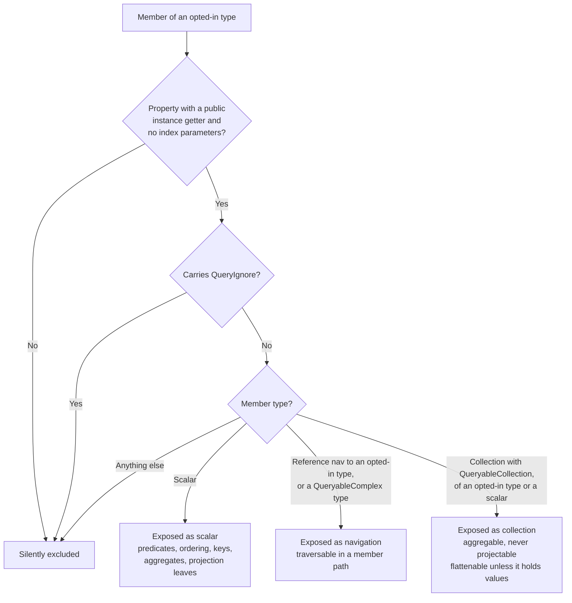

# Annotations

`Scry.Annotations` (namespace `Scry`, targeting `netstandard2.0`) holds the attributes that define the allow-list. They are applied to the **server** model. Both the source generator and the server runtime read the same attributes and derive the same surface from them.

The model is **default-deny**: a type that carries none of the opt-in attributes is invisible to clients, and a request naming it is rejected as an unknown source. A type opts in as exactly one of them: carrying two is refused by the generator (`SCRY008`) and at server startup, since the two sides would otherwise classify the type differently.

| Attribute | Target | Effect |
| --- | --- | --- |
| `[Queryable]` | class, struct | Opts a table-backed EF Core entity into client querying. |
| `[QueryableView]` | class, struct | Opts a keyless EF Core entity (a database view) into client querying. |
| `[QueryablePoco]` | class, struct | Opts a non-persisted POCO into client querying; the server supplies the data. |
| `[QueryableComplex]` | class, struct | Opts an EF complex type (e.g. a JSON-mapped value object) in as a traversable member type, not a root source. |
| `[QueryableCollection]` | property | Opts a collection in for aggregation and flattening — never for projection into a result. |
| `[QueryIgnore]` | property, field | Excludes a member from an opted-in type. |
| `[PreviousNames("...")]` | class, struct, property, field | Keeps accepting the names a source, member, or enum value used to be exposed under. |
| `[ReturnableWith(typeof(TPolicy))]` | class, struct | Attaches a server-side row policy, and optionally says [what a row it denies produces](policies.md#what-a-denied-row-produces). |
| `[BinaryTransfer]` | property, field | Sends a `byte[]` as a raw multipart part instead of base64. |
| `[Attachment]` | property, field | Makes a `byte[]` a claim check: never carried by a query, fetched on demand by row key. Optional `ContentType` says what the bytes are. |
| `[AttachmentWith(typeof(TPolicy))]` | class, struct | Attaches the check authorizing this type's attachments. Required where one is exposed. |


## `[Queryable]`

<!-- snippet: queryableEntity -->
<a id='snippet-queryableEntity'></a>
```cs
[Queryable]
public class Employee
{
    public int Id { get; set; }
    public string Name { get; set; } = "";
    public Status Status { get; set; }
    public bool Active { get; set; }
    public DateOnly Created { get; set; }

    public int? ManagerId { get; set; }
    public Employee? Manager { get; set; }

    public int DepartmentId { get; set; }
    public Department? Department { get; set; }

    // A claim check rather than a value: no query reads it, and what a client gets back is a handle
    // carrying this row's key. A photo is the case the attribute exists for — bytes nothing wants on
    // every row of every query, fetched by the one thing that actually wants to draw them. The check
    // that authorizes the fetch is registered by the server; this project references the annotations
    // alone, so [AttachmentWith] has no policy type to name here.
    [Attachment(ContentType = "image/svg+xml")]
    public byte[]? Photo { get; set; }

    // Never exposed to clients.
    [QueryIgnore]
    public decimal Salary { get; set; }

    // The other half of that pair: queryable, but never in a URL and never in a cache. [QueryIgnore]
    // hides a member outright; [Sensitive] keeps it askable while refusing the two ways its value
    // escapes — a query comparing it against a constant travels as a body rather than a URL, where the
    // constant would land in every access log on the way, and a response projecting it is sent
    // no-store, where a cacheable one would be written to the caller's disk.
    [Sensitive]
    public string Password { get; set; } = "";
}
```
<sup><a href='/samples/Sample.Model/Entities/Employee.cs#L3-L39' title='Snippet source file'>snippet source</a> | <a href='#snippet-queryableEntity' title='Start of snippet'>anchor</a></sup>
<!-- endSnippet -->

The source name exposed to clients defaults to the **type name** — `Employee`. That is what appears as the `root` of a wire request, as the property name on the generated `ScryQuery`, and in the introspection output.

If the type also carries EF Core's `[Keyless]`, Scry classifies it as a view rather than an entity. The two are resolved identically (`DbContext.Set<T>()`); the distinction is reported through introspection so tooling can label it.


### Inheritance

**`[Queryable]` is never inherited.** It is a statement about the type it is written on, so a derived type has to opt in on its own:

<!-- snippet: queryableHierarchy -->
<a id='snippet-queryableHierarchy'></a>
```cs
[Queryable]
public class Asset
{
    public int Id { get; set; }
    public string Name { get; set; } = "";
}

[Queryable]
public class Vehicle : Asset
{
    public int Wheels { get; set; }
}

[Queryable]
public class Building : Asset
{
    public int Floors { get; set; }
}
```
<sup><a href='/src/Scry.Tests/TestModel.cs#L182-L201' title='Snippet source file'>snippet source</a> | <a href='#snippet-queryableHierarchy' title='Start of snippet'>anchor</a></sup>
<!-- endSnippet -->

That is default-deny applied to the hierarchy: adding a subclass to the model exposes nothing until it is annotated. A type left out is unreachable — it has no wire name, its members are not readable, and no query can narrow to it — while its own descendants stay reachable if they opted in, since the base link skips over types that did not.

The members of a base that did not opt in are another matter. When the base is in the model assembly, every opted-in type deriving from it exposes them as its own, as if they were declared there: reflection reads inherited members, and the generator reads the base's metadata the same way. A base in another assembly is the one the generator cannot read, so a member inherited from one is refused at startup rather than exposed to a client that could never see it. An override is one member, described where it is nearest, and carrying the attributes of every declaration along the chain.

An opted-in derived type is itself a source (`Query.Vehicle`), *and* something a query rooted at the base can narrow to with [`OfType`](querying.md#narrowing-to-a-derived-type). The generated model inherits the base's, declaring only the members the CLR type declares, so the base's members are readable before and after the narrowing and the derived ones only after.

A [`[ReturnableWith]`](#returnablewith) policy *is* inherited, deliberately: a subclass cannot shed the policy its base carries. When both carry one, both apply, base-most first. A policy registered in code with `AddPolicy` inherits the same way — being a source itself is what makes that matter, since a derived source is reachable without naming the base at all.


## Naming a source

The source name is part of the **wire contract**. Renaming the CLR type would otherwise change the `root` of every request and break already-deployed clients, so all three opt-in attributes take a `Name` that decouples the two:

`Name` pins the wire name against CLR renames. It does not help when the **wire name itself** has to change — see [Renaming](#renaming) for that.

<!-- snippet: namedSource -->
<a id='snippet-namedSource'></a>
```cs
/// <summary>
/// Exposed to clients as 'Region', so the CLR type can be renamed without changing the wire
/// contract. Adopting Name was itself a wire rename — it had been exposed as 'SalesRegion' — so the
/// old name is carried as a previous name. Has no DbSet; it exists to pin the naming behaviour.
/// </summary>
[Queryable(Name = "Region")]
[PreviousNames("SalesRegion")]
public class SalesRegion
{
    public int Id { get; set; }
    public string Name { get; set; } = "";
}
```
<sup><a href='/src/Scry.Tests/TestModel.cs#L323-L336' title='Snippet source file'>snippet source</a> | <a href='#snippet-namedSource' title='Start of snippet'>anchor</a></sup>
<!-- endSnippet -->

The generated entry point exposes the configured name, while the **model class name stays derived from the CLR type**:

<!-- snippet: GeneratorTests.NamedSources#ScryQuery.g.verified.cs -->
<a id='snippet-GeneratorTests.NamedSources#ScryQuery.g.verified.cs'></a>
```cs
//HintName: ScryQuery.g.cs
// <auto-generated/>
#nullable enable
#pragma warning disable CS0612, CS0618
namespace Scry.Generated;

/// <summary>Entry point for writing LINQ queries against the allow-listed sources.</summary>
public sealed class ScryQuery
{
    /// <summary>
    /// A hash of the queryable surface this client was generated against. Attached to each
    /// request so the server can identify a client generated against a different model.
    /// </summary>
    public const string SchemaStamp = "wD-O0DfMZ_zvEg8p";

    readonly global::Scry.ScryClient client;

    public ScryQuery(global::Scry.ScryClient client)
    {
        this.client = client;
        client.SchemaStamp = SchemaStamp;
    }

    public global::System.Linq.IQueryable<EmployeeQueryModel> Staff =>
        client.Source<EmployeeQueryModel>("Staff", ["Id", "Name"]);

    public global::System.Linq.IQueryable<EmployeeSummaryQueryModel> Headcount =>
        client.Source<EmployeeSummaryQueryModel>("Headcount", ["Total"]);

    public global::System.Linq.IQueryable<HolidayQueryModel> PublicHoliday =>
        client.Source<HolidayQueryModel>("PublicHoliday", ["Name"]);

    public global::System.Linq.IQueryable<OrderQueryModel> Order =>
        client.Source<OrderQueryModel>("Order", ["Amount"]);
}
```
<sup><a href='/src/Scry.SourceGenerator.Tests/GeneratorTests.NamedSources%23ScryQuery.g.verified.cs#L1-L35' title='Snippet source file'>snippet source</a> | <a href='#snippet-GeneratorTests.NamedSources#ScryQuery.g.verified.cs' title='Start of snippet'>anchor</a></sup>
<!-- endSnippet -->

That split is deliberate. `Name` governs the public vocabulary; `{Type}QueryModel` stays tied to the type so the server's introspection output and the generator's emission keep matching exactly — which is what lets the [explorer](explorer.md) synthesize an identical model.

The server derives the same name, so its introspection stays in step with generated client code:

<!-- snippet: namedSourceTest -->
<a id='snippet-namedSourceTest'></a>
```cs
[Test]
public void NameOverridesSourceNameButNotModelName()
{
    var sources = SharedProcessor.Instance.Describe().Sources;

    // The CLR type is SalesRegion; [Queryable(Name = "Region")] renames only the source, so the
    // generated model stays SalesRegionQueryModel and the server's introspection agrees with
    // what the generator emits.
    var region = sources.Single(_ => _.Name == "Region");
    Assert.That(region.Model, Is.EqualTo("SalesRegionQueryModel"));
    Assert.That(region.Kind, Is.EqualTo("Entity"));
    Assert.That(sources.Select(_ => _.Name), Does.Not.Contain("SalesRegion"));
}
```
<sup><a href='/src/Scry.Tests/IntrospectionTests.cs#L8-L22' title='Snippet source file'>snippet source</a> | <a href='#snippet-namedSourceTest' title='Start of snippet'>anchor</a></sup>
<!-- endSnippet -->

Details:

- A blank or whitespace-only `Name` is treated as unset and falls back to the type name.
- Names are compared with ordinal case sensitivity.
- Two sources resolving to the same name is an error on both sides: the generator reports `SCRY002` and emits nothing, and the server throws `Duplicate queryable source name '...'` at startup. Note that this is reachable without `Name` too — two same-named types in different namespaces collide the same way.
- **A name has to be writable as a C# property name.** It is not only a wire name — it is the property on the generated `ScryQuery`, and on the model the explorer synthesizes from introspection — so anything C# cannot express there is refused rather than emitted. That rules out spaces, punctuation, a leading digit, and the reserved keywords (`class`, `string`, `int`, …). Contextual keywords are fine: `record`, `var`, and `where` are all legal property names, so they are legal source names. Unicode letters are fine too, on the same rule the language uses.

  Refused on both sides, as with a duplicate: the generator reports `SCRY003` and emits nothing, and the server throws at startup — so the mistake surfaces in the same place whichever side is built first. A verbatim `@` prefix is not a way around it: the wire name would then carry an `@` that is not part of the name.

  This applies only to the *current* name. A [`[PreviousNames]`](#renaming) entry is a wire name and nothing else — the generator never emits one — so it is under no such constraint.


## Renaming

Three things are named on the wire, and renaming any of them breaks a client that has not been regenerated:

| Wire name | Appears as | Renamed by |
| --- | --- | --- |
| Source | `root` of a request | renaming the CLR type, or changing/adopting/dropping `Name` |
| Member | segments of a member path, and projection keys | renaming the property |
| Enum value | an enum constant's value | renaming the enum member |

`[PreviousNames]` gives each of them a migration window: the server keeps resolving the old name, so already-deployed clients keep working while they pick up a regenerated one.

On a source it sits alongside `Name` — the [example above](#naming-a-source) had been exposed as `SalesRegion` before it adopted `Name = "Region"`, so it carries the old name.

On a member:

<!-- snippet: previousNamesMember -->
<a id='snippet-previousNamesMember'></a>
```cs
// Renamed from 'FullName'; the previous name still resolves for clients generated before it.
[PreviousNames("FullName")]
public string Name { get; set; } = "";
```
<sup><a href='/src/Scry.Tests/TestModel.cs#L41-L45' title='Snippet source file'>snippet source</a> | <a href='#snippet-previousNamesMember' title='Start of snippet'>anchor</a></sup>
<!-- endSnippet -->

On an enum value:

<!-- snippet: previousNamesEnumValue -->
<a id='snippet-previousNamesEnumValue'></a>
```cs
public enum Status
{
    FullTime,
    PartTime,

    // Renamed from 'Freelancer'; enum value names are sent on the wire as constants, so clients
    // generated before the rename keep resolving.
    [PreviousNames("Freelancer")]
    Contractor
}
```
<sup><a href='/src/Scry.Tests/TestModel.cs#L3-L14' title='Snippet source file'>snippet source</a> | <a href='#snippet-previousNamesEnumValue' title='Start of snippet'>anchor</a></sup>
<!-- endSnippet -->

It is deliberately **server-side only**. Generated clients never emit a previous name, and previous names are excluded from introspection and from the [schema stamp](wire-format.md#schema-stamp) — so a rename still changes the stamp and still registers as drift. That is the point: the stale client is detected and prompted to reload ([Schema versioning](schema-versioning.md#detecting-a-stale-client)) while its in-flight queries keep succeeding, instead of failing first and being diagnosed second.


### The response side

Accepting an old name is not enough on its own — the response has to come back in keys the old client can read. Response keys always come from the **request's** projection, and a generated client always sends one: the entry point passes its scalar member names to `Source` (visible in the [generated entry point above](#naming-a-source)), so a query that writes no `Select` still projects them explicitly.

The client therefore names its own columns on every request, and the server echoes those names back verbatim — it never substitutes its own. A member rename round-trips without the server having to work out which version of the client sent the request.

The server's own default projection remains for a request that names no members — a hand-built one, or any non-generated caller. Those have no fixed model to satisfy, so they get the current names.

**Enum values travel differently.** A renamed value in a *result* is serialized under its current name — unlike a key, a value cannot be written under two names. Instead the translation is carried out of band: when the request's stamp differs from the server's, the response carries [`enumAliases`](wire-format.md#response) (current name → previous names, straight from `[PreviousNames]`), and the client's enum reader resolves a name it does not know to a previous name it does. The payload stays canonical, and nothing is sent when the stamps agree.

If a name still cannot be resolved — the value was renamed without a `[PreviousNames]` entry, or removed — the client throws `ScryStaleClientException` rather than a bare `JsonException`, so the failure names its cause: regenerate the client, or reload the deployed app.

Entries are meant to be **pruned** once deployed clients have refreshed. Keeping them indefinitely accumulates exactly the compatibility debt the one-surface-at-a-time design avoids.

Once pruned, treat a retired name as **retired for good** — do not reuse it for something else. Every other mistake here surfaces as an error: an unknown name is a rejected query or a `ScryStaleClientException`. Reuse is the one that produces *no error at all*. A client old enough to still send the retired name gets whatever now answers to it, and a retired enum value name resolves an ancient client's row to the wrong member with no error anywhere. The startup checks cannot catch this, because by then nothing records that the name ever meant something else.

Details:

- Previous names are the previous *wire* names, not previous CLR names. A CLR type renamed behind a fixed `Name` never changed its wire name and needs no entry.
- Compared with ordinal case sensitivity, like every other name on the wire.
- The server throws at startup for a previous name that is blank, that collides with a live source/member/enum value, that duplicates another previous name in the same scope, or that is applied to something with no wire name of its own — a `[QueryableComplex]` type, a `[QueryIgnore]`d property, or a type with no opt-in attribute.
- A renamed enum value with no matching entry is rejected as an invalid query (`'X' is not a value of enum 'Y'`), not reported as a server fault.


## `[QueryableView]`

For a keyless entity mapped to a database view:

<!-- snippet: queryableView -->
<a id='snippet-queryableView'></a>
```cs
/// <summary>A keyless EF Core entity mapped to a database view.</summary>
[QueryableView]
public class EmployeeSummary
{
    public string Department { get; set; } = "";
    public int Headcount { get; set; }
}
```
<sup><a href='/samples/Sample.Model/Entities/EmployeeSummary.cs#L3-L11' title='Snippet source file'>snippet source</a> | <a href='#snippet-queryableView' title='Start of snippet'>anchor</a></sup>
<!-- endSnippet -->

paired with the usual EF configuration on the context:

<!-- snippet: dbContext -->
<a id='snippet-dbContext'></a>
```cs
public DbSet<Department> Departments => Set<Department>();
public DbSet<Employee> Employees => Set<Employee>();
public DbSet<Order> Orders => Set<Order>();
public DbSet<EmployeeSummary> EmployeeSummaries => Set<EmployeeSummary>();
public DbSet<Asset> Assets => Set<Asset>();

protected override void OnModelCreating(ModelBuilder builder)
{
    builder.Entity<EmployeeSummary>()
        .HasNoKey()
        .ToView("EmployeeSummary");

    // Table-per-hierarchy: the derived types share the base table and are told apart by a
    // discriminator, which is what OfType narrows on.
    builder.Entity<Vehicle>();
    builder.Entity<Building>();
}
```
<sup><a href='/samples/Sample.Model/SampleContext.cs#L6-L24' title='Snippet source file'>snippet source</a> | <a href='#snippet-dbContext' title='Start of snippet'>anchor</a></sup>
<!-- endSnippet -->

`[QueryableView]` is equivalent to putting `[Queryable]` on a type that EF has marked `[Keyless]`; use it when the keyless configuration lives in `OnModelCreating` rather than on the type.


## `[QueryablePoco]`

For a type that is not part of the persisted model at all:

<!-- snippet: queryablePoco -->
<a id='snippet-queryablePoco'></a>
```cs
/// <summary>A POCO that is not part of the persisted model.</summary>
[QueryablePoco]
public class Holiday
{
    public string Name { get; set; } = "";
    public DateOnly Date { get; set; }

    public static IEnumerable<Holiday> Seed() =>
    [
        new()
        {
            Name = "New Year",
            Date = new(2026, 1, 1)
        },
        new()
        {
            Name = "Workers Day",
            Date = new(2026, 5, 1)
        },
        new()
        {
            Name = "Christmas",
            Date = new(2026, 12, 25)
        }
    ];
}
```
<sup><a href='/samples/Sample.Model/Entities/Holiday.cs#L3-L30' title='Snippet source file'>snippet source</a> | <a href='#snippet-queryablePoco' title='Start of snippet'>anchor</a></sup>
<!-- endSnippet -->

The server must supply the data:

<!-- snippet: serverRegistration -->
<a id='snippet-serverRegistration'></a>
```cs
builder.Services
    .AddScry<SampleContext>(
    _ =>
    {
        // Holiday is a [QueryablePoco]: it has no table, so the server supplies its rows. Every
        // [QueryablePoco] type must be registered here or AddScry throws at startup.
        _.AddPocoSource(_ => Holiday.Seed());
        // Department.Handbook and Employee.Photo are [Attachment]s, and one exposed without a
        // check is a startup failure. Registered here rather than by [AttachmentWith] because
        // the model project references the annotations alone and has no server type to name.
        _.AddAttachmentPolicy<Department, HandbookPolicy>();
        _.AddAttachmentPolicy<Employee, PhotoPolicy>();
        _.MaxPageSize = 200;

        // A row policy whose decision is too slow to run per row in SQL, so it runs in C# and
        // the server remembers what it answered. Revision is what tells it a row has changed
        // and needs deciding again — see /docs/policies.md and the /permissions page.
        _.AddCachedPolicy<Order, long, RegionAccessPolicy>(_ => _.Revision);

        // Repeat a query while nothing has been written and the answer is a 304 rather than a
        // re-execution. Optional, and off until a freshness source says how to tell — see
        // /docs/caching.md.
        _.UseDeltaFreshness<SampleContext>();

        // What a cached response belongs to. This server has sources whose answers depend on
        // who asked — the row policy above, and Department.Handbook's attachment check — and
        // MapScry refuses to start without this. The sample has no sign-in, so the caller
        // half is a constant; a real app returns its tenant or its principal, and a client
        // signing in as someone else is then never handed the previous one's rows.
        //
        // The grants version is the other half, and is the part worth copying. A response
        // varies by what the caller is allowed to see, and QueryFreshness only watches the
        // database — so a grant changing outside it would move nothing, and a cache holding
        // the old rows would go on answering with rows the caller has since lost.
        _.CacheScope = _ => $"sample-{_.RequestServices.GetRequiredService<RegionGrants>().Version}";
    });
```
<sup><a href='/samples/Sample.Server/Program.cs#L31-L70' title='Snippet source file'>snippet source</a> | <a href='#snippet-serverRegistration' title='Start of snippet'>anchor</a></sup>
<!-- endSnippet -->

The registered sequence is wrapped with `AsQueryable()`, so the pipeline runs in memory over LINQ to<!-- include: poco-in-memory. path: /docs/includes/poco-in-memory.include.md -->
Objects with the same validation, shaping, and limits as a database source. The string functions run
ordinally there — a prefix, a suffix, a search, a casing, a three-way comparison — so an answer does not
follow the request's culture, as a database source's answer does not.<!-- endInclude -->

Registration is **mandatory**. `AddScry` throws at startup if a `[QueryablePoco]` type has no registered source:

```
POCO source 'Holiday' has no data registered. Call options.AddPocoSource<Holiday>(...).
```

See [Server](server.md#poco-sources) for the per-request factory overload.


## `[QueryableComplex]`

For an EF Core **complex type** — a value object with no key of its own, typically mapped into a JSON column:

<!-- snippet: queryableComplex -->
<a id='snippet-queryableComplex'></a>
```cs
[QueryableComplex]
[Sensitive]
public class Address
{
    public string City { get; set; } = "";
    public string Country { get; set; } = "";

    [QueryIgnore]
    public string Zip { get; set; } = "";
}
```
<sup><a href='/src/Scry.Tests/TestModel.cs#L151-L162' title='Snippet source file'>snippet source</a> | <a href='#snippet-queryableComplex' title='Start of snippet'>anchor</a></sup>
<!-- endSnippet -->

paired with the usual EF mapping on the owning entity:

<!-- snippet: complexToJson -->
<a id='snippet-complexToJson'></a>
```cs
builder.Entity<Employee>()
    .ComplexProperty(_ => _.Address)
    .ToJson();
```
<sup><a href='/src/Scry.Tests/TestModel.cs#L577-L581' title='Snippet source file'>snippet source</a> | <a href='#snippet-complexToJson' title='Start of snippet'>anchor</a></sup>
<!-- endSnippet -->

A complex type is **not a root source**: it produces no property on the generated `ScryQuery` and no server resolver. It is reachable only by traversing into it from an opted-in entity/view/POCO — for example `Employee.Address.City`. Its members follow the same exposure rules as any other type (`[QueryIgnore]` still hides `Zip`), and the traversal is bounded by `MaxNavigationDepth` like any navigation. How EF stores the type — a JSON column or separate columns — is transparent to Scry; the server rebinds the member path onto EF, which translates it either way.

Because it is a member type rather than a source, `[QueryableComplex]` takes no `Name`.

A complex type can also be held as a **collection** — a JSON array of value objects. It is exposed the same way any other collection is, by opting the member in with [`[QueryableCollection]`](#collections):

<!-- snippet: queryableComplexCollection -->
<a id='snippet-queryableComplexCollection'></a>
```cs
// A JSON array of value objects: a complex-type collection mapped into one column. Aggregable and
// flattenable exactly like a collection of entities — the element type being [QueryableComplex]
// rather than a source changes nothing about how a client queries it.
[QueryableCollection]
public List<Address> PreviousAddresses { get; set; } = [];
```
<sup><a href='/src/Scry.Tests/TestModel.cs#L71-L77' title='Snippet source file'>snippet source</a> | <a href='#snippet-queryableComplexCollection' title='Start of snippet'>anchor</a></sup>
<!-- endSnippet -->

<!-- snippet: complexCollectionToJson -->
<a id='snippet-complexCollectionToJson'></a>
```cs
builder.Entity<Employee>()
    .ComplexCollection(_ => _.PreviousAddresses)
    .ToJson();
```
<sup><a href='/src/Scry.Tests/TestModel.cs#L583-L587' title='Snippet source file'>snippet source</a> | <a href='#snippet-complexCollectionToJson' title='Start of snippet'>anchor</a></sup>
<!-- endSnippet -->

The element type being a complex type rather than a source changes nothing a client can see: the array is aggregable and flattenable exactly like a collection of entities, and the wire request is indistinguishable from one over a collection navigation. Because a complex type is never a source, it can carry no [row policy](policies.md) — attaching one is refused at startup rather than silently ignored, since a policy that cannot run reads as protection it is not providing:

```
'Address' is [QueryableComplex] and carries a row policy, which cannot apply: a policy filters a source, and a complex type is a member type with no source of its own. Filter on the type that owns it instead.
```

The generator and the server both read this attribute, but neither can see EF's `OnModelCreating`, so they cannot *infer* which types are complex — the attribute is the signal. To catch a mistake early, `MapScry` cross-checks the annotations against the live EF model at startup and throws if a `[Queryable]` type is really a complex type, or a `[QueryableComplex]` type is really a mapped entity:

```
'Address' is marked [Queryable]/[QueryableView] but is an EF complex type in SampleContext. Use [QueryableComplex].
```


## `[QueryIgnore]`

```cs
[QueryIgnore]
public decimal Salary { get; set; }
```

An ignored member is excluded twice over:

- The source generator never emits it, so client code cannot name it and there is no IntelliSense entry for it.
- The server's schema never registers it, so a hand-crafted request naming it is rejected with `Property 'Salary' is not allow-listed on 'Employee'.`

It is also absent from the default projection — a query with no `Select` returns every allow-listed scalar, and `Salary` is not one.

To warn clients before taking a member away, deprecate it first with [`[Obsolete]`](#obsolete).


## `[Sensitive]`

```cs
[Sensitive]
public string Password { get; set; } = "";
```

A member that stays queryable, but whose values must not be written into a log or kept by a cache. Where [`[QueryIgnore]`](#queryignore) hides a member outright, this one leaves it askable and refuses the two ways its value escapes.

| | Rule | Why |
| --- | --- | --- |
| A constant compared against it | the query travels as a `POST` body | a URL is written to the access log of every hop it passes, and to the `Referer` of whatever the page does next |
| It appears in the result | the response is sent `Cache-Control: no-store`, with no `ETag` | a storable response is written to the caller's disk, where it outlives the session that asked |

Naming the member without either — ordering by it, comparing it against another column — changes nothing: no value travels in the URL and none comes back.

The [audit trail](observability.md#the-audit-hook) is the one place the constant is written on purpose. An `IScryAuditor` receives the request as sent, flagged `Sensitive`, since the auditor is the host's own and reading the query is its point; one that forwards entries elsewhere redacts on the flag.

The client picks the transport and the server holds it to that choice. A client generated before the marking reads its own model, sees nothing sensitive, and asks in a URL; the server refuses with a flag the client acts on, re-sending the same request in a body. One extra round trip, and no code change.

Refusing cannot unsay the first leak — the URL was logged by every hop before it arrived — so what it buys is that the answer is never cached under that URL, and that a client getting it wrong says so. The second rule is the one that needs no cooperation at all.

On a type it covers every member read off that type, including one reached by navigating into it from somewhere else, which is how a [`[QueryableComplex]`](#queryablecomplex) shape is marked.

Marking a member **moves the [schema stamp](schema-versioning.md)**, unlike [`[Obsolete]`](#obsolete) and for the reason `[Obsolete]` does not: it changes what an already-deployed client is allowed to do, and moving the stamp is what makes that client report itself stale.

Fields are not a target. Nothing in Scry reads one — the generator and the server both walk properties — so the attribute would read as protection while doing nothing.

The message a refusal carries says only what to do, never which member is sensitive: naming it would answer "which of these columns is the sensitive one?" for anyone who asked. See [Caching](caching.md#the-sharp-edges).


## `[BinaryTransfer]`

<!-- snippet: binaryTransferMember -->
<a id='snippet-binaryTransferMember'></a>
```cs
// Travels as a raw multipart part in HTTP responses instead of base64 in the JSON payload, and —
// being a photograph of a person — is never written to a cache that outlives the session reading it.
[BinaryTransfer]
[Sensitive]
public byte[] Avatar { get; set; } = [];
```
<sup><a href='/src/Scry.Tests/TestModel.cs#L59-L65' title='Snippet source file'>snippet source</a> | <a href='#snippet-binaryTransferMember' title='Start of snippet'>anchor</a></sup>
<!-- endSnippet -->

A `byte[]` member's values normally travel as base64 strings inside the JSON payload — +33% size and an encode/decode on both ends. `[BinaryTransfer]` opts a member out: over HTTP its values travel as raw `multipart/mixed` parts beside the JSON, on all three endpoints. See [Binary transfer](wire-format.md#binary-transfer) for the format.

It is a transfer encoding, not a shape change:

- The generated client, validation surface, introspection, and [schema stamp](schema-versioning.md) are exactly what they would be without the attribute — adopting or dropping it is never a client-visible schema change, and the member stays filterable, orderable, and projectable as an ordinary scalar.
- Every non-HTTP transport (`ScryProcessor` hosted directly) keeps inline base64.
- The client reads both forms regardless, so the server model can adopt the attribute freely.

Only a `byte[]` member exposed to clients can carry it — anything else fails at server startup, the same way a misplaced `[PreviousNames]` does.


## `[Attachment]`

<!-- snippet: attachmentMember -->
<a id='snippet-attachmentMember'></a>
```cs
[Queryable]
[AttachmentWith(typeof(UnsealedContractsPolicy))]
public class Contract
{
    public int Id { get; set; }
    public string Name { get; set; } = "";

    // Never read by a query. A client sees a handle and fetches the bytes by this row's key, and the
    // declared content type is what that fetch is served as.
    [Attachment(ContentType = "application/pdf")]
    public byte[]? Document { get; set; }
}
```
<sup><a href='/src/Scry.Tests/TestModel.cs#L412-L425' title='Snippet source file'>snippet source</a> | <a href='#snippet-attachmentMember' title='Start of snippet'>anchor</a></sup>
<!-- endSnippet -->

The other way to expose a `byte[]`, and the opposite trade from `[BinaryTransfer]`: the query never reads the value at all. What the client gets instead is a handle carrying the row's key, exchanged for the bytes by a second request whenever — or if ever — they are wanted. See [Attachments](attachments.md).

It **is** a shape change, which is the whole difference between the two:

| | `[BinaryTransfer]` | `[Attachment]` |
| --- | --- | --- |
| Client member type | `byte[]`, unchanged | `ScryAttachment` |
| Read by the query | Yes | Never |
| Transferred | With every row that projects it | Only when the handle is opened |
| Schema stamp | Unmoved | Moves — the surface really did change |
| Filterable, orderable, projectable as a value | Yes | No |
| Authorization | The source's row policy | That, **and** a mandatory `IAttachmentPolicy<T>` |

Reach for `[BinaryTransfer]` when the bytes are wanted with the row and only the encoding is worth improving — a thumbnail on every row of a list. Reach for `[Attachment]` when they usually are not: a document, a full-size image, anything large enough that fetching it per row is the cost worth avoiding.

The constraints are checked twice, at the build that writes the model and again at server startup:

- Only a `byte[]` member (`SCRY004`).
- Only on a `[Queryable]` entity — a view or a POCO has no primary key to fetch by (`SCRY005`).
- Never alongside `[BinaryTransfer]`, which asks for the value to be both fetched and not fetched (`SCRY006`).
- The row's key must be derivable: `[Key]` where written, else a member named `Id`, else `{TypeName}Id` (`SCRY007`).
- The type must have an [attachment policy](policies.md#attachment-policies), or the server refuses to start.

`ContentType` is optional and says what the bytes are — the media type the fetch is served as, and what tooling names a download from. Leaving it unset serves `application/octet-stream`, which says only that they are bytes. A value that is not a `type/subtype` fails at server startup. See [Content type](attachments.md#content-type).


## `[AttachmentWith]`

```cs
[AttachmentWith(typeof(EmployeePhotoPolicy))]
public class Employee { ... }
```

Names the `IAttachmentPolicy<T>` authorizing this type's `[Attachment]` members. Server-only, like `[ReturnableWith]`, and inherited the same way — a subclass cannot shed the check its base carries. `ScryOptions.AddAttachmentPolicy<TEntity, TPolicy>()` is the programmatic equivalent and takes precedence on the same type.

Unlike a row policy there is exactly one: the check is a yes/no decision rather than a filter, so the nearest declaration answers and composing several would only raise the question of what a disagreement means. Row policies still apply on top — see [Attachments](attachments.md#security).


## `[Obsolete]`

`ObsoleteAttribute` on a model type or an exposed member:

<!-- snippet: obsoleteMember -->
<a id='snippet-obsoleteMember'></a>
```cs
// Deprecated rather than removed: still queryable, still validated, still executed — clients are
// only warned, at their next rebuild. [QueryIgnore] is what takes it off the surface for good.
[Obsolete("Counts open roles too; use the Region rollup.")]
public int Headcount { get; set; }
```
<sup><a href='/src/Scry.Tests/TestModel.cs#L347-L352' title='Snippet source file'>snippet source</a> | <a href='#snippet-obsoleteMember' title='Start of snippet'>anchor</a></sup>
<!-- endSnippet -->

The client never references the model assembly, so a deprecation would otherwise stop at the boundary. It is replicated instead: onto the generated query model, onto the member, and onto the `ScryQuery` entry point, so a query written against a deprecated source or member warns where it is written.

This is the deprecation window that `[QueryIgnore]` has no room for. The two are a sequence:

| | Server behaviour | Client behaviour |
| --- | --- | --- |
| `[Obsolete]` | Unchanged — still allow-listed, still validated, still executed | Compiles, with a warning |
| `[QueryIgnore]` | Removed from the schema; a request naming it is rejected | Not emitted at all; cannot be named |

Three things follow from it being advisory:

- **The `error: true` flag is deliberately dropped.** `[Obsolete("...", error: true)]` on the model still reaches the client as a plain warning. Making it a client build break would misrepresent the server: the server executes the query either way, and the client author could not unblock themselves except by suppressing it. `[QueryIgnore]` is the hard stop, and it is enforced server-side.
- **It stays out of the [schema stamp](schema-versioning.md).** Deprecating something leaves the queryable surface exactly as it was, so the stamp does not move and no deployed client is reported as stale. Clients learn about it at their next rebuild, which is what a deprecation window is.
- **Generated files suppress `CS0612`/`CS0618` internally.** A deprecated model type is still named by every navigation to it and by its own entry point, and that is generated code the consumer cannot edit — without the suppression, `TreatWarningsAsErrors` would fail on it. Uses in the consumer's own query code are outside those files and still warn.

The [explorer](explorer.md) shows the same deprecation: it re-derives the models from introspection, which carries the message alongside each source, type, and member.


## `[ReturnableWith]`

```cs
[ReturnableWith(typeof(ActiveOnlyPolicy))]
public class Employee { ... }
```

Names an `IReturnablePolicy<T>` implementation that the server applies to the source **before** any client operator. It is server-only: the generator ignores it and the client never sees it. See [Row policies](policies.md).

A policy registered in code via `ScryOptions.AddPolicy<TEntity, TPolicy>()` takes precedence over the attribute on the same type.


## Which members are exposed

A member of an opted-in type is exposed when **all** of the following hold:

- It is a property (fields are never exposed).
- It has a **public instance getter**.
- It takes no index parameters.
- It does not carry `[QueryIgnore]`.
- Its type is either a **scalar**, a **reference navigation to another opted-in type**, a **`[QueryableComplex]` type** (optionally `Nullable<>`), or a **collection carrying `[QueryableCollection]`** whose element is an opted-in type or a scalar.

Everything else is silently excluded — no error, it does not appear.




### Scalars

`bool`, `char`, `sbyte`, `byte`, `short`, `ushort`, `int`, `uint`, `long`, `ulong`, `float`, `double`, `decimal`, `string`, `DateTime`, `DateOnly`, `TimeOnly`, `DateTimeOffset`, `TimeSpan`, `Guid`, `byte[]`, and any `enum` — plus the `Nullable<>` form of each value type.

An `enum` used by an exposed member is re-emitted into the generated client code (as `ScryEnums.g.cs`), so the client can compare against it without referencing the model. The members' values, the underlying type, and `[Flags]` are carried across, so a member means the same on both sides — including a combined flag, which travels by name and resolves through those values.

Scalars can be used in predicates, ordering keys, group keys, aggregate selectors, and projection leaves.


### Navigations

A property whose type is another opted-in type is a **reference navigation**. It can be traversed in a member path (`e.Manager.Name`) and projected into, up to `MaxNavigationDepth` segments (default 4). A `[QueryableComplex]` member behaves the same way for traversal (`e.Address.City`); the only difference is at the type level — a complex type is never a root source.

A navigation cannot itself be a value — it cannot be compared, ordered by, grouped by, or used as a projection leaf. `Projection member must reference a scalar value.` is the rejection returned.


### Collections

A property whose type is a collection of another opted-in type is a **collection navigation**. Unlike every other member it stays invisible even on an exposed type until it opts in:

<!-- snippet: queryableCollection -->
<a id='snippet-queryableCollection'></a>
```cs
// Opted in for aggregation: a client can ask how many lines an order has, or what they total, but
// can never enumerate them into a result.
[QueryableCollection]
public List<OrderLine> Lines { get; set; } = [];
```
<sup><a href='/src/Scry.Tests/TestModel.cs#L256-L261' title='Snippet source file'>snippet source</a> | <a href='#snippet-queryableCollection' title='Start of snippet'>anchor</a></sup>
<!-- endSnippet -->

An exposed collection is **aggregable, not projectable**. A client can ask a question about it — `Any`, `All`, `Count`, `Sum`, `Average`, `Min`, `Max`, which the database answers as a correlated subquery — but can never enumerate its rows, project it, traverse through it in a member path, or order by it. Every answer is a scalar, so a response can never carry an unbounded nested collection. See [subqueries](querying.md#collection-subqueries).

The element type must itself be opted in. If it carries a [row policy](policies.md) the server refuses to start, naming the member — a policy filters a source and a subquery has none, so aggregating the collection off its owner would count exactly the rows the policy hides. Setting [`CollectionNavigation`](policies.md#collections) on that policy is what unlocks it: `Hide` reads the collection through the policy, so the aggregate counts what a direct query of the element source would have reached.

The element may be a source type or a [`[QueryableComplex]`](#queryablecomplex) type. The latter is a **JSON array of value objects**, and behaves identically — how it is stored is EF's concern, and nothing about it reaches the wire.

The declaration itself is one of a closed set the generator reads by name: a one-dimensional array, `List<T>`, `HashSet<T>`, `Collection<T>`, `ObservableCollection<T>`, or one of the `ICollection<T>`, `IEnumerable<T>`, `IList<T>`, `IReadOnlyCollection<T>`, `IReadOnlyList<T>`, and `ISet<T>` interfaces. Any other collection shape under `[QueryableCollection]` is refused at startup, naming the member, since a client could never see it.


### Collections of values

The element may also be a [**scalar**](#scalars) — an EF **primitive collection**, which the provider stores as a JSON column:

<!-- snippet: queryablePrimitiveCollection -->
<a id='snippet-queryablePrimitiveCollection'></a>
```cs
// EF primitive collections — collections of values, which the provider stores as a JSON column.
// They opt in like any other collection; what differs is that their elements are values, so a
// question about them reads the element itself rather than a member of it.
[QueryableCollection]
public List<string> Tags { get; set; } = [];

[QueryableCollection]
public List<int> Scores { get; set; } = [];
```
<sup><a href='/src/Scry.Tests/TestModel.cs#L263-L272' title='Snippet source file'>snippet source</a> | <a href='#snippet-queryablePrimitiveCollection' title='Start of snippet'>anchor</a></sup>
<!-- endSnippet -->

It opts in the same way and answers the same questions. The one difference is that its elements are values with no members, so a question reads the element *itself* — `_.Tags.Contains("urgent")`, `_.Tags.Any(tag => tag.StartsWith("ex"))`, `_.Scores.Sum()`. See [collections of values](querying.md#collections-of-values).

Two things it cannot do, both because a bare value is not a row:

- **It cannot be flattened.** `SelectMany` over it is rejected — the rows it would produce have no members for the projection, ordering or grouping that follow to name.
- **It cannot be projected**, exactly as no collection can.

An `enum` element is re-emitted to clients like any other exposed enum, even when the collection is the only thing that reaches it.


### Not exposed

- **Collections without `[QueryableCollection]`**, whatever their element type.
- **Collections whose element is neither an opted-in type nor a scalar** — a `List<T>` of a plain POCO stays invisible even with `[QueryableCollection]`.
- **Complex types that are not themselves opted in.** Adding `[QueryableComplex]` to the target type makes it traversable.
- **Write-only or non-public properties, indexers, and fields.**
- **What the generator could not read** — a member inherited from a base in another assembly, an enum declared in another assembly, or a collection shape outside the set above. Each is refused at startup, naming the member, rather than exposed to a client that would then report itself stale.


## Keeping the two readers aligned

Two independent components read the same attributes:

- `MetadataModelReader` in the generator, over `System.Reflection.Metadata`, at build time.
- `Schema` in the server, over `System.Reflection`, at startup.

They deliberately agree on classification, on which base type each model derives from, and on the C# type spelling each member gets — the server's introspection output reproduces the generator's emission exactly, which is what lets the [query explorer](explorer.md) synthesize an identical model in the browser. The server's copy is the one that matters for security: it is rebuilt at runtime from the real assembly and validates every request regardless of what the client was generated against.

Where agreement has to be exact rather than merely parallel, the two compile one shared source file instead of two implementations: the [schema stamp](schema-versioning.md), the rule for [which source names are expressible](#naming-a-source), and the [collection shapes](#collections) a member may be declared as.

`LockstepTests` in `Scry.Tests` is what holds them together: it runs the generator's reader over the test model — which carries every shape the two have ever described differently — and compares the stamp and every member with the server's own description.
