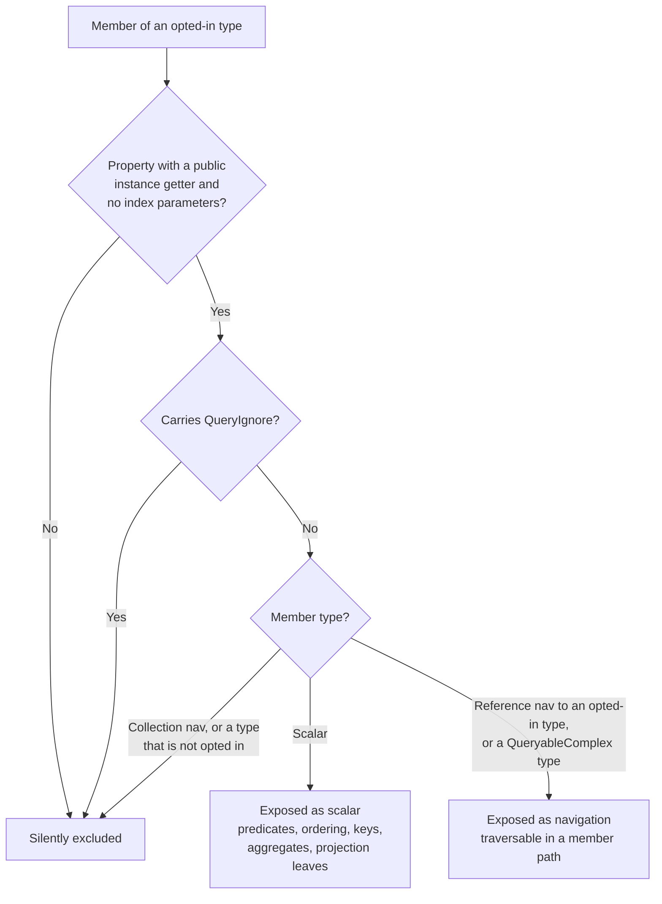

# Annotations

`Scry.Annotations` (namespace `Scry`, targeting `netstandard2.0`) holds the attributes that define the allow-list. They are applied to the **server** model. Both the source generator and the server runtime read the same attributes and derive the same surface from them.

The model is **default-deny**: a type that carries none of the opt-in attributes is invisible to clients, and a request naming it is rejected as an unknown source.

| Attribute | Target | Effect |
| --- | --- | --- |
| `[Queryable]` | class, struct | Opts a table-backed EF Core entity into client querying. |
| `[QueryableView]` | class, struct | Opts a keyless EF Core entity (a database view) into client querying. |
| `[QueryablePoco]` | class, struct | Opts a non-persisted POCO into client querying; the server supplies the data. |
| `[QueryableComplex]` | class, struct | Opts an EF complex type (e.g. a JSON-mapped value object) in as a traversable member type, not a root source. |
| `[QueryIgnore]` | property, field | Excludes a member from an opted-in type. |
| `[ReturnableWith(typeof(TPolicy))]` | class, struct | Attaches a server-side row policy. |

## `[Queryable]`

<!-- snippet: queryableEntity -->
<a id='snippet-queryableEntity'></a>
```cs
[Queryable]
public class Employee
{
    public int Id { get; set; }
    public string Name { get; set; } = "";
    public Status Status { get; set; }
    public bool Active { get; set; }
    public DateOnly Created { get; set; }

    public int? ManagerId { get; set; }
    public Employee? Manager { get; set; }

    public int DepartmentId { get; set; }
    public Department? Department { get; set; }

    // Never exposed to clients.
    [QueryIgnore]
    public decimal Salary { get; set; }
}
```
<sup><a href='/samples/Sample.Model/Entities/Employee.cs#L3-L23' title='Snippet source file'>snippet source</a> | <a href='#snippet-queryableEntity' title='Start of snippet'>anchor</a></sup>
<!-- endSnippet -->

The source name exposed to clients defaults to the **type name** — `Employee`. That is what appears as the `root` of a wire request, as the property name on the generated `ScryQuery`, and in the introspection output.

If the type also carries EF Core's `[Keyless]`, Scry classifies it as a view rather than an entity. The two are resolved identically (`DbContext.Set<T>()`); the distinction is reported through introspection so tooling can label it.

## Naming a source

The source name is part of the **wire contract**. Renaming the CLR type would otherwise change the `root` of every request and break already-deployed clients, so all three opt-in attributes take a `Name` that decouples the two:

<!-- snippet: namedSource -->
<a id='snippet-namedSource'></a>
```cs
/// <summary>
/// Exposed to clients as 'Region', so the CLR type can be renamed without changing the wire
/// contract. Has no DbSet — nothing queries it; it exists to pin the naming behaviour.
/// </summary>
[Queryable(Name = "Region")]
public class SalesRegion
{
    public int Id { get; set; }
    public string Name { get; set; } = "";
}
```
<sup><a href='/src/Scry.Tests/TestModel.cs#L86-L97' title='Snippet source file'>snippet source</a> | <a href='#snippet-namedSource' title='Start of snippet'>anchor</a></sup>
<!-- endSnippet -->

The generated entry point exposes the configured name, while the **model class name stays derived from the CLR type**:

<!-- snippet: GeneratorTests.NamedSources#ScryQuery.g.verified.cs -->
<a id='snippet-GeneratorTests.NamedSources#ScryQuery.g.verified.cs'></a>
```cs
//HintName: ScryQuery.g.cs
// <auto-generated/>
#nullable enable
namespace Scry.Generated;

/// <summary>Entry point for writing LINQ queries against the allow-listed sources.</summary>
public sealed class ScryQuery
{
    /// <summary>
    /// A hash of the queryable surface this client was generated against. Attached to each
    /// request so the server can identify a client generated against a different model.
    /// </summary>
    public const string SchemaStamp = "f0fc8cc5a6fa0a51b23480d0cb05daf7afe41cb78a460358abe7f74dee4042f1";

    readonly global::Scry.Client.ScryClient client;

    public ScryQuery(global::Scry.Client.ScryClient client)
    {
        this.client = client;
        client.SchemaStamp = SchemaStamp;
    }

    public global::System.Linq.IQueryable<EmployeeQueryModel> Staff =>
        client.Source<EmployeeQueryModel>("Staff");

    public global::System.Linq.IQueryable<EmployeeSummaryQueryModel> Headcount =>
        client.Source<EmployeeSummaryQueryModel>("Headcount");

    public global::System.Linq.IQueryable<HolidayQueryModel> PublicHoliday =>
        client.Source<HolidayQueryModel>("PublicHoliday");

    public global::System.Linq.IQueryable<OrderQueryModel> Order =>
        client.Source<OrderQueryModel>("Order");
}
```
<sup><a href='/src/Scry.SourceGenerator.Tests/GeneratorTests.NamedSources%23ScryQuery.g.verified.cs#L1-L34' title='Snippet source file'>snippet source</a> | <a href='#snippet-GeneratorTests.NamedSources#ScryQuery.g.verified.cs' title='Start of snippet'>anchor</a></sup>
<!-- endSnippet -->

That split is deliberate. `Name` governs the public vocabulary; `{Type}QueryModel` stays tied to the type so the server's introspection output and the generator's emission keep matching exactly — which is what lets the [explorer](explorer.md) synthesize an identical model.

The server derives the same name, so its introspection stays in step with generated client code:

<!-- snippet: namedSourceTest -->
<a id='snippet-namedSourceTest'></a>
```cs
[Test]
public void NameOverridesSourceNameButNotModelName()
{
    var sources = Processor().Describe().Sources;

    // The CLR type is SalesRegion; [Queryable(Name = "Region")] renames only the source, so the
    // generated model stays SalesRegionQueryModel and the server's introspection agrees with
    // what the generator emits.
    var region = sources.Single(_ => _.Name == "Region");
    Assert.That(region.Model, Is.EqualTo("SalesRegionQueryModel"));
    Assert.That(region.Kind, Is.EqualTo("Entity"));
    Assert.That(sources.Select(_ => _.Name), Does.Not.Contain("SalesRegion"));
}
```
<sup><a href='/src/Scry.Tests/IntrospectionTests.cs#L15-L29' title='Snippet source file'>snippet source</a> | <a href='#snippet-namedSourceTest' title='Start of snippet'>anchor</a></sup>
<!-- endSnippet -->

Details:

- A blank or whitespace-only `Name` is treated as unset and falls back to the type name.
- Names are compared with ordinal case sensitivity.
- Two sources resolving to the same name is an error on both sides: the generator reports `SCRY002` and emits nothing, and the server throws `Duplicate queryable source name '...'` at startup. Note that this is reachable without `Name` too — two same-named types in different namespaces collide the same way.

## `[QueryableView]`

For a keyless entity mapped to a database view:

<!-- snippet: queryableView -->
<a id='snippet-queryableView'></a>
```cs
/// <summary>A keyless EF Core entity mapped to a database view.</summary>
[QueryableView]
public class EmployeeSummary
{
    public string Department { get; set; } = "";
    public int Headcount { get; set; }
}
```
<sup><a href='/samples/Sample.Model/Entities/EmployeeSummary.cs#L3-L11' title='Snippet source file'>snippet source</a> | <a href='#snippet-queryableView' title='Start of snippet'>anchor</a></sup>
<!-- endSnippet -->

paired with the usual EF configuration on the context:

<!-- snippet: dbContext -->
<a id='snippet-dbContext'></a>
```cs
public DbSet<Department> Departments => Set<Department>();
public DbSet<Employee> Employees => Set<Employee>();
public DbSet<Order> Orders => Set<Order>();
public DbSet<EmployeeSummary> EmployeeSummaries => Set<EmployeeSummary>();

protected override void OnModelCreating(ModelBuilder modelBuilder) =>
    modelBuilder.Entity<EmployeeSummary>()
        .HasNoKey()
        .ToView("EmployeeSummary");
```
<sup><a href='/samples/Sample.Model/SampleContext.cs#L6-L16' title='Snippet source file'>snippet source</a> | <a href='#snippet-dbContext' title='Start of snippet'>anchor</a></sup>
<!-- endSnippet -->

`[QueryableView]` is equivalent to putting `[Queryable]` on a type that EF has marked `[Keyless]`; use it when the keyless configuration lives in `OnModelCreating` rather than on the type.

## `[QueryablePoco]`

For a type that is not part of the persisted model at all:

<!-- snippet: queryablePoco -->
<a id='snippet-queryablePoco'></a>
```cs
/// <summary>A POCO that is not part of the persisted model.</summary>
[QueryablePoco]
public class Holiday
{
    public string Name { get; set; } = "";
    public DateOnly Date { get; set; }

    public static IEnumerable<Holiday> Seed() =>
    [
        new()
        {
            Name = "New Year",
            Date = new(2026, 1, 1)
        },
        new()
        {
            Name = "Workers Day",
            Date = new(2026, 5, 1)
        },
        new()
        {
            Name = "Christmas",
            Date = new(2026, 12, 25)
        }
    ];
}
```
<sup><a href='/samples/Sample.Model/Entities/Holiday.cs#L3-L30' title='Snippet source file'>snippet source</a> | <a href='#snippet-queryablePoco' title='Start of snippet'>anchor</a></sup>
<!-- endSnippet -->

The server must supply the data:

<!-- snippet: serverRegistration -->
<a id='snippet-serverRegistration'></a>
```cs
builder.Services
    .AddScry<SampleContext>(
    _ =>
    {
        // Holiday is a [QueryablePoco]: it has no table, so the server supplies its rows. Every
        // [QueryablePoco] type must be registered here or AddScry throws at startup.
        _.AddPocoSource(_ => Holiday.Seed());
        _.MaxPageSize = 200;
    });
```
<sup><a href='/samples/Sample.Server/Program.cs#L26-L36' title='Snippet source file'>snippet source</a> | <a href='#snippet-serverRegistration' title='Start of snippet'>anchor</a></sup>
<!-- endSnippet -->

The registered sequence is wrapped with `AsQueryable()`, so the pipeline runs in memory over LINQ to<!-- include: poco-in-memory. path: /docs/includes/poco-in-memory.include.md -->
Objects with the same validation, shaping, and limits as a database source.<!-- endInclude -->

Registration is **mandatory**. `AddScry` throws at startup if a `[QueryablePoco]` type has no registered source:

```
POCO source 'Holiday' has no data registered. Call options.AddPocoSource<Holiday>(...).
```

See [Server](server.md#poco-sources) for the per-request factory overload.

## `[QueryableComplex]`

For an EF Core **complex type** — a value object with no key of its own, typically mapped into a JSON column:

<!-- snippet: queryableComplex -->
<a id='snippet-queryableComplex'></a>
```cs
[QueryableComplex]
public class Address
{
    public string City { get; set; } = "";
    public string Country { get; set; } = "";

    [QueryIgnore]
    public string Zip { get; set; } = "";
}
```
<sup><a href='/src/Scry.Tests/TestModel.cs#L48-L58' title='Snippet source file'>snippet source</a> | <a href='#snippet-queryableComplex' title='Start of snippet'>anchor</a></sup>
<!-- endSnippet -->

paired with the usual EF mapping on the owning entity:

<!-- snippet: complexToJson -->
<a id='snippet-complexToJson'></a>
```cs
modelBuilder.Entity<Employee>()
    .ComplexProperty(_ => _.Address)
    .ToJson();
```
<sup><a href='/src/Scry.Tests/TestModel.cs#L178-L182' title='Snippet source file'>snippet source</a> | <a href='#snippet-complexToJson' title='Start of snippet'>anchor</a></sup>
<!-- endSnippet -->

A complex type is **not a root source**: it produces no property on the generated `ScryQuery` and no server resolver. It is reachable only by traversing into it from an opted-in entity/view/POCO — for example `Employee.Address.City`. Its members follow the same exposure rules as any other type (`[QueryIgnore]` still hides `Zip`), and the traversal is bounded by `MaxNavigationDepth` like any navigation. How EF stores the type — a JSON column or separate columns — is transparent to Scry; the server rebinds the member path onto EF, which translates it either way.

Because it is a member type rather than a source, `[QueryableComplex]` takes no `Name`.

The generator and the server both read this attribute, but neither can see EF's `OnModelCreating`, so they cannot *infer* which types are complex — the attribute is the signal. To catch a mistake early, `MapScry` cross-checks the annotations against the live EF model at startup and throws if a `[Queryable]` type is really a complex type, or a `[QueryableComplex]` type is really a mapped entity:

```
'Address' is marked [Queryable]/[QueryableView] but is an EF complex type in SampleContext. Use [QueryableComplex].
```

## `[QueryIgnore]`

```cs
[QueryIgnore]
public decimal Salary { get; set; }
```

An ignored member is excluded twice over:

- The source generator never emits it, so client code cannot name it and there is no IntelliSense entry for it.
- The server's schema never registers it, so a hand-crafted request naming it is rejected with `Property 'Salary' is not allow-listed on 'Employee'.`

It is also absent from the default projection — a query with no `Select` returns every allow-listed scalar, and `Salary` is not one.

## `[ReturnableWith]`

```cs
[ReturnableWith(typeof(ActiveOnlyPolicy))]
public class Employee { ... }
```

Names an `IReturnablePolicy<T>` implementation that the server applies to the source **before** any client operator. It is server-only: the generator ignores it and the client never sees it. See [Row policies](policies.md).

A policy registered in code via `ScryOptions.AddPolicy<TEntity, TPolicy>()` takes precedence over the attribute on the same type.

## Which members are exposed

A member of an opted-in type is exposed when **all** of the following hold:

- It is a property (fields are never exposed).
- It has a **public instance getter**.
- It takes no index parameters.
- It does not carry `[QueryIgnore]`.
- Its type is either a **scalar**, a **reference navigation to another opted-in type**, or a **`[QueryableComplex]` type** (optionally `Nullable<>`).

Everything else is silently excluded — no error, it simply does not appear.



### Scalars

`bool`, `char`, `sbyte`, `byte`, `short`, `ushort`, `int`, `uint`, `long`, `ulong`, `float`, `double`, `decimal`, `string`, `DateTime`, `DateOnly`, `TimeOnly`, `DateTimeOffset`, `TimeSpan`, `Guid`, `byte[]`, and any `enum` — plus the `Nullable<>` form of each value type.

An `enum` used by an exposed member is re-emitted into the generated client code (as `ScryEnums.g.cs`), so the client can compare against it without referencing the model.

Scalars can be used in predicates, ordering keys, group keys, aggregate selectors, and projection leaves.

### Navigations

A property whose type is another opted-in type is a **reference navigation**. It can be traversed in a member path (`e.Manager.Name`) and projected into, up to `MaxNavigationDepth` segments (default 4). A `[QueryableComplex]` member behaves the same way for traversal (`e.Address.City`); the only difference is at the type level — a complex type is never a root source.

A navigation cannot itself be a value — it cannot be compared, ordered by, grouped by, or used as a projection leaf. `Projection member must reference a scalar value.` is the rejection you get.

### Not exposed

- **Collection navigations** (`List<Employee> Employees`). There is no wire node for traversing a collection, so a client cannot fan out, `Any()` into a child set, or aggregate across one. If you need a collection-derived value, expose it as a view or a computed scalar on the parent. This includes collection-valued complex types (`OwnsMany` / JSON arrays).
- **Complex types that are not themselves opted in.** Adding `[QueryableComplex]` to the target type makes it traversable.
- **Write-only or non-public properties, indexers, and fields.**

## Keeping the two readers aligned

Two independent components read the same attributes:

- `MetadataModelReader` in the generator, over `System.Reflection.Metadata`, at build time.
- `Schema` in the server, over `System.Reflection`, at startup.

They deliberately agree on classification and on the C# type spelling each member gets — the server's introspection output reproduces the generator's emission exactly, which is what lets the [query explorer](explorer.md) synthesize an identical model in the browser. The server's copy is the one that matters for security: it is rebuilt at runtime from the real assembly and validates every request regardless of what the client was generated against.
