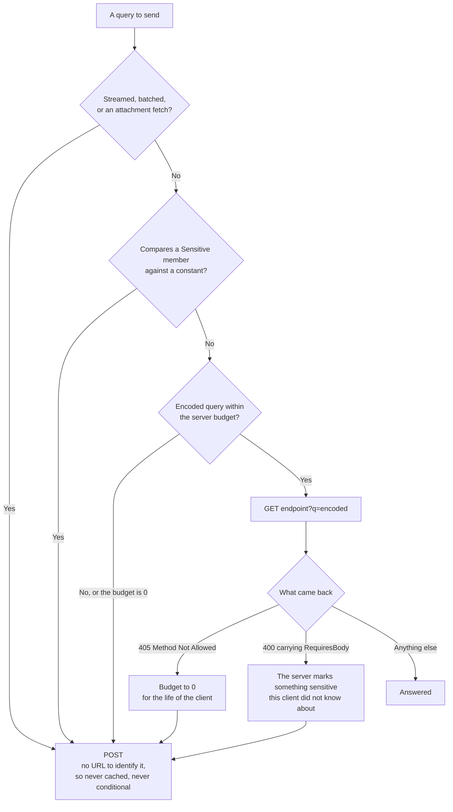

# Caching and 304 Not Modified

Scry caches nothing. Every query is executed, and every response is written in full — which is the right default, and wasteful whenever a client asks the same question twice against a database that has not changed in between.

[304 Not Modified](https://www.keycdn.com/support/304-not-modified) is the standard answer to that: the server hands out an `ETag` with a response, the client sends it back as `If-None-Match` next time, and a server that can cheaply prove nothing has changed replies with a status and no body. The hard part is the proof, and [Delta](https://github.com/SimonCropp/Delta) is a small library that supplies it — an `ETag` derived from the database's own change tracking, so "has anything changed" is one cheap read rather than a re-execution.

All of that ships. A query short enough to fit in a URL is asked with `GET`, so the caches that already exist can identify the response; `Scry.Server` writes the `ETag` and answers the `304`; and the one thing it cannot know — whether anything has changed — comes from a delegate the host supplies. [`Scry.Server.Delta`](#the-freshness-source) supplies one in a line. None of it is on until that delegate is set.


## Why a query is a URL

A cache — the browser's, a proxy's, a CDN's — decides what it can store from the method and the URL, and it decides before it looks at anything else. A `POST` is uncacheable to all of them, and its body is not part of any cache key, so a query sent as one is invisible to every cache between the client and the server no matter what headers it carries.

So a query that fits is sent as `GET {endpoint}?q={encoded}`, where `q` is the same serialized `QueryRequest` base64url-encoded ([`QueryUrl`](wire-format.md#the-url-form)). The URL identifies the response, which is what a cache needs, and `304` becomes what it is everywhere else on the web rather than something both ends have to hand-implement.

Three consequences worth stating plainly:

**The request travels in the URL, not in content on the GET.** A body would carry any query at any size, and it cannot be used. A browser refuses to send one — the Fetch standard forbids content on `GET`, which rules it out for a WASM client and for the explorer. And an intermediary is permitted to drop the content of a `GET`: what reaches the server is then still a well-formed request — same method, same URL — carrying nothing to execute, so the server answers 400 and the client that sent a complete request cannot tell that from a rejection it caused itself. The failure is silent, depends on infrastructure the client cannot see, and does not reproduce locally. A URL survives every hop by construction.

**A URL has a ceiling, so `POST` stays mapped.** 8 KB is the usual server and proxy limit on a whole request line, and what exceeds it is rejected by whichever hop is strictest, as a 414 or a 400 depending on the deployment. `QueryUrl.MaxLength` is set well below that; a query over it is sent as a body exactly as before, with no cache involvement. An `IN` list is the easiest way to get there — a few hundred ids is enough.

**A URL is logged.** Everything in the request, including the constants a filter compares against, lands in the access log of every hop and in the `Referer` of whatever the page does next. A query whose constants are sensitive on their own — an account number, a person's id — is one to keep on `POST` regardless of length.


## Which transport a query gets

The client decides, per query, before it sends anything. Nothing about it is configurable: each branch below is a fact about the query or about what the server said, and the two escapes to `POST` are the two things a URL cannot carry safely.



The two retries are what a *stale* client does — one built before the budget dropped to `0`, or before a member was marked. Neither needs a redeploy to start behaving: the 405 and the flag each say what to do instead, and the query still returns, one round trip later. A client in step with its server takes neither branch.

Both are bounded to one retry, and only ever from a URL to a body.


## What identifies a response

The ETag has to change whenever the bytes it stands for would change. Three things decide those bytes:

| Part | Changes when | Read from |
| --- | --- | --- |
| Schema stamp | the queryable surface is redeployed | `ScryProcessor.SchemaStamp` |
| Freshness token | anything is written | `ScryOptions.QueryFreshness` |
| Query fingerprint | a different question is asked | a hash of the `q` parameter |
| Cache scope | a different caller asks | `ScryOptions.CacheScope` |

The fingerprint costs nothing to obtain: the encoded request in the URL *is* the query, so hashing it identifies the query exactly. It is hashed only for size — `q` runs to thousands of characters where an ETag wants a handful. Being a hash of the encoded **bytes** means two spellings of the same query miss rather than collide, which is the safe direction for a cache key: a miss costs a round trip, a collision would cost correctness.

Nothing about it comes from the client's own account of what it sent. There is no header asserting a query hash and nothing that reads one — a client cannot describe its request as something other than what its URL says, because the URL is what the server hashed.

Delta's own ETag opens with the entry assembly's last write time, so any redeployment invalidates every entry. The schema stamp is the narrower version of that idea — narrower because a redeployed binary that left the queryable surface alone keeps its caches warm. It also means a client whose model has drifted can never be answered 304: the stamp in its ETag is the old one, so the comparison fails and it gets a full response carrying the server's current stamp, which is what [drift detection](schema-versioning.md) reads.

`If-None-Match` is compared as HTTP defines it rather than as a string: a list matches if any member does, `*` matches anything current, and the comparison is the weak one RFC 9110 asks for — so a tag some proxy weakened on the way through still matches, instead of turning every hit into a permanent miss.


## The server half

Two settings, and nothing else:

<!-- snippet: serverRegistration -->
<a id='snippet-serverRegistration'></a>
```cs
builder.Services
    .AddScry<SampleContext>(
    _ =>
    {
        // Holiday is a [QueryablePoco]: it has no table, so the server supplies its rows. Every
        // [QueryablePoco] type must be registered here or AddScry throws at startup.
        _.AddPocoSource(_ => Holiday.Seed());
        // Department.Handbook is an [Attachment], and one exposed without a check is a startup
        // failure. Registered here rather than by [AttachmentWith] because the model project
        // references the annotations alone and has no server type to name.
        _.AddAttachmentPolicy<Department, HandbookPolicy>();
        _.MaxPageSize = 200;

        // Repeat a query while nothing has been written and the answer is a 304 rather than a
        // re-execution. Optional, and off until a freshness source says how to tell — see
        // /docs/caching.md.
        _.UseDeltaFreshness<SampleContext>();

        // What a cached response belongs to. Department.Handbook carries an attachment check,
        // so this server has a source whose answers depend on who asked, and MapScry refuses
        // to start without this. The sample has no sign-in, so there is one caller and one
        // scope; a real app returns its tenant or its principal, and a client signing in as
        // someone else is then never handed the previous one's rows.
        _.CacheScope = _ => "sample";
    });
```
<sup><a href='/samples/Sample.Server/Program.cs#L26-L52' title='Snippet source file'>snippet source</a> | <a href='#snippet-serverRegistration' title='Start of snippet'>anchor</a></sup>
<!-- endSnippet -->

`QueryFreshness` is what the rows are current as of. Null — the default — writes no `ETag` and answers nothing conditionally, so a server that never sets it behaves exactly as it did before any of this existed. Returning null from it skips one request rather than turning the feature off, so a source that cannot answer right now degrades to a full response.

`CacheScope` is who a cached response belongs to. It is not optional where it matters: if any source carries a [row policy](policies.md) or an [attachment policy](attachments.md), its rows depend on who asked while its URL says nothing about that, and `MapScry` **refuses to start** until the host has said what a cached response is scoped to. The failure is loud at startup because the alternative is silent in production — a browser profile outlives a sign-out, so the next identity revalidates, matches, and is handed the previous one's rows.


### The freshness source

Reading "has anything changed" cheaply is the hard part, and it has no single answer — a transaction log position, a change-tracking version, a counter in Redis. [Delta](https://github.com/SimonCropp/Delta) answers it for a database, and `Scry.Server.Delta` is that answer wired up:

<!-- snippet: useDeltaFreshness -->
<a id='snippet-useDeltaFreshness'></a>
```cs
/// <summary>
/// Answers a repeated query with <c>304 Not Modified</c> while nothing has been written, by
/// reading <typeparamref name="TContext"/>'s own change marker through Delta's
/// <c>GetLastTimeStamp</c> — the transaction log's end position on SQL Server,
/// <c>pg_last_committed_xact</c> on PostgreSQL.
/// </summary>
/// <remarks>
/// <para>
/// One read of a marker the database already maintains, in place of executing the query and
/// writing its rows. That trade pays in almost any read-heavy app and does not pay where the data
/// changes on every request, since the marker moves for a write to anything at all.
/// </para>
/// <para>
/// The marker trails a commit rather than moving with it — a couple of hundred milliseconds on
/// SQL Server — so inside that window a client that has just written can be told its copy is
/// still current. A client that needs read-after-write sends <c>Cache-Control: no-cache</c>,
/// which skips the comparison and re-executes.
/// </para>
/// <para>
/// Where any source carries a row or attachment policy, its rows depend on who asked, and
/// <see cref="ScryOptions.CacheScope"/> has to say what a cached response belongs to.
/// <c>MapScry</c> refuses to start otherwise.
/// </para>
/// </remarks>
public static ScryOptions UseDeltaFreshness<TContext>(this ScryOptions options)
    where TContext : DbContext
{
    options.QueryFreshness = async (context, cancel) =>
    {
        var data = context.RequestServices.GetRequiredService<TContext>();
        var timeStamp = await data.GetLastTimeStamp(cancel);

        // A marker that says nothing identifies nothing, so the request is answered in full rather
        // than with an ETag that has a hole where its freshness should be.
        return timeStamp.Length == 0 ? null : timeStamp;
    };

    return options;
}
```
<sup><a href='/src/Scry.Server.Delta/ScryDeltaExtensions.cs#L9-L49' title='Snippet source file'>snippet source</a> | <a href='#snippet-useDeltaFreshness' title='Start of snippet'>anchor</a></sup>
<!-- endSnippet -->

Any other source is the same shape: a delegate returning a string that changes when the data does.

| Package | Use |
| --- | --- |
| [`Scry.Server.Delta`](https://nuget.org/packages/Scry.Server.Delta/) | `UseDeltaFreshness<TContext>()`. What the sample uses. |
| [`Delta`](https://nuget.org/packages/Delta/) | `UseDelta` for the app's own GET traffic — the host page, static assets, conventional endpoints. |
| [`Delta.SqlServer`](https://nuget.org/packages/Delta.SqlServer/) | Helpers for enabling and inspecting SQL Server change tracking. |


## The client half

In a browser, most of this half already exists. A query asked as a URL is an ordinary cacheable `GET`, so the browser stores the response, sends `If-None-Match` on its own next time, and turns the `304` back into the rows it already holds — none of which the app sees. That is the whole reason the request is a URL.

What the handler below adds is the same behaviour where that cache does not exist: a console app, a service, a test host. It matters here because the sample's own tests run outside a browser, and because without it `ScryClient` treats a bare 304 as what it is at that layer — a response with no rows in it, surfaced as a `ScryRequestException` with status 304.

It is a `DelegatingHandler` below the client, which re-asks with `If-None-Match` and rebuilds the response a 304 stands for:

<!-- snippet: clientCacheHandler -->
<a id='snippet-clientCacheHandler'></a>
```cs
public sealed class QueryCacheHandler(QueryCache cache) :
    DelegatingHandler
{
    protected override async Task<HttpResponseMessage> SendAsync(
        HttpRequestMessage request,
        CancellationToken cancellationToken)
    {
        if (Key(request) is not { } key)
        {
            return await base.SendAsync(request, cancellationToken);
        }

        var cached = cache.Get(key);
        if (cached is not null)
        {
            request.Headers.TryAddWithoutValidation("If-None-Match", cached.ETag);
        }

        var response = await base.SendAsync(request, cancellationToken);

        if (response.StatusCode == HttpStatusCode.NotModified &&
            cached is not null)
        {
            cache.RecordHit();
            return Replay(request, response, cached);
        }

        cache.RecordMiss();

        // Nothing to store: either the server is not offering ETags, or this is a response that
        // cannot be replayed from bytes held in memory.
        if (response.Headers.ETag?.ToString() is not { } etag ||
            response.Content.Headers.ContentType?.MediaType != "application/json")
        {
            return response;
        }

        var body = await response.Content.ReadAsByteArrayAsync(cancellationToken);
        cache.Store(key, new(etag, body, "application/json", Stamp(response)));

        // The content has been read to the end, so the response is handed back over the bytes rather
        // than over the stream they came out of.
        return WithBody(request, response, body, "application/json");
    }
```
<sup><a href='/samples/Sample.Client/QueryCacheHandler.cs#L15-L60' title='Snippet source file'>snippet source</a> | <a href='#snippet-clientCacheHandler' title='Start of snippet'>anchor</a></sup>
<!-- endSnippet -->

Registered into the named client's pipeline, with the store held apart from it — the factory rotates handlers every couple of minutes, and a cache that rotated with them would forget everything:

<!-- snippet: clientCacheRegistration -->
<a id='snippet-clientCacheRegistration'></a>
```cs
builder.Services.AddSingleton<QueryCache>();
builder.Services.AddTransient<QueryCacheHandler>();
builder.Services
    .AddHttpClient("scry")
    .AddHttpMessageHandler<QueryCacheHandler>();
```
<sup><a href='/samples/Sample.Client/Program.cs#L28-L34' title='Snippet source file'>snippet source</a> | <a href='#snippet-clientCacheRegistration' title='Start of snippet'>anchor</a></sup>
<!-- endSnippet -->

Above the handler nothing changes: the same `ScryClient`, the same generated models, the same rows.


## The exchange

Two identical queries, recorded at the socket. Both are `GET`s carrying the query in `q` — shown decoded, since what travels is base64url. The first is answered in full and carries an `ETag`; the second sends it back and is answered with a status and nothing else:

<!-- snippet: ConditionalQueryTests.ConditionalExchange.verified.txt -->
<a id='snippet-ConditionalQueryTests.ConditionalExchange.verified.txt'></a>
```txt
[
  {
    RequestUri: {
      Path: http://localhost/api/query,
      Query: {
        q: {"version":1,"root":"Employee","pipeline":[{"$type":"where","predicate":{"$type":"binary","op":"AndAlso","left":{"$type":"member","path":["Active"]},"right":{"$type":"binary","op":"Equal","left":{"$type":"member","path":["Department","Name"]},"right":{"$type":"const","value":"Engineering","tag":"String"}}}},{"$type":"orderBy","key":{"$type":"member","path":["Name"]},"descending":false},{"$type":"select","projection":{"members":[{"name":"Name","value":{"$type":"node","node":{"$type":"member","path":["Name"]}}}]}}],"stamp":"{scrubbed stamp}"}
      }
    },
    RequestMethod: GET,
    ResponseStatus: OK 200,
    ResponseHeaders: {
      Cache-Control: no-cache, private,
      ETag: {Scrubbed},
      Scry-Schema-Stamp: {Scrubbed},
      Scry-Url-Limit: 4096
    },
    ResponseContent: {"version":2,"kind":"List","payload":[{"name":"Aaron"},{"name":"Alice"}],"stamp":"{scrubbed stamp}"}
  },
  {
    RequestUri: {
      Path: http://localhost/api/query,
      Query: {
        q: {"version":1,"root":"Employee","pipeline":[{"$type":"where","predicate":{"$type":"binary","op":"AndAlso","left":{"$type":"member","path":["Active"]},"right":{"$type":"binary","op":"Equal","left":{"$type":"member","path":["Department","Name"]},"right":{"$type":"const","value":"Engineering","tag":"String"}}}},{"$type":"orderBy","key":{"$type":"member","path":["Name"]},"descending":false},{"$type":"select","projection":{"members":[{"name":"Name","value":{"$type":"node","node":{"$type":"member","path":["Name"]}}}]}}],"stamp":"{scrubbed stamp}"}
      }
    },
    RequestMethod: GET,
    RequestHeaders: {
      If-None-Match: {Scrubbed}
    },
    ResponseStatus: NotModified 304,
    ResponseHeaders: {
      Cache-Control: no-cache, private,
      ETag: {Scrubbed},
      Scry-Schema-Stamp: {Scrubbed},
      Scry-Url-Limit: 4096
    }
  }
]
```
<sup><a href='/samples/Sample.Tests/ConditionalQueryTests.ConditionalExchange.verified.txt#L1-L38' title='Snippet source file'>snippet source</a> | <a href='#snippet-ConditionalQueryTests.ConditionalExchange.verified.txt' title='Start of snippet'>anchor</a></sup>
<!-- endSnippet -->

The ETag values are scrubbed from that snapshot because they carry the database's log position. That the two match is what the 304 proves.

Note what the 304 does **not** carry: `Scry-Schema-Stamp`, since the response was never built by Scry. The handler replays the stamp it cached, and drift would have produced a full response anyway — the stamp is part of the ETag.


## What it costs

A URL-borne query reads the freshness token before doing anything else. That read is cheap — a lookup, not a scan — but it is not free, and it happens whether or not the request turns out to be a hit. The trade is one lookup against one query execution plus one response serialization, which pays off in almost any read-heavy app and does not pay off if the data changes on every request. A query asked in a body pays nothing, since it is never answered conditionally.


## The sharp edges

**A write is not visible instantly.** On SQL Server the log position Delta reads trails a committed transaction — a couple of hundred milliseconds on LocalDB. Inside that window a client that has written can still be told its cached copy is current. A client that needs read-after-write sends `Cache-Control: no-cache`, which skips the comparison and re-executes; that is the standard escape and it is honoured. Beyond it, this suits data whose update frequency is low relative to reads, which is the assumption Delta states outright.

**One token invalidates everything.** A write to anything at all moves the freshness token, so it empties the whole cache rather than the entries that write affected. Correct, and the reason the trade collapses on a write-heavy database.

**Anything a response varies by must be in the scope.** A [row policy](policies.md) that scopes rows to a tenant, or an [attachment policy](attachments.md) that answers per principal, makes two identical queries produce different bytes for different callers, and the URL says nothing about which one asked. `CacheScope` is where that goes, and a server carrying such a source will not start without it. For the same reason, a client's own store has to be cleared on sign-in and sign-out.

**A 304 skips the policies.** Nothing runs on a hit — that is the point — so a response header a policy writes is absent on one. A client reading such a header has to treat its absence as "unchanged" rather than as "gone".

**A query in a body is never answered conditionally.** A query too long for a URL, or one refused a URL by `[Sensitive]`, gets no ETag and no 304 — it is answered exactly as it would be with none of this configured. That is the same fact from the other side: what makes a response identifiable to a cache is its URL, and a body-borne query has none.

**A sensitive member changes both halves.** A constant compared against a member the model marks [`[Sensitive]`](annotations.md) sends the query as a body, so nothing lands in a log; a result containing one is sent `Cache-Control: no-store` with no `ETag`, so nothing lands on a disk. The second is worth dwelling on, because `private, no-cache` **stores** — it means revalidate before reuse, not do not keep — and the server sets `no-store` whatever the client believed, which is what makes it a control rather than a convention. A query with no `Select` returns every member of its source, so it falls under that rule without having named one.

**A URL response is cacheable, so the server says who may keep it.** Every answer to a `GET` carries `Cache-Control: private, no-cache`, and both halves are load-bearing. `private` is what keeps a CDN or a shared proxy out of it: rows are shaped by [policies](policies.md) that read the request, so the same URL answers differently for two principals, and a shared cache keyed on the URL alone would hand one of them the other's rows. `no-cache` keeps a stored copy revalidating rather than expiring on a guess — without a directive, a browser is free to invent a freshness lifetime and serve stale rows without asking. An app whose rows genuinely do not vary by caller can widen this above the endpoint; nothing else should.

**Not everything the client caches is cacheable.** The sample's handler keeps `application/json` responses only. A [streamed](querying.md#streaming-rows) result is meant to be read a row at a time and a [multipart](wire-format.md#binary-transfer) one carries binary parts beside its envelope; caching either means buffering it whole, so both pass through untouched. They still get an ETag from the server — a client that wants to cache them needs a strategy of its own.

**It is a cache, so it needs a bound.** The sample's is an unbounded dictionary, which suits a page that asks the same handful of queries. A real one wants an LRU, or a cap on the bytes held.


## The simpler options

Not every app needs this. Worth considering first:

- **Nothing.** A query that runs in single-digit milliseconds against a warm database does not need a caching layer, and this one costs a freshness read per request plus two places where staleness can hide. Leaving `QueryFreshness` unset is the default for that reason.
- **Delta's `UseDelta`, on the app's own GET traffic.** The Blazor host page, static assets, and any conventional endpoints get the same treatment with one line and no client-side work, because the browser already implements the client half.
- **A shorter-lived client cache with no server involvement.** If "the last few seconds" is fresh enough, a client that reuses a response for a fixed window skips the round trip entirely rather than shortening it.
