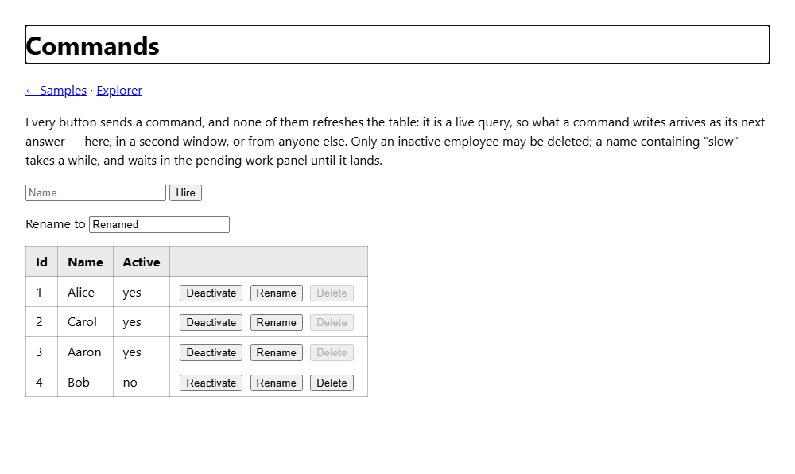
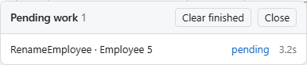

# Commands

A command is a write, in the service-bus sense: a message class the client sends, which the server validates, authorizes and hands to whatever handles it. Scry queries are read-only by design, and commands are how an application built on them writes.



A command the server decides within a short window answers at once. One that takes longer answers `Pending` and streams its outcome on the same response, so a screen behaves synchronously while the server is idle and hands the work to a pending-work panel when it is not. What a command wrote reaches every screen — the sender's and everyone else's — through the [live queries](live-queries.md) that read it. Nothing about a command is pushed to them: they are asked again because the rows they read changed.

The hostile-client model holds as it does for queries. Every command is bound on the server into the server's own class, through the properties the server allows, and decided again by the server's policies however the client got there.


## Declaring a command

A command is a class in the model assembly carrying `[Command]`. Its public read-write properties are its payload.

<!-- snippet: commandMessages -->
<a id='snippet-commandMessages'></a>
```cs
/// <summary>Deletes one employee — an inactive one, by the sample's policy.</summary>
[Command(typeof(Employee))]
public class DeleteEmployee
{
    public int Id { get; set; }
}

/// <summary>Renames one employee. A name containing "slow" takes a while, to show a command going pending.</summary>
[Command(typeof(Employee))]
public class RenameEmployee
{
    public int Id { get; set; }

    [StringLength(100, MinimumLength = 1)]
    public string Name { get; set; } = "";
}

/// <summary>Deactivates or reactivates one employee: what makes a row deletable, and deletable again.</summary>
[Command(typeof(Employee))]
public class SetEmployeeActive
{
    public int Id { get; set; }
    public bool Active { get; set; }
}

/// <summary>Hires an employee, answering with the new row's id.</summary>
[Command(Result = typeof(EmployeeCreated))]
public class CreateEmployee
{
    [StringLength(100, MinimumLength = 1)]
    public string Name { get; set; } = "";

    public int DepartmentId { get; set; }
    public Status Status { get; set; }
}

public class EmployeeCreated
{
    public int Id { get; set; }
}
```
<sup><a href='/samples/Sample.Model/Commands/EmployeeCommands.cs#L5-L46' title='Snippet source file'>snippet source</a> | <a href='#snippet-commandMessages' title='Start of snippet'>anchor</a></sup>
<!-- endSnippet -->

- `[Command(typeof(Employee))]` targets a row: the command acts on one `Employee`, whose key it carries as a property named like the key member (`Id`) or `{Target}{Key}` (`EmployeeId`). The target is also what the command's policy decides row by row, and what the server reports changed when the command completes.
- `[Command]` alone is untargeted: `CreateEmployee` acts on no existing row.
- `Result` names the class the command answers with. The client reads it typed.
- `Name` renames the command on the wire, as `[Queryable(Name = ...)]` renames a source.
- `[CommandIgnore]` keeps a property out of the payload, for the server to fill.
- A payload property is a scalar, an enum, `byte[]`, a nullable of those, or a list of those. DataAnnotations on a property are checked before anything runs.

A class that was a message before it was a command becomes one by annotating it. The sample's `RepriceOrder` is a message two NServiceBus endpoints already shared, and `[Command(typeof(Order))]` is all it took; the model still references nothing but `Scry.Annotations`.

The generator reads `[Command]` from the model DLL as it reads `[Queryable]`, and emits one class per command, one per result, and a `ScryCommands` facade on the generated `ScryQuery` as `Query.Commands`. A command class a client can construct is emitted with `init` properties; the server's own class is never referenced by the client.


## Sending one

<!-- snippet: sendCommandApi -->
<a id='snippet-sendCommandApi'></a>
```cs
/// <summary>
/// Sends a command, answering with its outcome where the server decides it within
/// <see cref="CommandWait"/> and otherwise as <see cref="ScryCommandStatus.Pending"/>, listed in
/// <see cref="PendingWork"/> until its outcome arrives on <see cref="ScryCommandOutcome.Completion"/>.
/// </summary>
/// <param name="command">A generated command class, which names the command it is.</param>
/// <param name="cancel">
/// Stops waiting. Before the server has answered it also abandons the request, so the command may
/// or may not have been accepted; after that it never stops the command, which goes on being
/// followed in <see cref="PendingWork"/>.
/// </param>
/// <remarks>
/// Throws for a command the server would not accept — malformed, denied, one too many — as a query
/// the server refuses does: it never ran, so sending it again is safe where the refusal was about
/// the moment rather than the request. A target that was gone by the time the command arrived is
/// not a refusal but a <see cref="ScryCommandStatus.Failed"/> outcome: a race lost to whoever
/// removed it.
/// </remarks>
public Task<ScryCommandOutcome> SendCommandAsync<TCommand>(TCommand command, Cancel cancel = default)
    where TCommand : class =>
    SendCommand(command, cancel);

/// <summary>
/// Sends a command that answers with a result, as <see cref="SendCommandAsync{TCommand}"/> does, with
/// the result typed on <see cref="ScryCommandOutcome{TResult}.Value"/>.
/// </summary>
public async Task<ScryCommandOutcome<TResult>> SendCommandAsync<TCommand, TResult>(TCommand command, Cancel cancel = default)
    where TCommand : class =>
    ScryCommandOutcome<TResult>.From(await SendCommand(command, cancel));
```
<sup><a href='/src/Scry.Client/ScryClient.Commands.cs#L198-L228' title='Snippet source file'>snippet source</a> | <a href='#snippet-sendCommandApi' title='Start of snippet'>anchor</a></sup>
<!-- endSnippet -->

Through the generated facade, a command is a method call:

<!-- snippet: commandsPageSend -->
<a id='snippet-commandsPageSend'></a>
```cs
Task Delete(EmployeeRow row) =>
    Send(() => Query.Commands.DeleteEmployee(new() {Id = row.Id}), $"Deleted {row.Name}.");

Task Rename(EmployeeRow row) =>
    Send(() => Query.Commands.RenameEmployee(new() {Id = row.Id, Name = renameTo}), $"Renamed {row.Name} to {renameTo}.");

Task SetActive(EmployeeRow row)
{
    var done = row.Active ? $"Deactivated {row.Name}." : $"Reactivated {row.Name}.";
    return Send(() => Query.Commands.SetEmployeeActive(new() {Id = row.Id, Active = !row.Active}), done);
}

// The typed outcome: the new row's id, read off the result the handler answered with.
async Task Create()
{
    var name = hireName;
    await Send(
        async () =>
        {
            var hired = await Query.Commands.CreateEmployee(new() {Name = name, DepartmentId = 1, Status = Status.FullTime});
            if (hired.Status == ScryCommandStatus.Completed)
            {
                status = $"Hired {name} as #{hired.Value.Id}.";
            }

            return hired;
        },
        done: null);
}

async Task Send(Func<Task<ScryCommandOutcome>> send, string? done)
{
    status = null;
    try
    {
        var outcome = await send();
        status = outcome.Status switch
        {
            ScryCommandStatus.Completed => done ?? status,

            // Still running when the client stopped waiting: the pending-work panel follows it to
            // its end, and the table shows what it wrote when it lands.
            ScryCommandStatus.Pending => $"{outcome.Command} is taking a while. It is in pending work.",
            _ => outcome.Error
        };
    }
    catch (Exception exception)
    {
        // Refused before it ran — malformed, denied, one too many — so nothing was written.
        status = exception.Message;
    }
}
```
<sup><a href='/samples/Sample.WebClient/Pages/Commands.razor.cs#L74-L127' title='Snippet source file'>snippet source</a> | <a href='#snippet-commandsPageSend' title='Start of snippet'>anchor</a></sup>
<!-- endSnippet -->

What comes back is a `ScryCommandOutcome`:

| Status | Means |
| --- | --- |
| `Completed` | Handled. `Result` holds what the handler answered with, typed on `ScryCommandOutcome<TResult>.Value`. |
| `Failed` | Accepted and then not done — the handler refused or failed, or the target was gone by the time the command arrived — with the reason on `Error`. |
| `Pending` | Still being handled when the client stopped waiting. `Completion` finishes with the outcome, and meanwhile the command is listed in `PendingWork`. |
| `Unknown` | The connection the command was answered on ended, and the server no longer holds its outcome. It may have run. |

A refusal is not an outcome. A command the server would not accept — malformed, denied outright, one too many — never ran, so sending it throws, as a query the server refuses does: `ScryRequestException` with a code, `ScryPermissionException`, or `ScryStaleClientException`. Where the refusal was about the moment (`CommandLimit`), sending it again is safe.

`EnsureCompleted()` turns anything but `Completed` into an exception, for code that has nothing to do with a failure but report it.


## What a caller may do

Two things say whether a button should be enabled, and both are advisory: the server decides again on every command.

`Query.Commands.CanCreateEmployee` is the command-wide answer: whether the command's policy allows this caller at all. It is `false` until the server has answered — the first read starts it, `Client.Ready` completes when it is in, and `CapabilitiesChanged` says when it moves. A denial refreshes it.

`EmployeeQueryModel.CanDeleteEmployee` is the per-row answer. Every targeted command adds a `bool` member to its target's query model, computed on the server, in the database, from the command's policy. It is a member like any other: the default projection carries it, a query filters, orders and groups by it, and inside a live query it is decided again on every run — so deactivating a row enables that row's Delete as the next answer arrives.

<!-- snippet: commandsPageMarkup -->
<a id='snippet-commandsPageMarkup'></a>
```razor
<form id="create" @onsubmit="Create">
    <input id="create-name" @bind="hireName" placeholder="Name" aria-label="Name to hire"/>
    <button id="create-submit" type="submit" disabled="@(!Query.Commands.CanCreateEmployee)">Hire</button>
</form>
<p>
    <label>Rename to <input id="rename-to" @bind="renameTo" aria-label="Rename to"/></label>
</p>

<table id="employees" data-ready="@Ready">
    <thead>
        <tr><th>Id</th><th>Name</th><th>Active</th><th></th></tr>
    </thead>
    <tbody>
    @foreach (var row in rows)
    {
        <tr data-id="@row.Id">
            <td>@row.Id</td>
            <td class="name">@row.Name</td>
            <td class="active">@(row.Active ? "yes" : "no")</td>
            <td class="actions">
                <button class="toggle" @onclick="() => SetActive(row)">@(row.Active ? "Deactivate" : "Reactivate")</button>
                <button class="rename" disabled="@(!Query.Commands.CanRenameEmployee)" @onclick="() => Rename(row)">Rename</button>
                <button class="delete" disabled="@(!row.CanDeleteEmployee)" @onclick="() => Delete(row)">Delete</button>
            </td>
        </tr>
    }
    </tbody>
</table>
```
<sup><a href='/samples/Sample.WebClient/Pages/Commands.razor#L14-L43' title='Snippet source file'>snippet source</a> | <a href='#snippet-commandsPageMarkup' title='Start of snippet'>anchor</a></sup>
<!-- endSnippet -->


## Handling one

A handler is an ordinary class in the container:

<!-- snippet: commandHandlerInterface -->
<a id='snippet-commandHandlerInterface'></a>
```cs
public interface ICommandHandler<in TCommand>
{
    Task Handle(TCommand command, ScryCommandContext context, Cancel cancel);
}

/// <summary>A handler for a command that answers with <typeparamref name="TResult"/>.</summary>
public interface ICommandHandler<in TCommand, TResult>
{
    Task<TResult> Handle(TCommand command, ScryCommandContext context, Cancel cancel);
}
```
<sup><a href='/src/Scry.Server/ICommandHandler.cs#L15-L26' title='Snippet source file'>snippet source</a> | <a href='#snippet-commandHandlerInterface' title='Start of snippet'>anchor</a></sup>
<!-- endSnippet -->

<!-- snippet: slowCommandHandler -->
<a id='snippet-slowCommandHandler'></a>
```cs
/// <summary>
/// Renames an employee. Saved by the pipeline once this returns, through the host's context — and so
/// through its change interceptor, which is what re-asks the live queries that read the name.
/// </summary>
public sealed class RenameEmployeeHandler(SampleContext data, IOptions<SampleCommandOptions> options) :
    ICommandHandler<RenameEmployee>
{
    public async Task Handle(RenameEmployee command, ScryCommandContext context, CancellationToken cancel)
    {
        // Stands in for work that takes a while: long enough past the sync window that the command is
        // answered as pending, and the client's pending-work panel shows it until it lands.
        if (command.Name.Contains("slow", StringComparison.OrdinalIgnoreCase))
        {
            await Task.Delay(options.Value.SlowDelay, cancel);
        }

        var employee = await data.Employees.SingleAsync(_ => _.Id == command.Id, cancel);
        employee.Name = command.Name;
    }
}
```
<sup><a href='/samples/Sample.CommandHandlers/EmployeeHandlers.cs#L22-L43' title='Snippet source file'>snippet source</a> | <a href='#snippet-slowCommandHandler' title='Start of snippet'>anchor</a></sup>
<!-- endSnippet -->

- The handler runs on a scope and a `DbContext` of its own, after the request that sent the command may have finished.
- The pipeline saves the context once the handler returns, where anything changed; set `ScryCommandContext.SaveChanges` to `false` to save differently. A handler that must save to learn a new row's key — as a create answering with an id does — saves itself.
- `ScryCommandException` carries a message the client is shown. Anything else thrown fails the command with the fixed "Command execution failed.", and the real exception goes to the [audit trail](observability.md).
- The context is the host's own `AddDbContext` registration, so where the host added `ScryChangeInterceptor` the save re-asks the live queries that read what it wrote.

The sample registers its handlers and turns commands on in two calls, one for each side of a host:

<!-- snippet: commandRegistration -->
<a id='snippet-commandRegistration'></a>
```cs
/// <summary>The handlers every sample command needs, and the options they read.</summary>
public static IServiceCollection AddSampleCommandHandlers(this IServiceCollection services, IConfiguration? configuration = null)
{
    var options = services.AddOptions<SampleCommandOptions>();
    if (configuration is not null)
    {
        options.Bind(configuration.GetSection("Sample:Commands"));
    }

    services.AddScoped<ICommandHandler<DeleteEmployee>, DeleteEmployeeHandler>();
    services.AddScoped<ICommandHandler<RenameEmployee>, RenameEmployeeHandler>();
    services.AddScoped<ICommandHandler<SetEmployeeActive>, SetEmployeeActiveHandler>();
    services.AddScoped<ICommandHandler<CreateEmployee, EmployeeCreated>, CreateEmployeeHandler>();
    services.AddScoped<ICommandHandler<RepriceOrder>, RepriceOrderHandler>();

    // A policy with dependencies is resolved rather than constructed, so it is registered.
    services.AddScoped<CreateEmployeePolicy>();
    return services;
}

/// <summary>Commands on, answered at once where they finish within a second, and their policies.</summary>
public static ScryOptions UseSampleCommands(this ScryOptions options)
{
    // Off until a server says how many it will have in flight at once, which is also what maps
    // the routes — as MaxSubscriptions is for live queries.
    options.MaxPendingCommands = 100;
    options.CommandSyncWindow = TimeSpan.FromSeconds(1);
    options.AddCommandPolicy<DeleteEmployee, DeleteEmployeePolicy>();
    options.AddCommandPolicy<CreateEmployee, CreateEmployeePolicy>();
    return options;
}
```
<sup><a href='/samples/Sample.CommandHandlers/SampleCommands.cs#L19-L51' title='Snippet source file'>snippet source</a> | <a href='#snippet-commandRegistration' title='Start of snippet'>anchor</a></sup>
<!-- endSnippet -->


## Policies

<!-- snippet: commandPolicyInterface -->
<a id='snippet-commandPolicyInterface'></a>
```cs
public interface ICommandPolicy<TCommand>
{
    bool Allow(ScryPolicyContext context);
}

/// <summary>
/// Decides, for a targeted command, which rows of <typeparamref name="TEntity"/> a caller may send it
/// against — as an expression, so it runs in the database: as the check a command's row has to pass,
/// and as the <c>Can{Command}</c> member a query reads per row.
/// </summary>
/// <remarks>
/// Composed with the target's own row policies rather than instead of them: a row the caller cannot
/// read is not one they can send a command against, whatever this answers.
/// </remarks>
public interface ICommandPolicy<TCommand, TEntity> :
    ICommandPolicy<TCommand>
{
    Expression<Func<TEntity, bool>> Rows(ScryPolicyContext context);
}
```
<sup><a href='/src/Scry.Server/ICommandPolicy.cs#L14-L34' title='Snippet source file'>snippet source</a> | <a href='#snippet-commandPolicyInterface' title='Start of snippet'>anchor</a></sup>
<!-- endSnippet -->

`Allow` decides the whole command for the caller: a refusal is a `403`, and the facade's `Can*` reads `false`. `Rows` decides it row by row, as an expression the server composes into SQL: a row it refuses is answered exactly as a row that is not there — one `404`, whether the row is absent, hidden by the source's row policies, or refused by the command's — so a caller probing keys learns nothing about rows it may not see. It is also what the row's `Can*` member reads.

<!-- snippet: commandPolicy -->
<a id='snippet-commandPolicy'></a>
```cs
/// <summary>
/// Only an inactive employee may be deleted. Checked on every delete sent — a row this refuses is
/// answered exactly as a row that is not there — and computed per row as
/// <c>Employee.CanDeleteEmployee</c>, in the database, for every query that reads it.
/// </summary>
public sealed class DeleteEmployeePolicy :
    ICommandPolicy<DeleteEmployee, Employee>
{
    public bool Allow(ScryPolicyContext context) => true;

    public Expression<Func<Employee, bool>> Rows(ScryPolicyContext context) =>
        _ => !_.Active;
}
```
<sup><a href='/samples/Sample.CommandHandlers/EmployeePolicies.cs#L3-L17' title='Snippet source file'>snippet source</a> | <a href='#snippet-commandPolicy' title='Start of snippet'>anchor</a></sup>
<!-- endSnippet -->

A policy is registered with `[Command(Policy = ...)]` or `options.AddCommandPolicy<TCommand, TPolicy>()`, which wins. A policy with constructor dependencies is resolved from the container. A command with no policy is allowed.


## Turning commands on

<!-- snippet: scryOptionsCommands -->
<a id='snippet-scryOptionsCommands'></a>
```cs
/// <summary>
/// How many commands may be in flight at once — accepted and not yet finished. Default zero, which
/// maps no command route at all: a server serves writes because it said it would, and one that has
/// not says nothing about the commands its model declares — every capability reads false.
/// </summary>
/// <remarks>
/// One past the limit is answered <c>503</c> with a <c>Retry-After</c>, and nothing about it runs.
/// When this is set, every command the model declares has to be handled — by a handler in the
/// container or a dispatcher that claims it — or the server refuses to start.
/// </remarks>
public int MaxPendingCommands { get; set; }

/// <summary>
/// How many of those one caller may have in flight, where <see cref="Caller"/> can say who is
/// asking. Default 20. One past it is answered <c>429</c>.
/// </summary>
public int MaxPendingCommandsPerCaller { get; set; } = 20;

/// <summary>
/// How long a command is waited for before it is answered as pending. Default one second. A command
/// finishing inside it is answered with its outcome in one response; one that does not is answered
/// with a stream: pending at once, then the outcome when it lands.
/// </summary>
public TimeSpan CommandSyncWindow { get; set; } = TimeSpan.FromSeconds(1);

/// <summary>
/// How long a finished command's outcome is kept for a client asking for it again by its id.
/// Default five minutes. A command still pending after twelve times this is failed as having
/// received no completion — a handler that never answers must not hold its place for ever.
/// </summary>
public TimeSpan CommandRetention { get; set; } = TimeSpan.FromMinutes(5);

/// <summary>
/// The largest command body read, in bytes. Default 65,536 (64 KiB). One declaring more is refused
/// with a <c>413</c> before it is read, and one sending more is refused once it passes the limit.
/// </summary>
public int MaxCommandBytes { get; set; } = 64 * 1024;
```
<sup><a href='/src/Scry.Server/ScryOptions.cs#L251-L289' title='Snippet source file'>snippet source</a> | <a href='#snippet-scryOptionsCommands' title='Start of snippet'>anchor</a></sup>
<!-- endSnippet -->

Commands are off until a server says how many it will have in flight at once. Off is absent rather than guarded, as it is for live queries: `MaxPendingCommands` at zero maps no command route, every `Can*` reads `false`, and a host with commands off needs no handlers. A host that turns them on has to route every command the model declares — to an in-process handler or a dispatcher that claims it — or it refuses to start.

`MapScry` maps three routes beside the query endpoints, under whatever authorization the endpoint carries:

| Route | Answers |
| --- | --- |
| `POST {pattern}/command` | The command's receipt as JSON where it was decided within `CommandSyncWindow`, and otherwise a stream of receipts |
| `GET {pattern}/command/{id}` | The same answer again, for the caller that sent it — what a client re-attaches with |
| `GET {pattern}/capabilities` | The commands this caller may send |


## Seeing what a command wrote

The screen that sent a command reads what it wrote the way every other screen does: through a live query.

<!-- snippet: commandsPageQuery -->
<a id='snippet-commandsPageQuery'></a>
```cs
protected override async Task OnInitializedAsync()
{
    // The Delete button of each row is its CanDeleteEmployee: the command's policy, decided per
    // row in the database, and decided again on every answer — so deactivating a row enables its
    // Delete as the next answer arrives.
    employees = Query
        .Employee
        .OrderBy(_ => _.Id)
        .Select(_ => new EmployeeRow(_.Id, _.Name, _.Active, _.CanDeleteEmployee))
        .Live()
        .Subscribe(
            answer =>
            {
                rows = answer;
                answered = true;
                InvokeAsync(StateHasChanged);
            },
            exception =>
            {
                error = exception.Message;
                InvokeAsync(StateHasChanged);
            });

    // What this caller may send at all, for the buttons bound to Query.Commands.Can*. False until
    // the server has said, and said again whenever a denial shows it has moved.
    Client.CapabilitiesChanged += Redraw;
    await Client.Ready;
    capable = true;
}
```
<sup><a href='/samples/Sample.WebClient/Pages/Commands.razor.cs#L39-L69' title='Snippet source file'>snippet source</a> | <a href='#snippet-commandsPageQuery' title='Start of snippet'>anchor</a></sup>
<!-- endSnippet -->

A handler's save is reported by the interceptor on the context it saved through, a bulk write by the handler calling `ScryChanges.Notify`, and whatever else by the change probe or the poll. A targeted command that completes also reports its target changed, which covers a handler that writes with `ExecuteUpdate` and a worker that reports nothing; where the interceptor reported too, the two are one run.

The outcome and the live answer arrive in no set order. Over HTTP the outcome usually lands first and the table within `SubscriptionThrottle`; over a bus either can lead. So a screen takes its status from the outcome and its rows from the live query, and one that must show its own write the moment `Completed` arrives asks once more.


## A command that takes longer

The server waits `CommandSyncWindow` for a command's outcome. One decided within it is answered as JSON, in one response. One that is not is answered `200 text/event-stream`: a `result` event carrying the `Pending` receipt at once, then one carrying the outcome when it lands, then the end of the stream — the framing a live query's answers use, heartbeats and a lifetime included.

The client waits `CommandWait` — three seconds unless set — before answering `Pending` and listing the command in `ScryClient.PendingWork`, whose `Completion` the same stream then finishes. A stream that is cut, or ended by the server to bound its life, is asked for again by the command's id, under `ScryClient.Reconnect`. Asked for again and not found — pruned after `CommandRetention`, or asked of a node that never held it — it ends `Unknown`.

A Blazor app renders the pending-work panel once, beside the router:

<!-- snippet: pendingWorkMarkup -->
<a id='snippet-pendingWorkMarkup'></a>
```razor
<ScryPendingWork />
```
<sup><a href='/samples/Sample.WebClient/App.razor#L5-L7' title='Snippet source file'>snippet source</a> | <a href='#snippet-pendingWorkMarkup' title='Start of snippet'>anchor</a></sup>
<!-- endSnippet -->



It opens as a command goes pending, shows each to its end, and drops a completed one after `CompletedLinger`. A failed or unknown one stays until it is cleared, since it is saying something somebody should read. The store raises `Changed` on the synchronization context the command was sent from, so a WPF or Windows Forms list bound to it redraws with no marshalling.

Each pending command holds one response open. HTTP/1.1 allows six to an origin, which live queries share; HTTP/2 multiplexes them over one connection, and the hub carries them all on one socket.


## Over SignalR

A client made with `ScrySignalRClient.Create` sends commands over the hub, re-attaches over it when the connection comes back, and reads capabilities from it. The hub method is the same processor, so the limits, policies and audit are the same, and the caller is decided as the HTTP endpoint decides it. A refusal surfaces as the exception it is over HTTP.

A write over a hub is not guarded the way one over HTTP is — see [Security](#security).


## Over a message bus

A command need not be handled where the server is. A dispatcher claims it, carries it to a worker, and finishes it when the worker says how it ended; the client sees the same outcome, usually past the sync window and so through the streamed receipt.

With NServiceBus, the package that carries changes between servers carries commands too:

<!-- snippet: sampleNServiceBusCommands -->
<a id='snippet-sampleNServiceBusCommands'></a>
```cs
// RepriceOrder goes to the worker rather than to the in-process handler BackplaneHost
// registered: a dispatcher's claim comes first. The endpoint's routing says where it goes,
// and the worker's reply to this endpoint is what finishes it.
_.UseNServiceBusCommands(_ => _.For<RepriceOrder>());
```
<sup><a href='/samples/Sample.NServiceBusServer/NServiceBusServerHost.cs#L25-L30' title='Snippet source file'>snippet source</a> | <a href='#snippet-sampleNServiceBusCommands' title='Start of snippet'>anchor</a></sup>
<!-- endSnippet -->

<!-- snippet: useNServiceBusCommands -->
<a id='snippet-useNServiceBusCommands'></a>
```cs
/// <summary>
/// On a Scry server: sends the commands it claims over NServiceBus, through the host's
/// <see cref="IMessageSession"/> and routed by the endpoint's own routing, and finishes each when
/// the worker that handled it replies. Claims every command the endpoint knows as an NServiceBus
/// <see cref="ICommand"/> by marker, and those <paramref name="configure"/> names — never the rest,
/// which stay with their in-process handlers.
/// </summary>
/// <remarks>
/// The endpoint has to be able to receive, since the reply comes back to it — and to this node, so
/// each node is an endpoint of its own, as the change backplane already needs.
/// </remarks>
public static ScryOptions UseNServiceBusCommands(this ScryOptions options, Action<BusCommands>? configure = null)
{
    var claims = new BusCommands();
    configure?.Invoke(claims);
    options.AddDispatcher(_ => new NServiceBusDispatcher(_, claims));
    return options;
}

/// <summary>
/// On an endpoint whose handlers handle commands a Scry server sends: replies to each with how it
/// ended, once its handlers are done and through the message's own context — so the reply leaves
/// only if the handlers' work is kept, and once for a message that was retried. A message that
/// exhausts recoverability is answered as failed as it goes to the error queue.
/// </summary>
/// <remarks>
/// Apart from <see cref="UseScryChanges"/>: a worker may reply without publishing changes, where the
/// servers hear of what it saved some other way. A command's own target is re-asked on completion
/// either way.
/// </remarks>
public static EndpointConfiguration UseScryCommands(this EndpointConfiguration configuration)
{
    var failed = new FailedCommands();
    configuration.GetSettings().Set(failed);
    configuration.EnableFeature<ScryCommandsFeature>();
    configuration.Pipeline.Register(
        new ScryCommandsBehavior(),
        "Replies to each command a Scry server sent with how it ended.");
    configuration.Recoverability().Failed(_ => _.OnMessageSentToErrorQueue(failed.Answer));
    return configuration;
}

/// <summary>
/// What a handler of a command with a result answers with, sent back to the server in the reply.
/// Serialized as the server's own results are, so it arrives as the client expects it.
/// </summary>
public static void SetScryResult(this IMessageHandlerContext context, object result)
{
    if (!context.Extensions.TryGet<CommandResult>(out var holder))
    {
        throw new InvalidOperationException(
            "SetScryResult was called while handling a message no Scry server sent as a command, or on an endpoint without UseScryCommands.");
    }

    holder.Json = JsonSerializer.Serialize(result, result.GetType(), ScryJson.Options);
}
```
<sup><a href='/src/Scry.Server.NServiceBus/ScryNServiceBusExtensions.cs#L56-L113' title='Snippet source file'>snippet source</a> | <a href='#snippet-useNServiceBusCommands' title='Start of snippet'>anchor</a></sup>
<!-- endSnippet -->

The worker's handler is an ordinary `IHandleMessages<T>`. The reply leaves through the message's own context, beside the `ScryChanged` publish — so it leaves only if the handler's work was kept, with the outbox after its transaction commits, and once for a retried message. A message that exhausts recoverability is answered as failed as it goes to the error queue.

MassTransit, Rebus and Wolverine each have a package of their own. They claim nothing until told, carry no change backplane, and follow the same shape: the server's option, a completion handler on the server's bus, and a worker-side hook.

<!-- snippet: useMassTransitCommands -->
<a id='snippet-useMassTransitCommands'></a>
```cs
/// <summary>
/// On a Scry server: publishes the commands <paramref name="configure"/> names over MassTransit,
/// with their id and caller as headers, and finishes each when its consumer says how it ended.
/// Claims nothing until told, since nothing about a MassTransit message says it is one.
/// </summary>
/// <remarks>
/// The server's bus needs <see cref="AddScryCommandCompletions"/>, which is what hears the answers.
/// </remarks>
public static ScryOptions UseMassTransitCommands(this ScryOptions options, Action<BusCommands>? configure = null)
{
    var claims = new BusCommands();
    configure?.Invoke(claims);
    options.AddDispatcher(_ => new MassTransitDispatcher(_, claims));
    return options;
}

/// <summary>
/// On the server's bus: the consumer that hears how each command ended. On a temporary endpoint of
/// its own, so that every node receives every completion — only the node that dispatched a command
/// holds it, and one queue shared between nodes would hand each completion to one of them.
/// </summary>
public static IBusRegistrationConfigurator AddScryCommandCompletions(this IBusRegistrationConfigurator configurator)
{
    configurator
        .AddConsumer<MassTransitCommandCompletedConsumer>()
        .Endpoint(_ => _.Temporary = true);
    return configurator;
}

/// <summary>
/// On a worker's bus: publishes how each command a Scry server sent ended, once its consumers are
/// done. Configure it before <c>UseMessageRetry</c>, so a failure is reported once retries are
/// spent rather than at the first attempt.
/// </summary>
public static void UseScryCommands(this IBusFactoryConfigurator configurator, IRegistrationContext context) =>
    configurator.UseConsumeFilter(typeof(ScryCommandFilter<>), context);

/// <summary>
/// What a consumer of a command with a result answers with, published back to the server with the
/// completion. Serialized as the server's own results are, so it arrives as the client expects it.
/// </summary>
public static void SetScryResult(this ConsumeContext context, object result)
{
    if (!context.TryGetPayload<CommandResult>(out var holder))
    {
        throw new InvalidOperationException(
            "SetScryResult was called while consuming a message no Scry server sent as a command, or on a bus without UseScryCommands.");
    }

    holder.Json = JsonSerializer.Serialize(result, result.GetType(), ScryJson.Options);
}
```
<sup><a href='/src/Scry.Server.MassTransit/ScryMassTransitExtensions.cs#L6-L58' title='Snippet source file'>snippet source</a> | <a href='#snippet-useMassTransitCommands' title='Start of snippet'>anchor</a></sup>
<!-- endSnippet -->

<!-- snippet: useRebusCommands -->
<a id='snippet-useRebusCommands'></a>
```cs
/// <summary>
/// On a Scry server: sends the commands <paramref name="configure"/> names over Rebus, with their id
/// and caller as headers and routed by the bus's own routing, and finishes each when the reply to
/// it arrives. Claims nothing until told, since nothing about a Rebus message says it is one.
/// </summary>
/// <remarks>
/// The server's bus needs <see cref="RebusCommandCompletedHandler"/> registered as a handler, and
/// an input queue of its own on each node, since that is where the reply comes back to.
/// </remarks>
public static ScryOptions UseRebusCommands(this ScryOptions options, Action<BusCommands>? configure = null)
{
    var claims = new BusCommands();
    configure?.Invoke(claims);
    options.AddDispatcher(_ => new RebusDispatcher(_, claims));
    return options;
}

/// <summary>
/// On a worker's bus: replies to each message a Scry server sent as a command with how it ended —
/// once its handlers have returned, inside the message's own transaction, so the reply leaves only
/// if their work is kept. A message that exhausts its delivery attempts is answered as failed as it
/// goes to the error queue.
/// </summary>
public static OptionsConfigurer EnableScryCompletion(this OptionsConfigurer options)
{
    options.Register(_ => new CompletionSender(_.Get<ISerializer>(), _.Get<ITransport>(), _.Get<IMessageTypeNameConvention>()));
    options.Decorate<IPipeline>(
        _ => new PipelineStepInjector(_.Get<IPipeline>())
            .OnReceive(new CompletionStep(_.Get<CompletionSender>()), PipelineRelativePosition.After, typeof(DispatchIncomingMessageStep)));
    options.Decorate<IErrorHandler>(_ => new CompletionErrorHandler(_.Get<IErrorHandler>(), _.Get<CompletionSender>()));
    return options;
}

/// <summary>
/// What a handler of a command with a result answers with, sent back to the server in the reply.
/// Serialized as the server's own results are, so it arrives as the client expects it.
/// </summary>
public static void SetScryResult(this IMessageContext context, object result)
{
    if (!context.Headers.ContainsKey(ScryCommandHeaders.CommandId))
    {
        throw new InvalidOperationException("SetScryResult was called while handling a message no Scry server sent as a command.");
    }

    var step = context.IncomingStepContext;
    var holder = step.Load<CommandResult>();
    if (holder is null)
    {
        holder = new();
        step.Save(holder);
    }

    holder.Json = JsonSerializer.Serialize(result, result.GetType(), ScryJson.Options);
}
```
<sup><a href='/src/Scry.Server.Rebus/ScryRebusExtensions.cs#L6-L61' title='Snippet source file'>snippet source</a> | <a href='#snippet-useRebusCommands' title='Start of snippet'>anchor</a></sup>
<!-- endSnippet -->

<!-- snippet: useWolverineCommands -->
<a id='snippet-useWolverineCommands'></a>
```cs
/// <summary>
/// On a Scry server: sends the commands <paramref name="configure"/> names over Wolverine, with
/// their id and caller as headers and routed by the application's own routing, and finishes each
/// when the response to it arrives. Claims nothing until told, since nothing about a Wolverine
/// message says it is one.
/// </summary>
/// <remarks>
/// The server's Wolverine options need <see cref="AddScryCommandCompletions"/>, which is what hears
/// the responses.
/// </remarks>
public static ScryOptions UseWolverineCommands(this ScryOptions options, Action<BusCommands>? configure = null)
{
    var claims = new BusCommands();
    configure?.Invoke(claims);
    options.AddDispatcher(_ => new WolverineDispatcher(_, claims));
    return options;
}

/// <summary>On the server's Wolverine options: the handler that hears how each command ended.</summary>
public static WolverineOptions AddScryCommandCompletions(this WolverineOptions options)
{
    options.Discovery.IncludeType(typeof(WolverineCommandCompletedHandler));
    return options;
}

/// <summary>
/// On a worker's Wolverine options: responds to each message a Scry server sent as a command with
/// how it ended, once its handler has returned. For a message that ends in the error queue, add
/// <see cref="AndScryFailure"/> to the error policy that sends it there.
/// </summary>
public static WolverineOptions UseScryCommands(this WolverineOptions options)
{
    options.Policies.AddMiddleware(typeof(ScryCommandMiddleware), _ => _.MessageType != typeof(WolverineCommandCompleted));
    return options;
}

/// <summary>
/// On a worker's error policy, after <c>MoveToErrorQueue</c>: also answers the command whose
/// message it is as failed, to the server waiting for it — which would otherwise hold it pending
/// until it gave up on it.
/// </summary>
public static IAdditionalActions AndScryFailure(this IAdditionalActions actions) =>
    actions.And(ScryCommandMiddleware.Failed, "Answers the Scry command whose message this is as failed.");

/// <summary>
/// What a handler of a command with a result answers with, sent back to the server in the
/// response. Serialized as the server's own results are, so it arrives as the client expects it.
/// </summary>
public static void SetScryResult(this IMessageContext context, object result)
{
    if (context.Envelope is not { } envelope ||
        !envelope.Headers.ContainsKey(ScryCommandHeaders.CommandId))
    {
        throw new InvalidOperationException("SetScryResult was called while handling a message no Scry server sent as a command.");
    }

    ScryCommandMiddleware.SetResult(envelope, JsonSerializer.Serialize(result, result.GetType(), ScryJson.Options));
}
```
<sup><a href='/src/Scry.Server.Wolverine/ScryWolverineExtensions.cs#L6-L65' title='Snippet source file'>snippet source</a> | <a href='#snippet-useWolverineCommands' title='Start of snippet'>anchor</a></sup>
<!-- endSnippet -->

A worker on one of these reaches live queries through the target notification on completion, a change probe, or the poll.


## Hosting without HTTP

`ScryProcessor.SendCommand` is the programmatic form of the command endpoint, for a transport of a host's own: it enforces every bound — validation, policies, the target check, the limits — and yields the receipts, throwing for each refusal before anything is dispatched. `Receipt` is the re-attach, and `Capabilities` the capabilities read. On the client, the `ScryClient` constructor takes `commandTransport`, `receiptTransport` and `capabilitiesTransport` beside the query delegates; without them commands are refused with a directed `NotSupportedException` and `Can` answers `false`.


## Security

- The payload is bound into the server's own class, through the properties the server allows, with unknown members refused, enums by name only, and nested depth bounded. The name the client sends is looked up among the server's commands; the client's class is never trusted.
- A target the caller may not act on is answered exactly as one that is not there.
- A command's outcome is given again only to the caller that sent it. Anyone else asking by its id is answered as if it were unknown.
- Capabilities are advisory. They decide what a screen enables, never what the server accepts.
- Commands are off by default, and off maps no route.
- A write over a SignalR hub has no JSON content type for a cross-site form to be unable to declare, and a WebSocket handshake is not subject to CORS. A hub that authenticates by cookie keeps that cookie at `SameSite=Lax` or `Strict`, or checks the handshake's `Origin`.
- A hub call has no request of its own, so a policy that reads the caller reads it from a scoped service a hub filter fills, not from `IHttpContextAccessor`.

See [Security](security.md#commands) for the full layer.


## What it does not do

- No transaction spans two commands, and nothing orders commands carried over a bus.
- The client neither retries a refused command nor queues one offline: a refusal is the caller's to act on.
- Re-attaching is node-local. A command's outcome is held by the node that accepted it, so a client asking a different node is told the command is unknown — pin a client to its node, or accept `Unknown` across a deployment.


## From F#

<!-- snippet: fsharpCommand -->
<a id='snippet-fsharpCommand'></a>
```fs
/// A command from F#: the generated class, its properties set in the constructor call, sent through
/// the generated facade. The outcome is a Task like any other — Completed where the server decided
/// it within its sync window, Pending with its Completion to await where it did not.
let rename (query: ScryQuery) (id: int) (name: string) =
    query.Commands.RenameEmployee(RenameEmployee(Id = id, Name = name))

/// A command that answers with a result: the typed outcome's Value is the class the handler
/// answered with, read only once EnsureCompleted has said the command did complete.
let hire (query: ScryQuery) (name: string) (departmentId: int) =
    task {
        let! outcome =
            query.Commands.CreateEmployee(CreateEmployee(Name = name, DepartmentId = departmentId, Status = Status.FullTime))

        return outcome.EnsureCompleted().Value.Id
    }
```
<sup><a href='/samples/Sample.FSharp/Commands.fs#L8-L24' title='Snippet source file'>snippet source</a> | <a href='#snippet-fsharpCommand' title='Start of snippet'>anchor</a></sup>
<!-- endSnippet -->
