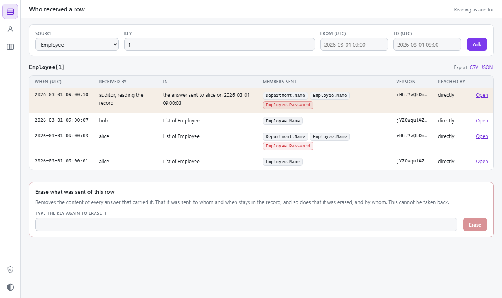
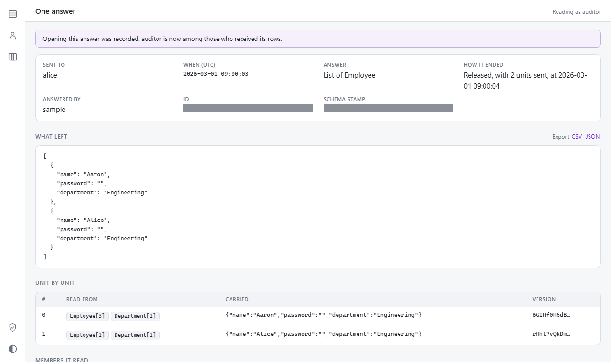
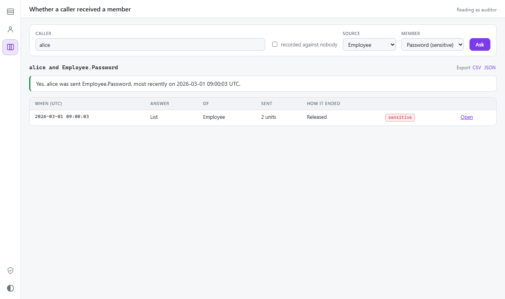
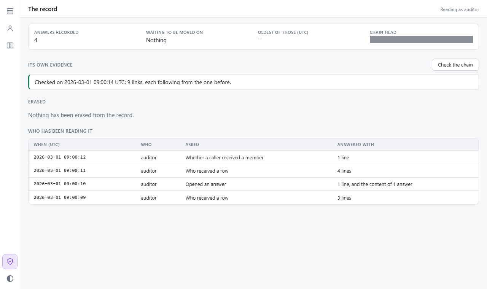

# Disclosure audit

The [audit hook](observability.md#the-audit-hook) records what was asked: the request, its outcome, a row count. Nothing in it records what was sent. The disclosure audit is that record: opt-in, durable, deduplicated and queryable, of every piece of data the server hands to a caller.

The threat model is the one in [Security model](security.md): the client is hostile and under the user's control, so "disclosed" means whatever left the server in a response, not what a screen rendered. Anything returned to a client is treated as seen by that caller.

It answers three questions from the store, each by index lookup:

1. Which callers received row X of source S, when, and which version of it?
2. What did caller U receive between T1 and T2? The response content can be rebuilt from the store.
3. Did caller U ever receive member M of any row of S?




## Turning it on

The audit is off until a host gives it somewhere to record. That is a sink: the one seam every store implements.

<!-- snippet: disclosureSink -->
<a id='snippet-disclosureSink'></a>
```cs
public interface IScryDisclosureSink
{
    /// <summary>Accepts a batch, blocking until it is durable. What the blocking processor surface calls.</summary>
    void Append(ScryDisclosureBatch batch);

    /// <summary>Accepts a batch, completing once it is durable. What the endpoints call.</summary>
    ValueTask AppendAsync(ScryDisclosureBatch batch, Cancel cancel);
}
```
<sup><a href='/src/Scry.Server/IScryDisclosureSink.cs#L24-L33' title='Snippet source file'>snippet source</a> | <a href='#snippet-disclosureSink' title='Start of snippet'>anchor</a></sup>
<!-- endSnippet -->

`UseDisclosureAudit` takes a sink and turns the audit on. Scry ships three: `ScryMemoryDisclosureStore` for tests and for a host whose record may live and die with the process, `ScryDisclosureJournal` to put a write-ahead file in front of any other, and the SQL Server store in `Scry.Server.Disclosure.SqlServer`. The bundled `Sample.DisclosureServer` keeps its record in SQL Server, in the application's own database:

<!-- snippet: sampleDisclosureAudit -->
<a id='snippet-sampleDisclosureAudit'></a>
```cs
services
    .AddScry<SampleContext>(_ =>
    {
        // What the model needs before any server will start: see Sample.WebServer.
        _.AddPocoSource(_ => Holiday.Seed());
        _.AddAttachmentPolicy<Department, SignedIn<Department>>();
        _.AddAttachmentPolicy<Employee, SignedIn<Employee>>();

        // Every answer is a committed row in this database before it is sent, and an answer
        // the database does not take is not given. The application's own database, so that
        // recording adds nothing that can be down to the path of an answer.
        _.UseSqlServerDisclosureAudit(
            database.ConnectionString,
            store =>
            {
                // Each batch of the record linked to the one before, so that a change to what
                // was recorded shows. A server with ledger tables has them as well, and they
                // are the stronger of the two; this is what the explorer's check reads.
                store.HashChain = true;
                store.Clock = clock;
            },
            audit =>
            {
                audit.Node = "sample";
                audit.Clock = clock;

                // A row is recorded by its key, and a source with none has to be given one or
                // owned up to: a view by what its rows are grouped on.
                audit.Key<EmployeeSummary>(_ => _.Department);

                // Left out of the record: a calendar is nobody's to ask after, and neither is
                // the logo or the handbook a department publishes. An answer of nothing but
                // these is sent as it would be with the audit off. One that reads anything
                // else is recorded whole, these included.
                audit.Exclude<Holiday>();
                audit.Exclude<Department>(_ => _.Logo, _ => _.Handbook);
            });

        // A query asked by URL may be kept by the caller's own cache, which has to ask before
        // using its copy again. Being told the copy still stands is a 304, and is recorded
        // before it is said. Nothing writes to this sample's rows once it has started, so an
        // answer stands for as long as the server does. A real host reads a change marker
        // here, as Sample.WebServer does with Delta — and then keeps the record in a database
        // of its own: Delta reads the database's log position, which every answer recorded
        // beside the rows would move, so no recorded answer would ever be found unchanged.
        _.QueryFreshness = (_, _) => new(started);

        // Whose cache an answer belongs in: the caller's, since what is sent depends on who asks.
        _.CacheScope = _ => _.User.Identity?.Name;
    });
```
<sup><a href='/samples/Sample.DisclosureServer/Program.cs#L52-L103' title='Snippet source file'>snippet source</a> | <a href='#snippet-sampleDisclosureAudit' title='Start of snippet'>anchor</a></sup>
<!-- endSnippet -->

Turning it on changes four things about a server, each of them a refusal to do something the record could not account for:

- **An answer the sink does not accept is not sent.** See [the write-ahead guarantee](#fail-closed-the-write-ahead-guarantee).
- **A recorded response is `Cache-Control: no-store`**, unless the caller can ask whether it is still current, and then the asking is recorded. See [Caching](#caching).
- **Every answer is recorded under a caller**, and an answer for nobody is refused. See [Who the caller is](#who-the-caller-is).
- **Every source has to say what identifies a row of it.** An entity's primary key is found in the model. A view, a list supplied from memory, or a table mapped with no key has none, and the server refuses to start until the host has given each one a key with `Key<T>` or acknowledged that it has none with `Unkeyed<T>`. See [Key capture](#key-capture).

The settings:

<!-- snippet: disclosureOptions -->
<a id='snippet-disclosureOptions'></a>
```cs
public sealed class ScryDisclosureOptions
{
    /// <summary>
    /// Who is asking, for a call whose transport did not say. The HTTP endpoints, the hub and MCP all
    /// say, with <see cref="ScryOptions.Caller"/>; this answers for a transport of a host's own
    /// calling the processor directly. Null, the default, reads the current request's caller through
    /// <c>IHttpContextAccessor</c> where there is one.
    /// </summary>
    /// <remarks>
    /// Read from the authenticated principal, never from something the caller supplied: this is the
    /// name every answer is recorded under.
    /// </remarks>
    public Func<IServiceProvider, string?>? Caller { get; set; }

    /// <summary>
    /// Whether an answer may be recorded with no caller. Off by default: an answer nobody can be
    /// named as having received is refused rather than sent, since "who received this" is the
    /// question the record exists to answer.
    /// </summary>
    public bool AllowAnonymous { get; set; }

    /// <summary>
    /// A key that makes every address an HMAC-SHA-256 rather than a plain SHA-256. Null, the
    /// default, leaves them plain.
    /// </summary>
    /// <remarks>
    /// An address stays in the record after the content it names has been erased, and a plain hash
    /// of a value with few possibilities — a status, a yes or a no — can be confirmed by guessing.
    /// Under a key it cannot, by anyone who lacks the key. Changing the key starts addresses afresh:
    /// content recorded under the old one is not recognised as the same.
    /// </remarks>
    public byte[]? AddressKey { get; set; }

    /// <summary>
    /// Whether binary values — an attachment's bytes, a <c>byte[]</c> member — are kept, rather than
    /// recorded by digest and length alone. Off by default.
    /// </summary>
    public bool StoreBinaryContent { get; set; }

    /// <summary>
    /// How much of a stream is held back while the record of it is accepted, in bytes. Default 16,384.
    /// A stream is released a chunk at a time, each only once the sink holds it; zero makes every row
    /// a chunk of its own.
    /// </summary>
    public int StreamChunkBytes { get; set; } = 16 * 1024;

    /// <summary>
    /// How many queries asked by URL the server remembers the record of, which is what a <c>304</c>
    /// for one is recorded from. Default 4096. Past it all are forgotten, and a forgotten query is
    /// answered in full the next time it is asked about. Zero remembers none, so no caller is told
    /// that the copy it holds still stands.
    /// </summary>
    public int RememberedQueries { get; set; } = 4096;

    /// <summary>What this node is recorded as. The machine's name by default.</summary>
    public string Node { get; set; } = Environment.MachineName;

    /// <summary>The clock events are timed by. The system's by default.</summary>
    public TimeProvider Clock { get; set; } = TimeProvider.System;
```
<sup><a href='/src/Scry.Server/ScryDisclosureOptions.cs#L8-L68' title='Snippet source file'>snippet source</a> | <a href='#snippet-disclosureOptions' title='Start of snippet'>anchor</a></sup>
<!-- endSnippet -->

Off, the audit costs one null check where a capture would be made: no hidden columns are read and nothing is hashed.


## Decisions at a glance

| Topic | Decision |
| --- | --- |
| Capture point | In `ScryProcessor` and below (`ResponseWriter`, `QueryExecutor`), from the typed projected rows. No tee of the HTTP body, no reparsing of JSON, no wire change, no change to the generator or the schema stamp. |
| Unit of content | One projected row (or scalar, receipt, attachment digest) in canonical form, addressed by SHA-256 (HMAC-SHA-256 when a host key is set), stored once. |
| Row identity | Hidden trailing key slots on the projection plan, the mechanism keyset paging already relies on. Read from the database, never serialised. |
| Guarantee | Write-ahead: no byte of recorded content is released to a transport before the sink accepted the record describing it. It never under-records; over-records are bounded and marked. |
| Durable accept | `IScryDisclosureSink`. Shipped: an in-memory store, a local journal file, and a SQL Server store whose accept is one row in an outbox table. |
| Caching | A recorded response is `no-store`, except one asked by URL on a server with `QueryFreshness` set. That one may be kept by the caller's own cache, has to be asked about before each reuse, and the `304` that answers is recorded as a confirmation before it is sent. |
| Caller | Required. A disclosure with no caller is refused unless `AllowAnonymous` is set. |
| Erasure | Content in a separate table that can be deleted from; ledger tables hold addresses only; an optional HMAC key so a leftover address cannot be confirmed by guessing. Crypto-shredding is designed and deferred. |
| UI | A Blazor WASM app embedded in a server package, over the reader seam, so it works on any store. Erase and export sit behind guards of their own. |
| Reviewers | Looking at the store is a disclosure. Every question a reviewer asks is recorded through the same sink before it is answered. |


## What counts as a disclosure

A disclosure is content the processor hands to a transport for a caller. "Sent" means *released to the transport*: the processor cannot observe a socket, so a response the client never finished reading is still recorded, which is the safe direction. A record exists per *answer*, not per request: a batch is one event per entry, a live query one event per answer that was sent.


## The disclosure surface

Every entry is reached through `ScryProcessor`, so HTTP, the SignalR hub, MCP and any transport of a host's own inherit it.

| Surface | What is recorded |
| --- | --- |
| List | The event, one unit per row, the row each unit was read from, the shape |
| Page | The same. The cursor is sealed (AES-GCM) and is not content |
| Single (`First`, `Single`, `Last`) | One unit or none. A null payload is an event with no units |
| Scalar and aggregates | One scalar unit and the request, with the members it read marked `Read` or `Aggregated`. No row identity |
| The public `Execute`, and the envelope a drifted client is answered with | The same as the shape it answers, from the same canonical bytes |
| Streamed rows | A begin record before the first row, the rows a chunk at a time, and a close with the count released. An early end records only the rows released |
| Batch | One event per entry, sharing a correlation id. A refused or failed entry records nothing |
| Live query | One event per answer that was sent. A run whose answer had not changed sends nothing and records nothing. A first answer the caller named in `Last-Event-ID` is recorded as `Confirmed` |
| Attachment | Source, row key, member, content type, length, digest. The bytes only where `StoreBinaryContent` is set. A `204` (a null value) is recorded; a `404` discloses nothing by design and is not |
| Command receipt | One event per receipt yielded, with the receipt (status, result, error) and the row the command was sent against |
| Capabilities | The list of commands the caller may send |
| `Can{Command}` in rows | Part of the row's unit. The member is recorded with the use `Capability` |
| `DeniedRowMode.Error` | A `Denial` event with the request and no content: the caller was told that rows it may not see matched |
| Introspection | A `Schema` event. The document is stored once for as long as it is the same document |
| SQL preview | A `SqlPreview` event with the SQL text, which carries table names, the shape of a policy and bound parameter values |
| MCP tools, hub methods | Nothing of their own: each is one of the rows here. They pass the caller |

Out of scope, each with its reason:

- **The paging cursor, the `ETag`, an SSE event id, `Scry-Schema-Stamp`** are sealed ciphertext or fingerprints. None is readable content.
- **Error bodies other than a denial.** A `400` echoes the caller's own text and schema names; a `500` is fixed text. No row value is formatted into any of them.
- **Headers a row or attachment policy writes** (`ScryPolicyContext.ResponseHeaders`) are the host's own channel, written by host code.
- **Change backplanes** carry entity names between servers, never rows, and never to a caller.
- **Explorer assets** are static files. The queries an explorer sends go through `MapScry` and are recorded there.
- **Enum aliases** are schema data sent to a drifted client, covered by the stamp on the event.


## The record

```
row written ─► capture (per call: canonicalise, hash, collect the rows it was read from)
            ─► IScryDisclosureSink.Append        ◄── returns only once the batch is durable
                  ├─ ScryMemoryDisclosureStore   (tests, small hosts)
                  ├─ ScryDisclosureJournal ─► any sink   (a local write-ahead file, shipped in the background)
                  └─ SQL outbox table ─► mover ─► ledger tables + content table
            ─► IScryDisclosureReader             (the three questions)
                  └─ Scry.Server.Disclosure.Explorer ─► Scry.Disclosure.Ui (browser)
```

| Record | Fields |
| --- | --- |
| Event (begin) | `Id` (a version 7 GUID), `At`, `Caller`, `Kind` (List, Page, Single, Scalar, Stream, Attachment, CommandReceipt, Capabilities, Schema, SqlPreview, Denial), `Subscribed`, `Delivery` (Sent, Confirmed), `Source`, `Request` (an address), `Shape` (an address), `Sensitive`, `Stamp`, `Correlation`, `Node`, `ContentType` |
| Unit | `EventId`, `Ordinal`, `Content` (an address) |
| Entity ref | `EventId`, `Ordinal`, `Slot`, `Source`, `Key` (canonical), `Via` (a navigation path, a join's side, or the row a command was sent against) |
| Shape | An addressed descriptor: the members the query read, each with what it did with it. Which member of the answer each one became is in the request, which is stored beside it |
| Field | `Shape`, `Source`, `Member` (a path from the row, as `Address.City`), `Use` (Returned, Aggregated, Read, Traversed, Capability), `Sensitive` |
| Content | `Address`, `Kind` (row, scalar, request, receipt, capabilities, schema, sql, bytes, parameters), `Length`, `Bytes` (absent for a unit recorded by digest alone) |
| Close (end) | `EventId`, `Outcome` (Released, Truncated, Canceled, Failed, Retracted), `Units` released, `Response` (an address over the ordered unit addresses) |
| Review | `Id`, `At`, `Reviewer`, `Question` (Row, Caller, Member, Event, Export, Status, Verify, Erase), `Parameters` (an address), `Results` (a count), `Events` (the events whose content was shown or exported), `Node` |
| Erasure | `At`, `By`, `Source`, `Key`, `Units` removed |

A buffered response is begin, units and close in one batch. A stream is several batches under one event id. Events reference addresses only; content is stored once. `ScryDisclosureBatch.Serialize` and `Deserialize` give every sink one binary format, the role `ScryChange.Serialize` and `TryParse` play for a backplane. The journal file and the outbox column both hold it.

The record is read through one interface, which a store implements beside its sink:

<!-- snippet: disclosureReader -->
<a id='snippet-disclosureReader'></a>
```cs
public interface IScryDisclosureReader
{
    /// <summary>
    /// Who received a row: every release of a unit read from it, and every reviewer who has since
    /// opened an event that released one. An event that carried the row in several units is listed
    /// once for each, in the order they were sent.
    /// </summary>
    /// <param name="source">
    /// The row's source, by the wire name of the top of its hierarchy: the name
    /// <see cref="ScryDisclosureEntity.Source"/> records it under.
    /// </param>
    /// <param name="key">The row's primary-key values, in the key's own order.</param>
    /// <param name="from">The earliest time to answer for, or null for no bound.</param>
    /// <param name="to">The latest time to answer for, or null for no bound.</param>
    /// <param name="after">Where an earlier listing left off, or null to start at the newest.</param>
    /// <param name="cancel">Stops the listing.</param>
    IAsyncEnumerable<ScryRowDisclosure> ReceiversOf(
        string source,
        IReadOnlyList<object?> key,
        DateTimeOffset? from = null,
        DateTimeOffset? to = null,
        ScryDisclosureCursor? after = null,
        Cancel cancel = default);

    /// <summary>
    /// What a caller received in a range of time: the events and how each ended, without their
    /// content. An event that was withdrawn before anything of it left is not among them.
    /// </summary>
    /// <param name="caller">Who received them. Null asks for the answers recorded against nobody.</param>
    /// <param name="from">The earliest time to answer for.</param>
    /// <param name="to">The latest time to answer for.</param>
    /// <param name="after">Where an earlier listing left off, or null to start at the newest.</param>
    /// <param name="cancel">Stops the listing.</param>
    IAsyncEnumerable<ScryDisclosureEntry> ReceivedBy(
        string? caller,
        DateTimeOffset from,
        DateTimeOffset to,
        ScryDisclosureCursor? after = null,
        Cancel cancel = default);

    /// <summary>
    /// The events in which a caller was returned a member of a source, for at least one row. Empty
    /// means it never was.
    /// </summary>
    IAsyncEnumerable<ScryDisclosureEntry> MemberReceivedBy(
        string? caller,
        string source,
        string member,
        ScryDisclosureCursor? after = null,
        Cancel cancel = default);

    /// <summary>
    /// One event with everything recorded under it, content included, or null where the store holds
    /// no such event.
    /// </summary>
    ValueTask<ScryDisclosedResponse?> Reconstruct(Guid eventId, Cancel cancel = default);

    /// <summary>
    /// One piece of content by its address, or null where the store never held anything under it. What
    /// a binary value named in a row was: a row carries such a value's address and length, and the
    /// bytes are here where the store kept them.
    /// </summary>
    ValueTask<ScryDisclosureContent?> Content(ScryDisclosureAddress address, Cancel cancel = default);

    /// <summary>
    /// What a shape's address names: the members every answer of that shape read, each with what was
    /// done with it, or null where the store holds no shape under it. How a listing says which
    /// members an event returned without rebuilding the event.
    /// </summary>
    ValueTask<ScryDisclosureShape?> Shape(ScryDisclosureAddress address, Cancel cancel = default);

    /// <summary>
    /// The sources and members the store has recorded anything about: what a screen offers to ask
    /// about, without needing the schema.
    /// </summary>
    ValueTask<ScryDisclosureCatalog> Catalog(Cancel cancel = default);

    /// <summary>The questions reviewers have asked, newest first.</summary>
    IAsyncEnumerable<ScryDisclosureReview> Reviews(ScryDisclosureCursor? after = null, Cancel cancel = default);
}
```
<sup><a href='/src/Scry.Server/IScryDisclosureReader.cs#L13-L94' title='Snippet source file'>snippet source</a> | <a href='#snippet-disclosureReader' title='Start of snippet'>anchor</a></sup>
<!-- endSnippet -->

How each question is answered:

- **Who received a row** reads the entity refs by source and key, which lead to the events (caller, time) and the unit addresses (the version disclosed), cut at the close record's `Units`. Reviewers who opened or exported one of those events are answered too, marked as such. An event that carried the row in several units is listed once for each, and `ScryDisclosureCursor.After` takes a listing up from any one of them.
- **What a caller received** reads the events by caller and time. `Reconstruct` reads the request, the shape and the units in order, with their content.
- **Whether a caller received a member** reads the events of the caller whose shape has the member with the use `Returned`, and that released at least one row of that source, or one unit where the source has no key.

Two smaller seams sit beside the reader, each optional for a store to implement: `IScryDisclosureEraser` and `IScryDisclosureStatus`. A store that keeps evidence of its own that the record is unchanged offers it through `IScryDisclosureVerifier`. A store handed to `UseDisclosureAudit` as the sink is registered as whichever of these it also is, so whatever reads the record finds them in the host's services.


## Canonicalisation

1. **A row** is the UTF-8 JSON object the response writer produces for it: members in projection order, camel-cased names, enums by name, numbers and strings as `ScryJson.Options` writes them, no insignificant whitespace. It is the object the wire carries, so a row of a plan with no `byte[]` leaf is written once: into a scratch buffer, hashed, and copied into the response. Rows of a plan that has one are written twice: in a canonical form that writes each binary value's digest, then as the wire wants them.
2. **A `byte[]` value**, inline base64 or `[BinaryTransfer]`, is replaced in the canonical row by `{"$bytes":"<address>","length":n}`, so the row is independent of the transfer encoding and large values do not enter the store. The bytes become content of their own only where `StoreBinaryContent` is set.
3. **A scalar** is its JSON value. **A request** is its wire JSON. **A receipt, capabilities and a schema** are their wire JSON. **SQL** is its UTF-8 text.
4. **An address** is `SHA-256(kind ‖ bytes)`, or `HMAC-SHA-256(AddressKey, kind ‖ bytes)` where a key is set. The kind byte separates the domains. It is 32 bytes, stored raw, and written as 43 characters of base64url.
5. **A row key** is the JSON array of the primary-key values in the key's own property order (`[5]`, `["A",7]`), each written as a response writes a value of that type. `ScryDisclosureEntity.KeyOf` makes the same text from the values a row is asked about by.
6. **Deliberately not canonicalised:** member order and aliases. Two projections of one row are two units, because they are two different things sent. Identical bytes share one content entry whatever row they came from; the entity refs keep them apart.


## Key capture

A projection often omits the primary key, and the record has to say which row was sent without changing what the client receives. The projection plan carries trailing slots after the ones the response is written from, and after a page's cursor keys, with a descriptor for each row a unit was read from: its source, how it was reached, its key members. Both response writers ignore trailing slots, which is what keyset paging already relied on.

- Keys come from the EF model's primary key, read through its properties. Not through the allow-list: a `[QueryIgnore]`d key is still captured, and still never sent. A key EF holds in shadow counts as no key, as it does for the denied-row probe and for a policied navigation.
- Whether a type has a key is the model's to say: a type mapped with a fluent `HasNoKey` is still an entity to the schema. So the startup refusal for an unkeyed source is made where a model exists.
- A key is read only for a path rooted at the row: one read inside a subquery's element belongs to no row of the result.
- An attachment's key and a command's key are put into the key's own order before being recorded, so that a composite key matches the one a query recorded.
- A reference navigation's key is read through the same rewrite the member reads go through, so a target a policy hides yields null and no entity ref. Rows a root policy filters never reach a writer at all.
- The source recorded is the wire name of the topmost opted-in type of the hierarchy, so a row read as `Vehicle` and asked about as `Asset` is one row. An owned or complex type is part of its owner's row and gets no ref of its own.

What each shape records:

| Shape | Row identity |
| --- | --- |
| Rows of one source (`Where`, `OrderBy`, `Skip`, `Take`, `OfType`, `Select` or the default projection; a list, a page, a stream, `First`, `Single`, `Last`) | The root key, plus one ref per reference navigation the projection reads |
| `SelectMany` | The element's key where the element is an entity. None for a complex, JSON or value element: the owner is out of scope after a flatten |
| `Join` (inner, left, right) | The outer and inner keys, nullable on the optional side |
| Group join | The outer key. The inner side contributes aggregates |
| `GroupBy` | None. Key members are `Returned`, aggregated members `Aggregated` |
| `Distinct`, set operations | None. A key column would change which rows the database returns |
| `Count`, `Any`, `All`, `Sum`, `Average`, `Min`, `Max`, a string join | None. `Min`, `Max` and a string join carry real values without identity, which the `Aggregated` use says |
| A keyless view, a POCO source, an entity whose key is held in shadow | The key the host declared with `Key<T>`, else none. Startup refuses such a source where the host has neither keyed it nor acknowledged it with `Unkeyed<T>`: a record with no row identity is a decision, not a default |


## The field-level record

Every member a query reads is recorded with whose member it is, its path from the row, what the query did with it, and whether the model marks it `[Sensitive]`. A member of a complex type is recorded against the entity that holds it (`Employee`, `Address.City`), a path that crosses into another source is a step on the first and a member of the second, and every type of a hierarchy is recorded under its topmost source. The use is set by position: `Returned` inside a projection, `Aggregated` inside an aggregate or a subquery, `Read` in a predicate, an ordering, a grouping or a join key, `Traversed` for a navigation step.

Four kinds of read need care:

- **A group key named in a grouped projection or a `HAVING`** is recorded as `Returned` as well when the key is projected.
- **A fold** takes its use from where it stands. Folded into something returned, the members it read are `Aggregated`, and so is the collection it folded; folded into a filter they are `Read`, as everything in a filter is.
- **Members the server reads for itself**, a page's cursor keys and the key slots [of the section before](#key-capture), are not recorded as the query's. They are read, never returned.
- **A capability** is recorded as itself. Its value is the command policy's row condition, a host-written expression that may be a function of members the caller cannot otherwise read; what it reads is not walked.

The result is the shape, addressed and stored once per distinct query shape. `Read` members are kept because a filter over a member is an inference channel even when nothing of it is returned.


## Fail closed: the write-ahead guarantee

**The guarantee.** Scry releases recorded content to a transport only after `IScryDisclosureSink.Append` returned for the batch describing it. What "accepted" is worth is the sink's durability.

- **Under-recording is impossible** short of the sink losing accepted data.
- **Over-recording is bounded and marked.** A record can exist for content that did not arrive: the client disconnected; a later step failed, an auditor throwing for one; the process died between accept and write. Where the process survives, the close record says how many units were released, or a `Retracted` close withdraws the event. Where it dies, at most one response or one stream chunk is over-recorded, and an event with no close record is read as "may have been sent".
- **An event can carry two close records.** An answer is closed as `Released` once the sink holds all of it, which is before the last step that can still fail the request. Where that step does fail, a second close says what really left: `Retracted` where nothing had, `Truncated` with the count where part of it had already been drained. The close written last is the one that stands.
- **A sink that refuses or cannot be reached fails the response**: a `500` before the response started; truncation, an error marker or an `error` event after.

| Path | The accept happens | Then |
| --- | --- | --- |
| Buffered query (HTTP, hub, MCP, a batch entry) | After the whole envelope is written, and before the query is audited as succeeded | The transport writes the bytes |
| A response past `ResponseSpillThreshold` | Also before every part of it is drained to the transport | The drained bytes go out |
| Stream | Begin before the first row; each chunk before its rows are yielded; the close when the read finishes or is abandoned | A chunk closes at `StreamChunkBytes` (zero makes every row a chunk) or at the end |
| Live query | Only when the answer changed, before it is yielded | The frame is handed on |
| Attachment, receipt, capabilities, schema, SQL preview, denial | Before the result is returned, yielded or rethrown | |

**Order against the auditors:** disclosure first, then `IScryAuditor`. A failed accept is then audited as `Failed`, which is what the caller saw. `ScryAuditEntry.Disclosure` is the event's id, null when nothing was sent, which also says what the entry could not say before: whether a live query's run was sent.

**Streams.** Rows are held until their chunk is accepted. When the read ends early (`MaxStreamRows`, a budget refusal, a provider fault) the rows already held are accepted and yielded first and the failure is rethrown after them, so the same rows precede the error marker as do with the audit off. Delivery is in bursts of a chunk; the order and the content of the rows are unchanged.

**Three smaller rules.**

- **A drifted client's envelope** is written before the accept, so a `MaxResponseBytes` refusal cannot follow one.
- **A sink that throws `OperationCanceledException`** while the request was not cancelled is a failure, not a cancellation. Left alone it would be recorded `Canceled` and would abandon a batch whose earlier entries were already accepted.
- **A configured audit with no sink attached** throws. A processor made by hand never ran the startup checks, so the sink is found on first use and its absence is never read as "off".


## The stores

### In memory

`ScryMemoryDisclosureStore` is the sink, the reader, the eraser and the status over what it was handed. Accepting a batch is a copy under a lock, so what "accepted" is worth is this process's memory. It is what the tests run against, and the plainest statement of what a store keeps: the SQL Server store's tests record the same answers to both and assert that they say the same.

### A local journal

`UseJournal` puts a file on this machine in front of whichever sink the audit records through. The accept is then an append to a segment file and an `fsync`, made by one writer for every answer waiting at that moment, so answers arriving together share one flush, and the request path waits on a local disk and not on the store.

<!-- snippet: disclosureJournalOptions -->
<a id='snippet-disclosureJournalOptions'></a>
```cs
public sealed class ScryDisclosureJournalOptions
{
    /// <summary>
    /// The most the journal may hold that the sink behind it has not accepted, in bytes. Default
    /// 1,073,741,824 (1 GiB). Past it nothing more is accepted, so answers fail rather than pile up
    /// on a disk that will fill: a store that has been unreachable that long is an outage to be told
    /// about, not one to be absorbed.
    /// </summary>
    public long MaxBytes { get; set; } = 1L << 30;

    /// <summary>
    /// How large a segment file grows before the next is started, in bytes. Default 8,388,608
    /// (8 MiB). A segment is removed once everything in it has been shipped, so this is also about
    /// how much disk a journal that is keeping up occupies.
    /// </summary>
    public int SegmentBytes { get; set; } = 8 << 20;

    /// <summary>
    /// How long the shipper waits before asking again a sink that refused. Default one second,
    /// doubling with each refusal up to <see cref="MaxRetryDelay"/>.
    /// </summary>
    public TimeSpan RetryDelay { get; set; } = TimeSpan.FromSeconds(1);

    /// <summary>The longest the shipper waits between attempts. Default thirty seconds.</summary>
    public TimeSpan MaxRetryDelay { get; set; } = TimeSpan.FromSeconds(30);

    /// <summary>
    /// How long closing the journal waits for the sink behind to accept what is left. Default five
    /// seconds. What is not accepted by then stays on disk for the next process to ship.
    /// </summary>
    public TimeSpan DrainTimeout { get; set; } = TimeSpan.FromSeconds(5);

    /// <summary>The clock groups are timed by, and the shipper waits by. The system's by default.</summary>
    public TimeProvider Clock { get; set; } = TimeProvider.System;
}
```
<sup><a href='/src/Scry.Server/ScryDisclosureJournal.cs#L1164-L1200' title='Snippet source file'>snippet source</a> | <a href='#snippet-disclosureJournalOptions' title='Start of snippet'>anchor</a></sup>
<!-- endSnippet -->

Each group written is framed with its length and a checksum, and a group is durable before the next is written. A background shipper forwards batches to the sink behind in order and advances a checkpoint. On recovery a damaged group at the very end of the last segment is a write the crash cut short, and is dropped: nothing in it was acknowledged. A damaged group anywhere else refuses to start. Delivery to the sink behind is at-least-once, and every sink is idempotent on `(EventId, Sequence)`. A byte budget bounds the backlog: past it, appends fail and responses fail closed. A write or a flush that fails breaks the journal until the process restarts, since what reached the disk is then unknown.

One directory per process, held by a lock file. The journal survives a crash and a restart. It does **not** survive the loss of the disk before shipping, so a container needs a persistent volume. Until a batch is shipped its content sits in that directory in the clear, so the directory needs the protection the store has.

### SQL Server

`Scry.Server.Disclosure.SqlServer` depends on `Microsoft.Data.SqlClient` alone, so the request path is one parameterised command. It is written for SQL Server 2017 and later, and for Azure SQL: the newest thing its statements ask of a server is `STRING_AGG`. Ledger tables are the one part that needs more, and the store does without them where the server has none.

<!-- snippet: useSqlServerDisclosureAudit -->
<a id='snippet-useSqlServerDisclosureAudit'></a>
```cs
/// <summary>
/// Turns the disclosure audit on and keeps it in SQL Server: every answer is accepted into an
/// outbox table in <paramref name="connectionString"/>'s database before it is sent.
/// </summary>
/// <param name="options">The server's options.</param>
/// <param name="connectionString">
/// The database to keep the record in. The application's own is the usual choice, since an
/// answer then waits on nothing the request did not already depend on.
/// </param>
/// <param name="store">The schema the tables live in, whether to create them, and how long to wait.</param>
/// <param name="configure">The audit's own settings: who the caller is, the address key, a journal.</param>
public static ScryOptions UseSqlServerDisclosureAudit(
    this ScryOptions options,
    string connectionString,
    Action<ScrySqlServerDisclosureOptions>? store = null,
    Action<ScryDisclosureOptions>? configure = null)
{
    var settings = new ScrySqlServerDisclosureOptions
    {
        ConnectionString = connectionString
    };
    store?.Invoke(settings);

    // Made here rather than by the container, so that a processor built by hand — which has no
    // container — records through the same store one built by AddScry does. It holds no
    // connection until it is used.
    var kept = new ScrySqlServerDisclosureStore(settings);
    options.UseDisclosureAudit(
        _ => _.GetService<ScrySqlServerDisclosureStore>() ?? kept,
        services =>
        {
            // The store is the sink, and also what reads the record back, erases from it and
            // says how it stands: whatever asks the container for any of those is handed it.
            services.TryAddSingleton(kept);
            services.TryAddSingleton<IScryDisclosureReader>(kept);
            services.TryAddSingleton<IScryDisclosureEraser>(kept);
            services.TryAddSingleton<IScryDisclosureStatus>(kept);

            // Only where there is a chain to check. With ledger tables the checking is the
            // database's own, and a check of no chain would read as one that held.
            if (settings.HashChain)
            {
                services.TryAddSingleton<IScryDisclosureVerifier>(kept);
            }

            services.AddHostedService(_ => new DisclosureDrainHost(kept));
        },
        configure);
    return options;
}
```
<sup><a href='/src/Scry.Server.Disclosure.SqlServer/ScrySqlServerDisclosureExtensions.cs#L6-L57' title='Snippet source file'>snippet source</a> | <a href='#snippet-useSqlServerDisclosureAudit' title='Start of snippet'>anchor</a></sup>
<!-- endSnippet -->

The accept is one committed `INSERT` of the serialized batch into an outbox table, unique on `(EventId, Sequence)`. Pointed at the application's own database it adds no dependency to the request path, and it survives the loss of the node. What was accepted is then moved, a step behind every answer, into the tables the record is read from.

- **Append-only, suitable for ledger tables** (inserts only; `LEDGER = ON (APPEND_ONLY = ON)` where the server supports it, which `LedgerTables` can force either way): `DisclosureBatch` (which batches the record has had), `DisclosureEvent`, `DisclosureClose`, `DisclosureUnit`, `DisclosureEntity`, `DisclosureRun`, `DisclosureRunUnit`, `DisclosureRunEntity`, `DisclosureManifest`, `DisclosureManifestRun`, `DisclosureAnswer`, `DisclosureShape`, `DisclosureField`, `DisclosureReview`, `DisclosureReviewEvent`, `DisclosureErasure`, and the optional `DisclosureChain`.
- **Mutable**: `DisclosureOutbox`; `DisclosureContent`, or `IScryDisclosureBlobStore` for content kept outside the database; and `DisclosureSource`, a summary of which sources the record holds anything of.
- **An answer given again adds one row, and one that differs by a row adds little more.** The units a batch carries are kept as a list, and a list as the runs it is made of. A run is some thirty units on average, each with its content's address and the rows it was read from, and has an address over all of that; it is kept once (`DisclosureRun` and its two tables). A list has an address over its runs and is kept once as a line for each of them (`DisclosureManifest`, `DisclosureManifestRun`), and each batch names the list it carried and where in the answer the list starts (`DisclosureAnswer`). So the same thousand rows asked for every minute are a thousand unit rows once and one row a minute. The same rows with one changed, added or taken away are a list of their own that shares every run but the one the difference is in: that run's units, and a line for each of the other runs. Where a run ends is decided by the units in it and not by how far into the list they are, which is what keeps a row more near the start from making every later run a new one. A stream's chunks are lists like any other, so a stream read again adds a row for each chunk. How much of an answer was handed on is its close's to say, whichever way its units are kept. `DisclosureUnit` and `DisclosureEntity` hold a batch's units as they arrived only where they do not follow one another, which no answer the server records does. Everything that reads units reads the views `DisclosureUnits` and `DisclosureEntities`, which put each unit back at its place.
- **Nothing a caller chose is an index key.** A caller's name, a source, a member and a row's key are kept as text of any length and found by a SHA-256 of them (`CallerHash`, `RowHash` over the source and the key together, `FieldHash` over the source and the member), then held to the text itself. So no value is too long to record, and none is cut short to fit. Those columns have a binary collation: a name is the name of exactly those characters, whatever the database's own collation says of case and accents.
- **The mover** takes outbox rows in the order they were accepted, writes the rows the record lacks in one transaction, and deletes exactly the outbox rows it read. One mover at a time across nodes, under an application lock that an erasure also takes. A batch is moved exactly once; one that arrives again, as a journal's does after a crash, is recognised by `(EventId, Sequence)` and dropped. Content crosses to the content table only where the table does not already hold its bytes, so a row sent a thousand times is written once. A batch that will not read back is set aside in the outbox and reported by the store's status, so it cannot hold up what was accepted after it.
- **Reads are a step behind.** A question is answered from what has been moved on, which trails what was accepted by the time one move takes: milliseconds on the node that accepted it, up to `DrainInterval` for a batch another node accepted. The store's status says how much is waiting.
- **The hash chain** is optional: `Hash = SHA-256(Previous ‖ digest)` per batch, numbered by the chain itself, with `VerifyChainAsync` making each digest again from the rows as they now are. It is for editions without ledger tables. It shows a row changed, added or removed under a batch, and a link taken out. It cannot show its own end cut off, which is what keeping `ChainHead` somewhere else and asking `FindLinkAsync` for it is for.

<!-- snippet: sqlServerDisclosureOptions -->
<a id='snippet-sqlServerDisclosureOptions'></a>
```cs
public sealed class ScrySqlServerDisclosureOptions
{
    /// <summary>
    /// The database the record is kept in. The application's own is the usual choice: an answer is
    /// then accepted by a database the request already depends on, and nothing new can be down.
    /// </summary>
    public string ConnectionString { get; set; } = "";

    /// <summary>The schema the store's tables live in. Default <c>scry</c>.</summary>
    public string Schema { get; set; } = "scry";

    /// <summary>
    /// Whether the store makes its schema and tables where they are missing, the first time it is
    /// used. On by default. Off, they are a deployment's to create, from
    /// <see cref="ScrySqlServerDisclosureStore.Script"/>, and the login the server runs as needs no
    /// right to create anything.
    /// </summary>
    public bool CreateTables { get; set; } = true;

    /// <summary>
    /// How long an answer waits for its record to be accepted before it fails instead. Default
    /// fifteen seconds. Opening the connection is bounded by the connection string's own timeout.
    /// </summary>
    public TimeSpan AcceptTimeout { get; set; } = TimeSpan.FromSeconds(15);

    /// <summary>
    /// Whether the tables that are only ever added to are made as append-only ledger tables, which
    /// the database itself then refuses to update or delete from. Null, the default, makes them so
    /// where the server has ledger tables — SQL Server 2022 and Azure SQL — and plain where it does
    /// not. True refuses to create them plain; false always does.
    /// </summary>
    /// <remarks>
    /// Read when the tables are created, and never after: a table is what it was made as.
    /// </remarks>
    public bool? LedgerTables { get; set; }

    /// <summary>
    /// Whether every batch is also linked into a hash chain, each record's hash covering the one
    /// before it, so that a change to what was recorded shows as a break. Off by default. For a
    /// server without ledger tables, which have the same property and are checked by the database.
    /// </summary>
    public bool HashChain { get; set; }

    /// <summary>
    /// How often accepted batches are moved from the outbox into the tables a reader reads, where
    /// nothing has prompted it sooner. Default one second. Null leaves it to the host, which calls
    /// <see cref="ScrySqlServerDisclosureStore.DrainAsync"/> itself.
    /// </summary>
    /// <remarks>
    /// A node that accepts a batch moves it at once, so this is how long a batch another node
    /// accepted may wait, and how soon a failed move is tried again.
    /// </remarks>
    public TimeSpan? DrainInterval { get; set; } = TimeSpan.FromSeconds(1);

    /// <summary>How many batches are moved in one transaction. Default 200.</summary>
    public int DrainBatches { get; set; } = 200;

    /// <summary>
    /// Where content is kept instead of in the database: object storage, a file share. Null, the
    /// default, keeps it in a table of its own beside the record.
    /// </summary>
    /// <remarks>
    /// Content is the bulk of the record and the part an erasure removes. Kept elsewhere, the
    /// database holds only who was sent what, by address.
    /// </remarks>
    public IScryDisclosureBlobStore? Content { get; set; }

    /// <summary>The clock erasures and checks are timed by. The system's by default.</summary>
    public TimeProvider Clock { get; set; } = TimeProvider.System;
}
```
<sup><a href='/src/Scry.Server.Disclosure.SqlServer/ScrySqlServerDisclosureOptions.cs#L4-L75' title='Snippet source file'>snippet source</a> | <a href='#snippet-sqlServerDisclosureOptions' title='Start of snippet'>anchor</a></sup>
<!-- endSnippet -->

The store creates its schema and tables the first time it is used. A deployment that creates its own objects turns `CreateTables` off and runs `ScrySqlServerDisclosureStore.Script`, which can be run any number of times.

Content is the bulk of the record and the part an erasure removes. It can be kept outside the database:

<!-- snippet: disclosureBlobStore -->
<a id='snippet-disclosureBlobStore'></a>
```cs
public interface IScryDisclosureBlobStore
{
    /// <summary>Keeps a piece of content under its address.</summary>
    ValueTask PutAsync(ScryDisclosureAddress address, ReadOnlyMemory<byte> bytes, Cancel cancel);

    /// <summary>The content kept under an address, or null where there is none.</summary>
    ValueTask<ReadOnlyMemory<byte>?> GetAsync(ScryDisclosureAddress address, Cancel cancel);

    /// <summary>Forgets the content kept under an address. Not an error where there is none.</summary>
    ValueTask DeleteAsync(ScryDisclosureAddress address, Cancel cancel);
}
```
<sup><a href='/src/Scry.Server.Disclosure.SqlServer/IScryDisclosureBlobStore.cs#L13-L25' title='Snippet source file'>snippet source</a> | <a href='#snippet-disclosureBlobStore' title='Start of snippet'>anchor</a></sup>
<!-- endSnippet -->


## Caching

A caller that was sent an answer has been recorded as receiving it, and reading its own copy again tells it nothing new. Being told that the copy is still current does: that is a fact about the data at a later time. So what the audit has to record about a cache is each time the server says so, and what it has to prevent is a copy being reused without the server being asked.

- **A response nobody can ask about again is kept by nobody.** A recorded answer is sent `Cache-Control: no-store`: one asked in a request body, any answer on a server with no `ScryOptions.QueryFreshness`, and any answer that returns a `[Sensitive]` member.
- **A response that can be asked about may be kept, by the caller alone.** A query asked by URL on a server with `QueryFreshness` set is sent `private, no-cache` with an `ETag`, as it is without the audit. `no-cache` stores and forbids reuse without asking, so every reuse is a request.
- **The answer to that request is recorded before it is given.** A `304` writes an event with the earlier answer's kind, source, request and shape, marked `Confirmed`, with no units: this caller was told at this time that the answer to this request still stands. A sink that will not take it means the caller is not told, and gets a `500`.

A `304` runs nothing, so what it is recorded from is remembered: the server keeps, for each query asked by URL, what its answer was recorded as. That depends on the query and the server's settings and on nothing else, so it is the same for every caller. A server that remembers nothing of a query, after a restart or on a node that never answered it, does not answer `304`. It answers in full, which is recorded the ordinary way and remembered from then on. Which queries are asked is the caller's to choose, so what is remembered has a ceiling: `RememberedQueries`, 4096 by default. At it all are forgotten, and each is answered in full the next time it is asked about. Zero remembers none, and no `304` is given for a recorded answer or for one left out of the record.

A confirmation is recorded against the caller and the request, and not against the rows. It has no units, since nothing was sent and nothing was run to say which rows the copy holds, so it is listed under what a caller received in a range of time and is not listed under who received a row, or under whether a caller was sent a member. The answer it confirms is: the same caller's earlier event for the same request, which names the rows and holds what was sent. Naming the rows on the confirmation as well would mean remembering which answer each caller holds, where the server remembers only what each query is recorded as.

A query that reads nothing but [sources left out](#leaving-a-source-out) is remembered as that, and its `304` is given with nothing recorded.

**A freshness source has to look past the record.** One that watches the database the record is kept in sees the record's own writes. [Delta](caching.md), which reads the database's log position, is moved by every recorded answer, its own included: the `ETag` an answer leaves with is already out of date once the answer has been recorded, and no recorded answer is ever found unchanged. Beside such a source the record belongs in a database of its own, or the source has to be one that watches the application's tables and nothing else.

What a `304` does not do is run the row policies, with or without the audit: a caller whose grant was revoked is still told its copy stands unless what the grant depends on is in `CacheScope`. [Caching](caching.md) covers that, and it is on the [review checklist](security.md#review-checklist) with what is left to the host here: one that widens `Cache-Control` above the endpoint, or puts an output cache of its own in front of Scry.


## Who the caller is

The audit hook's entry has no caller, and a plain query needs none. The disclosure audit needs one on every path.

- The transports Scry ships pass it: `ScryOptions.Caller` over HTTP and MCP, the connection's own over the hub.
- A transport of a host's own, calling the processor directly, is resolved through `ScryDisclosureOptions.Caller`, which by default reads the current request through `IHttpContextAccessor`.
- No caller means the answer is refused, unless `AllowAnonymous` is set.

The name is read from the authenticated principal, never from something the client supplied: it is what every answer is recorded under.


## Leaving a source out

The audit covers every source unless the host leaves one out:

```cs
audit.Exclude<Holiday>();
audit.Exclude<Country>();
```

This is for a source whose rows are nobody's to ask after: a calendar, a list of countries. An answer that reads nothing but excluded sources is not recorded. It is sent as it would be with the audit off: the response is not marked `no-store` for the audit's sake, nobody has to be named, a stream is not held back, and an attachment or a command receipt of such a row leaves nothing.

The rule is about the answer and errs towards the record. An answer that reads an excluded source and one that is not is recorded whole, the excluded source's part included:

| The answer reads | Recorded |
| --- | --- |
| Excluded sources only | No |
| An excluded root, and a recorded source through a navigation, a join, a subquery or a set operation | Yes, whole |
| A recorded root, and an excluded source reached from it | Yes, whole |
| An excluded source, filtered or ordered by a member of a recorded one | Yes, whole |

Whole, because a record with part of an answer left out could not be put back together into what was sent, and because a filter is a read: an excluded source narrowed by what a recorded one holds says something about the recorded one. So leaving a source out never hides what was sent of another. A query rooted at an excluded source is refused for want of a caller only once it is found to read something recorded.

Said of a type, it holds for the types derived from it. An excluded source needs neither `Key<T>` nor `Unkeyed<T>` for the server to start; where a recorded answer reads one with no key, its rows are recorded as content with no row to hang them on.

### Leaving a member out

A member of a source is left out the same way, by the same rule:

```cs
audit.Exclude<Product>(_ => _.Name, _ => _.Code);
```

This is for a member whose values are nobody's to ask after while the rest of the row is: the name a list of rows is picked from, beside what the row holds. An answer that reads nothing but excluded members and excluded sources is not recorded, and is sent as it would be with the audit off. An attachment that is an excluded member is fetched unrecorded.

| The answer reads | Recorded |
| --- | --- |
| Excluded members only, in a projection, a filter, an ordering or an aggregate | No |
| An excluded member and another member of the same row, even to filter by | Yes, whole |
| An excluded member reached through a navigation from another row | Yes, whole: the navigation is a member of the row it was reached from |
| The rows and no member of them, as a count of them is | Yes |

It decides which answers are recorded, and is no way to keep a value out of an answer that is: a recorded answer is recorded as it was sent, the excluded member's values included, and the member is named among what it returned. What goes unrecorded is what the excluded members held, and how many rows there were of them.

Said of a type, it holds for the types derived from it. A member that holds a value of several parts is left out with everything in it. A member is named as a property read straight off the row.


## Erasure

An append-only ledger and an erasure request pull in opposite directions.

- **Ledger tables hold no content**: addresses, row keys, field names, callers, times.
- **Content lives in a separate table, outside the ledger.** `IScryDisclosureEraser.EraseAsync` removes every piece of content in which a row appears and appends an `Erasure` record naming who asked. An event rebuilt afterwards reports the unit as erased. Erasure wins over reconstruction: content another row was also sent as goes too. A row sent again after it was erased is a new disclosure and is kept as one; content is kept by address, so the earlier events that sent the same bytes read whole again from then on.
- **`AddressKey`** makes addresses HMACs, so an address left in the ledger for a value with few possibilities cannot be confirmed by guessing without the key.

Deferred, and why: per-entity crypto-shredding, where each unit is encrypted under keys derived from the rows it mentions and erasing deletes the key, which also covers backups. It needs key creation in the mover, key storage with a backup lifetime of its own, rotation, and a rule for units naming several rows. That is a feature of its own, and nothing here blocks it: content is already separate and addresses are already opaque. Left as they are, deliberately: row keys and caller names in the ledger. A natural key such as an email address is the host's to avoid or to pseudonymise.


## The disclosure explorer

`Scry.Server.Disclosure.Explorer` is an opt-in browser UI over the record, built the way the [query explorer](explorer.md) is and for a different reader: whoever has to answer who saw what.

<!-- snippet: mapDisclosureExplorer -->
<a id='snippet-mapDisclosureExplorer'></a>
```cs
// The record, read back. Shut to everybody but the one person whose job it is — a real host
// puts its own authorization here, and RequireAuthorization on what this returns.
app.MapScryDisclosureExplorer(_ =>
{
    _.EnableGuard = DemoSignIn.IsReviewer;
    _.EnableExport = DemoSignIn.IsReviewer;

    // Off unless a host turns it on, and it cannot be taken back: on here so there is
    // something to try it against.
    _.EnableErase = DemoSignIn.IsReviewer;
});
```
<sup><a href='/samples/Sample.DisclosureServer/Program.cs#L118-L130' title='Snippet source file'>snippet source</a> | <a href='#snippet-mapDisclosureExplorer' title='Start of snippet'>anchor</a></sup>
<!-- endSnippet -->

It needs a host with the audit on and something registered as `IScryDisclosureReader`, and says so at startup where either is missing. The SQL Server store registers itself, and so does an in-memory store handed to `UseDisclosureAudit`.

| View | Asks | Shows |
| --- | --- | --- |
| Row | A source, a key, an optional range of time | Who received that row and when, the members each answer sent, the version (a content address), and the reviewers who have opened one of those answers since |
| Caller | A caller, a range of time | Every answer sent to that caller, newest first: its kind, its source, how many units left, whether it returned a sensitive member, how it ended |
| Member | A caller, a source, a member | A yes or a no, and the answers that make it a yes |
| Answer | One event, from any list | The payload rebuilt from the store, each unit with the rows it was read from, the members the answer read with their use, and the request |
| Record | | What is waiting to be moved on, the chain head with a way to check the chain, what has been erased, and who has been reading |

Opening an answer is the one view that shows content:



The member question is a yes or a no before it is a list:



The view and what it was asked live in the fragment of the page's address, which a browser never sends, so a link can be shared while a row key or a caller's name stays out of every access log. For the same reason the questions travel as JSON bodies and not as query strings. Every time on the page is UTC, typed and shown one way, so two people reading one record read the same times.

<!-- snippet: disclosureExplorerOptions -->
<a id='snippet-disclosureExplorerOptions'></a>
```cs
/// <summary>Sub-path the explorer is served under. Default <c>/scry-disclosures</c>.</summary>
public string Route { get; set; } = "/scry-disclosures";

/// <summary>
/// Decides, per request, whether the explorer is reachable at all. Development-only by default:
/// it is a window onto everything every caller was ever sent, so it stays shut in production
/// until a host opens it to somebody on purpose.
/// </summary>
public Func<HttpContext, bool> EnableGuard { get; set; } = DevelopmentOnly;

/// <summary>
/// Decides, per request, whether a result may be written out as a file. Development-only by
/// default, and separate from <see cref="EnableGuard"/>: a screen shows one event at a time,
/// and an export is every event of a question leaving at once.
/// </summary>
public Func<HttpContext, bool> EnableExport { get; set; } = DevelopmentOnly;

/// <summary>
/// Decides, per request, whether a row's content may be erased from the explorer. Off by
/// default, everywhere: an erasure cannot be taken back, so who may make one is the host's to say.
/// </summary>
public Func<HttpContext, bool> EnableErase { get; set; } = _ => false;

/// <summary>
/// Who is reading the record: what every question is recorded under. The authenticated name by
/// default. A request that names nobody is refused, unless the audit allows anonymous callers.
/// </summary>
/// <remarks>
/// Read from the authenticated principal, never from something the browser supplied: this is the
/// name the record of who read the record is kept under.
/// </remarks>
public Func<HttpContext, string?> Reviewer { get; set; } = _ => _.User.Identity?.Name;

/// <summary>
/// The most events one export writes. Default 1,000. An export past it holds the newest that
/// many and says that it was cut short.
/// </summary>
public int ExportLimit { get; set; } = 1000;
```
<sup><a href='/src/Scry.Server.Disclosure.Explorer/ScryDisclosureExplorerOptions.cs#L9-L48' title='Snippet source file'>snippet source</a> | <a href='#snippet-disclosureExplorerOptions' title='Start of snippet'>anchor</a></sup>
<!-- endSnippet -->

**The guards** each answer `404` when they say no, as the query explorer's do, so a closed explorer cannot be told from one never mapped. `RequireAuthorization` on what `MapScryDisclosureExplorer` returns reaches every route it mapped.

**Reviewers are recorded.** A question is appended to the record as a `Review`, through the same sink the answers went through, and the answer is written only after that append returns: the write-ahead rule, applied to the person reading the audit. A list shows who and when and records the question. Opening an answer or exporting a result shows content, so it records the events as well, and from then on the reviewer is among the receivers of those rows. A request that names no reviewer is refused, unless the audit allows anonymous callers.



**Erase** is an action on the Row view, shown only where `EnableErase` says so. It asks for the key to be typed again, is recorded as a question before anything is removed, and leaves an `Erasure` naming the reviewer.

**Export** writes a row's history, a caller's range, a member's answers or one answer as CSV or JSON, with the content each unit carried. It is made on the server, so it is not limited to what is on screen, and it is cut at `ExportLimit` answers and says so where it was. Every answer it is about to write is named in the record before the first byte of the file is. A CSV cell a spreadsheet would read as a formula is made text, the rule the query explorer's exporter applies.

**The API** sits under `{Route}/api/`: `GET catalog`, `POST rows`, `POST callers`, `POST members`, `GET events/{id}`, `GET status`, `POST verify`, `POST erase`, `POST export`. Every `POST` has to be `application/json`, the rule the query endpoints apply against a cross-site form, and a request a browser says came from another site's page is refused, so that nothing can be recorded in a reviewer's name that the reviewer did not ask. Every answer is `Cache-Control: no-store`.

**The policy** the page is served under is narrower than the query explorer's, which has an editor to run: `script-src 'self' 'wasm-unsafe-eval'` and the hashes of its own inline scripts, `style-src 'self'`, `connect-src 'self'`, `frame-ancestors 'none'`, `form-action 'none'`. What the page is shown has nowhere else to go.

**How it is built.** `Scry.Disclosure.Ui` is a Blazor WASM app in no solution and referencing no project: the package is its only builder, publishing it and embedding the result as the query explorer's package does. It hosts no compiler, so it is trimmed and its JSON is generated at build time. The questions and answers the page and the server exchange are one set of types compiled into both. The four images on this page are Verify baselines of `DisclosureScreenshotTests` in `samples/Sample.Tests`, taken against a server whose clock is pinned.

**Where it runs.** In a host that has the audit configured through `AddScry`, since recording what a reviewer saw goes through the same sink, address key and clock as recording an answer. That host need not be one that maps `MapScry`.


## What it costs

Off: a null check where a capture would be made. On, per row: one SHA-256 over the row's bytes and a copy of them into the batch, with no second serialisation unless the plan has a `byte[]` leaf. Per response: one sink accept. The extra key columns cost what selecting a primary key costs, and a policied navigation adds one correlated subquery for its key. The numbers are in [Performance](performance.md#the-disclosure-audit).


## Open questions

1. **What reading through runs costs.** A unit's place in an answer is added up from where its batch, its list and its run start, so a question that goes from an answer to its units reads three tables where it read one. Going from a row to who received it is still a seek. Neither has been measured on a record of any size. The in-memory store shares nothing: it keeps every answer's units as they arrived.
2. **"Which version".** A version is the content address of the unit. A row-version column named by the host, as a cached policy takes one, would compare versions across different projections.
3. **Retention.** Append-only ledger tables cannot be trimmed in place.
4. **Caller detail.** One string today. An agent acting for a user over MCP may warrant both identities.
5. **The hub's subscription caller.** A hub subscription is counted against the connection's user identifier while commands go by `ScryOptions.Caller`. The audit records the same caller for both; the limit key is left alone.
6. **Reading what was accepted a moment ago.** The SQL Server store answers from what has been moved on. A reader that waited for the outbox to empty would read its own writes, at the cost of a question waiting on the mover.
7. **Checking a long chain.** A check of the whole chain can outlast a request. A bounded range is checked per call, and the last result is kept.
8. **A reader-only host.** The explorer records through the audit's own settings, so its host configures the audit as a serving node does, model included. An explorer over a reader and a sink alone would run where the model is not.
