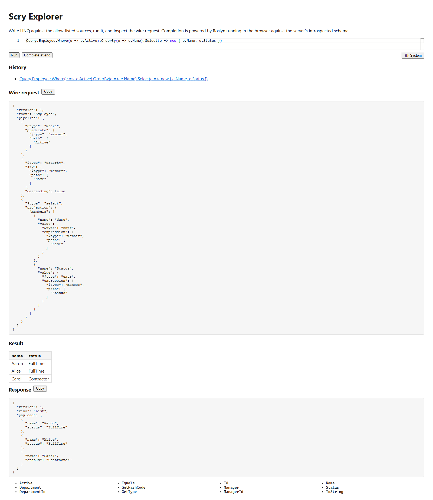
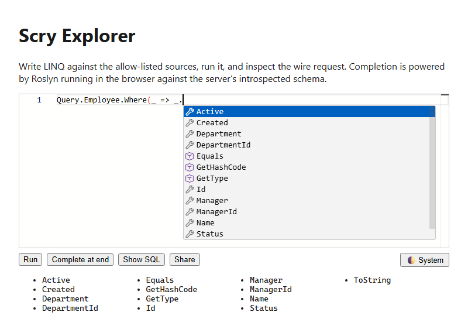

# Query explorer

`Scry.Server.Explorer` is an opt-in, GraphiQL-style query explorer. It serves a self-contained Blazor
WebAssembly UI that runs **Roslyn in the browser**: write strongly-typed C# LINQ against the
allow-listed sources with real IntelliSense and diagnostics, see the serialized wire request, execute
it, and inspect the results.

It is off unless mapped, and Development-only by default.




One screen shows the whole pipeline: the LINQ you wrote, the wire request it translated to, the rows
the server returned, and the raw response envelope.

## Mapping it

```cs
app.MapScry("/api/query");
app.MapScryExplorer("/scry");
```

Then browse to `/scry`.

The explorer requires `AddScry` — it resolves the `ScryProcessor` to describe the schema.

## Options

<!-- snippet: explorerOptions -->
<a id='snippet-explorerOptions'></a>
```cs
/// <summary>Sub-path the explorer UI is served under. Default <c>/scry</c>.</summary>
public string Route { get; set; } = "/scry";

/// <summary>The existing <c>MapScry</c> query endpoint the explorer POSTs validated requests to.
/// Default <c>/api/query</c>.</summary>
public string QueryEndpoint { get; set; } = "/api/query";

/// <summary>
/// Decides, per request, whether the explorer is reachable. Defaults to Development-only:
/// the explorer reveals the full queryable schema, so it stays off in production unless a host
/// opts in explicitly (e.g. behind an admin authorization check).
/// </summary>
public Func<HttpContext, bool> EnableGuard { get; set; } = DevelopmentOnly;
```
<sup><a href='/src/Scry.Server.Explorer/ScryExplorerOptions.cs#L10-L24' title='Snippet source file'>snippet source</a> | <a href='#snippet-explorerOptions' title='Start of snippet'>anchor</a></sup>
<!-- endSnippet -->

<!-- snippet: mapExplorer -->
<a id='snippet-mapExplorer'></a>
```cs
app.MapScryExplorer(
    _ =>
    {
        _.Route = "/scry";
        // This sample always exposes the explorer. The default guard is Development-only — in a real
        // app, run in Development or set EnableGuard to your own check (e.g. an admin authorization).
        _.EnableGuard = _ => true;
    });
```
<sup><a href='/samples/Sample.Server/Program.cs#L32-L41' title='Snippet source file'>snippet source</a> | <a href='#snippet-mapExplorer' title='Start of snippet'>anchor</a></sup>
<!-- endSnippet -->

| Option | Default | Meaning |
| --- | --- | --- |
| `Route` | `/scry` | Sub-path the UI is served under. |
| `QueryEndpoint` | `/api/query` | The `MapScry` endpoint the explorer POSTs to. Must match what you mapped. |
| `EnableGuard` | `DevelopmentOnly` | Decides, per request, whether the explorer is reachable. |

To expose it outside Development, replace the guard with your own check:

```cs
app.MapScryExplorer(options =>
{
    options.Route = "/scry";
    options.QueryEndpoint = "/api/query";
    options.EnableGuard = _ => _.User.IsInRole("admin");
});
```

When the guard returns false every explorer route returns **404**, not 403 — a disabled explorer is
indistinguishable from one that was never mapped.

## Introspection

The UI reads the schema from `{Route}/introspect` on load. The same guard applies.

<!-- snippet: IntrospectionTests.Describe.verified.txt -->
<a id='snippet-IntrospectionTests.Describe.verified.txt'></a>
```txt
{
  Version: 1,
  MaxPageSize: 1000,
  Sources: [
    {
      Name: Department,
      Kind: Entity,
      Model: DepartmentQueryModel
    },
    {
      Name: Employee,
      Kind: Entity,
      Model: EmployeeQueryModel
    },
    {
      Name: Holiday,
      Kind: Poco,
      Model: HolidayQueryModel
    },
    {
      Name: Order,
      Kind: Entity,
      Model: OrderQueryModel
    },
    {
      Name: Region,
      Kind: Entity,
      Model: SalesRegionQueryModel
    }
  ],
  Types: [
    {
      Model: DepartmentQueryModel,
      Members: [
        {
          Name: Id,
          TypeDisplay: int,
          NeedsNullDefault: false,
          IsNavigation: false
        },
        {
          Name: Name,
          TypeDisplay: string,
          NeedsNullDefault: true,
          IsNavigation: false
        }
      ]
    },
    {
      Model: EmployeeQueryModel,
      Members: [
        {
          Name: Active,
          TypeDisplay: bool,
          NeedsNullDefault: false,
          IsNavigation: false
        },
        {
          Name: Department,
          TypeDisplay: DepartmentQueryModel?,
          NeedsNullDefault: false,
          IsNavigation: true
        },
        {
          Name: DepartmentId,
          TypeDisplay: int,
          NeedsNullDefault: false,
          IsNavigation: false
        },
        {
          Name: Id,
          TypeDisplay: int,
          NeedsNullDefault: false,
          IsNavigation: false
        },
        {
          Name: Manager,
          TypeDisplay: EmployeeQueryModel?,
          NeedsNullDefault: false,
          IsNavigation: true
        },
        {
          Name: ManagerId,
          TypeDisplay: int?,
          NeedsNullDefault: false,
          IsNavigation: false
        },
        {
          Name: Name,
          TypeDisplay: string,
          NeedsNullDefault: true,
          IsNavigation: false
        },
        {
          Name: Status,
          TypeDisplay: Status,
          NeedsNullDefault: false,
          IsNavigation: false
        }
      ]
    },
    {
      Model: HolidayQueryModel,
      Members: [
        {
          Name: Date,
          TypeDisplay: global::System.DateOnly,
          NeedsNullDefault: false,
          IsNavigation: false
        },
        {
          Name: Name,
          TypeDisplay: string,
          NeedsNullDefault: true,
          IsNavigation: false
        }
      ]
    },
    {
      Model: OrderQueryModel,
      Members: [
        {
          Name: Amount,
          TypeDisplay: decimal,
          NeedsNullDefault: false,
          IsNavigation: false
        },
        {
          Name: Id,
          TypeDisplay: int,
          NeedsNullDefault: false,
          IsNavigation: false
        },
        {
          Name: Region,
          TypeDisplay: string,
          NeedsNullDefault: true,
          IsNavigation: false
        }
      ]
    },
    {
      Model: SalesRegionQueryModel,
      Members: [
        {
          Name: Id,
          TypeDisplay: int,
          NeedsNullDefault: false,
          IsNavigation: false
        },
        {
          Name: Name,
          TypeDisplay: string,
          NeedsNullDefault: true,
          IsNavigation: false
        }
      ]
    }
  ],
  Enums: [
    {
      Name: Status,
      Values: [
        FullTime,
        PartTime,
        Contractor
      ]
    }
  ],
  QueryEndpoint: /api/query
}
```
<sup><a href='/src/Scry.Tests/IntrospectionTests.Describe.verified.txt#L1-L171' title='Snippet source file'>snippet source</a> | <a href='#snippet-IntrospectionTests.Describe.verified.txt' title='Start of snippet'>anchor</a></sup>
<!-- endSnippet -->

The contract carries only what tooling needs: source names and kinds, the generated model names,
member names with the exact C# type spelling the source generator would emit, and the re-emitted
enums. It carries **no** policies, resolvers, connection details, or CLR internals.

Because `TypeDisplay` matches the generator's emission exactly, the explorer can synthesize an
identical set of query models in the browser, compile them with Roslyn, and offer completion against
the real allow-listed surface — which is what makes this real IntelliSense rather than a word list:




Note what is offered and what is not: `Active`, `Department`, `Manager`, `Name`, `Status` — but no
`Salary`, because it is `[QueryIgnore]`d and therefore never reaches the introspection contract.

You can produce the same contract programmatically:

```cs
var introspection = processor.Describe();
```

## How it works

1. On load the UI fetches `{Route}/introspect`.
2. `ModelSynthesizer` turns that contract into the same C# the design-time generator would emit — the
   enums, one query model per type, and a `ScryQuery` facade.
3. `RoslynWorkspace` compiles that source in-browser and wraps the user's expression in a method body,
   so the C# completion service offers members, and diagnostics are real compiler diagnostics.
4. `SnippetExecutor` compiles the expression, runs it against a capturing client to build the LINQ
   expression tree, and calls the production `ToScryRequest` — so the wire request shown is produced
   by exactly the same translation the real client performs.
5. The request is POSTed to `QueryEndpoint`, where it is validated like any other.

A trailing terminal (`.ToListAsync()`, `.FirstAsync()`, `.CountAsync()`, or a plain `.ToList()`) is
recognised and folded into the wire request as its terminal operator.

Only validated requests reach the server. The explorer is a convenience over the same endpoint, not a
bypass of it — it cannot query anything a normal client could not.

## Deployment notes

The UI is published and embedded as manifest resources inside the `Scry.Server.Explorer` assembly, so
the package is fully self-contained: no static web assets manifest, no extra files to deploy, and
nothing to configure beyond the route.

Because the explorer reveals the complete queryable schema, leaving it mapped in production means
publishing that schema to anyone who passes the guard. The Development-only default is deliberate.

## Regenerating the screenshots

Unlike every other code block in these docs, the two images above are **not** merged from source at
build time — they are captured from a real browser and committed under `docs/images/`. They will
therefore drift silently when the explorer UI changes; refresh them when it does.

`ExplorerWalkthrough` in `samples/Sample.Tests/UiSnapshotTests.cs` drives the live explorer with
Playwright and writes the raw captures to a temp directory (it is `[Explicit]`, so it does not run in
a normal test pass, and the fixture is `[Category("Browser")]` so CI can opt out — pixel output is
environment sensitive):

```bash
dotnet test samples/Sample.Tests --filter "FullyQualifiedName~ExplorerWalkthrough"
```

It prints the output directory. `1-loaded.png`, `2-intellisense.png`, `3-run.png`, `3b-count.png`,
`4-hover.png`, and `5-dark.png` are captured; the two used here are `2-intellisense` and `3-run`.

Two post-processing steps are applied to each before committing:

1. Trailing whitespace trimmed (the captures are full-page, so most of the height is blank).
2. The empty interior of the Monaco editor box spliced out — it renders a fixed height regardless of
   how little code it holds.

The frame around each image comes from an `` in the markdown rather than from the
pixels. Note that a `style` attribute would not work here: GitHub's markdown sanitizer strips
`style`, while `border` is on its allowed-attribute list.
