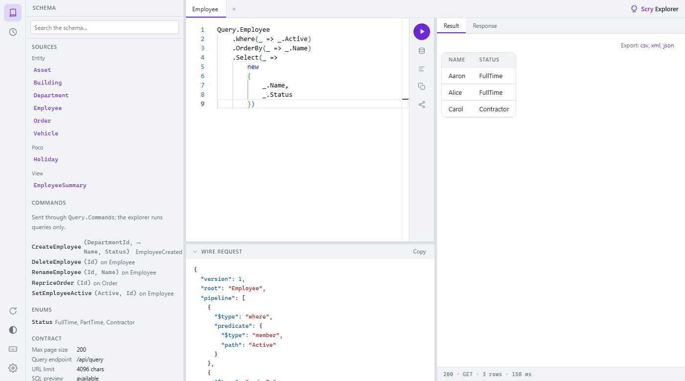
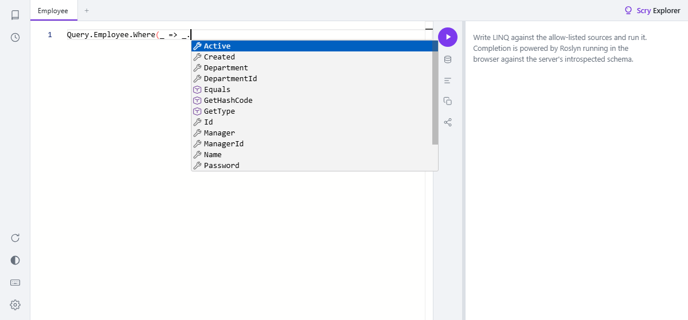
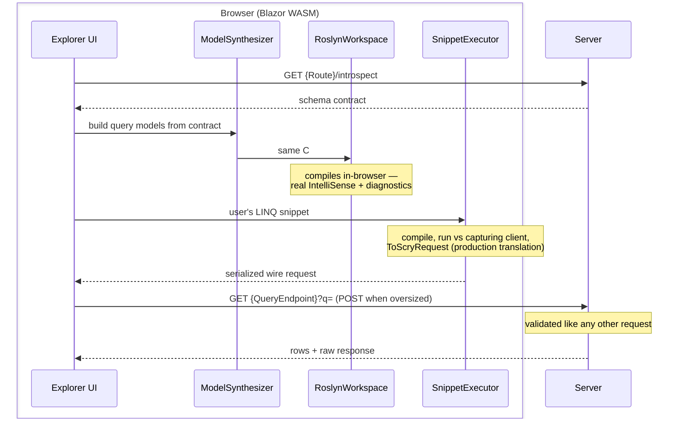

# Query explorer

`Scry.Server.Explorer` is an opt-in, GraphiQL-style query explorer. It serves a self-contained Blazor WebAssembly UI that runs **Roslyn in the browser**: write strongly-typed C# LINQ against the allow-listed sources with real IntelliSense and diagnostics, see the serialized wire request, execute it, and inspect the results.

It is off unless mapped, and Development-only by default.




One screen shows the whole pipeline: the LINQ as written, the wire request it translated to, and the rows the server returned.


## Layout

The explorer fills the window rather than flowing down it, and every region scrolls inside itself.

**The rail**, down the left edge, opens one pane at a time: the [schema](#schema-pane) and the
[history](#working-with-a-query). Under them sit re-fetch, the theme toggle, the shortcut list, and
settings.

**Tabs** hold a query each. A tab takes its name from the source the query reads — `Query.Employee`
becomes *Employee* — until it is renamed by double-clicking it. Tabs, the open pane, the theme and
every pane size persist across a reload; a response never does, because a response is a fact about
a moment and restoring one later would be showing something that may no longer be true.

**The query** sits on the left with its commands in a strip beside it, and the **wire request** in a
strip beneath it — the request is derived from the query rather than returned by the server, so it
belongs with the query rather than among the results.

**The output** is tabbed: the rows, the response envelope, and the SQL where the server offers it. A
tab appears only when there is something behind it, so a refused run leaves the column empty rather
than offering three empty panes. Under it, a status line reports the outcome, the transport the
request took, how many rows came back, and how long it took:

```
200 · GET · 3 rows · 34 ms
```

The `GET` is worth a word. A short request travels [in the URL and a long one in a
body](wire-format.md), decided by the server's own published limit, and which one a given query took
has never been visible anywhere else.

Every divider between panes drags, and double-clicking one restores its default. Dragging the schema
pane almost shut closes it, rather than leaving a sliver too narrow to read and too narrow to grab.


## Schema pane

The queryable surface, as the server publishes it: the sources grouped by kind, every model they
reach, the enums they use, and the contract's own facts — the page-size cap, the URL limit, whether
SQL preview is available, and the schema stamp.

A model's page lists its members with the type each is declared as, and a badge for whatever else the
[introspection contract](#introspection) says about it: a key column, a navigation, a collection, an
[attachment](attachments.md) with its content type, a [sensitive](annotations.md) member, and one
inherited from a base model. The types link, so a projection can be followed from `Employee` to
`Department` and back.

It is a schema *browser* rather than a documentation explorer, because there is nothing to document:
the contract carries a member's name, its type, and those flags. No descriptions travel, and none are
invented here.

Each source carries a button that opens a query selecting every scalar member of it, in a blank tab
or a new one — with a nested object for each navigation, carrying that model's scalars in turn:

```cs
Query.Employee
    .Select(_ =>
        new
        {
            _.Id,
            _.Name,
            _.Status,
            Department =
                new
                {
                    _.Department!.Id,
                    _.Department!.Name
                }
        })
```

A navigation is projected *into* rather than named as a leaf, which is the only way a query can carry
one, and it stops after one level so a self-navigation terminates. Scalars come first: a nested object
is several lines tall, and burying the row's own columns between two of them makes the shorter half
the harder to read.

Two kinds never appear because a projection cannot carry them: a collection is aggregable but neither
traversable nor projectable, and an [attachment](attachments.md) has no value in a result at all. Both
are published with their navigation flag *false*, so each has to be recognised on its own terms.

Two more are left out by choice. A [sensitive](annotations.md) member projects happily, answering
`no-store` — but a suggested query should not put a password on screen by default. And a `byte[]` is
bulk bytes whichever way it travels, which is a poor thing to open with. Note that this one goes by
the declared type rather than by a flag, because the contract publishes none:
[`[BinaryTransfer]`](wire-format.md#binary-transfer) deliberately does not change the queryable
surface — that is the whole of what the attribute claims, and why an attachment moves the schema stamp
and a diverted `byte[]` does not.

Naming any of the four explicitly still works; only the suggestion leaves them out.


## Mapping it

```cs
app.MapScry("/api/query");
app.MapScryExplorer("/scry");
```

Then browse to `/scry`.

The explorer requires `AddScry` — it resolves the `ScryProcessor` to describe the schema.


## Options

<!-- snippet: explorerOptions -->
<a id='snippet-explorerOptions'></a>
```cs
/// <summary>Sub-path the explorer UI is served under. Default <c>/scry</c>.</summary>
public string Route { get; set; } = "/scry";

/// <summary>The existing <c>MapScry</c> query endpoint the explorer sends validated requests to.
/// Default <c>/api/query</c>.</summary>
public string QueryEndpoint { get; set; } = "/api/query";

/// <summary>
/// Decides, per request, whether the explorer is reachable. Defaults to Development-only:
/// the explorer reveals the full queryable schema, so it stays off in production unless a host
/// opts in explicitly (e.g. behind an admin authorization check).
/// </summary>
public Func<HttpContext, bool> EnableGuard { get; set; } = DevelopmentOnly;

/// <summary>
/// Decides, per request, whether the explorer will show the SQL a query would run. Also
/// Development-only by default, and deliberately separate from <see cref="EnableGuard"/>: SQL
/// reveals more than the schema does — real table and column names, and the shape of any row
/// policy that narrowed the query — so opening the explorer to someone does not open this too.
/// </summary>
public Func<HttpContext, bool> EnableSqlPreview { get; set; } = DevelopmentOnly;
```
<sup><a href='/src/Scry.Server.Explorer/ScryExplorerOptions.cs#L6-L28' title='Snippet source file'>snippet source</a> | <a href='#snippet-explorerOptions' title='Start of snippet'>anchor</a></sup>
<!-- endSnippet -->

<!-- snippet: mapExplorer -->
<a id='snippet-mapExplorer'></a>
```cs
app.MapScryExplorer(
    _ =>
    {
        _.Route = "/scry";
        // This sample always exposes the explorer. The default guard is Development-only — in a real
        // app, run in Development or set EnableGuard to your own check (e.g. an admin authorization).
        _.EnableGuard = _ => true;
    });
```
<sup><a href='/samples/Sample.Server/Program.cs#L125-L134' title='Snippet source file'>snippet source</a> | <a href='#snippet-mapExplorer' title='Start of snippet'>anchor</a></sup>
<!-- endSnippet -->

| Option | Default | Meaning |
| --- | --- | --- |
| `Route` | `/scry` | Sub-path the UI is served under. |
| `QueryEndpoint` | `/api/query` | The `MapScry` endpoint the explorer POSTs to. Must match the mapped route. |
| `EnableGuard` | `DevelopmentOnly` | Decides, per request, whether the explorer is reachable. |
| `EnableSqlPreview` | `DevelopmentOnly` | Decides, per request, whether the [SQL preview](#sql-preview) is available. Separate from `EnableGuard` on purpose. |

To expose it outside Development, replace the guard with a custom check:

```cs
app.MapScryExplorer(options =>
{
    options.Route = "/scry";
    options.QueryEndpoint = "/api/query";
    options.EnableGuard = _ => _.User.IsInRole("admin");
});
```

When the guard returns false every explorer route returns **404**, not 403 — a disabled explorer is indistinguishable from one that was never mapped.


## Variables

The editor takes a query expression, and — ahead of it — the variables that query reads:

```cs
var since = new DateOnly(2026, 1, 1);
var wanted = new[] { "Aaron", "Carol" };

Query.Employee
    .Where(_ => _.Created >= since && wanted.Contains(_.Name))
    .Select(_ => new { _.Name, _.Created })
```

A variable is [captured state](querying.md#constants-and-captured-values), exactly as it is in a compiled client: nothing declared here travels under its own name, and whatever the query reads from one folds into the constant it stood for before the request is built. The request above is the one the same query would have produced with both values written inline — `since` as a [dated constant](wire-format.md#temporal-spellings), `wanted` as the values of a SQL `IN`.

Which makes them a convenience of the query rather than a feature of the wire: a value used in three places is named once, a long list of ids gets a line of its own, and the expression a value came from is written where it can be read instead of buried mid-predicate.

Only declarations may come before the query. Anything else — a loop, a call, an assignment — would run in the browser without changing the request it produced, and one the single-threaded runtime never returned from would take the page with it. The editor squiggles it and *Run* refuses it, the same way both report a query that will not compile.


## Working with a query

Four things the explorer does with the query in the editor, beyond running it.

**Remember it.** Every query that runs is recorded in the history pane, newest first, deduplicated by
its text. Twenty are kept — but a favorite sits outside the cap and is never evicted, so a query
worth keeping is kept by starring it. An entry can be named, and the search box matches both the name
and the query text. All of it is this browser's alone: nothing here is ever sent to the server, and
*Clear* forgets the rest while leaving the favorites, losing one of those being the thing there is no
way back from.

**Share a link.** *Share* puts the query in the URL and copies the link. It is placed in the **fragment** (`/scry/#q=…`), which browsers never send to the server — so a shared query cannot land in an access log, a proxy trace, or a referrer header on the way. Opening the link loads the query into the editor; a fragment that does not decode is ignored, and the explorer opens on its sample query rather than on an error.

**Export the results.** The *Export:* line under the result table saves the rows it is showing — same rows, same order — as `csv`, `xml`, or `json`.

`csv` writes them as displayed, with RFC 4180 quoting and a UTF-8 BOM so Excel reads non-ASCII values correctly. It is offered only for a **flat** result: [projecting into a navigation](wire-format.md) nests an object inside each row, and a grid cannot hold that without flattening the shape away. `xml` (a `row` element each, a child element per member) and `json` (the rows exactly as the server sent them) keep the nesting, so they are offered for every result the table can render.

**Fetch an attachment.** An [`[Attachment]`](attachments.md) has no value in a result at all — no query reads one — so the explorer adds a column of its own, named after the member, with a *fetch* link per row. Clicking it exchanges that row's key for the bytes at the attachment endpoint and hands them to the browser as a file, which is exactly what a generated client's `ScryAttachment.OpenAsync` does — built from the key column rather than from a materialized handle. A row whose value is null reports *empty* beside the link, and one the server will not hand over reports *unavailable* — the same single answer a refused, hidden, and missing row all get.

The column appears only where a row is identifiable: the source has to declare an attachment, and the result has to carry the key it is fetched by. A query that projected the key away, or one that went through `Distinct`, `GroupBy`, `SelectMany`, a join, or a set operator — all of which rewrite what a row *is* — gets no column, matching what a generated client refuses to bind. The fetch is authorized on its own terms whatever the query did, by the member's [`IAttachmentPolicy`](attachments.md#security) and the source's [row policies](policies.md), so the offer widens nothing: it saves writing the request, not the permission to make it.

**Read a binary member.** A [`[BinaryTransfer]`](annotations.md) `byte[]` does not travel inside the JSON payload — the server sends it as a raw multipart part and leaves a `{"$bin":n}` placeholder where the value was ([Binary transfer](wire-format.md#binary-transfer)). The explorer reassembles that response and folds the parts back in as base64, so a diverted member tables, exports, and copies exactly as the same `byte[]` would without the attribute — which is the whole of what the attribute claims. The *Response* pane shows the reassembled envelope rather than the multipart body it arrived as.

**Format it.** *Format* rewrites the query in the style above: the chain down the page, and a
projection down the page after it. A line is broken only where breaking it says something — the chain
because each operator is a step, a projection because each member is a column — so a predicate stays
on the one line it reads as:

```cs
Query.Employee
    .Where(_ => _.Created >= since && wanted.Contains(_.Name))
```

The declarations ahead of the query are left as written, comments and all; reindenting a caller's own
code is not what the button is for. Text that does not parse is reported rather than rewritten, since
a formatter guessing at a half-typed query produces a differently half-typed one.

It is the same printer the schema pane composes its starter query through, so what the pane offers is
already formatted and the two shapes cannot drift apart.

**See the SQL.** Covered next.


### Shortcuts

| Shortcut | Action |
| --- | --- |
| `Ctrl+Enter` | Run the query |
| `Shift+Ctrl+Q` | Show the SQL the query would run |
| `Shift+Ctrl+P` | Format the query |
| `Shift+Ctrl+C` | Copy the query |
| `Ctrl+Alt+S` | Schema pane |
| `Ctrl+Alt+K` | Search the schema |
| `Ctrl+Alt+H` | History pane |
| `Ctrl+,` | Settings |

The rail's keyboard button lists these in-app as well. The editor is Monaco, so its own keymap
applies on top of them — `Ctrl+F` to find, `F1` for the command palette, and multi-cursor, folding
and comment toggling as in VS Code.


## SQL preview

*Show SQL* asks the server what the current query would run, **without running it**:

```sql
SELECT [e].[Name], [e].[Status]
FROM [Employees] AS [e]
WHERE [e].[Active] = CAST(1 AS bit)
```

The request is the same wire request *Run* would send, and the server puts it through the same pipeline — validation, the allow-list, [row policies](policies.md), the rebind onto EF — then reads the SQL back instead of executing. So nothing is previewable that would not have been runnable, and what is shown is the SQL that *would* run, policy predicates included.

Two consequences worth knowing:

- **Only a row-returning query has SQL to show.** A terminal (`CountAsync`, `FirstAsync`, `ToPageAsync`, …) is answered by executing it, so the server refuses one rather than running it behind a button labelled *preview*. Drop the terminal to see the SQL underneath. A [`[QueryablePoco]`](annotations.md) source has no SQL at all — its rows are supplied in memory.
- **It is guarded separately, and defaults to Development-only.** SQL reveals more than the schema does: real table and column names, and the *shape* of any row policy that narrowed the query — a tenant filter or soft-delete rule is right there in the `WHERE`. Opening the explorer to someone therefore does not open this to them; `EnableSqlPreview` is its own decision:

```cs
app.MapScryExplorer(options =>
{
    options.EnableGuard = _ => _.User.IsInRole("admin");
    // Still off for those admins unless this says otherwise.
    options.EnableSqlPreview = _ => _.User.IsInRole("dba");
});
```

When it is off the endpoint 404s like every other disabled route, and the UI does not offer the button — the introspection contract advertises the capability, so the explorer only shows what would work.

The same preview is available programmatically, on any host with a `ScryProcessor`:

```cs
var sql = processor.ToQueryString(request, services);
```


## Introspection

The UI reads the schema from `{Route}/introspect` on load. The same guard applies.

<!-- snippet: IntrospectionTests.Describe.verified.txt -->
<a id='snippet-IntrospectionTests.Describe.verified.txt'></a>
```txt
{
  Version: 1,
  MaxPageSize: 1000,
  Sources: [
    {
      Name: Announcement,
      Kind: Entity,
      Model: AnnouncementQueryModel
    },
    {
      Name: Asset,
      Kind: Entity,
      Model: AssetQueryModel
    },
    {
      Name: Building,
      Kind: Entity,
      Model: BuildingQueryModel
    },
    {
      Name: Contract,
      Kind: Entity,
      Model: ContractQueryModel
    },
    {
      Name: Department,
      Kind: Entity,
      Model: DepartmentQueryModel
    },
    {
      Name: DepartmentHeadcount,
      Kind: View,
      Model: DepartmentHeadcountQueryModel
    },
    {
      Name: Employee,
      Kind: Entity,
      Model: EmployeeQueryModel
    },
    {
      Name: Holiday,
      Kind: Poco,
      Model: HolidayQueryModel
    },
    {
      Name: Order,
      Kind: Entity,
      Model: OrderQueryModel
    },
    {
      Name: OrderLine,
      Kind: Entity,
      Model: OrderLineQueryModel
    },
    {
      Name: Post,
      Kind: Entity,
      Model: PostQueryModel
    },
    {
      Name: Region,
      Kind: Entity,
      Model: SalesRegionQueryModel
    },
    {
      Name: RegionSummary,
      Kind: View,
      Model: RegionSummaryQueryModel,
      Obsolete: 
    },
    {
      Name: Shift,
      Kind: Entity,
      Model: ShiftQueryModel
    },
    {
      Name: Ticket,
      Kind: Entity,
      Model: TicketQueryModel
    },
    {
      Name: Vehicle,
      Kind: Entity,
      Model: VehicleQueryModel
    }
  ],
  Types: [
    {
      Model: AddressQueryModel,
      Members: [
        {
          Name: City,
          TypeDisplay: string,
          NeedsNullDefault: true,
          IsNavigation: false,
          IsCollection: false,
          IsAttachment: false,
          IsSensitive: false
        },
        {
          Name: Country,
          TypeDisplay: string,
          NeedsNullDefault: true,
          IsNavigation: false,
          IsCollection: false,
          IsAttachment: false,
          IsSensitive: false
        }
      ],
      IsSensitive: true
    },
    {
      Model: AnnouncementQueryModel,
      Members: [
        {
          Name: Pinned,
          TypeDisplay: bool,
          NeedsNullDefault: false,
          IsNavigation: false,
          IsCollection: false,
          IsAttachment: false,
          IsSensitive: false
        }
      ],
      Base: PostQueryModel,
      IsSensitive: false
    },
    {
      Model: AssetQueryModel,
      Members: [
        {
          Name: Id,
          TypeDisplay: int,
          NeedsNullDefault: false,
          IsNavigation: false,
          IsCollection: false,
          IsAttachment: false,
          IsSensitive: false
        },
        {
          Name: Name,
          TypeDisplay: string,
          NeedsNullDefault: true,
          IsNavigation: false,
          IsCollection: false,
          IsAttachment: false,
          IsSensitive: false
        }
      ],
      IsSensitive: false
    },
    {
      Model: BuildingQueryModel,
      Members: [
        {
          Name: Floors,
          TypeDisplay: int,
          NeedsNullDefault: false,
          IsNavigation: false,
          IsCollection: false,
          IsAttachment: false,
          IsSensitive: false
        }
      ],
      Base: AssetQueryModel,
      IsSensitive: false
    },
    {
      Model: ContractQueryModel,
      Members: [
        {
          Name: Document,
          TypeDisplay: global::Scry.ScryAttachment,
          NeedsNullDefault: true,
          IsNavigation: false,
          IsCollection: false,
          IsAttachment: true,
          ContentType: application/pdf,
          IsSensitive: false
        },
        {
          Name: Id,
          TypeDisplay: int,
          NeedsNullDefault: false,
          IsNavigation: false,
          IsCollection: false,
          IsAttachment: false,
          IsSensitive: false
        },
        {
          Name: Name,
          TypeDisplay: string,
          NeedsNullDefault: true,
          IsNavigation: false,
          IsCollection: false,
          IsAttachment: false,
          IsSensitive: false
        }
      ],
      Keys: [
        Id
      ],
      IsSensitive: false
    },
    {
      Model: DepartmentQueryModel,
      Members: [
        {
          Name: Id,
          TypeDisplay: int,
          NeedsNullDefault: false,
          IsNavigation: false,
          IsCollection: false,
          IsAttachment: false,
          IsSensitive: false
        },
        {
          Name: Name,
          TypeDisplay: string,
          NeedsNullDefault: true,
          IsNavigation: false,
          IsCollection: false,
          IsAttachment: false,
          IsSensitive: false
        }
      ],
      IsSensitive: false
    },
    {
      Model: DepartmentHeadcountQueryModel,
      Members: [
        {
          Name: Department,
          TypeDisplay: string,
          NeedsNullDefault: true,
          IsNavigation: false,
          IsCollection: false,
          IsAttachment: false,
          IsSensitive: false
        },
        {
          Name: Headcount,
          TypeDisplay: int,
          NeedsNullDefault: false,
          IsNavigation: false,
          IsCollection: false,
          Obsolete: Counts open roles too; use the Region rollup.,
          IsAttachment: false,
          IsSensitive: false
        }
      ],
      IsSensitive: false
    },
    {
      Model: EmployeeQueryModel,
      Members: [
        {
          Name: Active,
          TypeDisplay: bool,
          NeedsNullDefault: false,
          IsNavigation: false,
          IsCollection: false,
          IsAttachment: false,
          IsSensitive: false
        },
        {
          Name: Address,
          TypeDisplay: AddressQueryModel?,
          NeedsNullDefault: false,
          IsNavigation: true,
          IsCollection: false,
          IsAttachment: false,
          IsSensitive: false
        },
        {
          Name: Avatar,
          TypeDisplay: byte[],
          NeedsNullDefault: true,
          IsNavigation: false,
          IsCollection: false,
          IsAttachment: false,
          IsSensitive: true
        },
        {
          Name: Department,
          TypeDisplay: DepartmentQueryModel?,
          NeedsNullDefault: false,
          IsNavigation: true,
          IsCollection: false,
          IsAttachment: false,
          IsSensitive: false
        },
        {
          Name: DepartmentId,
          TypeDisplay: int,
          NeedsNullDefault: false,
          IsNavigation: false,
          IsCollection: false,
          IsAttachment: false,
          IsSensitive: false
        },
        {
          Name: Id,
          TypeDisplay: int,
          NeedsNullDefault: false,
          IsNavigation: false,
          IsCollection: false,
          IsAttachment: false,
          IsSensitive: false
        },
        {
          Name: Manager,
          TypeDisplay: EmployeeQueryModel?,
          NeedsNullDefault: false,
          IsNavigation: true,
          IsCollection: false,
          IsAttachment: false,
          IsSensitive: false
        },
        {
          Name: ManagerId,
          TypeDisplay: int?,
          NeedsNullDefault: false,
          IsNavigation: false,
          IsCollection: false,
          IsAttachment: false,
          IsSensitive: false
        },
        {
          Name: Name,
          TypeDisplay: string,
          NeedsNullDefault: true,
          IsNavigation: false,
          IsCollection: false,
          IsAttachment: false,
          IsSensitive: false
        },
        {
          Name: Perks,
          TypeDisplay: Perks,
          NeedsNullDefault: false,
          IsNavigation: false,
          IsCollection: false,
          IsAttachment: false,
          IsSensitive: false
        },
        {
          Name: PreviousAddresses,
          TypeDisplay: global::System.Collections.Generic.IReadOnlyList<AddressQueryModel>,
          NeedsNullDefault: true,
          IsNavigation: false,
          IsCollection: true,
          IsAttachment: false,
          IsSensitive: false
        },
        {
          Name: Status,
          TypeDisplay: Status,
          NeedsNullDefault: false,
          IsNavigation: false,
          IsCollection: false,
          IsAttachment: false,
          IsSensitive: false
        }
      ],
      IsSensitive: false
    },
    {
      Model: HolidayQueryModel,
      Members: [
        {
          Name: Date,
          TypeDisplay: global::System.DateOnly,
          NeedsNullDefault: false,
          IsNavigation: false,
          IsCollection: false,
          IsAttachment: false,
          IsSensitive: false
        },
        {
          Name: Name,
          TypeDisplay: string,
          NeedsNullDefault: true,
          IsNavigation: false,
          IsCollection: false,
          IsAttachment: false,
          IsSensitive: false
        }
      ],
      IsSensitive: false
    },
    {
      Model: OrderQueryModel,
      Members: [
        {
          Name: Amount,
          TypeDisplay: decimal,
          NeedsNullDefault: false,
          IsNavigation: false,
          IsCollection: false,
          IsAttachment: false,
          IsSensitive: false
        },
        {
          Name: Audited,
          TypeDisplay: string,
          NeedsNullDefault: true,
          IsNavigation: false,
          IsCollection: false,
          IsAttachment: false,
          IsSensitive: false
        },
        {
          Name: Code,
          TypeDisplay: string,
          NeedsNullDefault: true,
          IsNavigation: false,
          IsCollection: false,
          IsAttachment: false,
          IsSensitive: false
        },
        {
          Name: Discount,
          TypeDisplay: decimal?,
          NeedsNullDefault: false,
          IsNavigation: false,
          IsCollection: false,
          IsAttachment: false,
          IsSensitive: false
        },
        {
          Name: Grade,
          TypeDisplay: char,
          NeedsNullDefault: false,
          IsNavigation: false,
          IsCollection: false,
          IsAttachment: false,
          IsSensitive: false
        },
        {
          Name: Id,
          TypeDisplay: int,
          NeedsNullDefault: false,
          IsNavigation: false,
          IsCollection: false,
          IsAttachment: false,
          IsSensitive: false
        },
        {
          Name: Lines,
          TypeDisplay: global::System.Collections.Generic.IReadOnlyList<OrderLineQueryModel>,
          NeedsNullDefault: true,
          IsNavigation: false,
          IsCollection: true,
          IsAttachment: false,
          IsSensitive: false
        },
        {
          Name: Placed,
          TypeDisplay: global::System.DateTime,
          NeedsNullDefault: false,
          IsNavigation: false,
          IsCollection: false,
          IsAttachment: false,
          IsSensitive: false
        },
        {
          Name: Priorities,
          TypeDisplay: global::System.Collections.Generic.IReadOnlyList<Priority>,
          NeedsNullDefault: true,
          IsNavigation: false,
          IsCollection: true,
          IsAttachment: false,
          IsSensitive: false
        },
        {
          Name: Quantity,
          TypeDisplay: uint,
          NeedsNullDefault: false,
          IsNavigation: false,
          IsCollection: false,
          IsAttachment: false,
          IsSensitive: false
        },
        {
          Name: Region,
          TypeDisplay: string,
          NeedsNullDefault: true,
          IsNavigation: false,
          IsCollection: false,
          IsAttachment: false,
          IsSensitive: false
        },
        {
          Name: Scores,
          TypeDisplay: global::System.Collections.Generic.IReadOnlyList<int>,
          NeedsNullDefault: true,
          IsNavigation: false,
          IsCollection: true,
          IsAttachment: false,
          IsSensitive: false
        },
        {
          Name: Sku,
          TypeDisplay: ulong,
          NeedsNullDefault: false,
          IsNavigation: false,
          IsCollection: false,
          IsAttachment: false,
          IsSensitive: false
        },
        {
          Name: Tags,
          TypeDisplay: global::System.Collections.Generic.IReadOnlyList<string>,
          NeedsNullDefault: true,
          IsNavigation: false,
          IsCollection: true,
          IsAttachment: false,
          IsSensitive: false
        }
      ],
      IsSensitive: false
    },
    {
      Model: OrderLineQueryModel,
      Members: [
        {
          Name: Id,
          TypeDisplay: int,
          NeedsNullDefault: false,
          IsNavigation: false,
          IsCollection: false,
          IsAttachment: false,
          IsSensitive: false
        },
        {
          Name: Order,
          TypeDisplay: OrderQueryModel?,
          NeedsNullDefault: false,
          IsNavigation: true,
          IsCollection: false,
          IsAttachment: false,
          IsSensitive: false
        },
        {
          Name: OrderId,
          TypeDisplay: int,
          NeedsNullDefault: false,
          IsNavigation: false,
          IsCollection: false,
          IsAttachment: false,
          IsSensitive: false
        },
        {
          Name: Price,
          TypeDisplay: decimal,
          NeedsNullDefault: false,
          IsNavigation: false,
          IsCollection: false,
          IsAttachment: false,
          IsSensitive: false
        },
        {
          Name: Quantity,
          TypeDisplay: int,
          NeedsNullDefault: false,
          IsNavigation: false,
          IsCollection: false,
          IsAttachment: false,
          IsSensitive: false
        },
        {
          Name: Sku,
          TypeDisplay: string,
          NeedsNullDefault: true,
          IsNavigation: false,
          IsCollection: false,
          IsAttachment: false,
          IsSensitive: false
        }
      ],
      IsSensitive: false
    },
    {
      Model: PostQueryModel,
      Members: [
        {
          Name: Id,
          TypeDisplay: int,
          NeedsNullDefault: false,
          IsNavigation: false,
          IsCollection: false,
          IsAttachment: false,
          IsSensitive: false
        },
        {
          Name: Name,
          TypeDisplay: string,
          NeedsNullDefault: true,
          IsNavigation: false,
          IsCollection: false,
          IsAttachment: false,
          IsSensitive: false
        },
        {
          Name: Published,
          TypeDisplay: bool,
          NeedsNullDefault: false,
          IsNavigation: false,
          IsCollection: false,
          IsAttachment: false,
          IsSensitive: false
        }
      ],
      IsSensitive: false
    },
    {
      Model: RegionSummaryQueryModel,
      Members: [
        {
          Name: Region,
          TypeDisplay: string,
          NeedsNullDefault: true,
          IsNavigation: false,
          IsCollection: false,
          IsAttachment: false,
          IsSensitive: false
        },
        {
          Name: Total,
          TypeDisplay: decimal,
          NeedsNullDefault: false,
          IsNavigation: false,
          IsCollection: false,
          IsAttachment: false,
          IsSensitive: false
        }
      ],
      Obsolete: ,
      IsSensitive: false
    },
    {
      Model: SalesRegionQueryModel,
      Members: [
        {
          Name: Id,
          TypeDisplay: int,
          NeedsNullDefault: false,
          IsNavigation: false,
          IsCollection: false,
          IsAttachment: false,
          IsSensitive: false
        },
        {
          Name: Name,
          TypeDisplay: string,
          NeedsNullDefault: true,
          IsNavigation: false,
          IsCollection: false,
          IsAttachment: false,
          IsSensitive: false
        }
      ],
      IsSensitive: false
    },
    {
      Model: ShiftQueryModel,
      Members: [
        {
          Name: Day,
          TypeDisplay: global::System.DateOnly,
          NeedsNullDefault: false,
          IsNavigation: false,
          IsCollection: false,
          IsAttachment: false,
          IsSensitive: false
        },
        {
          Name: Duration,
          TypeDisplay: global::System.TimeSpan,
          NeedsNullDefault: false,
          IsNavigation: false,
          IsCollection: false,
          IsAttachment: false,
          IsSensitive: false
        },
        {
          Name: Id,
          TypeDisplay: int,
          NeedsNullDefault: false,
          IsNavigation: false,
          IsCollection: false,
          IsAttachment: false,
          IsSensitive: false
        },
        {
          Name: Name,
          TypeDisplay: string,
          NeedsNullDefault: true,
          IsNavigation: false,
          IsCollection: false,
          IsAttachment: false,
          IsSensitive: false
        },
        {
          Name: Signature,
          TypeDisplay: byte[],
          NeedsNullDefault: true,
          IsNavigation: false,
          IsCollection: false,
          IsAttachment: false,
          IsSensitive: false
        },
        {
          Name: Stamped,
          TypeDisplay: global::System.DateTimeOffset,
          NeedsNullDefault: false,
          IsNavigation: false,
          IsCollection: false,
          IsAttachment: false,
          IsSensitive: false
        },
        {
          Name: Start,
          TypeDisplay: global::System.TimeOnly,
          NeedsNullDefault: false,
          IsNavigation: false,
          IsCollection: false,
          IsAttachment: false,
          IsSensitive: false
        }
      ],
      IsSensitive: false
    },
    {
      Model: TicketQueryModel,
      Members: [
        {
          Name: Id,
          TypeDisplay: int,
          NeedsNullDefault: false,
          IsNavigation: false,
          IsCollection: false,
          IsAttachment: false,
          IsSensitive: false
        },
        {
          Name: IsOpen,
          TypeDisplay: bool,
          NeedsNullDefault: false,
          IsNavigation: false,
          IsCollection: false,
          IsAttachment: false,
          IsSensitive: false
        },
        {
          Name: Name,
          TypeDisplay: string,
          NeedsNullDefault: true,
          IsNavigation: false,
          IsCollection: false,
          IsAttachment: false,
          IsSensitive: false
        },
        {
          Name: Token,
          TypeDisplay: global::System.Guid,
          NeedsNullDefault: false,
          IsNavigation: false,
          IsCollection: false,
          IsAttachment: false,
          IsSensitive: false
        }
      ],
      IsSensitive: false
    },
    {
      Model: VehicleQueryModel,
      Members: [
        {
          Name: Wheels,
          TypeDisplay: int,
          NeedsNullDefault: false,
          IsNavigation: false,
          IsCollection: false,
          IsAttachment: false,
          IsSensitive: false
        }
      ],
      Base: AssetQueryModel,
      IsSensitive: false
    }
  ],
  Enums: [
    {
      Name: Perks,
      Values: [
        None,
        Parking,
        Gym,
        Remote
      ]
    },
    {
      Name: Priority,
      Values: [
        Low,
        High
      ]
    },
    {
      Name: Status,
      Values: [
        FullTime,
        PartTime,
        Contractor
      ]
    }
  ],
  QueryEndpoint: /api/query,
  QueryUrlLimit: 4096,
  SqlPreview: false,
  SchemaStamp: fe-JX0apjyRGkUkR
}
```
<sup><a href='/src/Scry.Tests/IntrospectionTests.Describe.verified.txt#L1-L824' title='Snippet source file'>snippet source</a> | <a href='#snippet-IntrospectionTests.Describe.verified.txt' title='Start of snippet'>anchor</a></sup>
<!-- endSnippet -->

The contract carries only what tooling needs: source names and kinds, the generated model names, member names with the exact C# type spelling the source generator would emit, and the re-emitted enums. It carries **no** policies, resolvers, connection details, or CLR internals.

Because `TypeDisplay` matches the generator's emission exactly, the explorer can synthesize an identical set of query models in the browser, compile them with Roslyn, and offer completion against the real allow-listed surface — which is what makes this real IntelliSense rather than a word list:




Note what is offered and what is not: `Active`, `Department`, `Manager`, `Name`, `Status` — but no `Salary`, because it is `[QueryIgnore]`d and therefore never reaches the introspection contract.

The same contract can be produced programmatically:

```cs
var introspection = processor.Describe();
```


## How it works

Everything except two HTTP calls happens **in the browser**: the schema is fetched once, the model is synthesized and compiled with Roslyn locally, and only an already-translated wire request crosses to the server — the same endpoint any client sends to, by the same route it would use.



1. On load the UI fetches `{Route}/introspect`.
2. `ModelSynthesizer` turns that contract into the same C# the design-time generator would emit — the enums, one query model per type, and a `ScryQuery` facade.
3. `RoslynWorkspace` compiles that source in-browser and wraps the user's snippet in a method body — the variables ahead of the query, then the query as what the body returns — so the C# completion service offers members, and diagnostics are real compiler diagnostics.
4. `SnippetExecutor` compiles the same snippet, runs it against a capturing client to build the LINQ expression tree, and calls the production `ToScryRequest` — so the wire request shown is produced by exactly the same translation the real client performs.
5. The request is sent to `QueryEndpoint` — [as a URL](wire-format.md#the-url-form) where it fits in one, as a body where it does not, the same choice `ScryClient` makes — and validated like any other.

A trailing terminal (`.ToListAsync()`, `.FirstAsync()`, `.CountAsync()`, or a plain `.ToList()`) is recognised and folded into the wire request as its terminal operator.

Only validated requests reach the server. The explorer is a convenience over the same endpoint, not a bypass of it — it cannot query anything a normal client could not.


## Deployment notes

The UI is published and embedded as manifest resources inside the `Scry.Server.Explorer` assembly, so the package is fully self-contained: no static web assets manifest, no extra files to deploy, and nothing to configure beyond the route.

Because the explorer reveals the complete queryable schema, leaving it mapped in production means publishing that schema to anyone who passes the guard. The Development-only default is deliberate — and the [SQL preview](#sql-preview), which discloses more than the schema does, keeps a Development-only default of its own even when the explorer itself is opened up.


## The screenshots

The two images above are not files kept beside the docs: they are **Verify baselines**, and the markdown points its `` straight at them. `ExplorerIntelliSense` and `ExplorerRun` in `samples/Sample.Tests/UiScreenshotTests.cs` drive the live explorer with Playwright and capture them, so a change to the UI fails a test rather than leaving a stale picture in the docs:

```bash
dotnet test samples/Scry.Samples.slnx --filter "FullyQualifiedName~UiScreenshotTests"
```

Accepting the received file — move `*.received.png` over `*.verified.png`, or accept it from the Verify diff tool — is what republishes the image. The fixture is `[Category("Browser")]` so a run can opt out, and pixel output is environment sensitive: a first run on a new OS or CI image is expected to need reseeding.

These two are laid out at their own widths rather than the fixture's default. A shell divided into a rail, a schema pane, an editor and an output column has a width below which the capture is a picture of the shell coping rather than of the layout, so the run capture takes **1400** and pays for it in the softening a doc renderer's downscale costs. The IntelliSense capture takes **1200** and puts the schema pane and most of the output column out of the way first — through the same stored pane sizes the shell restores from — because the suggest widget is wider than the editor gets once they have had their share, and neither is what that image is showing. The run capture's query is broken across lines so it reads in full without a horizontal scrollbar over it.

Two things in Monaco move on their own and would otherwise put a column of different pixels between two identical runs, so both are settled before the shutter falls: the caret is pinned solid, and the scrollbar fade-out is waited for.

The shell fills the viewport and scrolls inside its panes, so these are viewport captures rather than full-page ones — there is no page below the fold left to stitch.

The frame around each image comes from an `` in the markdown rather than from the pixels. Note that a `style` attribute would not work here: GitHub's markdown sanitizer strips `style`, while `border` is on its allowed-attribute list.
