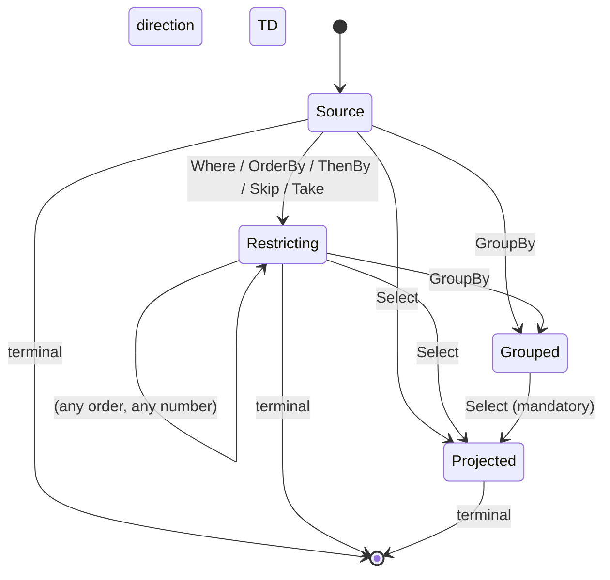

The legal operator orderings form a small state machine — every absent edge is an illegal ordering:

Nothing filters, orders, skips, or takes after `GroupBy`; a `GroupBy` cannot reach a terminal without
a `Select` in between; and there is no second `GroupBy` or `Select`. `ThenBy` without a preceding
`OrderBy` is rejected, and nothing may follow a terminal.
