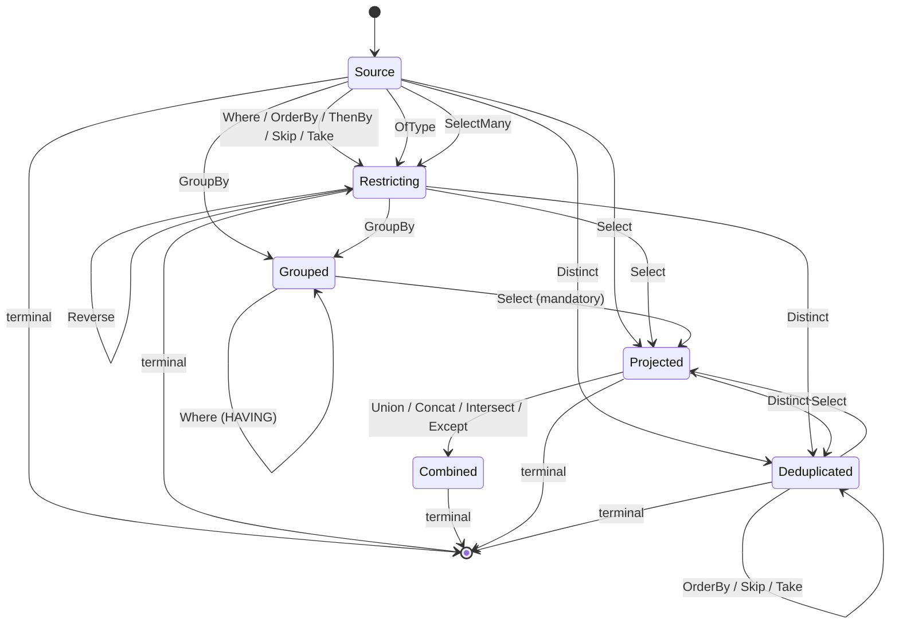

The legal operator orderings form a small state machine — every absent edge is an illegal ordering:

Nothing orders, skips, or takes after `GroupBy`; a `GroupBy` cannot reach a terminal without a
`Select` in between; and there is no second `GroupBy` or `Select`. A `Where` after `GroupBy` is the
one exception — it filters the groups rather than the rows, and reads only the key and aggregates.
`ThenBy` and `Reverse` without a preceding `OrderBy` are rejected, and nothing may follow a terminal.

A set operation combines the projected rows with a second source, so like a join only a terminal may
follow: the combined rows come from two sources and have no single root left to read.

`OfType` narrows to a derived type, leaving the query restricting but against that type — so the
members it declares become nameable and the base's stay so.

`SelectMany` flattens a collection into its elements, so it leaves the query restricting — but against
a different row. Everything after it is written against the element, at most one is allowed, and an
ordering written before it does not carry across.

`Distinct` deduplicates the projected rows, so what may follow it is the `Select` it deduplicates, a
terminal, and — over a flat projection of up to eight members — an `OrderBy` naming one of them, plus
`Skip` and `Take` over the resulting order. Filtering after it would be describing the rows that fed it, and
paging without an ordering would be slicing an order the deduplication never defined.
