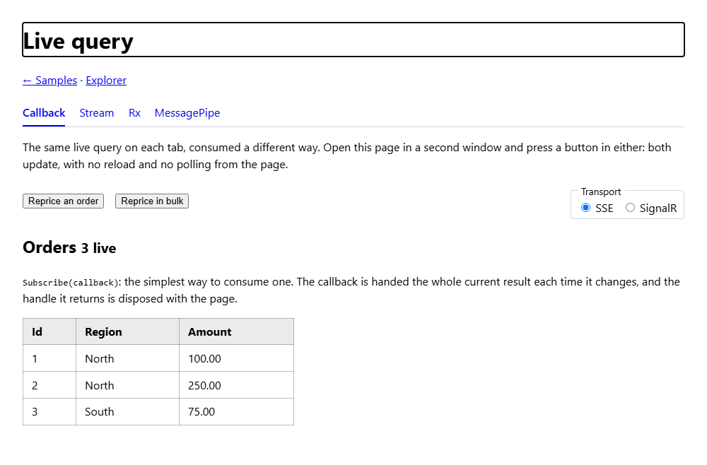

# Live queries

A live query is a query that is answered now, and answered again whenever its answer changes. The LINQ is what it would be for `ToListAsync`; `Live()` in its place means the rows keep arriving.



Nothing about the query is special. It is validated against the allow-list, run through the row policies and recorded by the auditors exactly as a query asked once is — every time it runs. What is new is when it runs: the server runs it again when the data it read changes, and sends the answer only where it differs from the one before.


## Consuming one

A live query is a description, not a connection. Nothing is asked of the server until it is consumed, and it can be consumed three ways.

<!-- snippet: liveTerminals -->
<a id='snippet-liveTerminals'></a>
```cs
/// <summary>
/// The query's rows, now and again whenever they change. Each answer is the whole current result.
/// </summary>
public static ScryLiveQuery<IReadOnlyList<T>> Live<T>(this IQueryable<T> source)
{
    var client = Client(Scry(source));
    var (plan, pipeline) = Plan(source);
    return Open<T, IReadOnlyList<T>>(
        source,
        terminal: null,
        pipeline,
        response =>
        {
            EnsureKind(response, ResultKind.List);
            return AttachmentBinder.Bind(Materialize<List<T>>(source, response), plan, client) ?? [];
        });
}

/// <summary>How many rows the query has, now and again whenever that changes.</summary>
public static ScryLiveQuery<int> LiveCount<T>(this IQueryable<T> source) =>
    LiveScalar<T, int>(source, new CountOp());

/// <summary>How many rows match <paramref name="predicate"/>, now and again whenever that changes.</summary>
public static ScryLiveQuery<int> LiveCount<T>(this IQueryable<T> source, Expression<Func<T, bool>> predicate) =>
    LiveScalar<T, int>(source, new CountOp(Predicate(predicate)));

/// <summary>How many rows the query has as a 64-bit integer, now and again whenever that changes.</summary>
public static ScryLiveQuery<long> LiveLongCount<T>(this IQueryable<T> source) =>
    LiveScalar<T, long>(source, new LongCountOp());

/// <summary>Whether the query has any rows, now and again whenever that changes.</summary>
public static ScryLiveQuery<bool> LiveAny<T>(this IQueryable<T> source) =>
    LiveScalar<T, bool>(source, new AnyOp(Predicate: null));

/// <summary>Whether any row matches <paramref name="predicate"/>, now and again whenever that changes.</summary>
public static ScryLiveQuery<bool> LiveAny<T>(this IQueryable<T> source, Expression<Func<T, bool>> predicate) =>
    LiveScalar<T, bool>(source, new AnyOp(Predicate(predicate)));

/// <summary>
/// The query's first row, or default where it has none, now and again whenever that changes —
/// which includes a different row becoming the first.
/// </summary>
public static ScryLiveQuery<T?> LiveFirstOrDefault<T>(this IQueryable<T> source) =>
    LiveSingle(source, new FirstOp(OrDefault: true, Predicate: null));

/// <summary>The first row matching <paramref name="predicate"/>, or default, now and again whenever that changes.</summary>
public static ScryLiveQuery<T?> LiveFirstOrDefault<T>(this IQueryable<T> source, Expression<Func<T, bool>> predicate) =>
    LiveSingle(source, new FirstOp(OrDefault: true, Predicate(predicate)));

/// <summary>
/// The query's only row, or default where it has none, now and again whenever that changes. What a
/// detail view of one record wants: the record as it is, for as long as it is on screen.
/// </summary>
public static ScryLiveQuery<T?> LiveSingleOrDefault<T>(this IQueryable<T> source) =>
    LiveSingle(source, new SingleOp(OrDefault: true, Predicate: null));

/// <summary>The only row matching <paramref name="predicate"/>, or default, now and again whenever that changes.</summary>
public static ScryLiveQuery<T?> LiveSingleOrDefault<T>(this IQueryable<T> source, Expression<Func<T, bool>> predicate) =>
    LiveSingle(source, new SingleOp(OrDefault: true, Predicate(predicate)));
```
<sup><a href='/src/Scry.Client/ScryQueryableExtensions.Live.cs#L8-L68' title='Snippet source file'>snippet source</a> | <a href='#snippet-liveTerminals' title='Start of snippet'>anchor</a></sup>
<!-- endSnippet -->

Every answer is the whole of the query's current result — a list's rows, a count's number — never a difference from the one before. The values a query closes over are read once, when `Live()` is called: a live query over `_.Region == region` keeps asking about the region that variable held then.


### As a stream

A live query is an `IAsyncEnumerable`, so it is read the way any other is. The next answer is not read until the loop comes back for it, so a consumer that is slow is handed the latest state when it is ready rather than a backlog. Cancelling the token ends it, and tells the server.

<!-- snippet: consoleLive -->
<a id='snippet-consoleLive'></a>
```cs
static async Task WatchOrders(ScryQuery query)
{
    using var leaving = new CancelSource();
    Console.CancelKeyPress += (_, pressed) =>
    {
        pressed.Cancel = true;
        leaving.Cancel();
    };

    Console.WriteLine("Watching orders. Ctrl+C to stop.");
    Console.WriteLine();
    var orders = query
        .Order
        .OrderBy(_ => _.Id)
        .Select(_ => new OrderRow(_.Id, _.Region, _.Amount))
        .Live();

    try
    {
        await foreach (var answer in orders.WithCancellation(leaving.Token))
        {
            Console.WriteLine($"{DateTime.Now:T}");
            WriteTable(
                ["Id", "Region", "Amount"],
                [.. answer.Select(_ => new[] {_.Id.ToString(), _.Region, _.Amount.ToString("0.00")})]);
        }
    }
    catch (OperationCanceledException)
    {
        // Ctrl+C.
    }
}
```
<sup><a href='/samples/Sample.ConsoleClient/Program.cs#L70-L103' title='Snippet source file'>snippet source</a> | <a href='#snippet-consoleLive' title='Start of snippet'>anchor</a></sup>
<!-- endSnippet -->


### With a callback

`Subscribe` hands each answer to a callback, one at a time and in order, and returns a `ScrySubscription`. Disposing it ends the live query; nothing is delivered once `Dispose` has returned.

<!-- snippet: liveCallback -->
<a id='snippet-liveCallback'></a>
```cs
protected override void Start()
{
    // The LINQ is what it would be for ToListAsync. Live() in its place means the answer keeps
    // arriving: now, and again whenever the rows it reads change.
    rows = Query
        .Order
        .OrderBy(_ => _.Id)
        .Select(_ => new OrderRow(_.Id, _.Region, _.Amount))
        .Live()
        .Subscribe(
            answer =>
            {
                orders = answer;
                InvokeAsync(StateHasChanged);
            },
            Failed);

    // Any terminal can be live. This one is a second subscription of its own, and the server
    // sends it a number rather than the rows.
    counting = Query
        .Order
        .LiveCount()
        .Subscribe(
            answer =>
            {
                count = answer;
                InvokeAsync(StateHasChanged);
            },
            Failed);
}

// A subscription outlives nothing: leaving the page ends it, and the server is told.
protected override async ValueTask Stop()
{
    if (rows is not null)
    {
        await rows.DisposeAsync();
    }

    if (counting is not null)
    {
        await counting.DisposeAsync();
    }
}
```
<sup><a href='/samples/Sample.WebClient/Pages/Live/LiveCallback.razor.cs#L25-L70' title='Snippet source file'>snippet source</a> | <a href='#snippet-liveCallback' title='Start of snippet'>anchor</a></sup>
<!-- endSnippet -->

A subscription made where there is a `SynchronizationContext` — a WPF or Windows Forms UI thread, a Blazor Server circuit — delivers on it, so a callback may touch what that context owns with no marshalling. The reading and deserializing happen off it.

<!-- snippet: winFormsLive -->
<a id='snippet-winFormsLive'></a>
```cs
void OnLiveChanged()
{
    subscription?.Dispose();
    subscription = null;
    refresh.Enabled = !live.Checked;
    if (!live.Checked)
    {
        return;
    }

    status.Text = "Connecting...";
    subscription = query
        .Employee
        .Where(_ => _.Active)
        .OrderBy(_ => _.Name)
        .Select(_ => new EmployeeRow(_.Id, _.Name, _.Status, _.Manager!.Name, _.Department!.Name))
        .Live()
        .Subscribe(
            rows =>
            {
                binding.DataSource = rows;
                status.Text = $"{rows.Count} active employees, live as of {DateTime.Now:T}";
            },
            exception => status.Text = $"The live query ended: {exception.Message}");
}
```
<sup><a href='/samples/Sample.WinFormsClient/MainForm.cs#L153-L179' title='Snippet source file'>snippet source</a> | <a href='#snippet-winFormsLive' title='Start of snippet'>anchor</a></sup>
<!-- endSnippet -->

A callback that awaits has an overload of its own, `Subscribe(Func<T, Task>)`, so that `async rows => …` is awaited before the next answer is read. Bound to the `Action` form it would be an `async void` whose failures go nowhere.

`ScrySubscription.State` says where a subscription is in its life — `Connecting`, `Live`, `Reconnecting`, `Closed`, `Faulted` — and `StateChanged` is raised when it moves, which is what a "reconnecting…" banner binds to. `Completion` completes when it is over and never faults; a failure is on `Error`, and was handed to the error callback.


### As an observable

`AsObservable()` hands over a plain `IObservable<T>`: the interface that ships with .NET, which is all System.Reactive, R3 or any other reactive library needs. Scry references none of them.

<!-- snippet: liveReactive -->
<a id='snippet-liveReactive'></a>
```cs
protected override void Start() =>
    subscription = Query
        .Order
        .Select(_ => new OrderRow(_.Id, _.Region, _.Amount))
        .Live()
        // From here down it is Rx. Each answer is the whole result, so an operator that wants
        // the difference between two of them folds them together itself.
        .AsObservable()
        .Select(_ =>
            new Totals(
                _.Count,
                _.Sum(_ => _.Amount),
                Change: 0))
        .Scan((previous, next) => next with
        {
            Change = next.Total - previous.Total
        })
        .DistinctUntilChanged()
        .Subscribe(
            next =>
            {
                totals = next;
                InvokeAsync(StateHasChanged);
            },
            exception =>
            {
                error = exception.Message;
                InvokeAsync(StateHasChanged);
            });

// Disposing the Rx subscription disposes the one under it, which ends the live query.
protected override ValueTask Stop()
{
    subscription?.Dispose();
    return ValueTask.CompletedTask;
}
```
<sup><a href='/samples/Sample.WebClient/Pages/Live/LiveReactive.razor.cs#L17-L54' title='Snippet source file'>snippet source</a> | <a href='#snippet-liveReactive' title='Start of snippet'>anchor</a></sup>
<!-- endSnippet -->

Calls to an observer never overlap, at most one of `OnError` and `OnCompleted` is made and nothing follows it, and nothing at all is called once the subscription's `Dispose` has returned. No synchronization context is captured, because saying where to be called is what a reactive pipeline does for itself:

<!-- snippet: wpfLive -->
<a id='snippet-wpfLive'></a>
```cs
void OnLiveChanged(object sender, RoutedEventArgs args)
{
    live?.Dispose();
    live = null;
    RefreshButton.IsEnabled = LiveCheckBox.IsChecked != true;
    if (LiveCheckBox.IsChecked != true)
    {
        return;
    }

    StatusText.Text = "Connecting...";
    live = query
        .Employee
        .Where(_ => _.Active)
        .OrderBy(_ => _.Name)
        .Select(_ => new EmployeeRow(_.Id, _.Name, _.Status, _.Manager!.Name, _.Department!.Name))
        .Live()
        .AsObservable()
        .ObserveOn(SynchronizationContext.Current!)
        .Subscribe(
            rows =>
            {
                EmployeeGrid.ItemsSource = rows;
                StatusText.Text = $"{rows.Count} active employees, live as of {DateTime.Now:T}";
            },
            exception => StatusText.Text = $"The live query ended: {exception.Message}");
}
```
<sup><a href='/samples/Sample.WpfClient/MainWindow.xaml.cs#L78-L106' title='Snippet source file'>snippet source</a> | <a href='#snippet-wpfLive' title='Start of snippet'>anchor</a></sup>
<!-- endSnippet -->

F# needs no package at all. `FSharp.Core` has an `Observable` module of its own over the same interface:

<!-- snippet: fsharpLiveObservable -->
<a id='snippet-fsharpLiveObservable'></a>
```fs
/// A live query as an observable, composed with FSharp.Core's own Observable module. There is no
/// reactive package here: Scry hands over the IObservable that ships with .NET, and F# already
/// knows what to do with one. Each answer is the whole current result.
let activeNames (query: ScryQuery) : IObservable<string list> =
    (Queries.activeEmployees query).Live().AsObservable()
    |> Observable.map (fun rows -> rows |> Seq.map _.Name |> List.ofSeq)
```
<sup><a href='/samples/Sample.FSharp/Live.fs#L10-L17' title='Snippet source file'>snippet source</a> | <a href='#snippet-fsharpLiveObservable' title='Start of snippet'>anchor</a></sup>
<!-- endSnippet -->


### Sharing one between several consumers

Each enumeration, each `Subscribe` and each observer opens a server subscription of its own. Where several parts of a page want the same answers, the page owns one subscription and publishes what arrives. With Rx that is `Publish().RefCount()`; with an in-process bus such as [MessagePipe](https://github.com/Cysharp/MessagePipe) it is a callback that is a publisher's `Publish`:

<!-- snippet: liveMessagePipe -->
<a id='snippet-liveMessagePipe'></a>
```cs
// The whole of the integration: a live query's callback is a publisher's Publish. Buffered, so a
// component that subscribes after an answer arrived is handed that answer rather than nothing.
protected override void Start() =>
    subscription = Query
        .Order
        .OrderBy(_ => _.Id)
        .Select(_ => new OrderRow(_.Id, _.Region, _.Amount))
        .Live()
        .Subscribe(
            answer => Publisher.Publish(new(answer)),
            exception =>
            {
                error = exception.Message;
                InvokeAsync(StateHasChanged);
            });
```
<sup><a href='/samples/Sample.WebClient/Pages/Live/LiveMessagePipe.razor.cs#L8-L24' title='Snippet source file'>snippet source</a> | <a href='#snippet-liveMessagePipe' title='Start of snippet'>anchor</a></sup>
<!-- endSnippet -->


## Turning it on

Live queries are off until a server says how many it will hold open. `MaxSubscriptions` is zero by default, and zero maps no route at all: a capability that is absent has no handler for anyone to reach.

<!-- snippet: liveQueryRegistration -->
<a id='snippet-liveQueryRegistration'></a>
```cs
// Live queries: the /live pages. Off until a server says how many it will hold open,
// which is also what maps the route — see /docs/live-queries.md.
_.MaxSubscriptions = 100;

// The interceptor above reports this server's own saves, at once and by entity. This
// watches the database's change marker for everything it cannot see: a bulk update,
// another node, a script run by hand.
_.UseDeltaChanges<SampleContext>();
```
<sup><a href='/samples/Sample.WebServer/Program.cs#L82-L91' title='Snippet source file'>snippet source</a> | <a href='#snippet-liveQueryRegistration' title='Start of snippet'>anchor</a></sup>
<!-- endSnippet -->

The route is `POST {pattern}/subscribe`, mapped inside `MapScry` beside the rest, so whatever authorization convention guards a query guards the stream of its answers.

<!-- snippet: scryOptionsSubscriptions -->
<a id='snippet-scryOptionsSubscriptions'></a>
```cs
/// <summary>
/// How many live queries this server holds open at once. Default zero, which maps no subscribe
/// route at all: a live query is a connection held and a query re-run on other people's writes, so
/// a deployment has one because it asked for one.
/// </summary>
/// <remarks>
/// One past the limit is answered <c>503</c> with a <c>Retry-After</c>, and nothing about it runs.
/// </remarks>
public int MaxSubscriptions { get; set; }

/// <summary>
/// How many of those one caller may hold, where <see cref="Caller"/> can say who is asking.
/// Default 20. One past it is answered <c>429</c>.
/// </summary>
public int MaxSubscriptionsPerCaller { get; set; } = 20;

/// <summary>
/// Who is asking: what a live query and a pending command are counted against, what a command is
/// handed as its caller and audited under, and whose a pending command's outcome is. The
/// authenticated name by default; null — an anonymous caller — is counted against nobody, so only
/// the server-wide limits bound it.
/// </summary>
/// <remarks>
/// Read from the authenticated principal or something derived from it, never from a header: a
/// caller that names itself names somebody new each time, is bounded by nothing, and could claim
/// somebody else's command.
/// </remarks>
public Func<HttpContext, string?> Caller { get; set; } = _ => _.User.Identity?.Name;

/// <summary>
/// The largest answer a live query may hold, in bytes. Default 1,048,576 (1 MB). An answer is
/// written whole before it is compared with the one before it, so this is what a subscription can
/// cost in memory — and one that outgrows it ends with a rejection saying so.
/// </summary>
public int MaxSubscriptionBytes { get; set; } = 1024 * 1024;

/// <summary>
/// How many live queries may be running against the database at once, across every subscription.
/// Default 8. One write can make thousands of them due in the same instant; this is what turns
/// that into a queue.
/// </summary>
public int MaxConcurrentSubscriptionRuns { get; set; } = 8;

/// <summary>
/// The least time between two runs of one live query. Default one second. Changes arriving inside
/// it are not lost and not queued: the query runs once when the time is up and answers for all of
/// them.
/// </summary>
public TimeSpan SubscriptionThrottle { get; set; } = TimeSpan.FromSeconds(1);

/// <summary>
/// How often a live query is run whether or not anything reported a change. Default thirty
/// seconds; null runs it only when told.
/// </summary>
/// <remarks>
/// Reports make a live query fast; this makes it correct. It is what catches everything nothing
/// reports — a bulk update nobody called <c>Notify</c> for, a write from another system, a policy
/// that answers by a claim or the clock, a row a view derives from a table this query never names.
/// A run that finds the answer unchanged sends nothing, so an idle poll costs a query and no
/// bandwidth.
/// </remarks>
public TimeSpan? SubscriptionPollInterval { get; set; } = TimeSpan.FromSeconds(30);

/// <summary>How often an idle live query is sent a heartbeat. Default fifteen seconds.</summary>
public TimeSpan SubscriptionHeartbeat { get; set; } = TimeSpan.FromSeconds(15);

/// <summary>
/// How long one live query's connection may last before the server ends it and the client asks
/// again. Default thirty minutes; null ends it only when the authentication ticket expires.
/// </summary>
/// <remarks>
/// Authorization is decided once per request, and a live query is one request. Ending it is what
/// makes a caller prove who they are again — so this, or the ticket's expiry where that is sooner,
/// bounds how long a revoked caller keeps receiving answers.
/// </remarks>
public TimeSpan? SubscriptionLifetime { get; set; } = TimeSpan.FromMinutes(30);

/// <summary>
/// Something that moves whenever the database is written — a change marker, a log position. Asked
/// every <see cref="ChangeProbeInterval"/> while any live query is open, from a service scope of
/// its own; when the answer differs from the last one, every live query is run again. Null, the
/// default, asks nothing.
/// </summary>
/// <remarks>
/// This sees every writer there is — another node, another system, raw SQL — without any of them
/// knowing Scry exists, which makes the database the backplane. What it cannot say is which
/// entities changed, so it re-runs everything; a run that finds nothing new still sends nothing.
/// Returning null skips one probe. Scry.Server.Delta supplies one for a <c>DbContext</c> in a line.
/// </remarks>
public Func<IServiceProvider, Cancel, ValueTask<string?>>? ChangeProbe { get; set; }

/// <summary>How often <see cref="ChangeProbe"/> is asked. Default one second.</summary>
public TimeSpan ChangeProbeInterval { get; set; } = TimeSpan.FromSeconds(1);
```
<sup><a href='/src/Scry.Server/ScryOptions.cs#L155-L249' title='Snippet source file'>snippet source</a> | <a href='#snippet-scryOptionsSubscriptions' title='Start of snippet'>anchor</a></sup>
<!-- endSnippet -->


## What tells a live query to run again

Three things report a change, and a fourth covers what none of them can see.

**The change interceptor.** `ScryChangeInterceptor` reports what a `DbContext` saves, by entity, as soon as it can be read: after the save where no transaction is open, and after the commit where one is. A save inside a transaction that rolls back reports nothing. `AddScry` registers it; the host adds it to the contexts that write:

<!-- snippet: changeInterceptor -->
<a id='snippet-changeInterceptor'></a>
```cs
builder.Services
    .AddDbContext<SampleContext>((services, options) => options
        .UseSqlServer(database.ConnectionString)
        .AddInterceptors(services.GetRequiredService<ScryChangeInterceptor>()));
```
<sup><a href='/samples/Sample.WebServer/Program.cs#L26-L31' title='Snippet source file'>snippet source</a> | <a href='#snippet-changeInterceptor' title='Start of snippet'>anchor</a></sup>
<!-- endSnippet -->

**The host.** What never passes through `SaveChanges` — `ExecuteUpdate`, raw SQL, an import — no interceptor can see. `ScryChanges` is where the host says so:

<!-- snippet: changesNotify -->
<a id='snippet-changesNotify'></a>
```cs
// A bulk update never passes through SaveChanges, so no interceptor can see it. The host
// says what it wrote instead. Without that line the change marker would still catch it a
// moment later, and the poll after that — but this is at once, and names the entity.
app.MapPost(
    "/api/orders/reprice-bulk",
    async (SampleContext data, ScryChanges changes) =>
    {
        var orders = data.Orders;
        await orders.ExecuteUpdateAsync(_ => _.SetProperty(_ => _.Amount, _ => _.Amount + 1));
        changes.Notify<Order>();
        return Results.NoContent();
    });
```
<sup><a href='/samples/Sample.WebServer/Program.cs#L170-L183' title='Snippet source file'>snippet source</a> | <a href='#snippet-changesNotify' title='Start of snippet'>anchor</a></sup>
<!-- endSnippet -->

Invalidating a [cached policy](policies.md) reports a change too. No row was written, but which rows a caller may see is part of what a live query answers.

**A change probe.** `ChangeProbe` is asked on a timer while any live query is open, and when its answer moves every live query runs again. `Scry.Server.Delta` supplies one that reads the database's own change marker, which moves for every writer there is: another node, another system, a script run by hand.

<!-- snippet: useDeltaChanges -->
<a id='snippet-useDeltaChanges'></a>
```cs
/// <summary>
/// Runs every live query again when anything is written to <typeparamref name="TContext"/>'s
/// database, by watching the same change marker <see cref="UseDeltaFreshness{TContext}"/> reads.
/// </summary>
/// <remarks>
/// <para>
/// The marker moves for every writer there is — another node, another system, a bulk update, raw
/// SQL — none of which has to know Scry exists. That makes the database the backplane: a
/// deployment of several nodes needs nothing else for a write on one to reach the live queries
/// held by the others.
/// </para>
/// <para>
/// What it cannot say is what changed, so every live query is run again rather than the ones that
/// read what was written. A run that finds its answer unchanged sends nothing, so the cost is
/// queries and not traffic — and it is paid only while a live query is open, since nothing probes
/// otherwise. Use it beside <see cref="ScryChangeInterceptor"/>, which does know what changed and
/// reports it at once: the interceptor makes this node's own writes fast and precise, and this
/// catches everything the interceptor cannot see.
/// </para>
/// <para>
/// The marker trails a commit by a couple of hundred milliseconds on SQL Server, and is asked
/// every <see cref="ScryOptions.ChangeProbeInterval"/>, so that is how far behind a write this
/// alone can be.
/// </para>
/// </remarks>
public static ScryOptions UseDeltaChanges<TContext>(this ScryOptions options)
    where TContext : DbContext
{
    options.ChangeProbe = async (services, cancel) =>
    {
        var data = services.GetRequiredService<TContext>();
        var timeStamp = await data.GetLastTimeStamp(cancel);

        // A marker that says nothing is not one to compare against: the probe is skipped this
        // once rather than read as the database having moved.
        if (timeStamp.Length == 0)
        {
            return null;
        }

        return timeStamp;
    };

    return options;
}
```
<sup><a href='/src/Scry.Server.Delta/ScryDeltaExtensions.cs#L56-L102' title='Snippet source file'>snippet source</a> | <a href='#snippet-useDeltaChanges' title='Start of snippet'>anchor</a></sup>
<!-- endSnippet -->

**The poll.** `SubscriptionPollInterval` runs every live query on a timer whether or not anything reported a change, thirty seconds by default. It is what catches everything nothing reports: a policy that answers by a claim or the clock, a view over a table the query never names, a transaction committed outside EF. Reports make a live query fast; the poll makes it correct. A run that finds the answer unchanged sends nothing, so an idle poll costs a query and no bandwidth.

A reported change does not run every live query. Each one listens for the entities its last run read — read off the query as it ran, so a table only a row policy names counts as much as one the client named. A view, a POCO source, or anything else whose rows cannot be traced to a table listens for everything.

Changes arriving close together are not queued. `SubscriptionThrottle` is the least time between two runs of one live query, and whatever arrives inside it is answered by one run when the time is up. `MaxConcurrentSubscriptionRuns` bounds how many live queries are at the database at once, which is what turns one write making thousands of them due into a queue.


## Writes made through commands

A [command](commands.md)'s handler saves through the host's own context, so its save is reported by the interceptor like any other — the live query hears of it because the rows it reads changed, not because anything told it about the command. A targeted command also reports its target when it completes, which covers a handler that writes in bulk and a worker that reports nothing; where both report, the live query runs once. The sample's Reprice button is a command, sent over whichever transport the page's switch selects.

The command's outcome and the live query's next answer arrive in no set order. A screen takes its status from the outcome and its rows from the live query.


## More than one server

A single server hears its own writes and needs nothing else. With several, a write on one has to reach the live queries held by the others.

Where the database can say when it was last written, it already does: `UseDeltaChanges` on SQL Server or PostgreSQL makes the database the backplane, with nothing to operate. Anywhere else, or where naming the entities that changed is worth having, a backplane carries changes between nodes:

| Package | Carries changes over |
| --- | --- |
| [Scry.Server.Redis](https://nuget.org/packages/Scry.Server.Redis/) | Redis pub/sub |
| [Scry.Server.MessagePipe](https://nuget.org/packages/Scry.Server.MessagePipe/) | whichever distributed transport the host registered with MessagePipe: Redis, NATS, an interprocess pipe |
| [Scry.Server.NServiceBus](https://nuget.org/packages/Scry.Server.NServiceBus/) | a `ScryChanged` event on the host's NServiceBus endpoint |

<!-- snippet: sampleRedisBackplane -->
<a id='snippet-sampleRedisBackplane'></a>
```cs
// The connection is the host's own, registered the way it would be for anything else that uses Redis.
builder.Services
    .AddSingleton<IConnectionMultiplexer>(
        _ => ConnectionMultiplexer.Connect(builder.Configuration["Redis"] ?? "localhost:6379"));

builder.Services
    .AddScry<SampleContext>(
    _ =>
    {
        BackplaneHost.Configure(_);

        // What this node saves is published, and what the others publish re-asks the live queries
        // held here. Nothing else changes: the interceptor still reports, the queries still run
        // through their policies, and a node with no live queries of its own still says what it wrote.
        _.UseRedisBackplane();
    });
```
<sup><a href='/samples/Sample.RedisServer/Program.cs#L8-L25' title='Snippet source file'>snippet source</a> | <a href='#snippet-sampleRedisBackplane' title='Start of snippet'>anchor</a></sup>
<!-- endSnippet -->

<!-- snippet: sampleMessagePipeBackplane -->
<a id='snippet-sampleMessagePipeBackplane'></a>
```cs
// MessagePipe and a distributed transport for it, registered as a host that uses MessagePipe for
// anything else already has them. Scry asks for neither by name: it resolves MessagePipe's
// distributed publisher and subscriber, and whichever transport backs them is the one used.
builder.Services
    .AddMessagePipe(_ => _.EnableAutoRegistration = false)
    .AddRedis(ConnectionMultiplexer.Connect(builder.Configuration["Redis"] ?? "localhost:6379"));

builder.Services.AddScry<SampleContext>(
    _ =>
    {
        BackplaneHost.Configure(_);
        _.UseMessagePipeBackplane();
    });
```
<sup><a href='/samples/Sample.MessagePipeServer/Program.cs#L8-L22' title='Snippet source file'>snippet source</a> | <a href='#snippet-sampleMessagePipeBackplane' title='Start of snippet'>anchor</a></sup>
<!-- endSnippet -->

What travels names entities and never rows. Whoever can write to a backplane can cause live queries to be asked again — which costs what the throttle lets it cost — and nothing else: every answer still comes from running the query through its policies. Delivery may be at most once; a message a node misses costs a live query nothing worse than waiting for its poll.

Any other transport is two methods:

```cs
public interface IScryChangeBackplane
{
    ValueTask PublishAsync(ScryChange change, CancellationToken cancel);

    ValueTask<IAsyncDisposable> SubscribeAsync(Func<ScryChange, CancellationToken, ValueTask> handler, CancellationToken cancel);
}
```

registered with `options.UseBackplane<TBackplane>()`. `ScryChange.Serialize()` and `ScryChange.TryParse` give every backplane one text format, so an implementation chooses a transport and nothing else.


### Writes made by another process

The NServiceBus package exists for a case the others do not cover as well: the write is made by a message handler in a worker, which serves no queries and which no interceptor on the server can see. The worker registers change reporting on its own and adds one line to its endpoint:

<!-- snippet: sampleNServiceBusWorker -->
<a id='snippet-sampleNServiceBusWorker'></a>
```cs
// Change reporting on its own, and NServiceBus as what carries it to the servers.
builder.Services.AddScryNServiceBusBackplane();

// The interceptor is what knows which entities a save touched. It reports to the registration
// above, which is why it is resolved rather than constructed.
builder.Services.AddDbContext<SampleContext>(
    (services, options) => options
        .UseSqlServer(database)
        .AddInterceptors(services.GetRequiredService<ScryChangeInterceptor>()));

// What each message's handlers saved is published once they are done, through that message's
// own context — so it leaves only if the handler's work was kept. A message a Scry server sent
// as a command is replied to the same way, which is what finishes the command there.
var endpoint = NServiceBusEndpoint.Create("Sample.Worker", args);
endpoint.UseScryChanges();
endpoint.UseScryCommands();
builder.Services.AddNServiceBusEndpoint(endpoint);
```
<sup><a href='/samples/Sample.NServiceBusWorker/NServiceBusWorkerHost.cs#L12-L30' title='Snippet source file'>snippet source</a> | <a href='#snippet-sampleNServiceBusWorker' title='Start of snippet'>anchor</a></sup>
<!-- endSnippet -->

The handler is an ordinary one. Nothing in it mentions Scry: it saves, and the save is what gets reported.

<!-- snippet: sampleNServiceBusHandler -->
<a id='snippet-sampleNServiceBusHandler'></a>
```cs
public sealed class RepriceOrderHandler(SampleContext data) :
    IHandleMessages<RepriceOrder>
{
    public async Task Handle(RepriceOrder message, IMessageHandlerContext context)
    {
        var order = await data
            .Orders
            .FindAsync([message.Id], context.CancellationToken);
        if (order is null)
        {
            return;
        }

        order.Amount += 1;
        await data.SaveChangesAsync(context.CancellationToken);
    }
}
```
<sup><a href='/samples/Sample.NServiceBusWorker/RepriceOrderHandler.cs#L2-L20' title='Snippet source file'>snippet source</a> | <a href='#snippet-sampleNServiceBusHandler' title='Start of snippet'>anchor</a></sup>
<!-- endSnippet -->

What each incoming message's handlers saved is published once, after they are done, through that message's own context. So the event leaves with the rest of what the handler sent, and only if the handler's work was kept: with the outbox, after its transaction commits. A handler that throws publishes nothing, and one that is retried publishes once.

The server hears it through its own endpoint:

<!-- snippet: sampleNServiceBusBackplane -->
<a id='snippet-sampleNServiceBusBackplane'></a>
```cs
builder.Services.AddScry<SampleContext>(
    _ =>
    {
        BackplaneHost.Configure(_);

        // Hears the ScryChanged events other endpoints publish, and publishes this node's own
        // saves as one. The endpoint below is what it hears them through.
        _.UseNServiceBusBackplane();

        // RepriceOrder goes to the worker rather than to the in-process handler BackplaneHost
        // registered: a dispatcher's claim comes first. The endpoint's routing says where it goes,
        // and the worker's reply to this endpoint is what finishes it.
        _.UseNServiceBusCommands(_ => _.For<RepriceOrder>());
    });

// An endpoint of its own for each node. NServiceBus hands an event to one instance of each
// endpoint, so nodes sharing a name would share the changes out between them rather than
// each hearing all of them — and a worker's reply comes back to the node that sent the
// command. A full endpoint rather than a send-only one, which could send commands and would
// hear nothing back.
var endpoint = NServiceBusEndpoint.Create($"Sample.Web.{Port(args)}", args);
builder.Services.AddNServiceBusEndpoint(endpoint);
```
<sup><a href='/samples/Sample.NServiceBusServer/NServiceBusServerHost.cs#L15-L40' title='Snippet source file'>snippet source</a> | <a href='#snippet-sampleNServiceBusBackplane' title='Start of snippet'>anchor</a></sup>
<!-- endSnippet -->

The same endpoint carries [commands](commands.md): `UseNServiceBusCommands` claims `RepriceOrder`, sends it to the worker, and finishes it when the worker's `UseScryCommands` replies — beside the `ScryChanged` publish, through the same message context, after the same handlers. The client that sent the command gets its outcome; every client reading orders gets the new rows.

NServiceBus delivers an event to one instance of each logical endpoint, since instances compete for the endpoint's queue. A worker's changes therefore reach every server only where each server is an endpoint of its own, which is why the sample names its endpoint after its port. Scaled-out web nodes that share an endpoint name can leave the fan-out between themselves to `UseDeltaChanges` and use this for the worker's writes. A send-only endpoint receives nothing, so a server that is to hear changes cannot be one.

`AddScryRedisBackplane()` and `AddScryMessagePipeBackplane()` register the other two backplanes for a process with no `AddScry` to configure, beside `AddScryChanges()`.


## Over SignalR instead of HTTP

Over HTTP each live query is a request held open. HTTP/2 shares one connection between them; HTTP/1.1 caps them at six per origin, which a development server on plain `http://` will reach. `Scry.Server.SignalR` and `Scry.Client.SignalR` serve the same queries over a hub, where every live query a page holds shares one socket.

<!-- snippet: mapScryHub -->
<a id='snippet-mapScryHub'></a>
```cs
/// <summary>
/// Maps <see cref="ScryHub"/> at <paramref name="pattern"/>. Needs <c>AddScry</c> and
/// <c>AddSignalR</c>, and may be mapped beside <c>MapScry</c> or instead of it.
/// </summary>
/// <remarks>
/// <para>
/// Runs the same startup checks <c>MapScry</c> does, so a host that serves queries over a hub
/// alone is held to what one serving them over HTTP is. Authorization goes on what this returns,
/// or on a hub derived from <see cref="ScryHub"/> mapped with the generic overload.
/// </para>
/// <para>
/// Where commands are on, the hub carries writes, and a write over a hub is not guarded the way
/// one over HTTP is: there is no JSON content type for a cross-site form to be unable to declare,
/// and a WebSocket handshake is not subject to CORS. A hub that authenticates by cookie therefore
/// needs that cookie at <c>SameSite=Lax</c> or <c>Strict</c>, or the host to check the handshake's
/// <c>Origin</c>. One that authenticates by bearer token is not exposed, since a browser never
/// attaches one on another site's behalf.
/// </para>
/// </remarks>
public static HubEndpointConventionBuilder MapScryHub(this IEndpointRouteBuilder endpoints, string pattern) =>
    endpoints.MapScryHub<ScryHub>(pattern);

/// <summary>The same, for a hub derived from <see cref="ScryHub"/>.</summary>
public static HubEndpointConventionBuilder MapScryHub<THub>(this IEndpointRouteBuilder endpoints, string pattern)
    where THub : ScryHub
{
    endpoints.ServiceProvider
        .GetRequiredService<ScryProcessor>()
        .EnsureReady(endpoints.ServiceProvider);
    return endpoints.MapHub<THub>(pattern);
}
```
<sup><a href='/src/Scry.Server.SignalR/ScrySignalRExtensions.cs#L6-L38' title='Snippet source file'>snippet source</a> | <a href='#snippet-mapScryHub' title='Start of snippet'>anchor</a></sup>
<!-- endSnippet -->

<!-- snippet: signalRTransport -->
<a id='snippet-signalRTransport'></a>
```cs
connection = new HubConnectionBuilder()
    .WithUrl(navigation.ToAbsoluteUri("/api/query-hub"))
    .WithAutomaticReconnect()
    .Build();
await connection.StartAsync();
var client = ScrySignalRClient.Create(connection);
hub = new(client);
```
<sup><a href='/samples/Sample.WebClient/Pages/Live/LiveTransport.cs#L63-L71' title='Snippet source file'>snippet source</a> | <a href='#snippet-signalRTransport' title='Start of snippet'>anchor</a></sup>
<!-- endSnippet -->

Everything written against a `ScryClient` works unchanged — the terminals, streaming, batching, live queries — and a failure surfaces as the same exception it does over HTTP. Requests and answers cross the hub as strings of the JSON the HTTP endpoints speak, read and written by `ScryJson`: a hub would otherwise bind its arguments with its own serializer, whose options know nothing of what makes the wire format fail closed. `MapScryHub` runs the startup checks `MapScry` runs, so a host that serves queries over a hub alone is held to the same ones.

A SignalR client stops a server stream when the token it was given is cancelled, not when its enumerator is disposed. The adapter cancels a token of its own whenever a stream is left, so a consumer that walks away from an `await foreach` does not leave the server running the query.

Any other transport plugs in the same way the hub does. `ScryProcessor.Subscribe` returns an `IAsyncEnumerable<QueryResponse>` a server-streaming call can return as it is, and a `ScryClient` takes a `subscribeTransport` delegate beside its others:

<!-- snippet: inProcessLiveClient -->
<a id='snippet-inProcessLiveClient'></a>
```cs
static ScryClient ClientFor(ScryProcessor processor, TestContext context) =>
    new(
        (request, _) => Task.FromResult(processor.Execute(request, context)),
        subscribeTransport: (request, cancel) => processor.Subscribe(request, context, cancel));
```
<sup><a href='/src/Scry.Tests/LiveQueryRoundTripTests.cs#L91-L96' title='Snippet source file'>snippet source</a> | <a href='#snippet-inProcessLiveClient' title='Start of snippet'>anchor</a></sup>
<!-- endSnippet -->


## When the connection ends

A connection that ends is asked for again, and the consumer sees no more than a pause. The client names the last answer it was given; a server whose first answer matches says so rather than sending the rows again.

What is asked again after: a connection that was cut or refused to open, a server that failed or was at its limit, and a stream the server ended on purpose. What ends a live query for good is what asking again would not fix: a rejection, a denial, a client the server calls stale. `ScryClient.Reconnect` is the policy — by default at once, then after a second, doubling to thirty, for as long as it takes. A live query that gave up would be a page that went stale without saying so.

The server ends every stream at `SubscriptionLifetime`, thirty minutes by default, or when the authentication ticket that opened it expires if that is sooner. Authorization is decided once per request, and a live query is one request: ending it is what makes a caller prove who they are again.

Because all of this is meant to be invisible to the consumer, it is also hard to see when it misbehaves. The [debug sidecar](sidecar.md#live-queries) is where to look: it lists a live query as one row across every connection it took to hold it open, and under it every connection and every event — the answers with their identifiers and sizes, the heartbeats, and how each connection finished.


## What it costs, and what bounds it

A live query is a connection held and a query run on other people's writes, so it is bounded on every axis:

| Option | Bounds |
| --- | --- |
| `MaxSubscriptions` | how many the server holds open; one past it is a `503` |
| `MaxSubscriptionsPerCaller` | how many one caller holds, by `SubscriptionCaller`; one past it is a `429` |
| `MaxSubscriptionBytes` | the largest answer one may hold, since an answer is written whole before it is compared |
| `MaxConcurrentSubscriptionRuns` | how many are at the database at once |
| `SubscriptionThrottle` | how often one runs |
| `SubscriptionLifetime` | how long one connection lasts |

The limits are the processor's rather than the endpoint's, so a hub or any other transport has them too. SignalR itself puts no bound on how many streams one client starts.

ASP.NET rate limiting counts a live query as one request, whatever it goes on to run. The most the database can be asked is about `MaxSubscriptions` divided by `SubscriptionThrottle` queries a second, driven by other callers' writes rather than by the caller's own.


## Security

Every answer is the query run again through its row policies, never a cached result and never shared between two subscriptions. So a change the caller may not see produces no answer, and when an answer arrives says nothing that asking again would not have: the answer is compared before it is sent, and a heartbeat is sent on a fixed clock that a run cannot delay.

Two things are slower to reach a live query than a query asked once, and both are bounded. A policy input the query does not show — a claim, the clock, a list loaded in C# — reaches it within `SubscriptionPollInterval`. A revoked authentication reaches it within `SubscriptionLifetime` or the ticket's expiry. Scoped services, a policy's own included, live as long as the subscription does.

See [Security model](security.md#live-queries).


## On the wire

The request is an ordinary [`QueryRequest`](wire-format.md). The response is `text/event-stream`:

| Event | `id` | `data` | Meaning |
| --- | --- | --- | --- |
| `result` | a fingerprint of the answer | a `QueryResponse`, byte for byte what the query endpoint answers | the first answer, then each one that differs |
| `unchanged` | | empty | the first answer is the one named by `Last-Event-ID` |
| `ping` | | empty | keeps an idle connection open |
| `error` | | a `ScryError` | closes the stream after a failure |
| `end` | | `{"reconnect":true,"reason":"lifetime"}` | closes the stream for a reason of the server's own |

The first answer is made before the response is committed, so everything a request can be refused for is still an ordinary status with an ordinary body. A stream that stops with neither `error` nor `end` was cut. See [Wire format](wire-format.md#live-queries).


## What it does not do

- **Differences.** An answer is the whole result. A consumer that wants what changed compares two answers, as the Rx sample does.
- **Shared runs.** Two subscriptions to the same query run it twice. Sharing a run across callers is what a row policy forbids, so it is not done for callers who happen to be alike either.
- **Attachments over a hub.** They are fetched over HTTP, as they always are.
- **Exactly-once.** An answer can be missed across a reconnect only by being superseded: what arrives afterwards is the current state.
