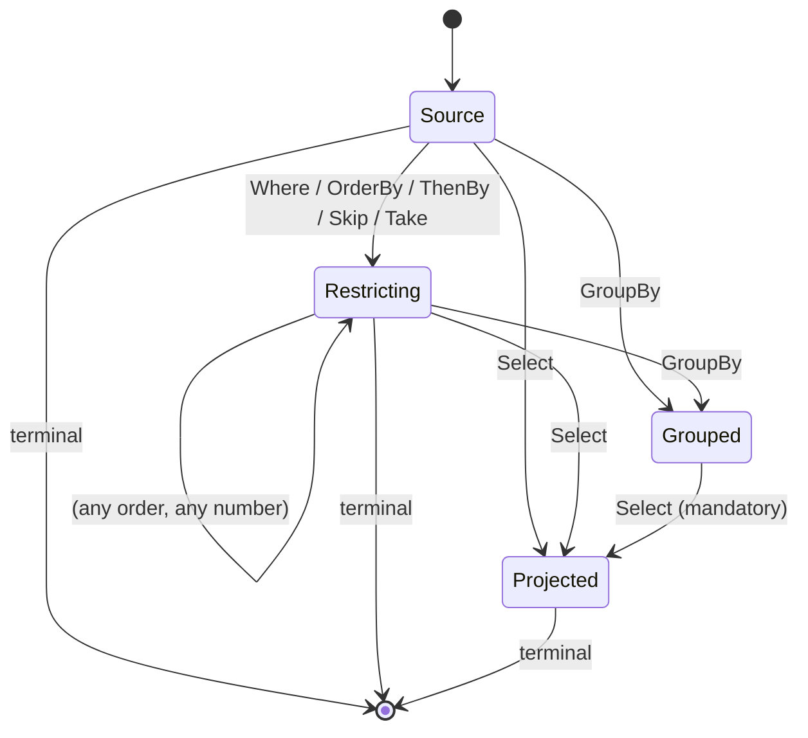

# Writing queries

Client queries are ordinary C# LINQ written against the generated query models. Nothing runs client-side: the expression tree is **captured**, translated to the [wire AST](wire-format.md), and sent to the server when a terminal operator is awaited.

<!-- snippet: clientQuery -->
<a id='snippet-clientQuery'></a>
```cs
employees = await Query.Employee
    .Where(_ => _.Active)
    .OrderBy(_ => _.Name)
    .Select(_ => new EmployeeRow(_.Name, _.Status, _.Manager!.Name, _.Department!.Name))
    .ToListAsync();
```
<sup><a href='/samples/Sample.Client/Pages/Index.razor.cs#L34-L40' title='Snippet source file'>snippet source</a> | <a href='#snippet-clientQuery' title='Start of snippet'>anchor</a></sup>
<!-- endSnippet -->

The supported surface is deliberately closed. Anything outside it fails fast with a clear `NotSupportedException` at translation time — before a request is ever sent.


## Entry points

The generated `ScryQuery` exposes one property per allow-listed source:

<!-- snippet: GeneratorTests.EntitiesViewPocoAndEnum#ScryQuery.g.verified.cs -->
<a id='snippet-GeneratorTests.EntitiesViewPocoAndEnum#ScryQuery.g.verified.cs'></a>
```cs
//HintName: ScryQuery.g.cs
// <auto-generated/>
#nullable enable
namespace Scry.Generated;

/// <summary>Entry point for writing LINQ queries against the allow-listed sources.</summary>
public sealed class ScryQuery
{
    /// <summary>
    /// A hash of the queryable surface this client was generated against. Attached to each
    /// request so the server can identify a client generated against a different model.
    /// </summary>
    public const string SchemaStamp = "da2a2c457e825eda6625b3344f24ee3c69c4954b731d9681f6c40beaf15b4101";

    readonly global::Scry.Client.ScryClient client;

    public ScryQuery(global::Scry.Client.ScryClient client)
    {
        this.client = client;
        client.SchemaStamp = SchemaStamp;
    }

    public global::System.Linq.IQueryable<EmployeeQueryModel> Employee =>
        client.Source<EmployeeQueryModel>("Employee");

    public global::System.Linq.IQueryable<EmployeeSummaryQueryModel> EmployeeSummary =>
        client.Source<EmployeeSummaryQueryModel>("EmployeeSummary");

    public global::System.Linq.IQueryable<HolidayQueryModel> Holiday =>
        client.Source<HolidayQueryModel>("Holiday");
}
```
<sup><a href='/src/Scry.SourceGenerator.Tests/GeneratorTests.EntitiesViewPocoAndEnum%23ScryQuery.g.verified.cs#L1-L31' title='Snippet source file'>snippet source</a> | <a href='#snippet-GeneratorTests.EntitiesViewPocoAndEnum#ScryQuery.g.verified.cs' title='Start of snippet'>anchor</a></sup>
<!-- endSnippet -->

Each returns an `IQueryable<T>` whose provider only captures. Enumerating it synchronously throws:

```
Use ToListAsync to execute a Scry query.
```

You can also reach a source by name, which is what the generated code does under the hood:

<!-- snippet: scryClientApi -->
<a id='snippet-scryClientApi'></a>
```cs
/// <summary>Creates a client that POSTs queries to an HTTP endpoint.</summary>
public static ScryClient ForHttp(HttpClient http, string endpoint) =>
    new(http, endpoint);

/// <summary>Returns an <see cref="IQueryable{T}"/> backed by the named allow-listed source.</summary>
public IQueryable<T> Source<T>(string name) =>
    new CaptureQueryable<T>(new(this, name));
```
<sup><a href='/src/Scry.Client/ScryClient.cs#L20-L28' title='Snippet source file'>snippet source</a> | <a href='#snippet-scryClientApi' title='Start of snippet'>anchor</a></sup>
<!-- endSnippet -->


## Operators

| LINQ | Wire op | Notes |
| --- | --- | --- |
| `Where(predicate)` | `where` | Not allowed after `GroupBy` or `Select`. |
| `OrderBy(key)` / `OrderByDescending(key)` | `orderBy` | Key must be a scalar member. Not allowed after `GroupBy` or `Select`. |
| `ThenBy(key)` / `ThenByDescending(key)` | `thenBy` | Must follow an `OrderBy`. |
| `Skip(n)` | `skip` | `n` must be non-negative. |
| `Take(n)` | `take` | `n` must be non-negative and `<= MaxPageSize`. |
| `GroupBy(key)` | `groupBy` | Exactly one key, at most one `GroupBy`, and it must be followed by a `Select`. |
| `Select(projection)` | `select` | At most one, and it must construct an object. |

Any other LINQ operator — `Join`, `Distinct`, `SelectMany`, `Union`, `Last`, `Reverse`, … — throws:

```
LINQ operator 'Join' is not supported by Scry.
```

Operators are applied left to right, exactly as written.


## Terminals

Terminals are `async` extension methods on `IQueryable<T>` from `Scry.Client`. Awaiting one is what sends the request.

| Method | Returns | Result kind |
| --- | --- | --- |
| `ToListAsync()` | `Task<List<T>>` | list |
| `ToArrayAsync()` | `Task<T[]>` | list |
| `ToHashSetAsync()` | `Task<HashSet<T>>` | list |
| `ToDictionaryAsync(keySelector[, elementSelector][, comparer])` | `Task<Dictionary<TKey, …>>` | list |
| `ToLookupAsync(keySelector[, elementSelector][, comparer])` | `Task<ILookup<TKey, …>>` | list |
| `FirstAsync()` | `Task<T?>` | single |
| `FirstOrDefaultAsync()` | `Task<T?>` | single |
| `SingleAsync()` | `Task<T?>` | single |
| `SingleOrDefaultAsync()` | `Task<T?>` | single |
| `CountAsync()` | `Task<int>` | scalar |
| `AnyAsync()` | `Task<bool>` | scalar |
| `ToPageAsync([pageSize])` | `Task<ScryPage<T>>` | page |
| `ToPageAsync(pageSize, cursor)` | `Task<ScryPage<T>>` | page |

`ToPageAsync` returns a bounded [page](paging.md): `Items`, `HasMore`, and a `Cursor`. Omitting `pageSize` uses the server's `DefaultPageSize`; any size is capped by `MaxPageSize`. Advance by **offset** (`Skip`, below) or by **keyset** — pass the previous page's `Cursor` back to seek past it:

<!-- snippet: clientPaging -->
<a id='snippet-clientPaging'></a>
```cs
// Offset paging: Skip to the start of the page, then take one page of rows. The response is
// a ScryPage — the rows plus HasMore, which the UI uses to enable or disable the Next button.
page = await Query.Employee
    .OrderBy(_ => _.Name)
    .Skip(pageIndex * pageSize)
    .Select(_ => new EmployeeRow(_.Name, _.Status, _.Department!.Name))
    .ToPageAsync(pageSize);
```
<sup><a href='/samples/Sample.Client/Pages/Paging.razor.cs#L22-L30' title='Snippet source file'>snippet source</a> | <a href='#snippet-clientPaging' title='Start of snippet'>anchor</a></sup>
<!-- endSnippet -->

or, resuming by cursor:

<!-- snippet: clientCursorPaging -->
<a id='snippet-clientCursorPaging'></a>
```cs
// Keyset paging: pass the previous page's opaque Cursor to resume exactly past its last row.
// The query must be ordered; the server seeks (WHERE Name > … ORDER BY Name, Id) instead of
// counting an offset, so it stays fast and stable as rows are added or removed.
page = await Query.Employee
    .OrderBy(_ => _.Name)
    .Select(_ => new EmployeeRow(_.Name, _.Status, _.Department!.Name))
    .ToPageAsync(pageSize, from);
```
<sup><a href='/samples/Sample.Client/Pages/KeysetPaging.razor.cs#L22-L30' title='Snippet source file'>snippet source</a> | <a href='#snippet-clientCursorPaging' title='Start of snippet'>anchor</a></sup>
<!-- endSnippet -->

Keyset paging needs an ordered, [seek-safe](paging.md#the-seek-safe-rule) query; otherwise `Cursor` is null and you page by offset. The [sample](sample.md) shows both an offset page and a cursor page.

The collection-shaping terminals (`ToArrayAsync`, `ToHashSetAsync`, `ToDictionaryAsync`, `ToLookupAsync`) all send the same **list** request as `ToListAsync` and reshape the returned rows in memory — there is no streaming wire, so their key/element selectors and comparers run client-side over the materialised result.

Each takes an optional `CancellationToken`. There are no predicate overloads on the client — filter with `Where` first:

```cs
var count = await Query.Employee
    .Where(_ => _.Active)
    .CountAsync();
```

`FirstAsync` and `SingleAsync` are declared as `Task<T?>` even though the server throws when the sequence is empty; the nullable return covers the `OrDefault` variants without a second signature.

There is one non-executing terminal, used by tooling such as the [explorer](explorer.md):

<!-- snippet: translateWithoutExecuting -->
<a id='snippet-translateWithoutExecuting'></a>
```cs
var request = client.Source<Employee>("Employee")
    .Where(_ => _.Active &&
                _.Status == wanted &&
                _.Name.StartsWith(prefix))
    .OrderBy(_ => _.Name)
    .Take(take)
    .Select(_ => new EmployeeRow(_.Name, _.Status, _.Manager!.Name))
    .ToScryRequest();
```
<sup><a href='/src/Scry.Tests/ClientRoundTripTests.cs#L34-L43' title='Snippet source file'>snippet source</a> | <a href='#snippet-translateWithoutExecuting' title='Start of snippet'>anchor</a></sup>
<!-- endSnippet -->

which produces the wire request without contacting the server.


## Expressions

Everything below may appear inside a `Where` predicate, an ordering key, a group key, an aggregate selector, or a projection leaf, subject to the position rules further down.


### Member access

A path rooted at the lambda parameter, traversing reference navigations:

```cs
.Where(_ => _.Manager!.Department!.Name == "Engineering")
```

becomes the member path `["Manager", "Department", "Name"]`. Path length is capped by `MaxNavigationDepth` (default 4). Collection navigations are not exposed at all, so there is no way to express a traversal into one.

A `[QueryableComplex]` member (an EF complex type, e.g. one mapped to a JSON column) is traversed the same way — `.Where(_ => _.Address.City == "London")` becomes `["Address", "City"]`. The server rebinds it onto EF, which translates the access into the JSON column; nothing about the storage is visible on the wire.


### Operators

<!-- snippet: wireBinaryOps -->
<a id='snippet-wireBinaryOps'></a>
```cs
/// <summary>Binary operators allowed in a predicate or projection expression.</summary>
public enum BinaryOp
{
    Equal,
    NotEqual,
    LessThan,
    LessThanOrEqual,
    GreaterThan,
    GreaterThanOrEqual,
    AndAlso,
    OrElse,
    Add,
    Subtract,
    Multiply,
    Divide
}

/// <summary>Unary operators allowed in an expression.</summary>
public enum UnaryOp
{
    Not,
    Negate
}
```
<sup><a href='/src/Scry.Wire/Enums.cs#L18-L42' title='Snippet source file'>snippet source</a> | <a href='#snippet-wireBinaryOps' title='Start of snippet'>anchor</a></sup>
<!-- endSnippet -->

C# `==`, `!=`, `<`, `<=`, `>`, `>=`, `&&`, `||`, `+`, `-`, `*`, `/`, `!`, and unary `-` map onto these. Any other operator (`%`, `&`, `|`, `^`, `<<`, `>>`, `??`, `?:`) throws:

```
Binary operator 'Modulo' is not supported by Scry.
```

`Convert` / `ConvertChecked` nodes — which the C# compiler inserts freely around enums, nullables, and numeric widening — are transparently unwrapped rather than encoded.


### Functions

<!-- snippet: wireFunctions -->
<a id='snippet-wireFunctions'></a>
```cs
/// <summary>The closed set of functions a client may call on a value. No free-form method names.</summary>
public enum KnownFunction
{
    StringContains,
    StringStartsWith,
    StringEndsWith,
    StringToLower,
    StringToUpper,
    StringIsNullOrEmpty,
    DateYear,
    DateMonth,
    DateDay
}
```
<sup><a href='/src/Scry.Wire/Enums.cs#L44-L58' title='Snippet source file'>snippet source</a> | <a href='#snippet-wireFunctions' title='Start of snippet'>anchor</a></sup>
<!-- endSnippet -->

Mapped from:

| C# | Function |
| --- | --- |
| `text.Contains(value)` | `StringContains` |
| `text.StartsWith(value)` | `StringStartsWith` |
| `text.EndsWith(value)` | `StringEndsWith` |
| `text.ToLower()` | `StringToLower` |
| `text.ToUpper()` | `StringToUpper` |
| `string.IsNullOrEmpty(text)` | `StringIsNullOrEmpty` |
| `date.Year` | `DateYear` |
| `date.Month` | `DateMonth` |
| `date.Day` | `DateDay` |

The date parts apply to `DateTime` and `DateOnly`. There is no free-form method call node in the wire format, so this list is the complete set of behaviour a client can ask the database to perform.


### Constants and captured values

Literals become constants. So does **any sub-expression that does not reference the lambda parameter** — it is evaluated on the client and sent as a constant. That is what makes a query parameterizable at runtime:

<!-- snippet: clientClosureCapture -->
<a id='snippet-clientClosureCapture'></a>
```cs
fullTimers = await Query.Employee
    .Where(_ => _.Status == status)
    .OrderBy(_ => _.Name)
    .Take(top)
    .Select(_ => new EmployeeRow(_.Name, _.Status, _.Manager!.Name, _.Department!.Name))
    .ToListAsync();
```
<sup><a href='/samples/Sample.Client/Pages/Index.razor.cs#L49-L56' title='Snippet source file'>snippet source</a> | <a href='#snippet-clientClosureCapture' title='Start of snippet'>anchor</a></sup>
<!-- endSnippet -->

`status` and `top` are locals; the translator compiles and invokes those sub-expressions, then emits their values. Calls to your own methods are fine on this path as long as they do not touch the query parameter — `.Where(_ => _.Name == BuildName())` sends the *result* of `BuildName()`.

A constant is carried as an invariant-culture string plus a type tag, and reconciled against the member type at the comparison site on the server. Enums travel as their **name**, not their numeric value.


## Projections

A `Select` must construct an object. Anonymous types, records, and object initializers all work:

```cs
.Select(_ => new { _.Name, Manager = _.Manager!.Name })
.Select(_ => new EmployeeRow(_.Name, _.Status, _.Manager!.Name, _.Department!.Name))
.Select(_ => new EmployeeRow { Name = _.Name, Department = _.Department!.Name })
```

Projecting a bare value does not work:

```cs
.Select(_ => _.Name) // NotSupportedException
```

```
A projection must construct an object (anonymous type, record, or object initializer).
```

For a record or constructor call, member names come from the constructor parameter names, capitalized — `new EmployeeRow(name: ...)` produces the member `Name`.

Every projection leaf must resolve to an allow-listed **scalar**. A navigation cannot be projected whole; project the scalar you want out of it (`_.Department!.Name`).

### Without a `Select`

If no projection is supplied, the server returns every allow-listed **scalar** member of the source. Navigations are excluded, and so is anything `[QueryIgnore]`d — which is why the default projection of `Employee` never contains `Salary`.

### Nested result objects

Projecting a **constructed object** into a navigation nests the result under that member instead of flattening it. Write the nested shape as an ordinary object construction whose members read through the navigation:

<!-- snippet: clientNestedProjection -->
<a id='snippet-clientNestedProjection'></a>
```cs
// Projecting into the Department navigation builds a nested result object rather than
// flattening it — the response is { Name, Department: { Name } }.
cards = await Query.Employee
    .Where(_ => _.Active)
    .OrderBy(_ => _.Name)
    .Select(_ => new EmployeeCard(_.Name, new DepartmentCard(_.Department!.Name)))
    .ToListAsync();
```
<sup><a href='/samples/Sample.Client/Pages/Index.razor.cs#L60-L68' title='Snippet source file'>snippet source</a> | <a href='#snippet-clientNestedProjection' title='Start of snippet'>anchor</a></sup>
<!-- endSnippet -->

The client factors the shared navigation (`_.Department`) out of the nested members and emits a `NestedValue` in the wire AST; the server descends the navigation and shapes the leaves under it, producing nested JSON:

<!-- snippet: ExecutionTests.WhereOrderByNestedProjection.verified.txt -->
<a id='snippet-ExecutionTests.WhereOrderByNestedProjection.verified.txt'></a>
```txt
{
  "version": 1,
  "kind": "List",
  "payload": [
    {
      "name": "Aaron",
      "managerName": "Alice",
      "department": {
        "name": "Engineering"
      }
    },
    {
      "name": "Alice",
      "managerName": null,
      "department": {
        "name": "Engineering"
      }
    }
  ]
}
```
<sup><a href='/src/Scry.Tests/ExecutionTests.WhereOrderByNestedProjection.verified.txt#L1-L20' title='Snippet source file'>snippet source</a> | <a href='#snippet-ExecutionTests.WhereOrderByNestedProjection.verified.txt' title='Start of snippet'>anchor</a></sup>
<!-- endSnippet -->

Rules for a nested projection member:

- Every member of the nested object must be a **member path** (`_.Department.Name`), not a function call or a further nested object — one level of nesting, scalar leaves.
- All its members must share a single navigation prefix; the client descends into that one navigation. Mixing two navigations (`new(_.Department.Name, _.Manager.Name)`) in one nested object is rejected.
- The flat form still works when you only need the value — `Department = _.Department!.Name` gives a flat column instead of a nested object.

## Grouping and aggregates

`GroupBy` must be followed by `Select`, and that projection may reference **only** the group key and aggregates:

<!-- snippet: clientGroupBy -->
<a id='snippet-clientGroupBy'></a>
```cs
regions = await Query.Order
    .GroupBy(_ => _.Region)
    .Select(_ => new RegionSummary(_.Key, _.Sum(_ => _.Amount), _.Count()))
    .ToListAsync();
```
<sup><a href='/samples/Sample.Client/Pages/Index.razor.cs#L42-L47' title='Snippet source file'>snippet source</a> | <a href='#snippet-clientGroupBy' title='Start of snippet'>anchor</a></sup>
<!-- endSnippet -->

<!-- snippet: wireAggregates -->
<a id='snippet-wireAggregates'></a>
```cs
/// <summary>Aggregate functions allowed in a projection over a grouped query.</summary>
public enum AggregateFn
{
    Count,
    Sum,
    Average,
    Min,
    Max
}
```
<sup><a href='/src/Scry.Wire/Enums.cs#L60-L70' title='Snippet source file'>snippet source</a> | <a href='#snippet-wireAggregates' title='Start of snippet'>anchor</a></sup>
<!-- endSnippet -->

| C# | Aggregate |
| --- | --- |
| `_.Count()` | `Count` |
| `_.Sum(_ => _.Amount)` | `Sum` |
| `_.Average(_ => _.Amount)` | `Average` |
| `_.Min(_ => _.Amount)` | `Min` |
| `_.Max(_ => _.Amount)` | `Max` |

Constraints:

- Exactly one group key, and it must be a member access.
- `Where`, `OrderBy`, and `ThenBy` are not allowed after `GroupBy`.
- Nested projections are not allowed in a grouped `Select`.
- Referencing a non-key member throws `A grouped projection may only use the group key or aggregates.`
- Aggregates outside a grouped `Select` are rejected server-side with `Aggregates are only allowed in a Select following GroupBy.`

## Ordering rules

The pipeline is validated as a whole. In order:

1. `Where`, `OrderBy`/`ThenBy`, `Skip`, `Take` — any number, in any order, before grouping or projection.
2. At most one `GroupBy`, which must precede the `Select`.
3. At most one `Select`.
4. At most one terminal, and nothing after it.

The legal operator orderings form a small state machine — every absent edge is an illegal ordering:<!-- include: pipeline-order. path: /docs/includes/pipeline-order.include.md -->



Nothing filters, orders, skips, or takes after `GroupBy`; a `GroupBy` cannot reach a terminal without
a `Select` in between; and there is no second `GroupBy` or `Select`. `ThenBy` without a preceding
`OrderBy` is rejected, and nothing may follow a terminal.<!-- endInclude -->

## Errors

| Where | Type | When |
| --- | --- | --- |
| Client, at translation | `NotSupportedException` | The LINQ cannot be expressed in the wire AST. Nothing is sent. |
| Client, on response | `ScryRequestException` | The server returned a non-success status. Carries `StatusCode` and `Body`. |
| Client, on response | `ScryWireException` | The response could not be deserialized, or its result kind did not match the terminal. |
| Server, during validation | `ScryValidationException` → `400` | The request violates the allow-list or a limit. |

See [Server](server.md#error-handling) for the response bodies.

## Future enhancements

- **Streaming results (`ToAsyncEnumerable`).** The wire currently carries each query result as a single response, so there is nothing to enumerate incrementally. `ToAsyncEnumerable` therefore throws `NotSupportedException` for now; use `ToListAsync`. A streaming wire (chunked or paged transport that yields rows as they arrive) is the intended way to make it real, at which point the terminal would stream rather than buffer.
