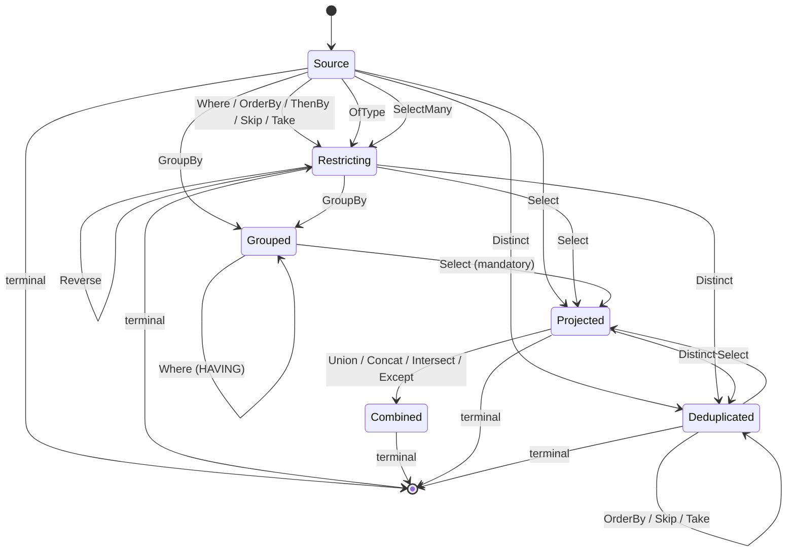

# Writing queries

Client queries are ordinary C# LINQ written against the generated query models. Nothing runs client-side: the expression tree is **captured**, translated to the [wire AST](wire-format.md), and sent to the server when a terminal operator is awaited.

<!-- snippet: clientQuery -->
<a id='snippet-clientQuery'></a>
```cs
employees = await Query
    .Employee
    .Where(_ => _.Active)
    .OrderBy(_ => _.Name)
    .Select(_ => new EmployeeRow(_.Name, _.Status, _.Manager!.Name, _.Department!.Name))
    .ToListAsync();
```
<sup><a href='/samples/Sample.Client/Pages/Index.razor.cs#L48-L55' title='Snippet source file'>snippet source</a> | <a href='#snippet-clientQuery' title='Start of snippet'>anchor</a></sup>
<!-- endSnippet -->

The supported surface is deliberately closed. Anything outside it fails fast with a clear `NotSupportedException` at translation time — before a request is ever sent.


## Entry points

The generated `ScryQuery` exposes one property per allow-listed source:

<!-- snippet: GeneratorTests.EntitiesViewPocoAndEnum#ScryQuery.g.verified.cs -->
<a id='snippet-GeneratorTests.EntitiesViewPocoAndEnum#ScryQuery.g.verified.cs'></a>
```cs
//HintName: ScryQuery.g.cs
// <auto-generated/>
#nullable enable
#pragma warning disable CS0612, CS0618
namespace Scry.Generated;

/// <summary>Entry point for writing LINQ queries against the allow-listed sources.</summary>
public sealed class ScryQuery
{
    /// <summary>
    /// A hash of the queryable surface this client was generated against. Attached to each
    /// request so the server can identify a client generated against a different model.
    /// </summary>
    public const string SchemaStamp = "2iosRX6CXtpmJbM0";

    readonly global::Scry.ScryClient client;

    public ScryQuery(global::Scry.ScryClient client)
    {
        this.client = client;
        client.SchemaStamp = SchemaStamp;
    }

    public global::System.Linq.IQueryable<EmployeeQueryModel> Employee =>
        client.Source<EmployeeQueryModel>("Employee", ["Id", "Name", "Status", "Active", "ManagerId", "Avatar"]);

    public global::System.Linq.IQueryable<EmployeeSummaryQueryModel> EmployeeSummary =>
        client.Source<EmployeeSummaryQueryModel>("EmployeeSummary", ["Department", "Headcount"]);

    public global::System.Linq.IQueryable<HolidayQueryModel> Holiday =>
        client.Source<HolidayQueryModel>("Holiday", ["Name", "Date"]);
}
```
<sup><a href='/src/Scry.SourceGenerator.Tests/GeneratorTests.EntitiesViewPocoAndEnum%23ScryQuery.g.verified.cs#L1-L32' title='Snippet source file'>snippet source</a> | <a href='#snippet-GeneratorTests.EntitiesViewPocoAndEnum#ScryQuery.g.verified.cs' title='Start of snippet'>anchor</a></sup>
<!-- endSnippet -->

Each returns an `IQueryable<T>` whose provider only captures. Enumerating it synchronously throws:

```
Use ToListAsync to execute a Scry query.
```

A source can also be reached by name, which is what the generated code does under the hood:

<!-- snippet: scryClientApi -->
<a id='snippet-scryClientApi'></a>
```cs
/// <summary>
/// Creates a client that sends queries to an HTTP endpoint — as a URL where the query fits in one
/// and as a body where it does not, which <see cref="QueryUrl"/> explains.
/// </summary>
public static ScryClient ForHttp(HttpClient http, string endpoint) =>
    new(http, endpoint);

/// <summary>
/// Whether a request has to travel in a body rather than a URL, because it compares a member the
/// model marks <c>[Sensitive]</c> against a constant — a value a URL would write into the access
/// log of every hop on the way.
/// </summary>
/// <remarks>
/// This client applies it to everything it sends; it is public for tooling that sends a request
/// itself, which has the same choice to make and no other way to make it. Answered from the
/// generated models the request was written against, so a request naming sources this process has
/// never opened is answered conservatively rather than optimistically.
/// </remarks>
public static bool RequiresBody(QueryRequest request) =>
    SensitiveWalk.Inspect(request, SensitiveModel.IsSensitive).InConstant;

/// <summary>
/// Returns an <see cref="IQueryable{T}"/> backed by the named allow-listed source.
/// <paramref name="defaultProjection"/> is the source's scalar member names, passed by the
/// generated entry point so a query without a <c>Select</c> still projects explicitly.
/// </summary>
public IQueryable<T> Source<T>(string name, IReadOnlyList<string>? defaultProjection = null)
{
    // Recorded so a finished request can be read back against the model it was written from: by
    // the time the transport chooses, all it holds is source names and member paths.
    SensitiveModel.Register(name, typeof(T));
    return new CaptureQueryable<T>(new(this, name, defaultProjection));
}

/// <summary>
/// Starts a batch: several queries collected on the client and sent as one request. Attach it to a
/// query with <see cref="ScryBatchExtensions.InBatch{T}"/>, then
/// <see cref="ScryBatch.SendAsync"/>. A batch is used once.
/// </summary>
public ScryBatch Batch()
{
    if (batchTransport is not null)
    {
        return new(this);
    }

    throw new NotSupportedException(
        """
        This client's transport does not batch.
        Send queries individually, or construct the client with a batch transport (ScryClient.ForHttp does).
        """);
}
```
<sup><a href='/src/Scry.Client/ScryClient.cs#L109-L162' title='Snippet source file'>snippet source</a> | <a href='#snippet-scryClientApi' title='Start of snippet'>anchor</a></sup>
<!-- endSnippet -->


## Operators

| LINQ | Wire op | Notes |
| --- | --- | --- |
| `Where(predicate)` | `where` | Filters rows. Written after `GroupBy` it filters groups instead — see [below](#filtering-groups). Not allowed after `Select`. |
| `OrderBy(key)` / `OrderByDescending(key)` | `orderBy` | Key must be a scalar member. Not allowed after `GroupBy` or `Select`. |
| `ThenBy(key)` / `ThenByDescending(key)` | `thenBy` | Must follow an `OrderBy`. |
| `Skip(n)` | `skip` | `n` must be non-negative. |
| `Take(n)` | `take` | `n` must be non-negative and `<= MaxPageSize`. |
| `OfType<T>()` | `ofType` | Narrows to a derived type — see [below](#narrowing-to-a-derived-type). Later operators read the derived type. |
| `SelectMany(collection)` | `selectMany` | Flattens a `[QueryableCollection]` — see [below](#flattening-a-collection). One per query; later operators read the element. |
| `GroupBy(key)` | `groupBy` | One key, or up to eight members grouped at once. At most one `GroupBy`, and it must be followed by a `Select`. |
| `Select(projection)` | `select` | At most one, and it must construct an object. |
| `Distinct()` | `distinct` | Deduplicates the **projected** rows. It can also be ordered, paged and counted — see [below](#deduplicating). |
| `Reverse()` | `reverse` | Inverts the ordering. Requires a preceding `OrderBy`. |
| `Join(inner, …)` / `LeftJoin(inner, …)` / `RightJoin(inner, …)` / `GroupJoin(inner, …)` | `join` | Joins a second source — see [below](#joins). Carries its own projection; only a terminal may follow. |
| `Union` / `Concat` / `Intersect` / `Except` | `set` | Combines a second source — see [below](#set-operations). Both sides project the same shape. |

Any other LINQ operator — `Cast`, `Zip`, `SkipWhile`, … — throws:

```
LINQ operator 'Zip' is not supported by Scry.
```

[LINQ coverage](linq-coverage.md) tracks the full supported/unsupported matrix against what EF Core can translate.

Operators are applied left to right, exactly as written.


## Terminals

Terminals are `async` extension methods on `IQueryable<T>` from `Scry.Client`. Awaiting one is what sends the request.

| Method | Returns | Result kind |
| --- | --- | --- |
| `ToListAsync()` | `Task<List<T>>` | list |
| `ToArrayAsync()` | `Task<T[]>` | list |
| `ToHashSetAsync()` | `Task<HashSet<T>>` | list |
| `ToDictionaryAsync(keySelector[, elementSelector][, comparer])` | `Task<Dictionary<TKey, …>>` | list |
| `ToLookupAsync(keySelector[, elementSelector][, comparer])` | `Task<ILookup<TKey, …>>` | list |
| `ToAsyncEnumerable()` | `IAsyncEnumerable<T>` | [stream](#streaming-rows) |
| `FirstAsync([predicate])` | `Task<T?>` | single |
| `FirstOrDefaultAsync([predicate])` | `Task<T?>` | single |
| `SingleAsync([predicate])` | `Task<T?>` | single |
| `SingleOrDefaultAsync([predicate])` | `Task<T?>` | single |
| `LastAsync([predicate])` | `Task<T?>` | single |
| `LastOrDefaultAsync([predicate])` | `Task<T?>` | single |
| `ElementAtAsync(index)` | `Task<T?>` | single |
| `ElementAtOrDefaultAsync(index)` | `Task<T?>` | single |
| `MaxByAsync(key)` / `MaxByOrDefaultAsync(key)` | `Task<T?>` | single |
| `MinByAsync(key)` / `MinByOrDefaultAsync(key)` | `Task<T?>` | single |
| `CountAsync([predicate])` | `Task<int>` | scalar |
| `LongCountAsync([predicate])` | `Task<long>` | scalar |
| `AnyAsync([predicate])` | `Task<bool>` | scalar |
| `AllAsync(predicate)` | `Task<bool>` | scalar |
| `SumAsync(selector)` | `Task<TValue>` | scalar |
| `AverageAsync(selector)` | `Task<double>` / `Task<decimal>` | scalar |
| `MinAsync(selector)` / `MaxAsync(selector)` | `Task<TValue?>` | scalar |
| `ToPageAsync([pageSize])` | `Task<ScryPage<T>>` | page |
| `ToPageAsync(pageSize, cursor)` | `Task<ScryPage<T>>` | page |

A terminal predicate narrows the rows before the terminal does anything else — `CountAsync(_ => _.Active)` is `Where(_ => _.Active).CountAsync()`. It cannot be combined with a `Select`, since it reads the row rather than the projection.

`LastAsync` requires an ordered query: "last" is resolved by reversing the ordering, so an unordered query has no defined last row and is rejected. `ElementAtAsync` is `Skip` plus `First`, so an index past the end yields no row rather than an error.

`MaxByAsync` and `MinByAsync` are `OrderBy` plus `First` — the same unfolding EF applies to `Queryable.MaxBy` / `MinBy`. The ordering precedes any projection, so the key is a single value read off the row, and the answer is the row itself, default-projected. Rows tying on the key come back in no particular order, exactly as they would from EF.

The aggregate terminals fold the whole sequence. `SumAsync` and `AverageAsync` carry one overload per numeric type, mirroring `System.Linq` — the value the server computes has a type of its own, so an average over integers returns a `double`. `MinAsync`/`MaxAsync` return the selected type, and give the default when there are no rows (select a nullable — `MinAsync(_ => (decimal?)_.Amount)` — to tell "no rows" apart from a real zero).

`ToPageAsync` returns a bounded [page](paging.md): `Items`, `HasMore`, and a `Cursor`. Omitting `pageSize` uses the server's `DefaultPageSize`; any size is capped by `MaxPageSize`. Advance by **offset** (`Skip`, below) or by **keyset** — pass the previous page's `Cursor` back to seek past it:

<!-- snippet: clientPaging -->
<a id='snippet-clientPaging'></a>
```cs
// Offset paging: Skip to the start of the page, then take one page of rows. The response is
// a ScryPage — the rows plus HasMore, which the UI uses to enable or disable the Next button.
page = await Query.Employee
    .OrderBy(_ => _.Name)
    .Skip(pageIndex * pageSize)
    .Select(_ => new EmployeeRow(_.Name, _.Status, _.Department!.Name))
    .ToPageAsync(pageSize);
```
<sup><a href='/samples/Sample.Client/Pages/Paging.razor.cs#L21-L29' title='Snippet source file'>snippet source</a> | <a href='#snippet-clientPaging' title='Start of snippet'>anchor</a></sup>
<!-- endSnippet -->

or, resuming by cursor:

<!-- snippet: clientCursorPaging -->
<a id='snippet-clientCursorPaging'></a>
```cs
// Keyset paging: pass the previous page's opaque Cursor to resume exactly past its last row.
// The query must be ordered; the server seeks (WHERE Name > … ORDER BY Name, Id) instead of
// counting an offset, so it stays fast and stable as rows are added or removed.
page = await Query.Employee
    .OrderBy(_ => _.Name)
    .Select(_ => new EmployeeRow(_.Name, _.Status, _.Department!.Name))
    .ToPageAsync(pageSize, from);
```
<sup><a href='/samples/Sample.Client/Pages/KeysetPaging.razor.cs#L21-L29' title='Snippet source file'>snippet source</a> | <a href='#snippet-clientCursorPaging' title='Start of snippet'>anchor</a></sup>
<!-- endSnippet -->

Keyset paging needs an ordered, [seek-safe](paging.md#the-seek-safe-rule) query; otherwise `Cursor` is null and paging falls back to offset. The [sample](sample.md) shows both an offset page and a cursor page.

The collection-shaping terminals (`ToArrayAsync`, `ToHashSetAsync`, `ToDictionaryAsync`, `ToLookupAsync`) all send the same **list** request as `ToListAsync` and reshape the returned rows in memory — their key/element selectors and comparers are client-side concerns, so they run over the materialised result rather than becoming part of the query.


### Streaming rows

`ToAsyncEnumerable` sends the same request `ToListAsync` does, and reads the rows off a [streaming endpoint](server.md#mapping-the-endpoint) as they arrive rather than as one response:

<!-- snippet: clientStream -->
<a id='snippet-clientStream'></a>
```cs
var names = new List<string>();
await foreach (var row in query.Employee
                   .Where(_ => _.Active)
                   .OrderBy(_ => _.Name)
                   .Select(_ => new NameRow(_.Name))
                   .ToAsyncEnumerable())
{
    names.Add(row.Name);
}
```
<sup><a href='/IntegrationTests/HttpRoundTripTests.cs#L177-L187' title='Snippet source file'>snippet source</a> | <a href='#snippet-clientStream' title='Start of snippet'>anchor</a></sup>
<!-- endSnippet -->

Neither side holds the whole result: the server never buffers the rows and the client yields each as it is read. That makes it the right terminal for a result too large to sit in memory comfortably, and unnecessary for one that is not — a small result costs an extra round-trip's worth of framing for nothing.

Only a query that **returns rows** can stream. A folded terminal (`CountAsync`, `AnyAsync`, an aggregate) has one value and nothing to enumerate, and a paged one is a single envelope; asking to stream either is rejected.

**A stream is only complete once it has been enumerated to the end.** The server closes a stream with an explicit marker, and its absence throws. That matters because a stream commits to a success status before the first row is written: once that has happened a later failure cannot become a `400` or a `500`, so a dropped connection or a faulting provider would otherwise be indistinguishable from a short result. Rejections still arrive as a status with a body — [validation runs to completion before anything is rebound](security.md), so nothing has been written when a query is refused. Abandoning the enumeration early is supported and stops the server, but what was read is then a prefix by the caller's own choice rather than something to detect.

`MaxStreamRows` bounds a stream, and is unset by default — matching `ToListAsync`, which has never been bounded either, since `MaxPageSize` caps an explicit `Take` rather than implicitly paging an unbounded query. Streaming is no longer the safer of the two server-side: a list that outgrows [`ResponseSpillThreshold`](server.md#response-size) is written out as it is read, so neither holds its rows. The reason to bound a stream anyway is the one thing both do hold — a connection, open for as long as the client reads. A stream that reaches the limit ends with an error marker rather than a short result.

Each takes an optional `CancellationToken`. There are no predicate overloads on the client — filter with `Where` first:

```cs
var count = await Query.Employee
    .Where(_ => _.Active)
    .CountAsync();
```

`FirstAsync` and `SingleAsync` are declared as `Task<T?>` even though the server throws when the sequence is empty; the nullable return covers the `OrDefault` variants without a second signature.

There is one non-executing terminal, used by tooling such as the [explorer](explorer.md):

<!-- snippet: translateWithoutExecuting -->
<a id='snippet-translateWithoutExecuting'></a>
```cs
var request = client.Source<Employee>("Employee")
    .Where(_ => _.Active &&
                _.Status == wanted &&
                _.Name.StartsWith(prefix))
    .OrderBy(_ => _.Name)
    .Take(take)
    .Select(_ => new EmployeeRow(_.Name, _.Status, _.Manager!.Name))
    .ToScryRequest();
```
<sup><a href='/src/Scry.Tests/ClientRoundTripTests.cs#L32-L41' title='Snippet source file'>snippet source</a> | <a href='#snippet-translateWithoutExecuting' title='Start of snippet'>anchor</a></sup>
<!-- endSnippet -->

which produces the wire request without contacting the server.


## Headers

`HttpClient.DefaultRequestHeaders` covers every call a client makes. These three operators cover **one query**:

<!-- snippet: queryHeaders -->
<a id='snippet-queryHeaders'></a>
```cs
/// <summary>Sends <paramref name="name"/>: <paramref name="value"/> with this query's request.</summary>
public static IQueryable<T> WithHeader<T>(this IQueryable<T> source, string name, string value) =>
    source.WithHeaders(_ => _.TryAddWithoutValidation(name, value));

/// <summary>Configures the headers of this query's request.</summary>
public static IQueryable<T> WithHeaders<T>(this IQueryable<T> source, Action<HttpRequestHeaders> configure) =>
    Rebind(source, _ => ScryCall.Configuring(_, configure));

/// <summary>
/// Reads the headers of this query's response, including when the query fails — a trace or
/// correlation header is most useful on the response that went wrong.
/// </summary>
public static IQueryable<T> OnResponseHeaders<T>(this IQueryable<T> source, Action<HttpResponseHeaders> read) =>
    Rebind(source, _ => ScryCall.Reading(_, read));
```
<sup><a href='/src/Scry.Client/ScryHeaderExtensions.cs#L23-L38' title='Snippet source file'>snippet source</a> | <a href='#snippet-queryHeaders' title='Start of snippet'>anchor</a></sup>
<!-- endSnippet -->

They are transport concerns rather than query operators. Nothing they carry enters the [wire request](wire-format.md), so the server sees them only as HTTP headers and the validator never meets them:

```cs
var rows = await Query.Order
    .WithHeader("X-Correlation", correlationId)
    .OnResponseHeaders(_ => trace = _.GetValues("X-Trace").Single())
    .Where(_ => _.Amount > 100)
    .ToListAsync();
```

Position in the chain does not matter — the operator swaps the provider that carries the hooks and leaves the captured expression untouched, so operators written on either side of it translate as usual. Repeating one composes rather than replaces.

`OnResponseHeaders` runs on **failed** responses too, which is where a trace or correlation header is most worth having; it runs before the failure becomes an exception. On a streamed query it runs once the response headers are read, before the first row.

Headers are carried by the HTTP transport, so a query carrying them needs a client built by `ScryClient.ForHttp`. A [custom transport delegate](server.md#hosting-without-the-http-endpoint) has nowhere to put them and refuses the query rather than sending it silently stripped. A header attached to the inner side of a join or a set operator is likewise ignored: those fold into the single request the outer query sends.

> [!WARNING]
> Whatever the client sends is attacker-controlled by the time the server reads it. Treat these as hint data — a correlation id, a trace id, a client build — and never as an authorization input. See [row policies](policies.md#reading-and-writing-headers).


## Expressions

Everything below may appear inside a `Where` predicate, an ordering key, a group key, an aggregate selector, or a projection leaf, subject to the position rules further down.


### Member access

A path rooted at the lambda parameter, traversing reference navigations:

```cs
.Where(_ => _.Manager!.Department!.Name == "Engineering")
```

becomes the member path `["Manager", "Department", "Name"]`. Path length is capped by `MaxNavigationDepth` (default 4). Collection navigations are not exposed at all, so there is no way to express a traversal into one.

A `[QueryableComplex]` member (an EF complex type, e.g. one mapped to a JSON column) is traversed the same way — `.Where(_ => _.Address.City == "London")` becomes `["Address", "City"]`. The server rebinds it onto EF, which translates the access into the JSON column; nothing about the storage is visible on the wire.


### Operators

<!-- snippet: wireBinaryOps -->
<a id='snippet-wireBinaryOps'></a>
```cs
/// <summary>Binary operators allowed in a predicate or projection expression.</summary>
public enum BinaryOp
{
    Equal,
    NotEqual,
    LessThan,
    LessThanOrEqual,
    GreaterThan,
    GreaterThanOrEqual,
    AndAlso,
    OrElse,
    Add,
    Subtract,
    Multiply,
    Divide,
    Modulo,
    Coalesce
}

/// <summary>Unary operators allowed in an expression.</summary>
public enum UnaryOp
{
    Not,
    Negate
}
```
<sup><a href='/src/Scry.Wire/BinaryOp.cs#L3-L29' title='Snippet source file'>snippet source</a> | <a href='#snippet-wireBinaryOps' title='Start of snippet'>anchor</a></sup>
<!-- endSnippet -->

C# `==`, `!=`, `<`, `<=`, `>`, `>=`, `&&`, `||`, `+`, `-`, `*`, `/`, `%`, `??`, `!`, and unary `-` map onto these, and `?:` becomes a `conditional` node. `+` over strings is concatenation, which travels as its own [`StringConcat`](#functions) function rather than as the operator: an Add of a string and a number is a concatenation while an Add of two numbers is arithmetic, and only the client — which can still see the `string.Concat` the compiler resolved — can tell which was written. Any other operator (`&`, `|`, `^`, `<<`, `>>`) throws:

```
Binary operator 'ExclusiveOr' is not supported by Scry.
```

`??` requires a nullable left operand, and the two branches of a `?:` must have the same type; both are checked server-side when the expression is rebound.

`Equals` is `==` spelled as a method and is carried as that comparison, in both spellings — `_.Name.Equals(x)` and `string.Equals(_.Name, x)` — and over any scalar rather than text alone. It is refused by exactly the rules `==` is refused by, since it becomes the same node; there is no function on the wire for it.

An optional member's `Value` and `HasValue` are carried the same way, as what they mean rather than as members of their own. Every wire operand is already optional, so `Value` is the member it wraps and disappears — `_.Discount.Value > 6` is `_.Discount > 6` — and `HasValue` is the comparison that asks the same question, `_.Discount != null`. A row whose member is absent is left out either way, which is what SQL's three-valued logic does with it.

The `StringComparison` overloads of `Contains`, `StartsWith`, `EndsWith` and `Equals` ask for a **case sensitivity**, and are supported when the server has configured a collation for it:

<!-- snippet: clientCaseInsensitive -->
<a id='snippet-clientCaseInsensitive'></a>
```cs
var rows = await client.Source<Employee>("Employee")
    .Where(_ => _.Name.Contains("LIC", StringComparison.OrdinalIgnoreCase))
    .Select(_ => new NameRow(_.Name))
    .ToListAsync();
```
<sup><a href='/src/Scry.Tests/CollationTests.cs#L60-L65' title='Snippet source file'>snippet source</a> | <a href='#snippet-clientCaseInsensitive' title='Start of snippet'>anchor</a></sup>
<!-- endSnippet -->

The client names only the sensitivity it wants; which collation implements it is [server configuration](server.md#limits). That is deliberate and load-bearing: a collation cannot be a query parameter — it is emitted into the SQL text — so it is the one value that must never come from a request. A server that has configured neither collation rejects the query rather than guessing.

The comparison the database then makes is **its own, under that collation** — not the .NET culture rules the `StringComparison` value names. Only the case sensitivity survives the crossing. Collation is also a relational concept, so a non-relational provider cannot offer it.

An operand that is **not a string** is converted by the database:

<!-- snippet: clientStringConcat -->
<a id='snippet-clientStringConcat'></a>
```cs
var rows = await client.Source<Order>("Order")
    .Select(_ => new {Label = $"{_.Region}-{_.Quantity}"})
    .ToListAsync();
```
<sup><a href='/src/Scry.Tests/StringConcatTests.cs#L16-L20' title='Snippet source file'>snippet source</a> | <a href='#snippet-clientStringConcat' title='Start of snippet'>anchor</a></sup>
<!-- endSnippet -->

Only the non-string side is converted, which is what tells the provider which side is already text. The alternative — converting both — leaves the operands indistinguishable, and the provider reads the whole expression as arithmetic and fails trying to cast the string to a number.


#### Reading a value as text

`ToString()` reads a value as text explicitly, wherever a value can appear:

<!-- snippet: clientToString -->
<a id='snippet-clientToString'></a>
```cs
var rows = await client.Source<Order>("Order")
    .Where(_ => _.Region == "South")
    .Select(_ => new {Quantity = _.Quantity.ToString(), Amount = _.Amount.ToString()})
    .ToListAsync();
```
<sup><a href='/src/Scry.Tests/ToStringTests.cs#L15-L20' title='Snippet source file'>snippet source</a> | <a href='#snippet-clientToString' title='Start of snippet'>anchor</a></sup>
<!-- endSnippet -->

It is restricted to the scalar shapes a provider renders — the numeric types, `char`, `bool`, the date and time types, `Guid`, and `byte[]`. An **enum** is refused: its text is a member name that lives in the model rather than the database, whose column holds the underlying value, so converting one in SQL would answer with a number where the client expects a name. Anything else is refused too, rather than translated into something that faults at execution.

**The overload taking a format — `ToString("N2")`, and the interpolated `$"{_.Amount:N2}"` — is not supported**, and refused on the client before a request is sent. Three things stand in the way, and the last is the one that matters:

- No provider translates it. EF's own converter takes the argument-less form only.
- It *appears* to work in a projection, because EF evaluates it client-side after the rows have been read. The same expression in a `Where`, an `OrderBy`, or a `GroupBy` fails outright — which is the tell that no SQL was ever produced for it.
- The SQL function that would express it, `FORMAT`, reads the server's language. `N2` yields `1,234.50` under `us_english` and `1.234,50` under `de-DE`, so the same row would format differently per connection — the same objection that keeps [`DayOfWeek`](#functions) from being expressed the obvious way, except that here there is no deterministic composition to build instead.

Format the value after the query returns, where .NET's own culture rules apply and mean what they say.

`string.Concat` and an **interpolated string** both mean that same `+`, non-string parts included. An interpolated string lowers to `string.Format` inside an expression tree, which no provider translates, so a plain-hole interpolation is rewritten into the concatenation it is equivalent to. A hole carrying alignment or a format specifier (`$"{_.Amount:N2}"`) is still rejected, as is `ToString("N2")` — see [reading a value as text](#reading-a-value-as-text).

`Convert` / `ConvertChecked` nodes — which the C# compiler inserts freely around enums, nullables, and numeric widening — are transparently unwrapped rather than encoded.


### Functions

<!-- snippet: wireFunctions -->
<a id='snippet-wireFunctions'></a>
```cs
/// <summary>The closed set of functions a client may call on a value. No free-form method names.</summary>
public enum KnownFunction
{
    StringContains,
    StringStartsWith,
    StringEndsWith,
    StringToLower,
    StringToUpper,
    StringIsNullOrEmpty,
    StringIsNullOrWhiteSpace,
    StringLength,
    StringTrim,
    StringTrimStart,
    StringTrimEnd,
    StringSubstring,
    StringIndexOf,
    StringReplace,

    /// <summary>
    /// The first and last character of a string, as <c>FirstOrDefault</c> and <c>LastOrDefault</c>
    /// spell them — a substring of one, taken at either end. The indexer that looks like it means the
    /// same is not carried: no provider translates it, and one that reads past the end of the text
    /// would fault where these answer with the default.
    /// </summary>
    StringFirst,
    StringLast,
    DateYear,
    DateMonth,
    DateDay,
    DateHour,
    DateMinute,
    DateSecond,
    DateMillisecond,
    DateDayOfYear,

    /// <summary>
    /// The sub-millisecond parts, each within the one above it: 0-999 microseconds of the
    /// millisecond, 0-999 nanoseconds of the microsecond. SQL Server's DATEPART counts them from the
    /// whole second, so the server takes the remainder, exactly as EF does.
    /// </summary>
    DateMicrosecond,
    DateNanosecond,

    /// <summary>The count of days since 0001-01-01 (<c>DateOnly.DayNumber</c>).</summary>
    DateDayNumber,

    /// <summary>
    /// The day of the week, numbered as <see cref="System.DayOfWeek"/> does — 0 for Sunday. The server
    /// owns how that is expressed in SQL, since the obvious formulation is not deterministic.
    /// </summary>
    DateDayOfWeek,
    DateDate,

    /// <summary>
    /// The time of day a date carries, as the <see cref="System.TimeSpan"/> since midnight. The
    /// counterpart of <see cref="DateDate"/>, which drops the same part instead of keeping it.
    /// </summary>
    DateTimeOfDay,

    /// <summary>
    /// The parts of an elapsed time, each within the unit above it — the hours of the day, the
    /// minutes of the hour, and so on down. Whole totals (<c>TotalHours</c> and its siblings) are a
    /// division rather than a part and no provider translates them, so they are not carried.
    /// </summary>
    TimeSpanHours,
    TimeSpanMinutes,
    TimeSpanSeconds,
    TimeSpanMilliseconds,
    TimeSpanMicroseconds,
    TimeSpanNanoseconds,

    /// <summary>
    /// Reading one temporal type as another: the date or the time half of a timestamp, a time read as
    /// an elapsed time, and a date and a time composed back into one. Each is a conversion the
    /// database performs, so the answer does not depend on the client's calendar or its clock.
    /// </summary>
    DateOnlyFromDateTime,
    TimeOnlyFromDateTime,
    TimeOnlyFromTimeSpan,
    DateTimeFromDateAndTime,

    /// <summary>
    /// Unix time, counted from 1970-01-01 UTC (<c>DateTimeOffset.ToUnixTimeSeconds</c>). The
    /// <c>DateTime</c> / <c>UtcDateTime</c> / <c>LocalDateTime</c> readings of an offset are not
    /// carried alongside them: the provider has a translation only for a column whose store type is
    /// <c>datetimeoffset</c> and refuses the expression otherwise, and the local reading would go
    /// through <c>CURRENT_TIMEZONE_ID()</c> — the server's own zone — even where it does translate.
    /// </summary>
    UnixSecondsFromOffset,
    UnixMillisecondsFromOffset,

    DateAddYears,
    DateAddMonths,
    DateAddDays,
    DateAddHours,
    DateAddMinutes,
    DateAddSeconds,
    DateAddMilliseconds,
    /// <summary>
    /// Joins the target and the argument into one string, converting either if it is not one already.
    /// C# writes this as <c>+</c>, but the operator alone does not say it: an Add of a string and a
    /// number is a concatenation, while an Add of two numbers is arithmetic, and only the client can
    /// tell which was written.
    /// </summary>
    StringConcat,

    /// <summary>
    /// The target's value as text — <c>ToString()</c> with no arguments. The formatted overload is not
    /// part of the set: no provider translates it, and the SQL function that would express it reads
    /// the server's language, so the same row would format differently per connection.
    /// </summary>
    StringFrom,

    MathAbs,
    MathCeiling,
    MathFloor,
    MathRound,
    MathTruncate,
    /// <summary>
    /// The sign of the target: -1, 0, or 1. The server composes it from comparisons rather than from
    /// SQL's own function, whose result takes the argument's type and so cannot be read back as the
    /// <see cref="int"/> this returns.
    /// </summary>
    MathSign,

    MathSqrt,
    MathPow,
    MathExp,

    /// <summary>Natural logarithm, or — with one argument — the logarithm to that base.</summary>
    MathLog,
    MathLog10,
    MathSin,
    MathCos,
    MathTan,
    MathAsin,
    MathAcos,
    MathAtan,

    /// <summary>The angle whose tangent is the target over the argument (<c>Math.Atan2(y, x)</c>).</summary>
    MathAtan2,

    /// <summary>
    /// The greater / lesser of the target and the argument (<c>Math.Max</c> / <c>Math.Min</c>). The
    /// server composes each from a comparison rather than using SQL's GREATEST and LEAST, which exist
    /// only from SQL Server 2022; a null operand keeps the answer null.
    /// </summary>
    MathMax,
    MathMin,

    /// <summary>
    /// Degrees to radians and back (<c>double.DegreesToRadians</c> / <c>RadiansToDegrees</c> —
    /// statics on the floating types rather than on <c>Math</c>). Defined over double alone, so the
    /// target is widened to reach them.
    /// </summary>
    MathDegreesToRadians,
    MathRadiansToDegrees,

    /// <summary>
    /// Membership of a client-supplied set (SQL <c>IN</c>). The target is the value being tested and
    /// every argument is a <see cref="ConstNode"/>; the server caps the number of values.
    /// </summary>
    In,

    /// <summary>
    /// Whether the target — a [Flags] enum member — carries the argument's bits
    /// (<c>Enum.HasFlag</c>). A combined flag travels by name exactly as <c>Enum.ToString</c> spells
    /// it: <c>"Parking, Gym"</c>.
    /// </summary>
    EnumHasFlag,

    /// <summary>
    /// Reads text as a value — <c>int.Parse</c> / <c>Convert.ToInt32</c> and their siblings; the
    /// inverse of <see cref="StringFrom"/>. Only that direction exists: a numeric member is already a
    /// value, and SQL's numeric-to-numeric conversions truncate where the CLR's round, so those are
    /// not carried. Text that does not parse faults at execution, exactly as it would in memory.
    /// </summary>
    Int32From,
    Int64From,
    DecimalFrom,
    DoubleFrom,
    BooleanFrom,
    ByteFrom,
    Int16From,
    SingleFrom,

    /// <summary>
    /// Three-way comparison (<c>a.CompareTo(b)</c>, <c>string.Compare(a, b)</c>): -1, 0, or 1, or
    /// null when either operand is — a comparison against a value that is not there has no direction.
    /// Numbers, text and dates compare; text compares under the server's collation, exactly as its
    /// ordering does.
    /// </summary>
    CompareTo,

    /// <summary>
    /// Questions about a binary member's bytes, without reading them: how many there are
    /// (<c>DATALENGTH</c>), whether a byte is among them (<c>CHARINDEX</c>), and the byte at one
    /// position. An <c>[Attachment]</c> answers none of them — its value is the one thing no query
    /// reads — so these reach a plain or <c>[BinaryTransfer]</c> member only. <c>Any()</c> is absent
    /// because the provider refuses it; ask whether <see cref="BytesLength"/> is above zero, which is
    /// the same question and does translate.
    /// </summary>
    BytesLength,
    BytesContains,
    BytesElementAt
}
```
<sup><a href='/src/Scry.Wire/KnownFunction.cs#L3-L210' title='Snippet source file'>snippet source</a> | <a href='#snippet-wireFunctions' title='Start of snippet'>anchor</a></sup>
<!-- endSnippet -->

Mapped from:

| C# | Function |
| --- | --- |
| `text.Contains(value)` | `StringContains` |
| `text.StartsWith(value)` | `StringStartsWith` |
| `text.EndsWith(value)` | `StringEndsWith` |
| `text.ToLower()` / `text.ToUpper()` | `StringToLower` / `StringToUpper` |
| `string.IsNullOrEmpty(text)` | `StringIsNullOrEmpty` |
| `string.IsNullOrWhiteSpace(text)` | `StringIsNullOrWhiteSpace` |
| `text.Length` | `StringLength` |
| `text.Trim()` / `text.TrimStart()` / `text.TrimEnd()` | `StringTrim` / `StringTrimStart` / `StringTrimEnd` |
| `text.Substring(start[, length])` | `StringSubstring` |
| `text.IndexOf(value)` | `StringIndexOf` |
| `text.Replace(from, to)` | `StringReplace` |
| `text.FirstOrDefault()` / `text.LastOrDefault()` | `StringFirst` / `StringLast` |
| `date.Year` / `.Month` / `.Day` | `DateYear` / `DateMonth` / `DateDay` |
| `date.Hour` / `.Minute` / `.Second` / `.Millisecond` | `DateHour` / `DateMinute` / `DateSecond` / `DateMillisecond` |
| `date.Microsecond` / `.Nanosecond` | `DateMicrosecond` / `DateNanosecond` |
| `date.DayOfYear` | `DateDayOfYear` |
| `date.DayOfWeek` | `DateDayOfWeek` |
| `date.DayNumber` | `DateDayNumber` |
| `date.Date` | `DateDate` |
| `date.TimeOfDay` | `DateTimeOfDay` |
| `elapsed.Hours` / `.Minutes` / `.Seconds` | `TimeSpanHours` / `TimeSpanMinutes` / `TimeSpanSeconds` |
| `elapsed.Milliseconds` / `.Microseconds` / `.Nanoseconds` | `TimeSpanMilliseconds` / `TimeSpanMicroseconds` / `TimeSpanNanoseconds` |
| `DateOnly.FromDateTime(date)` | `DateOnlyFromDateTime` |
| `TimeOnly.FromDateTime(date)` / `TimeOnly.FromTimeSpan(elapsed)` | `TimeOnlyFromDateTime` / `TimeOnlyFromTimeSpan` |
| `date.ToDateTime(time)` | `DateTimeFromDateAndTime` |
| `offset.ToUnixTimeSeconds()` / `.ToUnixTimeMilliseconds()` | `UnixSecondsFromOffset` / `UnixMillisecondsFromOffset` |
| `bytes.Length` | `BytesLength` |
| `bytes.Contains(value)` | `BytesContains` |
| `bytes.First()` / `bytes.ElementAt(i)` | `BytesElementAt` |
| `date.AddYears(n)` / `.AddMonths(n)` / `.AddDays(n)` | `DateAddYears` / `DateAddMonths` / `DateAddDays` |
| `date.AddHours(n)` / `.AddMinutes(n)` / `.AddSeconds(n)` / `.AddMilliseconds(n)` | `DateAddHours` / `DateAddMinutes` / `DateAddSeconds` / `DateAddMilliseconds` |
| `Math.Abs(value)` | `MathAbs` |
| `Math.Ceiling(value)` / `Math.Floor(value)` | `MathCeiling` / `MathFloor` |
| `Math.Round(value[, digits])` | `MathRound` |
| `Math.Truncate(value)` | `MathTruncate` |
| `Math.Sqrt(value)` / `Math.Pow(value, exponent)` | `MathSqrt` / `MathPow` |
| `Math.Sign(value)` | `MathSign` |
| `Math.Exp(value)` | `MathExp` |
| `Math.Log(value[, base])` / `Math.Log10(value)` | `MathLog` / `MathLog10` |
| `Math.Sin(value)` / `Math.Cos(value)` / `Math.Tan(value)` | `MathSin` / `MathCos` / `MathTan` |
| `Math.Asin(value)` / `Math.Acos(value)` / `Math.Atan(value)` | `MathAsin` / `MathAcos` / `MathAtan` |
| `Math.Atan2(y, x)` | `MathAtan2` |
| `Math.Max(a, b)` / `Math.Min(a, b)` | `MathMax` / `MathMin` |
| `double.DegreesToRadians(value)` / `double.RadiansToDegrees(value)` | `MathDegreesToRadians` / `MathRadiansToDegrees` |
| `a.CompareTo(b)` / `string.Compare(a, b)` | `CompareTo` |
| `flags.HasFlag(flag)` | `EnumHasFlag` |
| `int.Parse(text)` / `Convert.ToInt32(text)` | `Int32From` |
| `long.Parse(text)` / `Convert.ToInt64(text)` | `Int64From` |
| `decimal.Parse(text)` / `Convert.ToDecimal(text)` | `DecimalFrom` |
| `double.Parse(text)` / `Convert.ToDouble(text)` | `DoubleFrom` |
| `bool.Parse(text)` / `Convert.ToBoolean(text)` | `BooleanFrom` |
| `byte.Parse(text)` / `Convert.ToByte(text)` | `ByteFrom` |
| `short.Parse(text)` / `Convert.ToInt16(text)` | `Int16From` |
| `float.Parse(text)` | `SingleFrom` |
| `Convert.ToString(value)` | `StringFrom` |
| `a + b` where either is a string | `StringConcat` |
| `value.ToString()` | `StringFrom` |
| `set.Contains(_.Member)` | `In` |

`DayOfWeek` is one of the functions whose SQL the server composes itself rather than handing the provider a CLR expression to translate. SQL Server has no deterministic day-of-week function — `DATEPART(weekday, …)` reads `@@DATEFIRST`, a session setting, so the same row can answer differently on two connections — which is why EF refuses to translate `DateTime.DayOfWeek` at all. Scry carries the intent on the wire and builds the arithmetic server-side: whole days from a fixed Monday, modulo seven, numbered exactly as `System.DayOfWeek` is. It depends on nothing but the date, and is refused on a provider whose deterministic date arithmetic has not been verified rather than answered approximately.

The date functions apply to `DateTime`, `DateOnly`, `DateTimeOffset`, and `TimeOnly`, and an optional member is unwrapped before the part is read. Only the parts a type actually has are available: asking for the `Hour` of a `DateOnly` is rejected. The trim functions map only the whitespace-trimming overloads — the `params char[]` forms have no SQL equivalent.

An **elapsed time** — a `TimeSpan` member, or the `TimeOfDay` a date is read through — answers a set of its own, spelled in the plural to tell it apart from a date's: `Hours` rather than `Hour`.

<!-- snippet: clientTimeSpanParts -->
<a id='snippet-clientTimeSpanParts'></a>
```cs
var rows = await client.Source<Shift>("Shift")
    .Where(_ => _.Duration.Hours == 7 &&
                _.Duration.Minutes == 30 &&
                _.Duration.Seconds == 15)
    .Select(_ => new ShiftRow(_.Name))
    .ToListAsync();
```
<sup><a href='/src/Scry.Tests/TemporalPartTests.cs#L23-L30' title='Snippet source file'>snippet source</a> | <a href='#snippet-clientTimeSpanParts' title='Start of snippet'>anchor</a></sup>
<!-- endSnippet -->

Each is the part within the unit above it, so `Hours` of a two-day span is 0 to 23 and not 48. The whole totals — `TotalHours` and its siblings — are absent: each is a division rather than a part and no provider translates one, so they are [left out](linq-coverage.md#room-to-grow) rather than shipped as a query that fails at execution.

The **conversions** read one temporal type as another, and the database performs each, so no answer depends on the client's calendar or its clock. Reading a `DateTimeOffset` as a `DateTime` is the exception and is [not carried](linq-coverage.md#waiting-on-the-framework-or-the-provider) — the parts of an offset and its Unix-time readings are.

A **binary** member answers what can be asked without reading it: how many bytes it has, whether a byte is among them, and the byte at a position. `Any()` is not among them — the provider refuses it, so ask whether `Length` is above zero, which is the same question. An [`[Attachment]`](attachments.md) answers none of them, since its value is the one thing no query reads; a [`[BinaryTransfer]`](annotations.md) member is an ordinary value and answers them all.

The string functions take a `char` argument as readily as a string one — `Contains('x')`, `Replace('o', '0')` — since the constant travels as text either way. And several abbreviations are carried as what they abbreviate rather than as functions: `GetValueOrDefault([fallback])` is the `??` coalesce it stands for, `Value` and `HasValue` are [the member and the null comparison](#operators-1) they mean, `Equals` is the `==` it spells, and `GroupBy(key, resultSelector)` unfolds into the `GroupBy` + `Select` it spells in one call.

`HasFlag` reads a `[Flags]` enum member; a combined flag — `_.Perks.HasFlag(Perks.Parking | Perks.Gym)` — folds into one constant and travels by name, exactly as `Enum.ToString` spells it.

The parsing functions read **text only** — the inverse of `ToString`. A numeric member is already a value, which arithmetic and comparison promote without a cast, and SQL's numeric-to-numeric conversions truncate where the CLR's round — so that direction is refused rather than answered differently per source. Text that does not parse faults the query at execution, exactly as it would in memory. `Convert.ToSingle` is the one spelling left out: the provider translates `float.Parse` but carries no `ToSingle` conversion.

Every function past `Math.Sqrt` is defined over `double` alone, so an integer or decimal member is widened to reach it — which is also the type the provider computes it in. `Math.Log` is the natural logarithm with no second argument and a logarithm to that base with one. The angle conversions are statics on the floating types rather than on `Math` — the `float` spellings mean the same functions — and translate to SQL's `RADIANS` / `DEGREES`.

An arithmetic expression promotes its operands the way C# does, to the widest of their types, so `(double)_.Quantity / 2d` over an integer member is computed in floating point rather than as integer division. A comparison instead reads its constant at the member's type, which is what lets `_.Amount > 80` compare decimals.

`Math.Sign` reads as -1, 0, or 1:

<!-- snippet: clientSign -->
<a id='snippet-clientSign'></a>
```cs
var rows = await client.Source<Order>("Order")
    .Select(_ => new {_.Amount, Sign = Math.Sign(_.Amount - 100m)})
    .ToListAsync();
```
<sup><a href='/src/Scry.Tests/SignTests.cs#L18-L22' title='Snippet source file'>snippet source</a> | <a href='#snippet-clientSign' title='Start of snippet'>anchor</a></sup>
<!-- endSnippet -->

It is another function the server composes rather than hands straight to the provider. The provider does translate it, but SQL's `SIGN` returns its argument's type while the CLR method returns an `int`, so its result cannot be read back — the query succeeds in a predicate, where nothing is materialized, and faults in a projection. Two comparisons and a conditional say the same thing, translate anywhere, and yield an int because that is what they are built from. A null value keeps its sign null rather than being called zero, which is what an unguarded comparison chain would answer.

`Math.Max` and `Math.Min` are composed the same way. SQL's own `GREATEST` and `LEAST` exist only from SQL Server 2022, and a conditional says the same thing on any provider — with one deliberate difference: a null operand keeps the answer null, where `GREATEST` would skip it and answer with the other operand, the greater of one value rather than of two. The operands promote like any arithmetic pair, and `Math.Max(Math.Max(a, b), c)` composes into a three-way greatest.

`CompareTo` — and `string.Compare(a, b)`, its static spelling — answers -1, 0, or 1 over numbers, text, and dates. Text compares under the server's collation, exactly as its ordering does, and a null operand keeps the answer null: a comparison against a value that is not there has no direction.

There is no free-form method call node in the wire format, so this list is the complete set of behaviour a client can ask the database to perform. **Provider support is still the outer bound**: a function only reaches SQL if the EF provider translates it, and translating is not enough on its own — the result has to materialize too. That is what keeps [`ToString(format)`](#reading-a-value-as-text) out: the provider does not translate it at all, and the SQL function that would express it reads the server's language.

Functions are **expression-level**: they read a row inside a `Where` predicate, an ordering or group key, a terminal predicate, an aggregate selector, or a [projection member](#computed-projection-members).


### Deduplicating

`Distinct()` deduplicates the **projected** rows, so it dedupes the members the query asked for rather than whole entities:

<!-- snippet: clientDistinctPaging -->
<a id='snippet-clientDistinctPaging'></a>
```cs
var rows = await client.Source<Order>("Order")
    .Select(_ => new RegionRow(_.Region))
    .Distinct()
    .OrderBy(_ => _.Region)
    .Take(1)
    .ToListAsync();
```
<sup><a href='/src/Scry.Tests/ExpandedOperatorTests.cs#L232-L239' title='Snippet source file'>snippet source</a> | <a href='#snippet-clientDistinctPaging' title='Start of snippet'>anchor</a></sup>
<!-- endSnippet -->

Ordering, paging and counting a deduplicated query all materialize it as a row with one property per projected member — a shaped row is an array of values with no equality or ordering of its own. Three rules follow:

- The ordering must name one of the **projected** members. Every other column was folded away by the deduplication.
- Paging requires an ordering: without one it would slice an order the deduplication never defined.
- The projection must be a flat list of at most eight members. A nested object contributes several leaves under one name, leaving nothing for an ordering to name.

Plain enumeration has none of those limits — `Select(…).Distinct().ToListAsync()` works over any projection, nested members included.

Filtering after a `Distinct` is rejected outright; a `Where` there would be describing the rows that fed it. Filter before deduplicating.


### Set operations

Two sources can be combined into one sequence:

<!-- snippet: clientUnion -->
<a id='snippet-clientUnion'></a>
```cs
var rows = await client.Source<Order>("Order")
    .Select(_ => new Label(_.Region, _.Amount))
    .Union(client.Source<OrderLine>("OrderLine")
        .Select(_ => new Label(_.Sku, _.Price)))
    .ToListAsync();
```
<sup><a href='/src/Scry.Tests/SetOperationTests.cs#L19-L25' title='Snippet source file'>snippet source</a> | <a href='#snippet-clientUnion' title='Start of snippet'>anchor</a></sup>
<!-- endSnippet -->

`Union` deduplicates across the two sides, `Concat` keeps duplicates, `Intersect` keeps rows on both, and `Except` keeps rows on the first that are not on the second.

The second source is resolved and [policy-filtered](policies.md) before the two are combined, exactly as a [join](#joins) resolves its second side — so a row a policy hides can never appear through one.

Both sides carry **their own projection**, and the two must agree: same member names, in the same order, of the same types. That is what makes one shape out of two sources, and a combined row carries no record of which side produced it — which is also why only `Count`, `LongCount`, and `Any` may follow. Ordering or filtering the result would need a root the combined rows no longer have.

The combined rows are materialized as a row with one property per projected member, so the same flat, at-most-eight-member shape a [deduplicated query](#deduplicating) needs applies here.

The other source carries a small pipeline of its own: filters, then an ordering bounded by `Skip`/`Take`, then the `Select` — last, since the shape both sides share is the final thing an operand says. An ordering must be bounded and paging must be ordered: unbounded, a subquery discards its ordering, and unordered, a slice has no defined rows. A bounded operand travels under **wire version 2**; the request is stamped with the lowest version that carries it whole, so a server predating the shape rejects it outright rather than ignoring the bound and answering with more rows than the query asked for.


### Joins

A second source can be joined in, naming it exactly as a query names its own root:

<!-- snippet: clientJoin -->
<a id='snippet-clientJoin'></a>
```cs
var rows = await client.Source<Employee>("Employee")
    .Where(_ => _.Active)
    .Join(
        client.Source<Department>("Department").Where(_ => _.Name == "Engineering"),
        _ => _.DepartmentId,
        _ => _.Id,
        (employee, department) => new EmployeeDepartment(employee.Name, department.Name))
    .ToListAsync();
```
<sup><a href='/src/Scry.Tests/JoinTests.cs#L46-L55' title='Snippet source file'>snippet source</a> | <a href='#snippet-clientJoin' title='Start of snippet'>anchor</a></sup>
<!-- endSnippet -->

`LeftJoin` keeps every outer row, with nulls where the inner side has no match. A value read from the inner side of a left join comes back nullable, so an unmatched row yields null rather than a fault.

`RightJoin` is the mirror image — every *inner* row survives, and the widening applies to the outer side instead:

<!-- snippet: clientRightJoin -->
<a id='snippet-clientRightJoin'></a>
```cs
var rows = await client.Source<Department>("Department")
    .RightJoin(
        client.Source<Employee>("Employee"),
        _ => _.Id,
        _ => _.Id,
        (department, employee) => new EmployeeWithDepartment(
            employee.Name,
            department!.Name,
            department.Id))
    .ToListAsync();
```
<sup><a href='/src/Scry.Tests/JoinTests.cs#L90-L101' title='Snippet source file'>snippet source</a> | <a href='#snippet-clientRightJoin' title='Start of snippet'>anchor</a></sup>
<!-- endSnippet -->

It carries one restriction the other two do not: **the outer side of a `RightJoin` may not be narrowed.** A `Where`, `Skip`, or `Take` before it, or a [row policy](policies.md) on the outer source, is rejected. EF hoists such a predicate out of the join and into the `WHERE` of the combined query, which silently turns the right join into an inner one — unmatched inner rows are dropped instead of kept with nulls. Refusing the shape is better than answering it wrongly; swap the sides and use `LeftJoin`, which has no such problem because EF keeps the inner side as a subquery.

`FullJoin` is not supported: `Queryable.FullJoin` does not exist on .NET 10, so neither the client can express it nor EF can execute it.

**Each side is resolved and [policy-filtered](policies.md) independently, before the two meet.** A join is therefore only ever narrowing: no row that a direct query of the inner source would hide is observable through one. That is what makes the operator safe to expose at all.

Three rules follow from the joined row having two roots:

- The join **carries its own projection**, rather than being followed by a `Select`. A projected member has to say which side it reads, and an ordinary member path has no room to.
- Only `Count`, `LongCount`, `Any`, `First`, and `Single` may follow a join. Every other operator is single-rooted and could not name a side.
- The inner side carries a small pipeline of its own: filters, then an ordering bounded by `Skip`/`Take` — joining against the top-N of something. Grouping or projecting there would describe rows the join has already consumed. An ordering must be bounded and paging must be ordered — unbounded, a subquery discards its ordering, and unordered, a slice has no defined rows — and a bounded inner side travels under **wire version 2**, so a server predating the shape rejects the request whole rather than ignoring the bound.

Each side is validated against its own allow-list: a `[QueryIgnore]`d member stays hidden on both, and naming an outer member on the inner side is rejected. The two key selectors must produce the same type.

A key can be **composite** — `new {_.Region, _.Grade}` on both sides — joining on every part at once, compared position by position. C# already guarantees the two sides construct the same shape, since `Join` takes one key type; the wire carries the parts as one composite key, and a server predating them rejects the request outright rather than joining on less than the whole key. Up to eight parts, matching a composite `GroupBy` key.

#### Aggregating the matches

`GroupJoin` pairs each outer row with the matching inner rows as a group, and the projection folds that group to a scalar:

<!-- snippet: clientGroupJoin -->
<a id='snippet-clientGroupJoin'></a>
```cs
var rows = await client.Source<Department>("Department")
    .GroupJoin(
        client.Source<Employee>("Employee"),
        _ => _.Id,
        _ => _.DepartmentId,
        (department, employees) => new DepartmentSize(department.Name, employees.Count()))
    .ToListAsync();
```
<sup><a href='/src/Scry.Tests/GroupJoinTests.cs#L22-L30' title='Snippet source file'>snippet source</a> | <a href='#snippet-clientGroupJoin' title='Start of snippet'>anchor</a></sup>
<!-- endSnippet -->

An outer row with no matches survives with an empty group — `Count()` is zero, and `Min`/`Max`/`Sum` come back null — which makes it the way to ask "how many, and how much" about a second source without a row per match.

The group is **only ever aggregated**. Reading a member off the inner side is rejected: there is no single inner row to read it from, and returning the group itself would make the response nested. A `GroupJoin` that aggregates nothing is also rejected — it is the outer query with a join that costs something and changes nothing.

The inner side is resolved and [policy-filtered](policies.md) before the grouping, exactly as for an ordinary join, so a count over the group counts only rows a direct query would have returned.


### Membership of another source

`Contains` over a query against a **second source** becomes a SQL `IN (SELECT …)`:

<!-- snippet: clientSourceMembership -->
<a id='snippet-clientSourceMembership'></a>
```cs
var rows = await client.Source<Employee>("Employee")
    .Where(_ => client.Source<Department>("Department")
        .Where(_ => _.Name == "Sales")
        .Select(_ => _.Id)
        .Contains(_.DepartmentId))
    .OrderBy(_ => _.Name)
    .Select(_ => new NameRow(_.Name))
    .ToListAsync();
```
<sup><a href='/src/Scry.Tests/SourceMembershipTests.cs#L41-L50' title='Snippet source file'>snippet source</a> | <a href='#snippet-clientSourceMembership' title='Start of snippet'>anchor</a></sup>
<!-- endSnippet -->

The named source is resolved and [policy-filtered](policies.md) before the test, exactly as a [join](#joins) resolves its second side. Membership is therefore only ever of rows the caller could have queried directly: a row the source's policy hides is not in the set, so the test cannot be used to learn that it exists.

Only a `Where` and the `Select` naming the compared value cross into the other source — anything else would describe rows the test has already consumed — and a membership test may not appear inside another. Each side is validated against its own allow-list, so a `[QueryIgnore]`d member stays hidden on both.

The `Select` here names a **bare value** rather than constructing an object, unlike an ordinary projection: it is the single value being compared, not a row shape.


### Collection subqueries

A collection navigation opted in with [`[QueryableCollection]`](annotations.md#collections) can be asked a question, which the database answers as a correlated subquery:

<!-- snippet: clientCollectionSubquery -->
<a id='snippet-clientCollectionSubquery'></a>
```cs
var rows = await client.Source<Order>("Order")
    .OrderBy(_ => _.Id)
    .Select(_ => new OrderRow(_.Region, _.Lines.Count(l => l.Quantity > 1)))
    .ToListAsync();
```
<sup><a href='/src/Scry.Tests/CollectionSubqueryTests.cs#L85-L90' title='Snippet source file'>snippet source</a> | <a href='#snippet-clientCollectionSubquery' title='Start of snippet'>anchor</a></sup>
<!-- endSnippet -->

| C# | Meaning |
| --- | --- |
| `_.Items.Any()` / `.Any(predicate)` | Whether the collection has any matching element. |
| `_.Items.All(predicate)` | Whether every element matches. True for an empty collection, as in LINQ. |
| `_.Items.Count()` / `.Count(predicate)` / `.Count` | How many elements match. |
| `_.Items.Sum(selector)` / `.Average(selector)` | Folded over the elements. |
| `_.Items.Min(selector)` / `.Max(selector)` | Null over an empty collection rather than a fault. |

A `Where` may precede any of them — `_.Items.Where(i => i.Active).Count()` — and folds into the subquery's own filter.

The result is always a **scalar**, so a subquery can appear anywhere a value can: a predicate, an ordering key, a projection leaf, an aggregate selector. What it cannot do is return rows. A collection is never projectable, never traversable in a member path (`_.Items.Name` is rejected), and a subquery may not appear inside another subquery — the cost is per-row and would compound. Inside the subquery, the predicate and selector read the collection's *element*, against that type's own allow-list.

A collection of a [`[QueryableComplex]`](annotations.md#queryablecomplex) type — a **JSON array of value objects** — is asked the same questions in the same way:

<!-- snippet: clientComplexCollectionSubquery -->
<a id='snippet-clientComplexCollectionSubquery'></a>
```cs
var count = await client.Source<Employee>("Employee")
    .CountAsync(_ => _.PreviousAddresses.Any(address => address.City == "Berlin"));
```
<sup><a href='/src/Scry.Tests/ComplexCollectionTests.cs#L21-L24' title='Snippet source file'>snippet source</a> | <a href='#snippet-clientComplexCollectionSubquery' title='Start of snippet'>anchor</a></sup>
<!-- endSnippet -->

Nothing about the storage reaches the wire: the request is a `subquery` node over a member path, identical to one over a collection navigation, and the server rebinds it onto EF, which answers it against the JSON column. The same holds for [flattening](#flattening-a-collection) one.

#### Collections of values

An [EF primitive collection](annotations.md#collections-of-values) — `List<string>`, `int[]`, a collection of an enum — holds **values rather than rows**. Its elements have no members, so a question reads the element itself:

<!-- snippet: clientPrimitiveCollectionContains -->
<a id='snippet-clientPrimitiveCollectionContains'></a>
```cs
var rows = await client.Source<Order>("Order")
    .Where(_ => _.Tags.Contains("urgent"))
    .Select(_ => new {_.Region})
    .ToListAsync();
```
<sup><a href='/src/Scry.Tests/PrimitiveCollectionTests.cs#L22-L27' title='Snippet source file'>snippet source</a> | <a href='#snippet-clientPrimitiveCollectionContains' title='Start of snippet'>anchor</a></sup>
<!-- endSnippet -->

`Contains` is the common case and means what `Any(_ => _ == value)` does. Anything else that can be said about a scalar can be said about the element — `_.Tags.Any(tag => tag.StartsWith("ex"))`, `_.Tags.All(tag => tag != "urgent")` — and an aggregate with no selector folds the elements themselves:

<!-- snippet: clientPrimitiveCollectionAggregate -->
<a id='snippet-clientPrimitiveCollectionAggregate'></a>
```cs
var rows = await client.Source<Order>("Order")
    .OrderBy(_ => _.Id)
    .Select(_ => new ScoreRow(_.Region, _.Scores.Sum(), _.Scores.Max()))
    .ToListAsync();
```
<sup><a href='/src/Scry.Tests/PrimitiveCollectionTests.cs#L87-L92' title='Snippet source file'>snippet source</a> | <a href='#snippet-clientPrimitiveCollectionAggregate' title='Start of snippet'>anchor</a></sup>
<!-- endSnippet -->

On the wire the element is an [`element` node](wire-format.md#element), which is only valid inside a subquery over a collection of values. Two limits follow from a value not being a row:

- **The owning row is not in scope inside the subquery.** `_.Tags.Contains(_.Region)` is refused where it is written — the test is evaluated against the elements, and correlating with the row that holds them is not expressible.
- **It cannot be flattened.** `SelectMany` over it is rejected: the rows it would produce are bare values, and every operator after a flatten names members of the row it reads.

#### Narrowing to a derived type

`OfType` restricts the query to the rows of a derived type, which every later operator then reads:

<!-- snippet: clientOfType -->
<a id='snippet-clientOfType'></a>
```cs
var rows = await client.Source<Asset>("Asset")
    .OfType<Vehicle>()
    .Select(_ => new VehicleRow(_.Name, _.Wheels))
    .ToListAsync();
```
<sup><a href='/src/Scry.Tests/OfTypeTests.cs#L21-L26' title='Snippet source file'>snippet source</a> | <a href='#snippet-clientOfType' title='Start of snippet'>anchor</a></sup>
<!-- endSnippet -->

Everything before the narrowing is written against the base and everything after against the derived type, so a member the derived type declares is only nameable once the query has narrowed to it.

The type is named on the wire exactly as a request's own root is, and resolved through the same allow-list — no CLR type ever comes off the wire. Three things have to hold, all checked server-side:

- The name must be a source the server allow-lists. A type that [did not opt in](annotations.md#inheritance) has no wire name at all, so it is unreachable however it is spelled.
- It must actually derive from the type being queried. Widening back to a base is rejected: it would let a query rooted at a derived source reach rows that source never contained.
- It must not be the type already being queried, which would not narrow anything.

The derived type's own [row policy](policies.md) applies on top of the base's. Both narrow, so what survives is what a direct query of either source would have returned.

`Cast` is **not** the same operator spelled differently, and is not supported. `OfType` filters — a row that is not the derived type is left out. `Cast` asserts — every row is required to be that type already, and one that is not is an error. EF carries that assertion in the materializer, as the check made while a row becomes an entity, and a Scry query never reaches it: every query ends in a projection to a shaped row, so no entity is constructed and no check runs. The assertion would be dropped, leaving a read of the derived members over rows of any type — null, under table-per-hierarchy, wherever the column does not apply — so the query would neither filter nor fault, and would answer with the rows the assertion existed to exclude. `OfType` narrows by filtering and needs nothing on the way back. An upcast to a base asks for nothing either way, since the wire names a source rather than a type and projects by member name.

#### Flattening a collection

`SelectMany` goes the other way: rather than folding a collection to a scalar, it replaces the row being queried with the collection's elements.

<!-- snippet: clientSelectMany -->
<a id='snippet-clientSelectMany'></a>
```cs
var lines = await client.Source<Order>("Order")
    .SelectMany(_ => _.Lines)
    .Select(_ => new Line(_.Sku, _.Quantity))
    .ToListAsync();
```
<sup><a href='/src/Scry.Tests/SelectManyTests.cs#L20-L25' title='Snippet source file'>snippet source</a> | <a href='#snippet-clientSelectMany' title='Start of snippet'>anchor</a></sup>
<!-- endSnippet -->

Everything before the flatten is written against the row, everything after it against the element — so a `Where` on either side reads whatever that side's allow-list exposes, and the projection, ordering, grouping and terminals all describe the elements.

This is safe for the same reason the aggregates are: the element type is allow-listed in its own right, and a `[QueryableCollection]` of a type carrying a [row policy](policies.md) is [refused at startup](annotations.md#collections), so there is no policy for the flatten to bypass.

Three restrictions:

- **One flatten per query.** The fan-out is multiplicative, and nothing in the model needs a second.
- **It must name a collection on the row** — `.SelectMany(_ => _.Lines)`. Reference navigations may precede the collection; the collection is the last segment.
- **No result selector.** `SelectMany(collection, (row, element) => …)` would produce a two-rooted row like a join's, without a join's projection to name the sides. Flatten first, then `Select`.

Any ordering written before the flatten described the rows it consumed, so it does not carry across; order after it instead.


### Set membership

`Contains` over a client-side collection becomes a SQL `IN`:

<!-- snippet: clientSetMembership -->
<a id='snippet-clientSetMembership'></a>
```cs
var rows = await client.Source<Order>("Order")
    .Where(_ => wanted.Contains(_.Region))
    .OrderBy(_ => _.Amount)
    .Select(_ => new OrderShape(_.Region, _.Amount))
    .ToListAsync();
```
<sup><a href='/src/Scry.Tests/ExpandedOperatorTests.cs#L35-L41' title='Snippet source file'>snippet source</a> | <a href='#snippet-clientSetMembership' title='Start of snippet'>anchor</a></sup>
<!-- endSnippet -->

The collection must be closure state — it is evaluated on the client and its values are sent on the wire as constants — and the tested value must come from the row. The number of values is capped by [`MaxInValues`](server.md#limits) (default 1000). An empty collection matches nothing.


### Constants and captured values

Literals become constants. So does **any sub-expression that does not reference the lambda parameter** — it is evaluated on the client and sent as a constant. That is what makes a query parameterizable at runtime:

<!-- snippet: clientClosureCapture -->
<a id='snippet-clientClosureCapture'></a>
```cs
fullTimers = await Query
    .Employee
    .Where(_ => _.Status == status)
    .OrderBy(_ => _.Name)
    .Take(top)
    .Select(_ => new EmployeeRow(_.Name, _.Status, _.Manager!.Name, _.Department!.Name))
    .ToListAsync();
```
<sup><a href='/samples/Sample.Client/Pages/Index.razor.cs#L65-L73' title='Snippet source file'>snippet source</a> | <a href='#snippet-clientClosureCapture' title='Start of snippet'>anchor</a></sup>
<!-- endSnippet -->

`status` and `top` are locals; the translator compiles and invokes those sub-expressions, then emits their values. Calls to custom methods are fine on this path as long as they do not touch the query parameter — `.Where(_ => _.Name == BuildName())` sends the *result* of `BuildName()`.

A `char` has no tag of its own: C# promotes it to an `int` to compare it, so its literal reaches the wire as a code point about as often as it does as the character itself, and the server accepts either against a `char` member.

A constant is carried as an invariant-culture string plus a type tag, and reconciled against the member type at the comparison site on the server. Enums travel as their **name**, not their numeric value.


### Composing a query at runtime

Runtime values parameterize a query; runtime **conditions** compose one. An `IQueryable` is a value, so a pipeline can be assembled a piece at a time — the filter-UI case, where which criteria apply is unknown until the user acts:

<!-- snippet: clientRuntimeComposition -->
<a id='snippet-clientRuntimeComposition'></a>
```cs
// Stand-ins for what a user typed into filter controls; unknowable at compile time.
var nameContains = "o";
DateOnly? createdOnOrAfter = new(2026, 2, 1);
var newestFirst = true;

var employees = query.Employee;

if (nameContains is { } contains)
{
    employees = employees.Where(_ => _.Name.Contains(contains));
}

if (createdOnOrAfter is { } created)
{
    employees = employees.Where(_ => _.Created >= created);
}

employees = newestFirst
    ? employees.OrderByDescending(_ => _.Created)
    : employees.OrderBy(_ => _.Created);

var rows = await employees
    .Select(_ => new NameRow(_.Name))
    .ToListAsync();
```
<sup><a href='/IntegrationTests/HttpRoundTripTests.cs#L312-L337' title='Snippet source file'>snippet source</a> | <a href='#snippet-clientRuntimeComposition' title='Start of snippet'>anchor</a></sup>
<!-- endSnippet -->

Nothing executes client-side, so an operator appended inside an `if` is part of the captured expression like any other, and the terminal serializes whatever was built. No criteria DTO — property-name strings, an operator enum — is needed, and the request that leaves is indistinguishable from one written as a single chain.


## Projections

A `Select` must construct an object. Anonymous types, records, and object initializers all work:

```cs
.Select(_ => new { _.Name, Manager = _.Manager!.Name })
.Select(_ => new EmployeeRow(_.Name, _.Status, _.Manager!.Name, _.Department!.Name))
.Select(_ => new EmployeeRow { Name = _.Name, Department = _.Department!.Name })
```

Projecting a bare value does not work:

```cs
.Select(_ => _.Name) // NotSupportedException
```

```
A projection must construct an object (anonymous type, record, or object initializer).
```

For a record or constructor call, member names come from the constructor parameter names, capitalized — `new EmployeeRow(name: ...)` produces the member `Name`.

Every projection leaf must resolve to an allow-listed **scalar**. A navigation cannot be projected whole; project a scalar out of it (`_.Department!.Name`).


### Computed projection members

A leaf can be any expression, not only a member path — the same vocabulary a predicate is built from, computed by the database and returned as a column:

<!-- snippet: clientComputedProjection -->
<a id='snippet-clientComputedProjection'></a>
```cs
var rows = await client.Source<Order>("Order")
    .OrderBy(_ => _.Amount)
    .Select(_ => new OrderShape(
        _.Region == "North" ? "N" : "S",
        _.Amount - (_.Discount ?? 0m)))
    .ToListAsync();
```
<sup><a href='/src/Scry.Tests/ExpandedOperatorTests.cs#L498-L505' title='Snippet source file'>snippet source</a> | <a href='#snippet-clientComputedProjection' title='Start of snippet'>anchor</a></sup>
<!-- endSnippet -->

The same allow-list applies inside a computed leaf as anywhere else: a `[QueryIgnore]`d member is no more reachable through an expression than through a plain path, and the expression-depth limit still holds.

This holds inside a [nested object](#nested-result-objects) too — the navigation it descends into is inferred from the paths an expression reads, wherever they sit inside it:

<!-- snippet: clientNestedComputed -->
<a id='snippet-clientNestedComputed'></a>
```cs
var rows = await client.Source<Employee>("Employee")
    .Where(_ => _.Name == "Alice")
    .Select(_ => new EmployeeCard(_.Name, new(_.Department!.Name.ToUpper())))
    .ToListAsync();
```
<sup><a href='/src/Scry.Tests/ExpandedOperatorTests.cs#L556-L561' title='Snippet source file'>snippet source</a> | <a href='#snippet-clientNestedComputed' title='Start of snippet'>anchor</a></sup>
<!-- endSnippet -->

One restriction: a leaf must **read at least one member of the row**. `Select(_ => new { Kind = "employee" })` is rejected — the client already has that value, and EF refuses a constant in a client projection.

A **grouped** `Select` composes the same way, over what a group has: its key and aggregates.

<!-- snippet: clientGroupedComputed -->
<a id='snippet-clientGroupedComputed'></a>
```cs
var rows = await client.Source<Order>("Order")
    .GroupBy(_ => _.Region)
    .Select(_ => new OrderShape(_.Key, _.Sum(_ => _.Amount) / _.Count()))
    .ToListAsync();
```
<sup><a href='/src/Scry.Tests/ExpandedOperatorTests.cs#L606-L611' title='Snippet source file'>snippet source</a> | <a href='#snippet-clientGroupedComputed' title='Start of snippet'>anchor</a></sup>
<!-- endSnippet -->

That does not widen what a group can read. Every column but the key has been folded away, so naming one — even buried inside an expression — is still rejected.


### Without a `Select`

A query with no `Select` returns every allow-listed **scalar** member of the source. Navigations are excluded, and so is anything `[QueryIgnore]`d — which is why the default projection of `Employee` never contains `Salary`.

The projection is still explicit on the wire. The generated entry point knows those scalar members, so the client fills them in rather than leaving the server to choose, and the response comes back keyed by the names the client was generated with — which is what makes a member rename survivable ([Renaming](annotations.md#renaming)). A request that genuinely names no members, such as a hand-built one, falls back to the server picking them.


### Nested result objects

Projecting a **constructed object** into a navigation nests the result under that member instead of flattening it. Write the nested shape as an ordinary object construction whose members read through the navigation:

<!-- snippet: clientNestedProjection -->
<a id='snippet-clientNestedProjection'></a>
```cs
// Projecting into the Department navigation builds a nested result object rather than
// flattening it — the response is { Name, Department: { Name } }.
cards = await Query
    .Employee
    .Where(_ => _.Active)
    .OrderBy(_ => _.Name)
    .Select(_ => new EmployeeCard(_.Name, new DepartmentCard(_.Department!.Name)))
    .ToListAsync();
```
<sup><a href='/samples/Sample.Client/Pages/Index.razor.cs#L77-L86' title='Snippet source file'>snippet source</a> | <a href='#snippet-clientNestedProjection' title='Start of snippet'>anchor</a></sup>
<!-- endSnippet -->

The client factors the shared navigation (`_.Department`) out of the nested members and emits a `NestedValue` in the wire AST; the server descends the navigation and shapes the leaves under it, producing nested JSON:

<!-- snippet: ExecutionTests.WhereOrderByNestedProjection.verified.txt -->
<a id='snippet-ExecutionTests.WhereOrderByNestedProjection.verified.txt'></a>
```txt
{
  "version": 2,
  "kind": "List",
  "payload": [
    {
      "name": "Aaron",
      "managerName": "Alice",
      "department": {
        "name": "Engineering"
      }
    },
    {
      "name": "Alice",
      "managerName": null,
      "department": {
        "name": "Engineering"
      }
    }
  ],
  "stamp": "{scrubbed stamp}"
}
```
<sup><a href='/src/Scry.Tests/ExecutionTests.WhereOrderByNestedProjection.verified.txt#L1-L21' title='Snippet source file'>snippet source</a> | <a href='#snippet-ExecutionTests.WhereOrderByNestedProjection.verified.txt' title='Start of snippet'>anchor</a></sup>
<!-- endSnippet -->

Rules for a nested projection member:

- Every member of the nested object must resolve to a **scalar** — a member path (`_.Department.Name`) or an [expression over one](#computed-projection-members) (`_.Department.Name.ToUpper()`), but not a further nested object. One level of nesting.
- All its members must share a single navigation prefix; the client descends into that one navigation. Mixing two navigations (`new(_.Department.Name, _.Manager.Name)`) in one nested object is rejected.
- The flat form still works when only the value is needed — `Department = _.Department!.Name` gives a flat column instead of a nested object.


## Grouping and aggregates

`GroupBy` must be followed by `Select`, and that projection may reference **only** the group key and aggregates:

<!-- snippet: clientGroupBy -->
<a id='snippet-clientGroupBy'></a>
```cs
regions = await Query
    .Order
    .GroupBy(_ => _.Region)
    .Select(_ => new RegionSummary(_.Key, _.Sum(_ => _.Amount), _.Count()))
    .ToListAsync();
```
<sup><a href='/samples/Sample.Client/Pages/Index.razor.cs#L57-L63' title='Snippet source file'>snippet source</a> | <a href='#snippet-clientGroupBy' title='Start of snippet'>anchor</a></sup>
<!-- endSnippet -->

The key may be **composite** — up to eight members, grouped on all of them at once. Each part is then read by the name the key type gave it:

<!-- snippet: clientCompositeGroupBy -->
<a id='snippet-clientCompositeGroupBy'></a>
```cs
var rows = await client.Source<Order>("Order")
    .GroupBy(_ => new {_.Region, _.Grade})
    .Select(_ => new RegionTotal(_.Key.Region, _.Key.Grade, _.Sum(_ => _.Amount)))
    .ToListAsync();
```
<sup><a href='/src/Scry.Tests/CompositeGroupKeyTests.cs#L22-L27' title='Snippet source file'>snippet source</a> | <a href='#snippet-clientCompositeGroupBy' title='Start of snippet'>anchor</a></sup>
<!-- endSnippet -->

Reading a member off the key that the query did not group by is rejected rather than becoming a read of an ungrouped row member, and a group filter reads the parts the same way the projection does.

A key can also be **computed** rather than read, whether on its own or as one part of a composite one:

<!-- snippet: clientComputedGroupKey -->
<a id='snippet-clientComputedGroupKey'></a>
```cs
var rows = await client.Source<Order>("Order")
    .GroupBy(_ => _.Placed.DayOfWeek)
    .Select(_ => new {Day = _.Key, Count = _.Count()})
    .ToListAsync();
```
<sup><a href='/src/Scry.Tests/ComputedGroupKeyTests.cs#L15-L20' title='Snippet source file'>snippet source</a> | <a href='#snippet-clientComputedGroupKey' title='Start of snippet'>anchor</a></sup>
<!-- endSnippet -->

The two kinds differ only in how the key names itself on the wire. A key that is a plain member says so by its path, which is what the server matches it back to the position it grouped at; a computed key has no path, so it is named by that position directly. Everything after that is the same — the key composes with aggregates, and a group filter reads it identically.

<!-- snippet: wireAggregates -->
<a id='snippet-wireAggregates'></a>
```cs
/// <summary>
/// Aggregate functions, used either in a projection over a grouped query or as a terminal folding
/// the whole sequence to one scalar. <see cref="Count"/> is grouped-projection only — counting a
/// sequence has its own terminal — and so is <see cref="Join"/>, which has no terminal form.
/// </summary>
public enum AggregateFn
{
    Count,
    Sum,
    Average,
    Min,
    Max,

    /// <summary>
    /// Joins the group's text values into one string (SQL <c>STRING_AGG</c>), separated by
    /// <see cref="AggregateNode.Separator"/>. The values are ordered by themselves: SQL leaves the
    /// concatenation order unspecified, so the server imposes one, and the same answer reads from
    /// any source.
    /// </summary>
    Join
}
```
<sup><a href='/src/Scry.Wire/AggregateFn.cs#L3-L25' title='Snippet source file'>snippet source</a> | <a href='#snippet-wireAggregates' title='Start of snippet'>anchor</a></sup>
<!-- endSnippet -->

| C# | Aggregate |
| --- | --- |
| `_.Count()` | `Count` |
| `_.Sum(_ => _.Amount)` | `Sum` |
| `_.Average(_ => _.Amount)` | `Average` |
| `_.Min(_ => _.Amount)` | `Min` |
| `_.Max(_ => _.Amount)` | `Max` |
| `string.Join(", ", _.Select(x => x.Code))` | `Join` |
| `string.Concat(_.Select(x => x.Code))` | `Join`, with an empty separator |

An aggregate can **compose** over the group before it folds: `_.Where(x => x.Amount > 90).Count()` filters the rows the fold reads — `_.Count(x => x.Amount > 90)` abbreviates it — and `_.Select(x => x.Grade).Distinct().Count()` folds only the distinct selected values, SQL's `COUNT(DISTINCT …)`. The grammar is `g [.Where(pred)] [.Select(sel) [.Distinct()]] .Fold(…)`, written in that order because each stage reads what the previous one produced. The provider folds the filter into the aggregate itself — `SUM(CASE WHEN … END)` — and a distinct fold over an optional member skips absent values on every source, as SQL's distinct aggregates do. The composed forms travel under **wire version 2**, so a server predating them rejects the request rather than folding unfiltered; the text aggregate — `string.Join`, and `string.Concat`, its empty-separator spelling — stays whole: filter the rows before grouping. These forms work in a [group filter](#filtering-groups) too.

Constraints:

- One group key, or up to eight members grouped at once. Each may be a member of the row or an expression computed from it.
- `OrderBy` and `ThenBy` are not allowed after `GroupBy`; a `Where` after it is a [group filter](#filtering-groups).
- The key and aggregates may be [composed into expressions](#computed-projection-members) — `_.Sum(…) / _.Count()`.
- Nested projections are not allowed in a grouped `Select`.
- Referencing a non-key member throws `A predicate after GroupBy may only reference the group key or aggregates.`, whether it is named directly or buried in an expression.
- An aggregate written *inside a projection* is only valid in a grouped `Select`; elsewhere it is rejected with `Aggregates are only allowed in a Select following GroupBy.`

To aggregate a whole sequence rather than each group, use the [aggregate terminals](#terminals) — `SumAsync`, `AverageAsync`, `MinAsync`, `MaxAsync` — which need no `GroupBy` and must precede any `Select`.


### Filtering groups

A `Where` written **after** a `GroupBy` filters the groups rather than the rows — SQL `HAVING`:

<!-- snippet: clientHaving -->
<a id='snippet-clientHaving'></a>
```cs
var rows = await client.Source<Order>("Order")
    .GroupBy(_ => _.Region)
    .Where(_ => _.Sum(_ => _.Amount) > 100m && _.Key != "South")
    .Select(_ => new OrderShape(_.Key, _.Sum(_ => _.Amount)))
    .ToListAsync();
```
<sup><a href='/src/Scry.Tests/ExpandedOperatorTests.cs#L669-L675' title='Snippet source file'>snippet source</a> | <a href='#snippet-clientHaving' title='Start of snippet'>anchor</a></sup>
<!-- endSnippet -->

Its predicate reads a group, so — exactly like the grouped `Select` — it may name only the group key and aggregates. Every other column has been folded away by the grouping, and naming one is rejected:

```
A predicate after GroupBy may only reference the group key or aggregates.
```

Several group filters conjoin, so `.Where(…).Where(…)` after a `GroupBy` means both. A `Where` written *before* the `GroupBy` still filters rows in the ordinary way, and the two compose as they do in SQL: row filters narrow what is grouped, group filters narrow what the grouping produced.


## Ordering rules

The pipeline is validated as a whole. In order:

1. `Where`, `OrderBy`/`ThenBy`, `Skip`, `Take` — any number, in any order, before grouping, projection, or deduplication.
2. At most one `GroupBy`, which must precede the `Select`.
3. At most one `Select`.
4. At most one `Distinct`, after which only the `Select` and a terminal may follow.
5. At most one terminal, and nothing after it.

The legal operator orderings form a small state machine — every absent edge is an illegal ordering:<!-- include: pipeline-order. path: /docs/includes/pipeline-order.include.md -->



Nothing orders, skips, or takes after `GroupBy`; a `GroupBy` cannot reach a terminal without a
`Select` in between; and there is no second `GroupBy` or `Select`. A `Where` after `GroupBy` is the
one exception — it filters the groups rather than the rows, and reads only the key and aggregates.
`ThenBy` and `Reverse` without a preceding `OrderBy` are rejected, and nothing may follow a terminal.

A set operation combines the projected rows with a second source, so like a join only a terminal may
follow: the combined rows come from two sources and have no single root left to read.

`OfType` narrows to a derived type, leaving the query restricting but against that type — so the
members it declares become nameable and the base's stay so.

`SelectMany` flattens a collection into its elements, so it leaves the query restricting — but against
a different row. Everything after it is written against the element, at most one is allowed, and an
ordering written before it does not carry across.

`Distinct` deduplicates the projected rows, so what may follow it is the `Select` it deduplicates, a
terminal, and — over a flat projection of up to eight members — an `OrderBy` naming one of them, plus
`Skip` and `Take` over the resulting order. Filtering after it would be describing the rows that fed it, and
paging without an ordering would be slicing an order the deduplication never defined.<!-- endInclude -->


## Errors

| Where | Type | When |
| --- | --- | --- |
| Client, at translation | `NotSupportedException` | The LINQ cannot be expressed in the wire AST. Nothing is sent. |
| Client, on response | `ScryRequestException` | The server returned a non-success status. Carries `StatusCode` and `Body`. |
| Client, on response | `ScryWireException` | The response could not be deserialized, or its result kind did not match the terminal. |
| Server, during validation | `ScryValidationException` → `400` | The request violates the allow-list or a limit. |

See [Server](server.md#error-handling) for the response bodies.

A deployed client can also drift from the server's model over time — see [Schema versioning](schema-versioning.md) for detecting a stale client.
