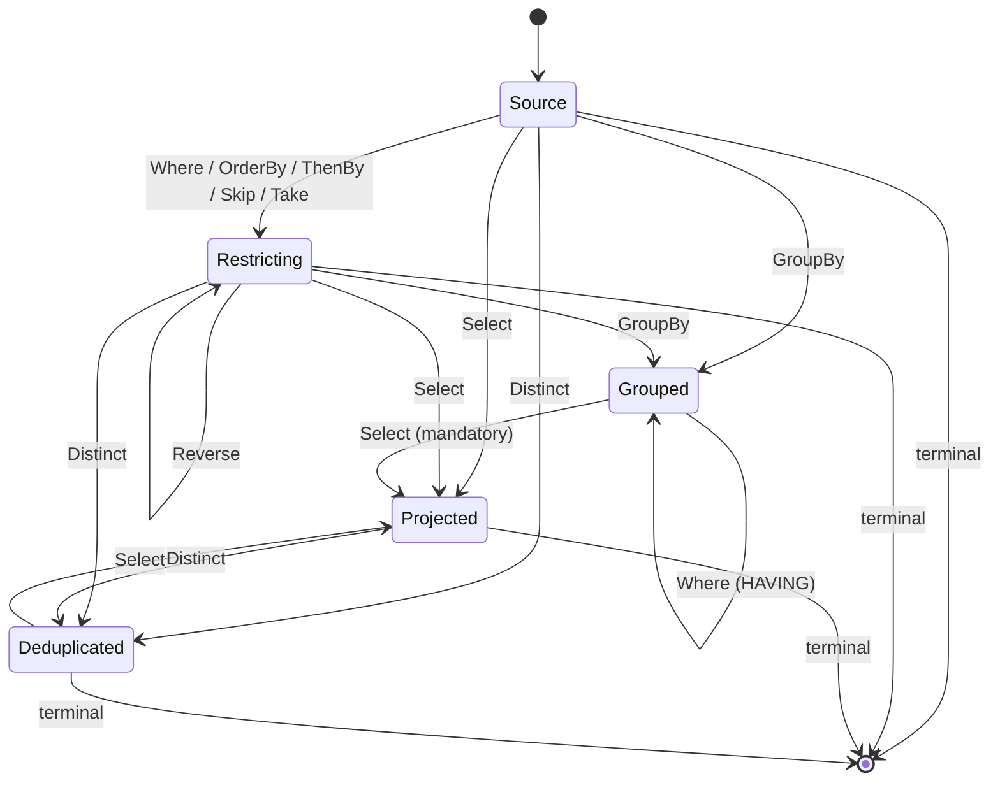

# Writing queries

Client queries are ordinary C# LINQ written against the generated query models. Nothing runs client-side: the expression tree is **captured**, translated to the [wire AST](wire-format.md), and sent to the server when a terminal operator is awaited.

<!-- snippet: clientQuery -->
<a id='snippet-clientQuery'></a>
```cs
employees = await Query.Employee
    .Where(_ => _.Active)
    .OrderBy(_ => _.Name)
    .Select(_ => new EmployeeRow(_.Name, _.Status, _.Manager!.Name, _.Department!.Name))
    .ToListAsync();
```
<sup><a href='/samples/Sample.Client/Pages/Index.razor.cs#L35-L41' title='Snippet source file'>snippet source</a> | <a href='#snippet-clientQuery' title='Start of snippet'>anchor</a></sup>
<!-- endSnippet -->

The supported surface is deliberately closed. Anything outside it fails fast with a clear `NotSupportedException` at translation time — before a request is ever sent.


## Entry points

The generated `ScryQuery` exposes one property per allow-listed source:

<!-- snippet: GeneratorTests.EntitiesViewPocoAndEnum#ScryQuery.g.verified.cs -->
<a id='snippet-GeneratorTests.EntitiesViewPocoAndEnum#ScryQuery.g.verified.cs'></a>
```cs
//HintName: ScryQuery.g.cs
// <auto-generated/>
#nullable enable
namespace Scry.Generated;

/// <summary>Entry point for writing LINQ queries against the allow-listed sources.</summary>
public sealed class ScryQuery
{
    /// <summary>
    /// A hash of the queryable surface this client was generated against. Attached to each
    /// request so the server can identify a client generated against a different model.
    /// </summary>
    public const string SchemaStamp = "2iosRX6CXtpmJbM0";

    readonly global::Scry.Client.ScryClient client;

    public ScryQuery(global::Scry.Client.ScryClient client)
    {
        this.client = client;
        client.SchemaStamp = SchemaStamp;
    }

    public global::System.Linq.IQueryable<EmployeeQueryModel> Employee =>
        client.Source<EmployeeQueryModel>("Employee", ["Id", "Name", "Status", "Active", "ManagerId", "Avatar"]);

    public global::System.Linq.IQueryable<EmployeeSummaryQueryModel> EmployeeSummary =>
        client.Source<EmployeeSummaryQueryModel>("EmployeeSummary", ["Department", "Headcount"]);

    public global::System.Linq.IQueryable<HolidayQueryModel> Holiday =>
        client.Source<HolidayQueryModel>("Holiday", ["Name", "Date"]);
}
```
<sup><a href='/src/Scry.SourceGenerator.Tests/GeneratorTests.EntitiesViewPocoAndEnum%23ScryQuery.g.verified.cs#L1-L31' title='Snippet source file'>snippet source</a> | <a href='#snippet-GeneratorTests.EntitiesViewPocoAndEnum#ScryQuery.g.verified.cs' title='Start of snippet'>anchor</a></sup>
<!-- endSnippet -->

Each returns an `IQueryable<T>` whose provider only captures. Enumerating it synchronously throws:

```
Use ToListAsync to execute a Scry query.
```

A source can also be reached by name, which is what the generated code does under the hood:

<!-- snippet: scryClientApi -->
<a id='snippet-scryClientApi'></a>
```cs
/// <summary>Creates a client that POSTs queries to an HTTP endpoint.</summary>
public static ScryClient ForHttp(HttpClient http, string endpoint) =>
    new(http, endpoint);

/// <summary>
/// Returns an <see cref="IQueryable{T}"/> backed by the named allow-listed source.
/// <paramref name="defaultProjection"/> is the source's scalar member names, passed by the
/// generated entry point so a query without a <c>Select</c> still projects explicitly.
/// </summary>
public IQueryable<T> Source<T>(string name, IReadOnlyList<string>? defaultProjection = null) =>
    new CaptureQueryable<T>(new(this, name, defaultProjection));
```
<sup><a href='/src/Scry.Client/ScryClient.cs#L20-L32' title='Snippet source file'>snippet source</a> | <a href='#snippet-scryClientApi' title='Start of snippet'>anchor</a></sup>
<!-- endSnippet -->


## Operators

| LINQ | Wire op | Notes |
| --- | --- | --- |
| `Where(predicate)` | `where` | Filters rows. Written after `GroupBy` it filters groups instead — see [below](#filtering-groups). Not allowed after `Select`. |
| `OrderBy(key)` / `OrderByDescending(key)` | `orderBy` | Key must be a scalar member. Not allowed after `GroupBy` or `Select`. |
| `ThenBy(key)` / `ThenByDescending(key)` | `thenBy` | Must follow an `OrderBy`. |
| `Skip(n)` | `skip` | `n` must be non-negative. |
| `Take(n)` | `take` | `n` must be non-negative and `<= MaxPageSize`. |
| `GroupBy(key)` | `groupBy` | Exactly one key, at most one `GroupBy`, and it must be followed by a `Select`. |
| `Select(projection)` | `select` | At most one, and it must construct an object. |
| `Distinct()` | `distinct` | Deduplicates the **projected** rows. Only the `Select` and a terminal may follow it. |
| `Reverse()` | `reverse` | Inverts the ordering. Requires a preceding `OrderBy`. |
| `Join(inner, …)` / `LeftJoin(inner, …)` | `join` | Joins a second source — see [below](#joins). Carries its own projection; only a terminal may follow. |

Any other LINQ operator — `Join`, `SelectMany`, `Union`, … — throws:

```
LINQ operator 'Join' is not supported by Scry.
```

[LINQ coverage](linq-coverage.md) tracks the full supported/unsupported matrix against what EF Core can translate.

Operators are applied left to right, exactly as written.


## Terminals

Terminals are `async` extension methods on `IQueryable<T>` from `Scry.Client`. Awaiting one is what sends the request.

| Method | Returns | Result kind |
| --- | --- | --- |
| `ToListAsync()` | `Task<List<T>>` | list |
| `ToArrayAsync()` | `Task<T[]>` | list |
| `ToHashSetAsync()` | `Task<HashSet<T>>` | list |
| `ToDictionaryAsync(keySelector[, elementSelector][, comparer])` | `Task<Dictionary<TKey, …>>` | list |
| `ToLookupAsync(keySelector[, elementSelector][, comparer])` | `Task<ILookup<TKey, …>>` | list |
| `FirstAsync([predicate])` | `Task<T?>` | single |
| `FirstOrDefaultAsync([predicate])` | `Task<T?>` | single |
| `SingleAsync([predicate])` | `Task<T?>` | single |
| `SingleOrDefaultAsync([predicate])` | `Task<T?>` | single |
| `LastAsync([predicate])` | `Task<T?>` | single |
| `LastOrDefaultAsync([predicate])` | `Task<T?>` | single |
| `ElementAtAsync(index)` | `Task<T?>` | single |
| `ElementAtOrDefaultAsync(index)` | `Task<T?>` | single |
| `CountAsync([predicate])` | `Task<int>` | scalar |
| `LongCountAsync([predicate])` | `Task<long>` | scalar |
| `AnyAsync([predicate])` | `Task<bool>` | scalar |
| `AllAsync(predicate)` | `Task<bool>` | scalar |
| `SumAsync(selector)` | `Task<TValue>` | scalar |
| `AverageAsync(selector)` | `Task<double>` / `Task<decimal>` | scalar |
| `MinAsync(selector)` / `MaxAsync(selector)` | `Task<TValue?>` | scalar |
| `ToPageAsync([pageSize])` | `Task<ScryPage<T>>` | page |
| `ToPageAsync(pageSize, cursor)` | `Task<ScryPage<T>>` | page |

A terminal predicate narrows the rows before the terminal does anything else — `CountAsync(_ => _.Active)` is `Where(_ => _.Active).CountAsync()`. It cannot be combined with a `Select`, since it reads the row rather than the projection.

`LastAsync` requires an ordered query: "last" is resolved by reversing the ordering, so an unordered query has no defined last row and is rejected. `ElementAtAsync` is `Skip` plus `First`, so an index past the end yields no row rather than an error.

The aggregate terminals fold the whole sequence. `SumAsync` and `AverageAsync` carry one overload per numeric type, mirroring `System.Linq` — the value the server computes has a type of its own, so an average over integers returns a `double`. `MinAsync`/`MaxAsync` return the selected type, and give the default when there are no rows (select a nullable — `MinAsync(_ => (decimal?)_.Amount)` — to tell "no rows" apart from a real zero).

`ToPageAsync` returns a bounded [page](paging.md): `Items`, `HasMore`, and a `Cursor`. Omitting `pageSize` uses the server's `DefaultPageSize`; any size is capped by `MaxPageSize`. Advance by **offset** (`Skip`, below) or by **keyset** — pass the previous page's `Cursor` back to seek past it:

<!-- snippet: clientPaging -->
<a id='snippet-clientPaging'></a>
```cs
// Offset paging: Skip to the start of the page, then take one page of rows. The response is
// a ScryPage — the rows plus HasMore, which the UI uses to enable or disable the Next button.
page = await Query.Employee
    .OrderBy(_ => _.Name)
    .Skip(pageIndex * pageSize)
    .Select(_ => new EmployeeRow(_.Name, _.Status, _.Department!.Name))
    .ToPageAsync(pageSize);
```
<sup><a href='/samples/Sample.Client/Pages/Paging.razor.cs#L22-L30' title='Snippet source file'>snippet source</a> | <a href='#snippet-clientPaging' title='Start of snippet'>anchor</a></sup>
<!-- endSnippet -->

or, resuming by cursor:

<!-- snippet: clientCursorPaging -->
<a id='snippet-clientCursorPaging'></a>
```cs
// Keyset paging: pass the previous page's opaque Cursor to resume exactly past its last row.
// The query must be ordered; the server seeks (WHERE Name > … ORDER BY Name, Id) instead of
// counting an offset, so it stays fast and stable as rows are added or removed.
page = await Query.Employee
    .OrderBy(_ => _.Name)
    .Select(_ => new EmployeeRow(_.Name, _.Status, _.Department!.Name))
    .ToPageAsync(pageSize, from);
```
<sup><a href='/samples/Sample.Client/Pages/KeysetPaging.razor.cs#L22-L30' title='Snippet source file'>snippet source</a> | <a href='#snippet-clientCursorPaging' title='Start of snippet'>anchor</a></sup>
<!-- endSnippet -->

Keyset paging needs an ordered, [seek-safe](paging.md#the-seek-safe-rule) query; otherwise `Cursor` is null and paging falls back to offset. The [sample](sample.md) shows both an offset page and a cursor page.

The collection-shaping terminals (`ToArrayAsync`, `ToHashSetAsync`, `ToDictionaryAsync`, `ToLookupAsync`) all send the same **list** request as `ToListAsync` and reshape the returned rows in memory — there is no streaming wire, so their key/element selectors and comparers run client-side over the materialised result.

Each takes an optional `CancellationToken`. There are no predicate overloads on the client — filter with `Where` first:

```cs
var count = await Query.Employee
    .Where(_ => _.Active)
    .CountAsync();
```

`FirstAsync` and `SingleAsync` are declared as `Task<T?>` even though the server throws when the sequence is empty; the nullable return covers the `OrDefault` variants without a second signature.

There is one non-executing terminal, used by tooling such as the [explorer](explorer.md):

<!-- snippet: translateWithoutExecuting -->
<a id='snippet-translateWithoutExecuting'></a>
```cs
var request = client.Source<Employee>("Employee")
    .Where(_ => _.Active &&
                _.Status == wanted &&
                _.Name.StartsWith(prefix))
    .OrderBy(_ => _.Name)
    .Take(take)
    .Select(_ => new EmployeeRow(_.Name, _.Status, _.Manager!.Name))
    .ToScryRequest();
```
<sup><a href='/src/Scry.Tests/ClientRoundTripTests.cs#L32-L41' title='Snippet source file'>snippet source</a> | <a href='#snippet-translateWithoutExecuting' title='Start of snippet'>anchor</a></sup>
<!-- endSnippet -->

which produces the wire request without contacting the server.


## Expressions

Everything below may appear inside a `Where` predicate, an ordering key, a group key, an aggregate selector, or a projection leaf, subject to the position rules further down.


### Member access

A path rooted at the lambda parameter, traversing reference navigations:

```cs
.Where(_ => _.Manager!.Department!.Name == "Engineering")
```

becomes the member path `["Manager", "Department", "Name"]`. Path length is capped by `MaxNavigationDepth` (default 4). Collection navigations are not exposed at all, so there is no way to express a traversal into one.

A `[QueryableComplex]` member (an EF complex type, e.g. one mapped to a JSON column) is traversed the same way — `.Where(_ => _.Address.City == "London")` becomes `["Address", "City"]`. The server rebinds it onto EF, which translates the access into the JSON column; nothing about the storage is visible on the wire.


### Operators

<!-- snippet: wireBinaryOps -->
<a id='snippet-wireBinaryOps'></a>
```cs
/// <summary>Binary operators allowed in a predicate or projection expression.</summary>
public enum BinaryOp
{
    Equal,
    NotEqual,
    LessThan,
    LessThanOrEqual,
    GreaterThan,
    GreaterThanOrEqual,
    AndAlso,
    OrElse,
    Add,
    Subtract,
    Multiply,
    Divide,
    Modulo,
    Coalesce
}

/// <summary>Unary operators allowed in an expression.</summary>
public enum UnaryOp
{
    Not,
    Negate
}
```
<sup><a href='/src/Scry.Wire/BinaryOp.cs#L3-L29' title='Snippet source file'>snippet source</a> | <a href='#snippet-wireBinaryOps' title='Start of snippet'>anchor</a></sup>
<!-- endSnippet -->

C# `==`, `!=`, `<`, `<=`, `>`, `>=`, `&&`, `||`, `+`, `-`, `*`, `/`, `%`, `??`, `!`, and unary `-` map onto these, and `?:` becomes a `conditional` node. `+` over two strings is concatenation — the wire records the operator, never the method, so the server reconstructs it from the operand types. Any other operator (`&`, `|`, `^`, `<<`, `>>`) throws:

```
Binary operator 'ExclusiveOr' is not supported by Scry.
```

`??` requires a nullable left operand, and the two branches of a `?:` must have the same type; both are checked server-side when the expression is rebound.

`string.Concat` and an **interpolated string** both mean that same `+`. An interpolated string lowers to `string.Format` inside an expression tree, which no provider translates, so a plain-hole interpolation is rewritten into the concatenation it is equivalent to. A hole carrying alignment or a format specifier (`$"{_.Amount:N2}"`) is rejected — it would change the value, and the database has no equivalent spelling — as is a non-string hole, whose conversion has no single spelling across providers.

`Convert` / `ConvertChecked` nodes — which the C# compiler inserts freely around enums, nullables, and numeric widening — are transparently unwrapped rather than encoded.


### Functions

<!-- snippet: wireFunctions -->
<a id='snippet-wireFunctions'></a>
```cs
/// <summary>The closed set of functions a client may call on a value. No free-form method names.</summary>
public enum KnownFunction
{
    StringContains,
    StringStartsWith,
    StringEndsWith,
    StringToLower,
    StringToUpper,
    StringIsNullOrEmpty,
    StringIsNullOrWhiteSpace,
    StringLength,
    StringTrim,
    StringTrimStart,
    StringTrimEnd,
    StringSubstring,
    StringIndexOf,
    StringReplace,
    DateYear,
    DateMonth,
    DateDay,
    DateHour,
    DateMinute,
    DateSecond,
    DateMillisecond,
    DateDayOfYear,
    DateDate,
    DateAddYears,
    DateAddMonths,
    DateAddDays,
    DateAddHours,
    DateAddMinutes,
    DateAddSeconds,
    MathAbs,
    MathCeiling,
    MathFloor,
    MathRound,
    MathTruncate,
    MathSqrt,
    MathPow,

    /// <summary>
    /// Membership of a client-supplied set (SQL <c>IN</c>). The target is the value being tested and
    /// every argument is a <see cref="ConstNode"/>; the server caps the number of values.
    /// </summary>
    In
}
```
<sup><a href='/src/Scry.Wire/KnownFunction.cs#L3-L50' title='Snippet source file'>snippet source</a> | <a href='#snippet-wireFunctions' title='Start of snippet'>anchor</a></sup>
<!-- endSnippet -->

Mapped from:

| C# | Function |
| --- | --- |
| `text.Contains(value)` | `StringContains` |
| `text.StartsWith(value)` | `StringStartsWith` |
| `text.EndsWith(value)` | `StringEndsWith` |
| `text.ToLower()` / `text.ToUpper()` | `StringToLower` / `StringToUpper` |
| `string.IsNullOrEmpty(text)` | `StringIsNullOrEmpty` |
| `string.IsNullOrWhiteSpace(text)` | `StringIsNullOrWhiteSpace` |
| `text.Length` | `StringLength` |
| `text.Trim()` / `text.TrimStart()` / `text.TrimEnd()` | `StringTrim` / `StringTrimStart` / `StringTrimEnd` |
| `text.Substring(start[, length])` | `StringSubstring` |
| `text.IndexOf(value)` | `StringIndexOf` |
| `text.Replace(from, to)` | `StringReplace` |
| `date.Year` / `.Month` / `.Day` | `DateYear` / `DateMonth` / `DateDay` |
| `date.Hour` / `.Minute` / `.Second` / `.Millisecond` | `DateHour` / `DateMinute` / `DateSecond` / `DateMillisecond` |
| `date.DayOfYear` | `DateDayOfYear` |
| `date.Date` | `DateDate` |
| `date.AddYears(n)` / `.AddMonths(n)` / `.AddDays(n)` | `DateAddYears` / `DateAddMonths` / `DateAddDays` |
| `date.AddHours(n)` / `.AddMinutes(n)` / `.AddSeconds(n)` | `DateAddHours` / `DateAddMinutes` / `DateAddSeconds` |
| `Math.Abs(value)` | `MathAbs` |
| `Math.Ceiling(value)` / `Math.Floor(value)` | `MathCeiling` / `MathFloor` |
| `Math.Round(value[, digits])` | `MathRound` |
| `Math.Truncate(value)` | `MathTruncate` |
| `Math.Sqrt(value)` / `Math.Pow(value, exponent)` | `MathSqrt` / `MathPow` |
| `set.Contains(_.Member)` | `In` |

The date functions apply to `DateTime`, `DateOnly`, `DateTimeOffset`, and `TimeOnly`, and an optional member is unwrapped before the part is read. Only the parts a type actually has are available: asking for the `Hour` of a `DateOnly` is rejected. The trim functions map only the whitespace-trimming overloads — the `params char[]` forms have no SQL equivalent.

There is no free-form method call node in the wire format, so this list is the complete set of behaviour a client can ask the database to perform. **Provider support is still the outer bound**: a function only reaches SQL if the EF provider translates it, which is why `DayOfWeek` — which SQL Server's provider does not translate — has no entry.

Functions are **expression-level**: they read a row inside a `Where` predicate, an ordering or group key, a terminal predicate, an aggregate selector, or a [projection member](#computed-projection-members).


### Joins

A second source can be joined in, naming it exactly as a query names its own root:

```cs
await Query.Employee
    .Where(_ => _.Active)
    .Join(
        Query.Department.Where(_ => _.Name != "Archive"),
        employee => employee.DepartmentId,
        department => department.Id,
        (employee, department) => new Row(employee.Name, department.Name))
    .ToListAsync();
```

`LeftJoin` keeps every outer row, with nulls where the inner side has no match. A value read from the inner side of a left join comes back nullable, so an unmatched row yields null rather than a fault.

**Each side is resolved and [policy-filtered](policies.md) independently, before the two meet.** A join is therefore only ever narrowing: no row that a direct query of the inner source would hide is observable through one. That is what makes the operator safe to expose at all.

Three rules follow from the joined row having two roots:

- The join **carries its own projection**, rather than being followed by a `Select`. A projected member has to say which side it reads, and an ordinary member path has no room to.
- Only `Count`, `LongCount`, `Any`, `First`, and `Single` may follow a join. Every other operator is single-rooted and could not name a side.
- Only `Where` crosses into the inner side. Ordering, paging, and grouping there would describe rows the join has already consumed, so filter each side first and join last.

Each side is validated against its own allow-list: a `[QueryIgnore]`d member stays hidden on both, and naming an outer member on the inner side is rejected. The two key selectors must produce the same type.


### Collection subqueries

A collection navigation opted in with [`[QueryableCollection]`](annotations.md#collections) can be asked a question, which the database answers as a correlated subquery:

```cs
await Query.Department
    .Where(_ => _.Employees.Any(e => e.Status == Status.Contractor))
    .Select(_ => new DepartmentRow(_.Name, _.Employees.Count(e => e.Active)))
    .ToListAsync();
```

| C# | Meaning |
| --- | --- |
| `_.Items.Any()` / `.Any(predicate)` | Whether the collection has any matching element. |
| `_.Items.All(predicate)` | Whether every element matches. True for an empty collection, as in LINQ. |
| `_.Items.Count()` / `.Count(predicate)` / `.Count` | How many elements match. |
| `_.Items.Sum(selector)` / `.Average(selector)` | Folded over the elements. |
| `_.Items.Min(selector)` / `.Max(selector)` | Null over an empty collection rather than a fault. |

A `Where` may precede any of them — `_.Items.Where(i => i.Active).Count()` — and folds into the subquery's own filter.

The result is always a **scalar**, so a subquery can appear anywhere a value can: a predicate, an ordering key, a projection leaf, an aggregate selector. What it cannot do is return rows. A collection is never projectable, never traversable in a member path (`_.Items.Name` is rejected), and a subquery may not appear inside another subquery — the cost is per-row and would compound. Inside the subquery, the predicate and selector read the collection's *element*, against that type's own allow-list.


### Set membership

`Contains` over a client-side collection becomes a SQL `IN`:

```cs
var wanted = new[] { "Engineering", "Sales" };

await Query.Employee
    .Where(_ => wanted.Contains(_.Department!.Name))
    .ToListAsync();
```

The collection must be closure state — it is evaluated on the client and its values ride the wire as constants — and the tested value must come from the row. The number of values is capped by [`MaxInValues`](server.md#limits) (default 1000). An empty collection matches nothing.


### Constants and captured values

Literals become constants. So does **any sub-expression that does not reference the lambda parameter** — it is evaluated on the client and sent as a constant. That is what makes a query parameterizable at runtime:

<!-- snippet: clientClosureCapture -->
<a id='snippet-clientClosureCapture'></a>
```cs
fullTimers = await Query.Employee
    .Where(_ => _.Status == status)
    .OrderBy(_ => _.Name)
    .Take(top)
    .Select(_ => new EmployeeRow(_.Name, _.Status, _.Manager!.Name, _.Department!.Name))
    .ToListAsync();
```
<sup><a href='/samples/Sample.Client/Pages/Index.razor.cs#L50-L57' title='Snippet source file'>snippet source</a> | <a href='#snippet-clientClosureCapture' title='Start of snippet'>anchor</a></sup>
<!-- endSnippet -->

`status` and `top` are locals; the translator compiles and invokes those sub-expressions, then emits their values. Calls to custom methods are fine on this path as long as they do not touch the query parameter — `.Where(_ => _.Name == BuildName())` sends the *result* of `BuildName()`.

A constant is carried as an invariant-culture string plus a type tag, and reconciled against the member type at the comparison site on the server. Enums travel as their **name**, not their numeric value.


## Projections

A `Select` must construct an object. Anonymous types, records, and object initializers all work:

```cs
.Select(_ => new { _.Name, Manager = _.Manager!.Name })
.Select(_ => new EmployeeRow(_.Name, _.Status, _.Manager!.Name, _.Department!.Name))
.Select(_ => new EmployeeRow { Name = _.Name, Department = _.Department!.Name })
```

Projecting a bare value does not work:

```cs
.Select(_ => _.Name) // NotSupportedException
```

```
A projection must construct an object (anonymous type, record, or object initializer).
```

For a record or constructor call, member names come from the constructor parameter names, capitalized — `new EmployeeRow(name: ...)` produces the member `Name`.

Every projection leaf must resolve to an allow-listed **scalar**. A navigation cannot be projected whole; project a scalar out of it (`_.Department!.Name`).


### Computed projection members

A leaf can be any expression, not only a member path — the same vocabulary a predicate is built from, computed by the database and returned as a column:

```cs
.Select(_ => new
{
    Shouted = _.Name.ToUpper(),
    Net = _.Amount - (_.Discount ?? 0m),
    Band = _.Amount > 100m ? "large" : "small",
    Label = _.Region + " / " + _.Name
})
```

The same allow-list applies inside a computed leaf as anywhere else: a `[QueryIgnore]`d member is no more reachable through an expression than through a plain path, and the expression-depth limit still holds.

This holds inside a [nested object](#nested-result-objects) too — the navigation it descends into is inferred from the paths an expression reads, wherever they sit inside it:

```cs
.Select(_ => new EmployeeCard(_.Name, new(_.Department!.Name.ToUpper())))
```

One restriction: a leaf must **read at least one member of the row**. `Select(_ => new { Kind = "employee" })` is rejected — the client already has that value, and EF refuses a constant in a client projection.

A **grouped** `Select` composes the same way, over what a group has: its key and aggregates.

```cs
.Select(_ => new RegionSummary(_.Key.ToUpper(), _.Sum(_ => _.Amount) / _.Count()))
```

That does not widen what a group can read. Every column but the key has been folded away, so naming one — even buried inside an expression — is still rejected.


### Without a `Select`

A query with no `Select` returns every allow-listed **scalar** member of the source. Navigations are excluded, and so is anything `[QueryIgnore]`d — which is why the default projection of `Employee` never contains `Salary`.

The projection is still explicit on the wire. The generated entry point knows those scalar members, so the client fills them in rather than leaving the server to choose, and the response comes back keyed by the names the client was generated with — which is what makes a member rename survivable ([Renaming](annotations.md#renaming)). A request that genuinely names no members, such as a hand-built one, falls back to the server picking them.


### Nested result objects

Projecting a **constructed object** into a navigation nests the result under that member instead of flattening it. Write the nested shape as an ordinary object construction whose members read through the navigation:

<!-- snippet: clientNestedProjection -->
<a id='snippet-clientNestedProjection'></a>
```cs
// Projecting into the Department navigation builds a nested result object rather than
// flattening it — the response is { Name, Department: { Name } }.
cards = await Query.Employee
    .Where(_ => _.Active)
    .OrderBy(_ => _.Name)
    .Select(_ => new EmployeeCard(_.Name, new DepartmentCard(_.Department!.Name)))
    .ToListAsync();
```
<sup><a href='/samples/Sample.Client/Pages/Index.razor.cs#L61-L69' title='Snippet source file'>snippet source</a> | <a href='#snippet-clientNestedProjection' title='Start of snippet'>anchor</a></sup>
<!-- endSnippet -->

The client factors the shared navigation (`_.Department`) out of the nested members and emits a `NestedValue` in the wire AST; the server descends the navigation and shapes the leaves under it, producing nested JSON:

<!-- snippet: ExecutionTests.WhereOrderByNestedProjection.verified.txt -->
<a id='snippet-ExecutionTests.WhereOrderByNestedProjection.verified.txt'></a>
```txt
{
  "version": 1,
  "kind": "List",
  "payload": [
    {
      "name": "Aaron",
      "managerName": "Alice",
      "department": {
        "name": "Engineering"
      }
    },
    {
      "name": "Alice",
      "managerName": null,
      "department": {
        "name": "Engineering"
      }
    }
  ],
  "stamp": "{scrubbed stamp}"
}
```
<sup><a href='/src/Scry.Tests/ExecutionTests.WhereOrderByNestedProjection.verified.txt#L1-L21' title='Snippet source file'>snippet source</a> | <a href='#snippet-ExecutionTests.WhereOrderByNestedProjection.verified.txt' title='Start of snippet'>anchor</a></sup>
<!-- endSnippet -->

Rules for a nested projection member:

- Every member of the nested object must resolve to a **scalar** — a member path (`_.Department.Name`) or an [expression over one](#computed-projection-members) (`_.Department.Name.ToUpper()`), but not a further nested object. One level of nesting.
- All its members must share a single navigation prefix; the client descends into that one navigation. Mixing two navigations (`new(_.Department.Name, _.Manager.Name)`) in one nested object is rejected.
- The flat form still works when only the value is needed — `Department = _.Department!.Name` gives a flat column instead of a nested object.


## Grouping and aggregates

`GroupBy` must be followed by `Select`, and that projection may reference **only** the group key and aggregates:

<!-- snippet: clientGroupBy -->
<a id='snippet-clientGroupBy'></a>
```cs
regions = await Query.Order
    .GroupBy(_ => _.Region)
    .Select(_ => new RegionSummary(_.Key, _.Sum(_ => _.Amount), _.Count()))
    .ToListAsync();
```
<sup><a href='/samples/Sample.Client/Pages/Index.razor.cs#L43-L48' title='Snippet source file'>snippet source</a> | <a href='#snippet-clientGroupBy' title='Start of snippet'>anchor</a></sup>
<!-- endSnippet -->

<!-- snippet: wireAggregates -->
<a id='snippet-wireAggregates'></a>
```cs
/// <summary>
/// Aggregate functions, used either in a projection over a grouped query or as a terminal folding
/// the whole sequence to one scalar. <see cref="Count"/> is grouped-projection only — counting a
/// sequence has its own terminal.
/// </summary>
public enum AggregateFn
{
    Count,
    Sum,
    Average,
    Min,
    Max
}
```
<sup><a href='/src/Scry.Wire/AggregateFn.cs#L3-L17' title='Snippet source file'>snippet source</a> | <a href='#snippet-wireAggregates' title='Start of snippet'>anchor</a></sup>
<!-- endSnippet -->

| C# | Aggregate |
| --- | --- |
| `_.Count()` | `Count` |
| `_.Sum(_ => _.Amount)` | `Sum` |
| `_.Average(_ => _.Amount)` | `Average` |
| `_.Min(_ => _.Amount)` | `Min` |
| `_.Max(_ => _.Amount)` | `Max` |

Constraints:

- Exactly one group key, and it must be a member access.
- `OrderBy` and `ThenBy` are not allowed after `GroupBy`; a `Where` after it is a [group filter](#filtering-groups).
- The key and aggregates may be [composed into expressions](#computed-projection-members) — `_.Sum(…) / _.Count()`.
- Nested projections are not allowed in a grouped `Select`.
- Referencing a non-key member throws `A predicate after GroupBy may only reference the group key or aggregates.`, whether it is named directly or buried in an expression.
- An aggregate written *inside a projection* is only valid in a grouped `Select`; elsewhere it is rejected with `Aggregates are only allowed in a Select following GroupBy.`

To aggregate a whole sequence rather than each group, use the [aggregate terminals](#terminals) — `SumAsync`, `AverageAsync`, `MinAsync`, `MaxAsync` — which need no `GroupBy` and must precede any `Select`.


### Filtering groups

A `Where` written **after** a `GroupBy` filters the groups rather than the rows — SQL `HAVING`:

```cs
await Query.Order
    .GroupBy(_ => _.Region)
    .Where(_ => _.Count() > 1 && _.Sum(_ => _.Amount) > 100m)
    .Select(_ => new RegionSummary(_.Key, _.Sum(_ => _.Amount), _.Count()))
    .ToListAsync();
```

Its predicate reads a group, so — exactly like the grouped `Select` — it may name only the group key and aggregates. Every other column has been folded away by the grouping, and naming one is rejected:

```
A predicate after GroupBy may only reference the group key or aggregates.
```

Several group filters conjoin, so `.Where(…).Where(…)` after a `GroupBy` means both. A `Where` written *before* the `GroupBy` still filters rows in the ordinary way, and the two compose as they do in SQL: row filters narrow what is grouped, group filters narrow what the grouping produced.


## Ordering rules

The pipeline is validated as a whole. In order:

1. `Where`, `OrderBy`/`ThenBy`, `Skip`, `Take` — any number, in any order, before grouping, projection, or deduplication.
2. At most one `GroupBy`, which must precede the `Select`.
3. At most one `Select`.
4. At most one `Distinct`, after which only the `Select` and a terminal may follow.
5. At most one terminal, and nothing after it.

The legal operator orderings form a small state machine — every absent edge is an illegal ordering:<!-- include: pipeline-order. path: /docs/includes/pipeline-order.include.md -->



Nothing orders, skips, or takes after `GroupBy`; a `GroupBy` cannot reach a terminal without a
`Select` in between; and there is no second `GroupBy` or `Select`. A `Where` after `GroupBy` is the
one exception — it filters the groups rather than the rows, and reads only the key and aggregates.
`ThenBy` and `Reverse` without a preceding `OrderBy` are rejected, and nothing may follow a terminal.

`Distinct` deduplicates the projected rows, so the only thing that may follow it is the `Select` it
deduplicates and a terminal. Filtering or ordering after it would be describing the rows that fed it,
and paging after it would be slicing an order that a deduplication cannot preserve.<!-- endInclude -->


## Errors

| Where | Type | When |
| --- | --- | --- |
| Client, at translation | `NotSupportedException` | The LINQ cannot be expressed in the wire AST. Nothing is sent. |
| Client, on response | `ScryRequestException` | The server returned a non-success status. Carries `StatusCode` and `Body`. |
| Client, on response | `ScryWireException` | The response could not be deserialized, or its result kind did not match the terminal. |
| Server, during validation | `ScryValidationException` → `400` | The request violates the allow-list or a limit. |

See [Server](server.md#error-handling) for the response bodies.

A deployed client can also drift from the server's model over time — see [Schema versioning](schema-versioning.md) for detecting a stale client.


## Future enhancements

- **Streaming results (`ToAsyncEnumerable`).** The wire currently carries each query result as a single response, so there is nothing to enumerate incrementally. `ToAsyncEnumerable` therefore throws `NotSupportedException` for now; use `ToListAsync`. A streaming wire (chunked or paged transport that yields rows as they arrive) is the intended way to make it real, at which point the terminal would stream rather than buffer.
