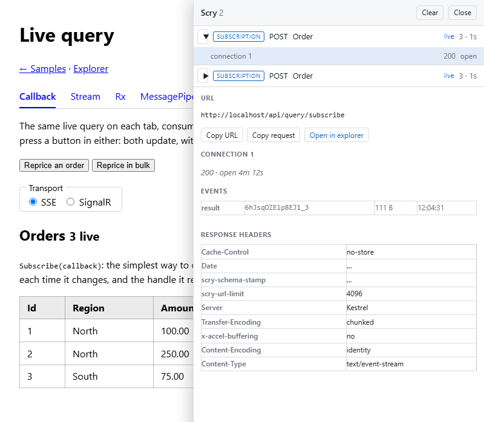

# Debug sidecar

`Scry.Client` ships an opt-in debug sidecar for Blazor apps. It is the one part of the client that is tied to a
host: the sidecar is a Razor component, so a WPF, Windows Forms, or console client has no equivalent — everything
else in `Scry.Client` works the same everywhere, as [Client hosts](clients.md) sets out. The panel opens on the right of the running page and lists every Scry exchange the app has made — the wire request decoded and pretty-printed (including GET URLs, whose `q=` parameter is otherwise an opaque base64url blob), the response pretty-printed, and the request and response headers. A [live query](live-queries.md) is listed as the session it is, with its connections under it and every event that came back.


Toggle it with <kbd>Alt</kbd>+<kbd>Q</kbd> (configurable), or with the small floating **Scry** button in the page's corner. While closed it renders nothing beyond that button — and with the button turned off, nothing at all.


## Enabling it

Register the sidecar's services and attach its capture handler to the named client Scry uses:

<!-- snippet: sidecarRegistration -->
<a id='snippet-sidecarRegistration'></a>
```cs
builder.Services.AddScrySidecar();
builder.Services
    .AddHttpClient("scry")
    .AddHttpMessageHandler<ScrySidecarHandler>();
```
<sup><a href='/samples/Sample.WebClient/Program.cs#L46-L51' title='Snippet source file'>snippet source</a> | <a href='#snippet-sidecarRegistration' title='Start of snippet'>anchor</a></sup>
<!-- endSnippet -->

Then render the panel once, above the router:

<!-- snippet: sidecarMarkup -->
<a id='snippet-sidecarMarkup'></a>
```razor
<ScrySidecar />
```
<sup><a href='/samples/Sample.WebClient/App.razor#L2-L4' title='Snippet source file'>snippet source</a> | <a href='#snippet-sidecarMarkup' title='Start of snippet'>anchor</a></sup>
<!-- endSnippet -->

The handler is attached explicitly rather than automatically so the sidecar observes exactly the client the app points it at, not every `HttpClient` in the container. If the app also uses the [caching handler](caching.md), register the sidecar's handler after it — what it records is then the real wire exchange, the `If-None-Match` request and the raw 304, rather than the cache's replay.


## Options

<!-- snippet: sidecarOptions -->
<a id='snippet-sidecarOptions'></a>
```cs
/// <summary>
/// Whether exchanges are captured and the panel responds to its shortcut. On by default —
/// turn it off for builds where a query log over the wire traffic is unwanted.
/// </summary>
public bool Enabled { get; set; } = true;

/// <summary>
/// The keyboard shortcut that opens and hides the panel, as modifier tokens plus a key
/// (for example <c>"Ctrl+Shift+D"</c>). An unrecognized value falls back to the default.
/// </summary>
public string ToggleShortcut { get; set; } = "Alt+Q";

/// <summary>
/// Decides whether the small floating button is shown in the page's corner while the panel
/// is closed, as a clickable alternative to the shortcut. Shown to everyone by default —
/// set <see cref="Never"/> to rely on the shortcut alone, or an own predicate to decide from
/// the current context (the signed-in user, say). Evaluated once, when the panel first loads.
/// </summary>
public Func<IServiceProvider, ValueTask<bool>> ToggleButton { get; set; } = Always;

/// <summary>
/// Where the query explorer is mapped, for the "open in explorer" action on a captured
/// query. Null hides the action.
/// </summary>
public string? ExplorerRoute { get; set; } = "/scry";

/// <summary>
/// Captured entries kept; the oldest is evicted beyond this. A live query still open is never
/// the one evicted — its row is the one thing still being written to.
/// </summary>
public int MaxEntries { get; set; } = 100;

/// <summary>
/// How often a live query's row may redraw while it is open, and how often the times it shows
/// are brought up to date. A floor on the work, not a wait for quiet: a live query answering
/// steadily still redraws at this rate rather than never.
/// </summary>
public TimeSpan LiveRefresh { get; set; } = TimeSpan.FromMilliseconds(500);

/// <summary>
/// Events kept per connection of a live query, heartbeats included; the oldest is dropped
/// beyond this, and the row says how many went.
/// </summary>
public int MaxSubscriptionEvents { get; set; } = 200;

/// <summary>
/// Answers whose body is kept for display, per connection, most recent first. A connection that
/// has been superseded keeps only its last — what an older connection answered is history the
/// moment a newer one has answered too.
/// </summary>
public int MaxRetainedAnswers { get; set; } = 3;

/// <summary>
/// The largest answer whose body is kept. A longer one is listed with its size, and the panel
/// says so rather than showing part of it as though it were the whole.
/// </summary>
public int MaxRetainedAnswerBytes { get; set; } = 16 * 1024;

/// <summary>
/// The client the attachment download action re-sends with. Defaults to a plain
/// <see cref="HttpClient"/>, which is enough because captured URLs are absolute — supply
/// one when the fetch needs the app's handler pipeline (an auth header, say).
/// </summary>
public Func<IServiceProvider, HttpClient>? DownloadClient { get; set; }
```
<sup><a href='/src/Scry.Client/Sidecar/ScrySidecarOptions.cs#L10-L75' title='Snippet source file'>snippet source</a> | <a href='#snippet-sidecarOptions' title='Start of snippet'>anchor</a></sup>
<!-- endSnippet -->

Capture is on by default once wired. `Enabled = false` makes the sidecar fully inert: nothing is captured, no key listener is registered, nothing renders — wire it behind an environment check for builds where a query log is unwanted.

The shortcut is worth overriding where <kbd>Alt</kbd>+<kbd>Q</kbd> collides with a browser, keyboard-layout, or assistive-technology binding.

`ToggleButton` decides whether the floating button is shown while the panel is closed. Shown to everyone by default — the discoverable way in, and the only way on a touch device; the panel's own **Close** button hides an open panel either way. `ScrySidecarOptions.Never` removes it, leaving the shortcut as the only way in:

```cs
builder.Services.AddScrySidecar(_ => _.ToggleButton = ScrySidecarOptions.Never);
```

Because it is a predicate over the app's services, the answer can come from the current context — for example, showing the button only to a signed-in developer:

```cs
builder.Services.AddScrySidecar(
    _ => _.ToggleButton = async services =>
    {
        var provider = services.GetRequiredService<AuthenticationStateProvider>();
        var state = await provider.GetAuthenticationStateAsync();
        return state.User.IsInRole("developer");
    });
```

The predicate is evaluated once, when the panel first loads. An answer that should change mid-session — a user signing in after the app booted — belongs on the markup instead: render `<ScrySidecar />` inside the condition (an `<AuthorizeView>`, say), and the component is created and torn down with it, re-asking everything as it comes and goes.


## What is captured — and what deliberately is not

- **Queries and batches** are recorded whole: the decoded request, the pretty-printed response, and both header sets. Their bodies are safe to buffer because the client buffers them itself.
- **Streams** are recorded as status and headers only. A streamed result is meant to be read a row at a time; buffering it to display it would stall the read.
- **Live queries** are recorded as one entry each, however many connections it took to hold one open, with every event that came back. A [live query](live-queries.md)'s response has no end to buffer up to, so it is watched as it flows instead — see [Live queries](#live-queries) below.
- **Commands** are recorded as one entry each, named by the command: the request, and the receipt where the command was answered at once. One answered as a stream of receipts is recorded to its headers, since the client reads the stream above the handler, and asking for it again by its id folds into the same row. Its state — sent, pending, completed, failed, unknown — is what the client reported, where the store observes the client. The capabilities read is listed as a command exchange about no one command.
- **Attachments** are recorded as status, headers, and the *request* body. The bytes themselves are never cached — the **Download** action re-sends the captured request and hands the fresh bytes to the browser, so the server's policies answer every download anew. Supply `DownloadClient` when that re-send needs the app's handler pipeline (an auth header, say).
- **Sensitive constants are shown.** A query comparing a `[Sensitive]` member against a constant travels as a POST body, and the panel shows bodies — the sidecar is a devtools-grade view of the app's own traffic, so wire it only in builds where opening the network tab would be equally acceptable.

One logical query is not always one entry: a GET the server refuses as URL-borne is retried as a POST, so it appears twice; a batch collapses several queries into one entry. A live query goes the other way — one entry however many times it had to reconnect.


## Live queries

A [live query](live-queries.md) is not an exchange but a session, and its row says so. In place of a status and a latency — which after the first moment describe a handshake rather than the thing — it shows what state the live query is in, how many answers have arrived, and how long since anything last did. That last number is the one that distinguishes a live query that is idle from one that is hung: the server pings an idle connection, so a row whose last event is seconds old is healthy however long it has been since it last had something to say.




Expand the row and its connections are listed under it, newest first, each with what it resumed from and how it finished — `end` with the server's own reason, or `cut` where it stopped without saying anything. Select one and its event timeline is shown: every `result` with the identifier the next connection will send back and its size, every `ping` and `unchanged` heartbeat, and the closing event. Select a `result` and the answer itself is shown, for the recent ones still kept.

Reading the body cannot be allowed to hold the consumer up, so nothing is buffered: each read is handed straight back and a copy is framed on the way past. What the consumer has not asked for is not read, so the panel shows what the app saw rather than what the socket held.

What is kept is bounded, because a live query can be open for days: `MaxSubscriptionEvents` per connection, `MaxRetainedAnswers` answers kept with their bodies, and `MaxRetainedAnswerBytes` each — a longer answer is listed with its size instead. A connection superseded by a newer one keeps only its last answer. An open live query is never the entry evicted to stay within `MaxEntries`.

A live query the server refuses is not a stream at all, so it is recorded like any other failure, with the server's reason.


### Live queries the sidecar cannot see

The sidecar observes the `HttpClient` it is attached to. A client built over `ScrySignalRClient` carries its live queries on a hub connection instead, so none of that reaches the handler. Hand the store the client and they are listed anyway:

```cs
var store = services.GetRequiredService<ScrySidecarStore>();
store.Observe(client);
```

`Observe` mirrors what the client itself knows about its live queries: the states, the answers, and which attempt it is on. For a live query carried on a hub that is the whole account — there are no connections, no event identifiers and no sizes, and the row says so. For one over HTTP it is the authoritative half of an account the wire already fills in: without it a live query is still listed, still folds its reconnects into one row and still shows every event, but the gap between two connections reads as `retry` without the client having confirmed it is really going to ask again.

`Observe` lists the client's [commands](commands.md) the same way, from `CommandActivity`: a command sent over a hub never reaches the handler, and one sent over HTTP gets the client's own account of its outcome on the row the exchange added. The two are one row, keyed by the command's id.

It is separate from `AddScrySidecar` because the app builds its own `ScryClient` — registration has nothing to attach it to.


## Open in explorer

Every captured query whose request can be rendered back into C# gets an **Open in explorer** action: a new tab at the [query explorer](explorer.md) with the editor pre-populated, via the explorer's own share-link format — the snippet travels in the URL fragment, which never reaches a server.

The action is hidden when the request cannot be faithfully re-spelled as a snippet the explorer accepts, and always for queries carrying a `[Sensitive]` constant — the constant is the secret, and a link is a shareable artifact.

Point `ExplorerRoute` at wherever `MapScryExplorer` is mapped, or set it null to hide the action.
