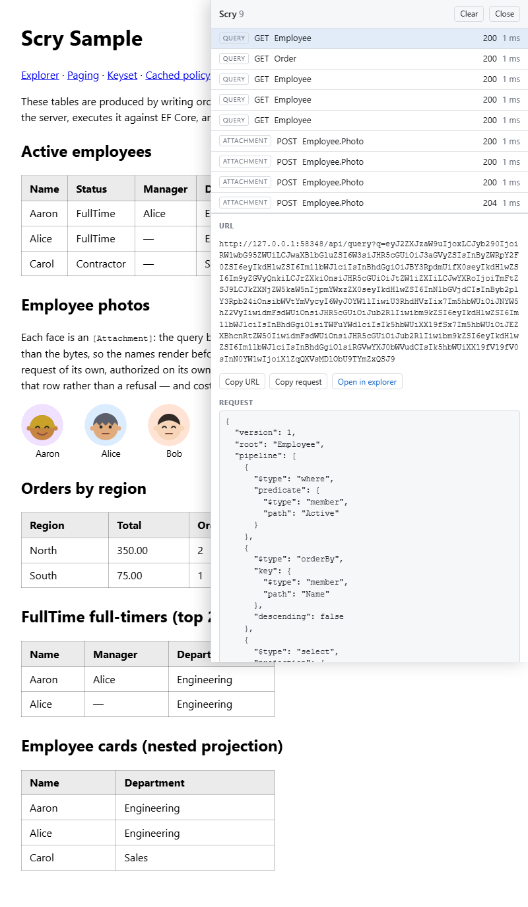

# Debug sidecar

`Scry.Client` ships an opt-in debug sidecar for Blazor apps: a panel that opens on the right of the running page and lists every Scry exchange the app has made — the wire request decoded and pretty-printed (including GET URLs, whose `q=` parameter is otherwise an opaque base64url blob), the response pretty-printed, and the request and response headers.



Toggle it with <kbd>Alt</kbd>+<kbd>Q</kbd> (configurable), or with the small floating **Scry** button in the page's corner. While closed it renders nothing beyond that button — and with the button turned off, nothing at all.


## Enabling it

Register the sidecar's services and attach its capture handler to the named client Scry uses:

<!-- snippet: sidecarRegistration -->
<a id='snippet-sidecarRegistration'></a>
```cs
builder.Services.AddScrySidecar();
builder.Services
    .AddHttpClient("scry")
    .AddHttpMessageHandler<ScrySidecarHandler>();
```
<sup><a href='/samples/Sample.Client/Program.cs#L46-L51' title='Snippet source file'>snippet source</a> | <a href='#snippet-sidecarRegistration' title='Start of snippet'>anchor</a></sup>
<!-- endSnippet -->

Then render the panel once, above the router:

<!-- snippet: sidecarMarkup -->
<a id='snippet-sidecarMarkup'></a>
```razor
<ScrySidecar />
```
<sup><a href='/samples/Sample.Client/App.razor#L2-L4' title='Snippet source file'>snippet source</a> | <a href='#snippet-sidecarMarkup' title='Start of snippet'>anchor</a></sup>
<!-- endSnippet -->

The handler is attached explicitly rather than automatically so the sidecar observes exactly the client the app points it at, not every `HttpClient` in the container. If the app also uses the [caching handler](caching.md), register the sidecar's handler after it — what it records is then the real wire exchange, the `If-None-Match` request and the raw 304, rather than the cache's replay.


## Options

<!-- snippet: sidecarOptions -->
<a id='snippet-sidecarOptions'></a>
```cs
/// <summary>
/// Whether exchanges are captured and the panel responds to its shortcut. On by default —
/// turn it off for builds where a query log over the wire traffic is unwanted.
/// </summary>
public bool Enabled { get; set; } = true;

/// <summary>
/// The keyboard shortcut that opens and hides the panel, as modifier tokens plus a key
/// (for example <c>"Ctrl+Shift+D"</c>). An unrecognized value falls back to the default.
/// </summary>
public string ToggleShortcut { get; set; } = "Alt+Q";

/// <summary>
/// Decides whether the small floating button is shown in the page's corner while the panel
/// is closed, as a clickable alternative to the shortcut. Shown to everyone by default —
/// set <see cref="Never"/> to rely on the shortcut alone, or an own predicate to decide from
/// the current context (the signed-in user, say). Evaluated once, when the panel first loads.
/// </summary>
public Func<IServiceProvider, ValueTask<bool>> ToggleButton { get; set; } = Always;

/// <summary>
/// Where the query explorer is mapped, for the "open in explorer" action on a captured
/// query. Null hides the action.
/// </summary>
public string? ExplorerRoute { get; set; } = "/scry";

/// <summary>Captured entries kept; the oldest is evicted beyond this.</summary>
public int MaxEntries { get; set; } = 100;

/// <summary>
/// The client the attachment download action re-sends with. Defaults to a plain
/// <see cref="HttpClient"/>, which is enough because captured URLs are absolute — supply
/// one when the fetch needs the app's handler pipeline (an auth header, say).
/// </summary>
public Func<IServiceProvider, HttpClient>? DownloadClient { get; set; }
```
<sup><a href='/src/Scry.Client/Sidecar/ScrySidecarOptions.cs#L10-L46' title='Snippet source file'>snippet source</a> | <a href='#snippet-sidecarOptions' title='Start of snippet'>anchor</a></sup>
<!-- endSnippet -->

Capture is on by default once wired. `Enabled = false` makes the sidecar fully inert: nothing is captured, no key listener is registered, nothing renders — wire it behind an environment check for builds where a query log is unwanted.

The shortcut is worth overriding where <kbd>Alt</kbd>+<kbd>Q</kbd> collides with a browser, keyboard-layout, or assistive-technology binding.

`ToggleButton` decides whether the floating button is shown while the panel is closed. Shown to everyone by default — the discoverable way in, and the only way on a touch device; the panel's own **Close** button hides an open panel either way. `ScrySidecarOptions.Never` removes it, leaving the shortcut as the only way in:

```cs
builder.Services.AddScrySidecar(_ => _.ToggleButton = ScrySidecarOptions.Never);
```

Because it is a predicate over the app's services, the answer can come from the current context — for example, showing the button only to a signed-in developer:

```cs
builder.Services.AddScrySidecar(
    _ => _.ToggleButton = async services =>
    {
        var provider = services.GetRequiredService<AuthenticationStateProvider>();
        var state = await provider.GetAuthenticationStateAsync();
        return state.User.IsInRole("developer");
    });
```

The predicate is evaluated once, when the panel first loads. An answer that should change mid-session — a user signing in after the app booted — belongs on the markup instead: render `<ScrySidecar />` inside the condition (an `<AuthorizeView>`, say), and the component is created and torn down with it, re-asking everything as it comes and goes.


## What is captured — and what deliberately is not

- **Queries and batches** are recorded whole: the decoded request, the pretty-printed response, and both header sets. Their bodies are safe to buffer because the client buffers them itself.
- **Streams** are recorded as status and headers only. A streamed result is meant to be read a row at a time; buffering it to display it would stall the read.
- **Attachments** are recorded as status, headers, and the *request* body. The bytes themselves are never cached — the **Download** action re-sends the captured request and hands the fresh bytes to the browser, so the server's policies answer every download anew. Supply `DownloadClient` when that re-send needs the app's handler pipeline (an auth header, say).
- **Sensitive constants are shown.** A query comparing a `[Sensitive]` member against a constant travels as a POST body, and the panel shows bodies — the sidecar is a devtools-grade view of the app's own traffic, so wire it only in builds where opening the network tab would be equally acceptable.

One logical query is not always one entry: a GET the server refuses as URL-borne is retried as a POST, so it appears twice; a batch collapses several queries into one entry.


## Open in explorer

Every captured query whose request can be rendered back into C# gets an **Open in explorer** action: a new tab at the [query explorer](explorer.md) with the editor pre-populated, via the explorer's own share-link format — the snippet travels in the URL fragment, which never reaches a server.

The action is hidden when the request cannot be faithfully re-spelled as a snippet the explorer accepts, and always for queries carrying a `[Sensitive]` constant — the constant is the secret, and a link is a shareable artifact.

Point `ExplorerRoute` at wherever `MapScryExplorer` is mapped, or set it null to hide the action.
