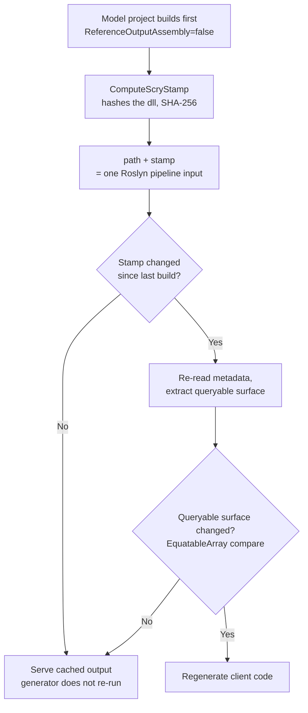

# Source generator

The generator lives in `Scry.SourceGenerator`. It is not a standalone package — it is packed inside `Scry.Client` as an analyzer, so a client project that references `Scry.Client` already has it.


## The path-not-reference design

The generator reads the server model's **built DLL from disk** using `System.Reflection.Metadata`. The assembly is never referenced by the client project, never loaded into the compiler, and never executed. Only the allow-listed surface is extracted from its metadata tables.

That is what lets a Blazor WebAssembly client be strongly typed against a server-side EF Core model without dragging EF Core, connection strings, or the non-allow-listed members of the model into the client's dependency graph or its shipped output.


## Wiring

Two things are needed in the client project. First, the path the generator reads:

<!-- snippet: clientModelPath -->
<a id='snippet-clientModelPath'></a>
```csproj
<!-- The server model, pointed at by path. NOT referenced. -->
<ScryModelDll>$(MSBuildThisFileDirectory)..\Sample.Model\bin\$(Configuration)\net10.0\Sample.Model.dll</ScryModelDll>
```
<sup><a href='/samples/Sample.Client/Sample.Client.csproj#L7-L10' title='Snippet source file'>snippet source</a> | <a href='#snippet-clientModelPath' title='Start of snippet'>anchor</a></sup>
<!-- endSnippet -->

Second, a project reference that exists purely for **build ordering**:

```xml
<ProjectReference Include="..\Sample.Model\Sample.Model.csproj" ReferenceOutputAssembly="false" />
```

`ReferenceOutputAssembly="false"` means no assembly reference is added — only the ordering constraint. Without it the generator races the model build and reads a stale or missing DLL.

Everything else is supplied by the `buildTransitive/Scry.Client.targets` file that ships in the `Scry.Client` package:

<!-- snippet: buildTransitiveProps -->
<a id='snippet-buildTransitiveProps'></a>
```targets
<ItemGroup>
  <CompilerVisibleProperty Include="ScryModelDll" />
  <CompilerVisibleProperty Include="ScryModelStamp" />
</ItemGroup>

<Target Name="ComputeScryStamp"
        AfterTargets="ResolveProjectReferences"
        BeforeTargets="GenerateMSBuildEditorConfig;CoreCompile"
        Condition="'$(ScryModelDll)' != '' and Exists('$(ScryModelDll)')">
  <GetFileHash Files="$(ScryModelDll)" Algorithm="SHA256">
    <Output TaskParameter="Hash" PropertyName="ScryModelStamp" />
  </GetFileHash>
</Target>

<Target Name="EnsureScryModel"
        BeforeTargets="CoreCompile"
        Condition="'$(ScryModelDll)' != '' and !Exists('$(ScryModelDll)')">
  <Error Text="Scry: the model assembly '$(ScryModelDll)' was not found.
Reference the model project with ReferenceOutputAssembly=&quot;false&quot; so it builds first." />
</Target>
```
<sup><a href='/src/Scry.Client/buildTransitive/Scry.Client.targets#L11-L32' title='Snippet source file'>snippet source</a> | <a href='#snippet-buildTransitiveProps' title='Start of snippet'>anchor</a></sup>
<!-- endSnippet -->


### Why the stamp

Roslyn's incremental pipeline can only see inputs that are declared to it. The DLL is read out of band, so from Roslyn's point of view the input is only a *path string* — which does not change when the file's contents do. A build that changes the model but not its location would leave the generator's cached output in place.

`ComputeScryStamp` hashes the DLL and surfaces the hash as a second compiler-visible property. The generator combines path and stamp into one pipeline input, so the model is re-read exactly when its contents change, and not otherwise.

The extracted model is then compared structurally (via `EquatableArray<T>`), so a change to the model assembly that leaves the *queryable surface* untouched — an unrelated method, a private field — does not trigger regeneration downstream.

Two gates therefore stand between a model build and a regenerated client — a content stamp and a structural comparison — and only a change that clears both re-emits code:




### Project references instead of the package

When referencing the projects directly (as the sample and integration tests do), the props file is not imported, so the wiring is written out explicitly:

<!-- snippet: clientGeneratorWiring -->
<a id='snippet-clientGeneratorWiring'></a>
```csproj
<ItemGroup>
  <ProjectReference Include="..\..\src\Scry.SourceGenerator\Scry.SourceGenerator.csproj"
                    OutputItemType="Analyzer" ReferenceOutputAssembly="false" />
  <ProjectReference Include="..\Sample.Model\Sample.Model.csproj" ReferenceOutputAssembly="false" />
  <CompilerVisibleProperty Include="ScryModelDll" />
  <CompilerVisibleProperty Include="ScryModelStamp" />
</ItemGroup>

<Target Name="ComputeScryStamp"
        AfterTargets="ResolveProjectReferences"
        BeforeTargets="GenerateMSBuildEditorConfig;CoreCompile"
        Condition="Exists('$(ScryModelDll)')">
  <GetFileHash Files="$(ScryModelDll)" Algorithm="SHA256">
    <Output TaskParameter="Hash" PropertyName="ScryModelStamp" />
  </GetFileHash>
</Target>
```
<sup><a href='/samples/Sample.Client/Sample.Client.csproj#L24-L41' title='Snippet source file'>snippet source</a> | <a href='#snippet-clientGeneratorWiring' title='Start of snippet'>anchor</a></sup>
<!-- endSnippet -->


## What is emitted

Everything lands in the `Scry.Generated` namespace.


### One query model per source

`{TypeName}QueryModel.g.cs`:

<!-- snippet: GeneratorTests.EntitiesViewPocoAndEnum#EmployeeQueryModel.g.verified.cs -->
<a id='snippet-GeneratorTests.EntitiesViewPocoAndEnum#EmployeeQueryModel.g.verified.cs'></a>
```cs
//HintName: EmployeeQueryModel.g.cs
// <auto-generated/>
#nullable enable
#pragma warning disable CS0612, CS0618
namespace Scry.Generated;

/// <summary>Client query model for the 'Employee' entity source.</summary>
[global::Scry.ScryModel("Employee", "Id", "Name", "Status", "Active", "ManagerId", "Avatar")]
public class EmployeeQueryModel
{
    public int Id { get; init; }
    public string Name { get; init; } = null!;
    public Status Status { get; init; }
    public bool Active { get; init; }
    public int? ManagerId { get; init; }
    public EmployeeQueryModel? Manager { get; init; }
    public byte[] Avatar { get; init; } = null!;
}
```
<sup><a href='/src/Scry.SourceGenerator.Tests/GeneratorTests.EntitiesViewPocoAndEnum%23EmployeeQueryModel.g.verified.cs#L1-L18' title='Snippet source file'>snippet source</a> | <a href='#snippet-GeneratorTests.EntitiesViewPocoAndEnum#EmployeeQueryModel.g.verified.cs' title='Start of snippet'>anchor</a></sup>
<!-- endSnippet -->

Note what is *absent*: `Salary` is `[QueryIgnore]`, and `Department`/`DepartmentId` appear only if `Department` is itself opted in.

Properties are `init`-only. A reference navigation is emitted as a nullable reference to the *other query model*, so `e.Manager!.Name` type-checks and traverses. A non-nullable `string` gets ` = null!;` to satisfy nullable analysis.


### Re-emitted enums

`ScryEnums.g.cs` contains every enum reachable from an exposed member, with its members in declaration order:

<!-- snippet: GeneratorTests.EntitiesViewPocoAndEnum#ScryEnums.g.verified.cs -->
<a id='snippet-GeneratorTests.EntitiesViewPocoAndEnum#ScryEnums.g.verified.cs'></a>
```cs
//HintName: ScryEnums.g.cs
// <auto-generated/>
#nullable enable
#pragma warning disable CS0612, CS0618
namespace Scry.Generated;

public enum Status
{
    FullTime,
    PartTime,
    Contractor,
}
```
<sup><a href='/src/Scry.SourceGenerator.Tests/GeneratorTests.EntitiesViewPocoAndEnum%23ScryEnums.g.verified.cs#L1-L13' title='Snippet source file'>snippet source</a> | <a href='#snippet-GeneratorTests.EntitiesViewPocoAndEnum#ScryEnums.g.verified.cs' title='Start of snippet'>anchor</a></sup>
<!-- endSnippet -->

This is why the client can write `e.Status == Status.FullTime` without referencing the model.


### The entry point

`ScryQuery.g.cs` exposes one `IQueryable<T>` per allow-listed source:

<!-- snippet: GeneratorTests.EntitiesViewPocoAndEnum#ScryQuery.g.verified.cs -->
<a id='snippet-GeneratorTests.EntitiesViewPocoAndEnum#ScryQuery.g.verified.cs'></a>
```cs
//HintName: ScryQuery.g.cs
// <auto-generated/>
#nullable enable
#pragma warning disable CS0612, CS0618
namespace Scry.Generated;

/// <summary>Entry point for writing LINQ queries against the allow-listed sources.</summary>
public sealed class ScryQuery
{
    /// <summary>
    /// A hash of the queryable surface this client was generated against. Attached to each
    /// request so the server can identify a client generated against a different model.
    /// </summary>
    public const string SchemaStamp = "2iosRX6CXtpmJbM0";

    readonly global::Scry.ScryClient client;

    public ScryQuery(global::Scry.ScryClient client)
    {
        this.client = client;
        client.SchemaStamp = SchemaStamp;
    }

    public global::System.Linq.IQueryable<EmployeeQueryModel> Employee =>
        client.Source<EmployeeQueryModel>("Employee", ["Id", "Name", "Status", "Active", "ManagerId", "Avatar"]);

    public global::System.Linq.IQueryable<EmployeeSummaryQueryModel> EmployeeSummary =>
        client.Source<EmployeeSummaryQueryModel>("EmployeeSummary", ["Department", "Headcount"]);

    public global::System.Linq.IQueryable<HolidayQueryModel> Holiday =>
        client.Source<HolidayQueryModel>("Holiday", ["Name", "Date"]);
}
```
<sup><a href='/src/Scry.SourceGenerator.Tests/GeneratorTests.EntitiesViewPocoAndEnum%23ScryQuery.g.verified.cs#L1-L32' title='Snippet source file'>snippet source</a> | <a href='#snippet-GeneratorTests.EntitiesViewPocoAndEnum#ScryQuery.g.verified.cs' title='Start of snippet'>anchor</a></sup>
<!-- endSnippet -->

Each source passes its **scalar member names** to `Source`. That is what a query with no `Select` projects, so the client names its own response keys rather than leaving the server to pick them — which is what lets a server-side member rename round-trip to an already-deployed client ([Renaming](annotations.md#renaming)). Navigations are excluded, matching the server's own default projection.

Register it alongside the client:

<!-- snippet: clientRegistration -->
<a id='snippet-clientRegistration'></a>
```cs
builder.Services.AddHttpClient(
    "scry",
    _ => _.BaseAddress = new(builder.HostEnvironment.BaseAddress));
builder.Services.AddScryClient(
    "/api/query",
    _ => _.GetRequiredService<IHttpClientFactory>().CreateClient("scry"));
builder.Services.AddScoped<ScryQuery>();
```
<sup><a href='/samples/Sample.Client/Program.cs#L14-L22' title='Snippet source file'>snippet source</a> | <a href='#snippet-clientRegistration' title='Start of snippet'>anchor</a></sup>
<!-- endSnippet -->


## Type mapping

| Model member type | Generated |
| --- | --- |
| `bool`, `char`, `sbyte`, `byte`, `short`, `ushort`, `int`, `uint`, `long`, `ulong`, `float`, `double` | the C# keyword |
| `string` | `string` (with ` = null!;`) |
| `byte[]` | `byte[]` (with ` = null!;`) |
| `decimal` | `decimal` |
| `DateTime`, `DateOnly`, `TimeOnly`, `DateTimeOffset`, `TimeSpan`, `Guid` | `global::System.X` |
| an `enum` | the enum name, re-emitted into `ScryEnums.g.cs` |
| another opted-in type | `{Type}QueryModel?` |
| a nullable value type | the above with `?` |
| anything else | omitted |


## Diagnostics

| ID | Severity | Meaning |
| --- | --- | --- |
| `SCRY001` | Error | Failed to read the Scry model assembly. The message carries the underlying reason. |
| `SCRY002` | Error | Two queryable types resolve to the same source name. |
| `SCRY003` | Error | A source name cannot be written as a C# property name. |

`SCRY001` is reported when the DLL exists but cannot be parsed — corrupt, truncated, or not a managed assembly.

`SCRY002` guards the source-name clash that would otherwise emit duplicate properties on `ScryQuery` and surface as a `CS0102` on generated code the user cannot see. Give one of the types a distinct [`Name`](annotations.md#naming-a-source). The server rejects the same clash at startup.

`SCRY003` guards the same axis for names that are not identifiers at all: the entry point exposing the source is a property, and a name it cannot be written as would emit a `ScryQuery` that does not parse. The server refuses the same set at startup, so which side is built first does not change where the mistake surfaces.

The `SCRY1xx` family is reported by the **LINQ analyzer**, which is packed in this same assembly and needs no separate reference. It reports queries the closed operator set cannot carry, at the call site rather than at translation time — see [LINQ coverage](linq-coverage.md#reported-at-compile-time).


## Troubleshooting

**Nothing is generated; `ScryQuery` does not exist.** The path in `ScryModelDll` is empty or does not resolve to an existing file, so the generator produces nothing at all rather than failing the build. Check the path against `$(Configuration)` and the model's target framework — a `Release` client pointing at a `Debug` model path is the usual cause. When consuming the NuGet package the `EnsureScryModel` target catches this and fails the build with:

```
Scry: the model assembly '...' was not found.
Reference the model project with ReferenceOutputAssembly="false" so it builds first.
```

**A source is missing from `ScryQuery`.** The type is not opted in. Add `[Queryable]`, `[QueryableView]`, or `[QueryablePoco]` — see [Annotations](annotations.md).

**A property is missing from a query model.** It is `[QueryIgnore]`d, has no public instance getter, or its type is neither a scalar nor another opted-in type. Collection navigations are always omitted.

**Generated code is stale after changing the model.** This is what the stamp exists to prevent, so first confirm the model project actually rebuilt. In Rider or Visual Studio the analyzer host caches generator assemblies; a restart clears it. The generator's `AssemblyVersion` tracks the package version specifically so an upgraded package gets a distinct identity rather than serving a cached, frozen generator.

**Build order flakiness in CI.** Confirm the `ReferenceOutputAssembly="false"` project reference is present. Without it, nothing orders the model build ahead of the client compile. A [solution-level build dependency](https://learn.microsoft.com/en-us/visualstudio/ide/how-to-create-and-remove-project-dependencies) (`<BuildDependency>` in `.slnx`, `ProjectDependencies` in `.sln`) is not a substitute — it only applies when the build is entered through that solution, so building the client project directly, or from another solution, loses the ordering.


## Reading generated code

Add this to the client project to write the generated files to disk:

```xml
<PropertyGroup>
  <EmitCompilerGeneratedFiles>true</EmitCompilerGeneratedFiles>
  <CompilerGeneratedFilesOutputPath>$(BaseIntermediateOutputPath)Generated</CompilerGeneratedFilesOutputPath>
</PropertyGroup>
```
