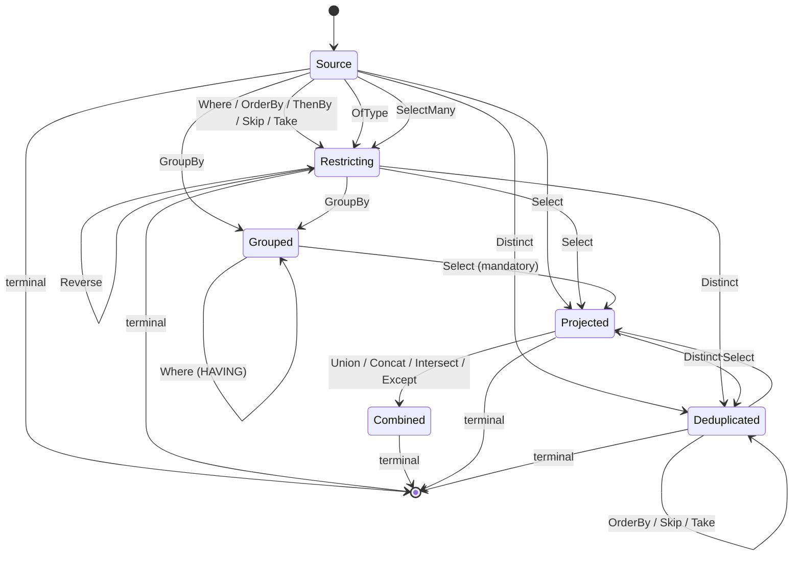

# Wire format

`Scry.Wire` defines the serializable query AST shared by client and server. It is a **restricted, closed node vocabulary** — not general expression-tree serialization — which is what makes every query exhaustively validatable.

These types are rarely constructed by hand; the client translator emits them and the server consumes them. This page is the reference for anyone writing another client, debugging a request, or reviewing the surface.


## Serialization

All (de)serialization goes through `ScryJson`, whose options are part of the contract:

- Property names are **camelCase**.
- Dictionary keys (result rows) are **camelCase**.
- Enums are written as **names**, never numbers, with no naming policy applied.
- Null-valued **properties** are omitted — so optional AST members such as `predicate` or a null constant's `value` do not appear. Result rows are dictionaries, not properties, so an explicit `null` column is still written.
- Polymorphic types use a `$type` discriminator.
- Deserialization is **fail-closed**: unknown discriminators and malformed JSON throw `ScryWireException`, they are not skipped.


### Why the options aren't configurable

There is no API for supplying custom `JsonSerializerOptions`, and that is deliberate.

**There is nothing to configure them *from*.** Unlike a normal ASP.NET application there is no single deployment holding both ends: the client is built separately, against a model DLL by path, and shipped somewhere else — a browser, another service, a third party's codebase. Any option would have to be set identically on both sides, out of band, with nothing verifying that it was. `version` catches a mismatched wire *format*; it cannot catch a client whose naming policy differs from the server's, which fails as an unexplained parse error or, worse, as a request the server reads as empty.

**Several of the options are the security model, not a preference.** Fail-closed deserialization is what keeps the node vocabulary *closed*, and closed is what makes every request exhaustively validatable — see the [security model](security.md). Options handed in from outside can carry `UnmappedMemberHandling.Skip`, a custom `TypeInfoResolver`, a `ReferenceHandler`, or a converter that resurrects a type the AST does not name. Each of those reopens the vocabulary, and a setting that is able to disable an invariant is one that gets disabled by whoever is debugging a `400`.

**There is nothing for a converter to attach to.** The usual reason to want one is a model type `System.Text.Json` cannot write. The exposed [scalar set](annotations.md#scalars) is closed, and a type outside it is not exposed at all — a strongly-typed ID or value object is invisible to clients unless it is `[QueryableComplex]`, whose own members are that same closed set again.

**A fixed format is what makes another client possible.** This page is only writable because the encoding is one thing rather than per-deployment. The same applies in-tree: the [explorer](explorer.md) reuses `ToScryRequest` and `ScryJson` specifically so the request it shows is the one production sends.

What is usually wanted instead already exists, in a narrower place:

| Want | Reach for |
| --- | --- |
| Bound what a query may ask for | [`ScryOptions` limits](server.md#options) — pipeline length, expression and navigation depth, page size, `IN` values, streamed rows |
| Change a name on the wire | [`Name`](annotations.md#naming-a-source) and [`[PreviousNames]`](annotations.md#renaming) — a versioned rename with a migration window, rather than a global reshaping |
| Compression, body size limits, headers | Ordinary ASP.NET Core middleware — these sit outside the wire |
| Readable JSON while debugging | Re-serialize locally with `WriteIndented`; the payload is already a `JsonElement` |


## Request

<!-- snippet: wireRequest -->
<a id='snippet-wireRequest'></a>
```cs
public sealed record QueryRequest(int Version, string Root, IReadOnlyList<QueryOp> Pipeline)
{
    /// <summary>Creates a request stamped with the current <see cref="WireFormat.Version"/>.</summary>
    public static QueryRequest Create(string root, IReadOnlyList<QueryOp> pipeline, string? stamp = null) =>
        new(WireFormat.Version, root, pipeline)
        {
            Stamp = stamp
        };

    /// <summary>
    /// The schema stamp of the generated client model the query was written against, when known.
    /// Lets the server distinguish a stale client (generated against a different model) from an
    /// invalid query. Omitted on the wire when null; servers ignore an unrecognized stamp property,
    /// so carrying it is compatible in both directions.
    /// </summary>
    public string? Stamp { get; init; }
}
```
<sup><a href='/src/Scry.Wire/QueryRequest.cs#L7-L25' title='Snippet source file'>snippet source</a> | <a href='#snippet-wireRequest' title='Start of snippet'>anchor</a></sup>
<!-- endSnippet -->

```json
{
  "version": 1,
  "root": "Employee",
  "pipeline": [ ... ]
}
```

| Field | Meaning |
| --- | --- |
| `version` | Wire format version. The server rejects anything newer than it understands. |
| `root` | The source name — the allow-listed type name, or the attribute's [`Name`](annotations.md#naming-a-source) when set. |
| `pipeline` | Ordered operators, applied left to right. |
| `stamp` | Optional. The [schema stamp](#schema-stamp) of the model the client was generated against. Omitted when unknown. |

Because `root` is part of the contract, prefer setting `Name` over relying on the type name if the CLR type is likely to be renamed.

`QueryRequest.Create(root, pipeline)` fills in the current wire version, and takes an optional schema stamp.


## Operators

<!-- snippet: wireOperators -->
<a id='snippet-wireOperators'></a>
```cs
[JsonPolymorphic(TypeDiscriminatorPropertyName = "$type")]
[JsonDerivedType(typeof(WhereOp), "where")]
[JsonDerivedType(typeof(OrderByOp), "orderBy")]
[JsonDerivedType(typeof(ThenByOp), "thenBy")]
[JsonDerivedType(typeof(SkipOp), "skip")]
[JsonDerivedType(typeof(TakeOp), "take")]
[JsonDerivedType(typeof(SelectOp), "select")]
[JsonDerivedType(typeof(SelectManyOp), "selectMany")]
[JsonDerivedType(typeof(OfTypeOp), "ofType")]
[JsonDerivedType(typeof(GroupByOp), "groupBy")]
[JsonDerivedType(typeof(DistinctOp), "distinct")]
[JsonDerivedType(typeof(ReverseOp), "reverse")]
[JsonDerivedType(typeof(JoinOp), "join")]
[JsonDerivedType(typeof(SetOp), "set")]
[JsonDerivedType(typeof(CountOp), "count")]
[JsonDerivedType(typeof(LongCountOp), "longCount")]
[JsonDerivedType(typeof(AnyOp), "any")]
[JsonDerivedType(typeof(AllOp), "all")]
[JsonDerivedType(typeof(FirstOp), "first")]
[JsonDerivedType(typeof(SingleOp), "single")]
[JsonDerivedType(typeof(LastOp), "last")]
[JsonDerivedType(typeof(AggregateOp), "aggregate")]
[JsonDerivedType(typeof(PageOp), "page")]
public abstract record QueryOp;
```
<sup><a href='/src/Scry.Wire/Operators/QueryOp.cs#L8-L33' title='Snippet source file'>snippet source</a> | <a href='#snippet-wireOperators' title='Start of snippet'>anchor</a></sup>
<!-- endSnippet -->

| `$type` | Payload | Meaning |
| --- | --- | --- |
| `where` | `predicate: Node` | Filter. |
| `orderBy` | `key: Node`, `descending: bool` | Primary ordering. |
| `thenBy` | `key: Node`, `descending: bool` | Secondary ordering. Must follow `orderBy`. |
| `skip` | `count: int` | Skip elements. |
| `take` | `count: int` | Take at most `count`, capped by `MaxPageSize`. |
| `groupBy` | `keys: Node[]` | Group. Exactly one key is supported. |
| `select` | `projection: Projection` | Project to the requested shape. |
| `count` | — | Terminal, scalar. |
| `any` | `predicate: Node?` | Terminal, scalar. |
| `first` | `orDefault: bool`, `predicate: Node?` | Terminal, single. |
| `single` | `orDefault: bool`, `predicate: Node?` | Terminal, single. |
| `page` | `size: int?`, `cursor: string?` | Terminal, page. Bounded page of rows; `size` null uses `DefaultPageSize`, capped by `MaxPageSize`. `cursor` resumes a previous page (keyset). See [Paging](paging.md). |

At most one terminal, and nothing may follow it.

The legal operator orderings form a small state machine — every absent edge is an illegal ordering:<!-- include: pipeline-order. path: /docs/includes/pipeline-order.include.md -->



Nothing orders, skips, or takes after `GroupBy`; a `GroupBy` cannot reach a terminal without a
`Select` in between; and there is no second `GroupBy` or `Select`. A `Where` after `GroupBy` is the
one exception — it filters the groups rather than the rows, and reads only the key and aggregates.
`ThenBy` and `Reverse` without a preceding `OrderBy` are rejected, and nothing may follow a terminal.

A set operation combines the projected rows with a second source, so like a join only a terminal may
follow: the combined rows come from two sources and have no single root left to read.

`OfType` narrows to a derived type, leaving the query restricting but against that type — so the
members it declares become nameable and the base's stay so.

`SelectMany` flattens a collection into its elements, so it leaves the query restricting — but against
a different row. Everything after it is written against the element, at most one is allowed, and an
ordering written before it does not carry across.

`Distinct` deduplicates the projected rows, so what may follow it is the `Select` it deduplicates, a
terminal, and — over a flat projection of up to eight members — an `OrderBy` naming one of them, plus
`Skip` and `Take` over the resulting order. Filtering after it would be describing the rows that fed it, and
paging without an ordering would be slicing an order the deduplication never defined.<!-- endInclude -->


## Expressions

<!-- snippet: wireExpressions -->
<a id='snippet-wireExpressions'></a>
```cs
[JsonPolymorphic(TypeDiscriminatorPropertyName = "$type")]
[JsonDerivedType(typeof(MemberNode), "member")]
[JsonDerivedType(typeof(ElementNode), "element")]
[JsonDerivedType(typeof(ConstNode), "const")]
[JsonDerivedType(typeof(BinaryNode), "binary")]
[JsonDerivedType(typeof(UnaryNode), "unary")]
[JsonDerivedType(typeof(CallNode), "call")]
[JsonDerivedType(typeof(ConditionalNode), "conditional")]
[JsonDerivedType(typeof(SubqueryNode), "subquery")]
[JsonDerivedType(typeof(CollateNode), "collate")]
[JsonDerivedType(typeof(InSourceNode), "inSource")]
[JsonDerivedType(typeof(AggregateNode), "aggregate")]
[JsonDerivedType(typeof(GroupKeyNode), "groupKey")]
public abstract record Node;
```
<sup><a href='/src/Scry.Wire/Expressions/Node.cs#L7-L22' title='Snippet source file'>snippet source</a> | <a href='#snippet-wireExpressions' title='Start of snippet'>anchor</a></sup>
<!-- endSnippet -->


### `member`

```json
{ "$type": "member", "path": ["Manager", "Name"] }
```

A navigation path of allow-listed property names. Each segment is validated against the allow-list of the type reached so far; every non-final segment must be a reference navigation.


### `element`

```json
{ "$type": "element" }
```

The element of the collection a `subquery` is reading — the counterpart of `member` for a [collection of **values**](querying.md#collection-subqueries) rather than of rows, whose elements have no member to name. `Tags.Any(_ => _ == "urgent")` is a `binary` over this and a `const`; `Scores.Sum()` is a `subquery` whose `selector` is this.

Carries no payload, and is valid **only** where the row being read is a value. Anywhere else the server rejects it: it would otherwise name a whole row, which is not something a query may compare, order by, or project.


### `const`

```json
{ "$type": "const", "value": "FullTime", "tag": "Enum" }
```

`value` is the invariant-culture string form, omitted entirely for a null constant. `tag` describes the shape the client had:

<!-- snippet: wireTypeTags -->
<a id='snippet-wireTypeTags'></a>
```cs
/// <summary>The CLR shape of a constant literal on the wire. The server reconciles it against the
/// member type at the comparison site.</summary>
public enum ClrTypeTag
{
    Null,
    String,
    Boolean,
    Int32,
    Int64,
    Decimal,
    Double,
    DateTime,
    DateOnly,
    Guid,
    Bytes,
    Enum
}
```
<sup><a href='/src/Scry.Wire/ClrTypeTag.cs#L3-L21' title='Snippet source file'>snippet source</a> | <a href='#snippet-wireTypeTags' title='Start of snippet'>anchor</a></sup>
<!-- endSnippet -->

The tag is a hint, not an instruction. The server parses the value into the **member's** type at the comparison site, so `tag` never dictates what CLR type is constructed. Types with no dedicated tag (`TimeOnly`, `TimeSpan`, `DateTimeOffset`, `char`) travel as `String` and are reconciled the same way. A `Bytes` value carries a `byte[]` as a base64 string.


### `binary` and `unary`

```json
{
  "$type": "binary",
  "op": "GreaterThan",
  "left":  { "$type": "member", "path": ["Amount"] },
  "right": { "$type": "const", "value": "100", "tag": "Decimal" }
}
```

<!-- snippet: wireBinaryOps -->
<a id='snippet-wireBinaryOps'></a>
```cs
/// <summary>Binary operators allowed in a predicate or projection expression.</summary>
public enum BinaryOp
{
    Equal,
    NotEqual,
    LessThan,
    LessThanOrEqual,
    GreaterThan,
    GreaterThanOrEqual,
    AndAlso,
    OrElse,
    Add,
    Subtract,
    Multiply,
    Divide,
    Modulo,
    Coalesce
}

/// <summary>Unary operators allowed in an expression.</summary>
public enum UnaryOp
{
    Not,
    Negate
}
```
<sup><a href='/src/Scry.Wire/BinaryOp.cs#L3-L29' title='Snippet source file'>snippet source</a> | <a href='#snippet-wireBinaryOps' title='Start of snippet'>anchor</a></sup>
<!-- endSnippet -->

When one side is a constant, its type is inferred from the other side, and nullable/non-nullable operands are coerced to match.


### `call`

```json
{
  "$type": "call",
  "function": "StringStartsWith",
  "target": { "$type": "member", "path": ["Name"] },
  "arguments": [ { "$type": "const", "value": "A", "tag": "String" } ]
}
```

<!-- snippet: wireFunctions -->
<a id='snippet-wireFunctions'></a>
```cs
/// <summary>The closed set of functions a client may call on a value. No free-form method names.</summary>
public enum KnownFunction
{
    StringContains,
    StringStartsWith,
    StringEndsWith,
    StringToLower,
    StringToUpper,
    StringIsNullOrEmpty,
    StringIsNullOrWhiteSpace,
    StringLength,
    StringTrim,
    StringTrimStart,
    StringTrimEnd,
    StringSubstring,
    StringIndexOf,
    StringReplace,
    DateYear,
    DateMonth,
    DateDay,
    DateHour,
    DateMinute,
    DateSecond,
    DateMillisecond,
    DateDayOfYear,

    /// <summary>
    /// The day of the week, numbered as <see cref="System.DayOfWeek"/> does — 0 for Sunday. The server
    /// owns how that is expressed in SQL, since the obvious formulation is not deterministic.
    /// </summary>
    DateDayOfWeek,
    DateDate,
    DateAddYears,
    DateAddMonths,
    DateAddDays,
    DateAddHours,
    DateAddMinutes,
    DateAddSeconds,
    /// <summary>
    /// Joins the target and the argument into one string, converting either if it is not one already.
    /// C# writes this as <c>+</c>, but the operator alone does not say it: an Add of a string and a
    /// number is a concatenation, while an Add of two numbers is arithmetic, and only the client can
    /// tell which was written.
    /// </summary>
    StringConcat,

    /// <summary>
    /// The target's value as text — <c>ToString()</c> with no arguments. The formatted overload is not
    /// part of the set: no provider translates it, and the SQL function that would express it reads
    /// the server's language, so the same row would format differently per connection.
    /// </summary>
    StringFrom,

    MathAbs,
    MathCeiling,
    MathFloor,
    MathRound,
    MathTruncate,
    /// <summary>
    /// The sign of the target: -1, 0, or 1. The server composes it from comparisons rather than from
    /// SQL's own function, whose result takes the argument's type and so cannot be read back as the
    /// <see cref="int"/> this returns.
    /// </summary>
    MathSign,

    MathSqrt,
    MathPow,
    MathExp,

    /// <summary>Natural logarithm, or — with one argument — the logarithm to that base.</summary>
    MathLog,
    MathLog10,
    MathSin,
    MathCos,
    MathTan,
    MathAsin,
    MathAcos,
    MathAtan,

    /// <summary>The angle whose tangent is the target over the argument (<c>Math.Atan2(y, x)</c>).</summary>
    MathAtan2,

    /// <summary>
    /// Membership of a client-supplied set (SQL <c>IN</c>). The target is the value being tested and
    /// every argument is a <see cref="ConstNode"/>; the server caps the number of values.
    /// </summary>
    In
}
```
<sup><a href='/src/Scry.Wire/KnownFunction.cs#L3-L92' title='Snippet source file'>snippet source</a> | <a href='#snippet-wireFunctions' title='Start of snippet'>anchor</a></sup>
<!-- endSnippet -->

There is no free-form method name anywhere in the format. This enum is the complete set of behaviour a client can request.


### `aggregate`

```json
{ "$type": "aggregate", "function": "Sum", "selector": { "$type": "member", "path": ["Amount"] } }
```

<!-- snippet: wireAggregates -->
<a id='snippet-wireAggregates'></a>
```cs
/// <summary>
/// Aggregate functions, used either in a projection over a grouped query or as a terminal folding
/// the whole sequence to one scalar. <see cref="Count"/> is grouped-projection only — counting a
/// sequence has its own terminal.
/// </summary>
public enum AggregateFn
{
    Count,
    Sum,
    Average,
    Min,
    Max
}
```
<sup><a href='/src/Scry.Wire/AggregateFn.cs#L3-L17' title='Snippet source file'>snippet source</a> | <a href='#snippet-wireAggregates' title='Start of snippet'>anchor</a></sup>
<!-- endSnippet -->

`selector` is omitted for `Count`. An aggregate is valid **only** as a projection member in a `select` that follows a `groupBy`.


### `groupKey`

```json
{ "$type": "groupKey", "index": 0 }
```

The key a query grouped by, read in the `select` or `where` that follows the `groupBy`, and rejected anywhere else. `index` selects the part of a composite key and is zero for a single one.

A key that is a plain member is named instead by its own `member` node, whose path the server matches back to the position it grouped at — so an existing client's grouped requests are unchanged by this node's existence. It is for the keys with no path to name: one computed from an expression, where the only thing left to say is which of the query's keys is meant.


## Projections

```json
{
  "projection": {
    "members": [
      { "name": "Name", "value": { "$type": "node", "node": { "$type": "member", "path": ["Name"] } } }
    ]
  }
}
```

<!-- snippet: wireProjectionValues -->
<a id='snippet-wireProjectionValues'></a>
```cs
/// <summary>The value of a projection member.</summary>
[JsonPolymorphic(TypeDiscriminatorPropertyName = "$type")]
[JsonDerivedType(typeof(NodeValue), "node")]
[JsonDerivedType(typeof(NestedValue), "nested")]
public abstract record ProjectionValue;
```
<sup><a href='/src/Scry.Wire/Projections/ProjectionValue.cs#L3-L9' title='Snippet source file'>snippet source</a> | <a href='#snippet-wireProjectionValues' title='Start of snippet'>anchor</a></sup>
<!-- endSnippet -->

| `$type` | Payload | Produces |
| --- | --- | --- |
| `node` | `node: Node` | A scalar leaf, or an aggregate in a grouped select. |
| `nested` | `path: string[]`, `projection: Projection` | A nested JSON object built from a navigation. |

A projection must have at least one member. Nested projections are not allowed in a grouped select, and nesting depth is capped by `MaxNavigationDepth`.


## Response

<!-- snippet: wireResponse -->
<a id='snippet-wireResponse'></a>
```cs
public sealed record QueryResponse(int Version, ResultKind Kind, JsonElement Payload)
{
    /// <summary>Creates a response stamped with the current <see cref="WireFormat.Version"/>.</summary>
    public static QueryResponse Create(ResultKind kind, JsonElement payload) =>
        new(WireFormat.Version, kind, payload);

    /// <summary>
    /// The server's schema stamp, carried on every successful response so a client can compare it
    /// against its own and detect a drifted model. The HTTP transport also advertises it as a header
    /// (<see cref="WireFormat.SchemaStampHeader"/>), which additionally covers error responses; this is
    /// the channel every other transport uses.
    /// </summary>
    public string? Stamp { get; init; }

    /// <summary>
    /// Renamed enum values ([PreviousNames] on the server model), sent only when the request's schema
    /// stamp differs from the server's. Lets a client generated before a rename resolve a value name
    /// it does not know to one it does. Null otherwise, and omitted from the JSON.
    /// </summary>
    public IReadOnlyList<EnumAlias>? EnumAliases { get; init; }
}
```
<sup><a href='/src/Scry.Wire/QueryResponse.cs#L9-L31' title='Snippet source file'>snippet source</a> | <a href='#snippet-wireResponse' title='Start of snippet'>anchor</a></sup>
<!-- endSnippet -->

```json
{
  "version": 1,
  "kind": "List",
  "payload": [ { "name": "Alice", "status": "FullTime" } ],
  "stamp": "9PcWs1g22NAOclcT"
}
```

| `kind` | `payload` |
| --- | --- |
| `List` | An array of projected row objects. |
| `Single` | One projected row object, or `null`. |
| `Scalar` | A bare value (`int` for `count`, `bool` for `any`). |
| `Page` | A `ScryPage` envelope: `{ items: [...], hasMore: bool, cursor: string? }` — `cursor` set for a seek-safe page, else null. See [Paging](paging.md). |

The client checks that `kind` matches the terminal it sent and throws `ScryWireException` if it does not.

`stamp` is the server's [schema stamp](#schema-stamp), carried on **every** successful response — this is what a client compares against its own to notice a drifted model. Over HTTP the same value also rides as the `Scry-Schema-Stamp` header, which additionally covers *error* responses, where there is no body to read it from. Every other transport (SignalR, gRPC, in-process) uses the body, so [drift detection](schema-versioning.md#detecting-a-stale-client) is not HTTP-specific.

`enumAliases` is optional and **additive**: it appears only when the request's schema stamp differs from the server's and the model declares enum value renames via `[PreviousNames]` ([Annotations](annotations.md#renaming)). Each entry maps the name the payload serializes a value under to the previous names it was exposed as:

```json
{
  "version": 1,
  "kind": "List",
  "payload": [ { "name": "Carol", "status": "Contractor" } ],
  "enumAliases": [ { "enumName": "Status", "valueName": "Contractor", "previousNames": [ "Freelancer" ] } ]
}
```

The payload itself always carries the **current** name — the aliases are a translation table for a reader generated before the rename, never a second serialization. A reader that does not understand the field ignores it.


### Streamed results

A request sent to the [`…/stream` endpoint](server.md#endpoints) comes back as newline-delimited JSON (`application/x-ndjson`) instead: one JSON value per line, a marker line opening and closing the rows.

```
{"$scry":"begin","version":1,"stamp":"WsQ9hxzDNvqFuufg"}
{"name":"Aaron","status":"FullTime"}
{"name":"Alice","status":"FullTime"}
{"$scry":"end"}
```

The rows between the markers are exactly the objects a `list` payload holds, so a reader materializes them the same way. The opening marker carries what a single response carries on the envelope — the version, the schema stamp, and any enum aliases, sent under the same rule as [above](#response).

`$scry` is what tells a marker from a row. Projected member names come from the client's own C# identifiers, and `$` cannot start one, so no row can collide with it.

**The closing marker is load-bearing.** A stream commits to a success status before its first row is written, so a failure past that point cannot become a `400` or a `500`. Without an explicit end, a truncated response — a dropped connection, a faulting provider, a killed server — would be indistinguishable from a complete one, and a reader would silently return a short answer. A reader must therefore require the marker and fail without it. A failure the server does notice closes the stream instead with:

```
{"$scry":"error","error":"The query returned more than the maximum of 1000 streamed rows."}
```

carrying a validation message, which is the client's own doing, or a generic one — the same rule a non-streamed `500` follows, so nothing internal leaks either way.


## Versioning

<!-- snippet: wireVersion -->
<a id='snippet-wireVersion'></a>
```cs
/// <summary>Wire format version constants.</summary>
public static class WireFormat
{
    /// <summary>The current wire format version.</summary>
    public const int Version = 1;

    /// <summary>
    /// The HTTP response header carrying the server's schema stamp. A successful response also carries
    /// it in the body (<see cref="QueryResponse.Stamp"/>, the channel every non-HTTP transport uses);
    /// the header additionally covers error responses, where there is no body to read it from. Part of
    /// the wire contract.
    /// </summary>
    public const string SchemaStampHeader = "Scry-Schema-Stamp";
}
```
<sup><a href='/src/Scry.Wire/WireFormat.cs#L3-L18' title='Snippet source file'>snippet source</a> | <a href='#snippet-wireVersion' title='Start of snippet'>anchor</a></sup>
<!-- endSnippet -->

`QueryRequest.Create` and `QueryResponse.Create` stamp the current version. The server rejects a request whose `version` is **greater** than its own — a newer client against an older server fails closed rather than being partially understood. Older requests continue to be accepted.

The `ScryJson` options, the `$type` discriminator strings, and the enum member names are all part of the contract. Changing any of them is a wire break.

**Adding** to the vocabulary — a new operator, node type, or function — does not bump the version. A request that uses only the older vocabulary stays byte-identical, so it keeps working against an older server; bumping the version would break those requests for no reason. A request that does use a new operator reaches an older server as an unknown `$type`, which fails deserialization closed rather than being partially understood — the same guarantee the version check gives, arrived at from the other direction. Removing or renaming any of them remains a break, and would bump the version.


## Schema stamp

`version` covers the *format*. The **schema stamp** covers the *model* — the allow-listed surface a client was generated against.

The stamp is a SHA-256 over a canonical description of the queryable surface — sources with their kinds, query-model types with their members and type displays, and re-emitted enums with their values, each list sorted ordinal — truncated to 96 bits and base64url-encoded, giving a 16-character string. The generator computes it from the model DLL's metadata and bakes it into the generated `ScryQuery` as `SchemaStamp`; the server computes it from the real model by reflection. Both sides compile the same source, so equal surfaces produce equal stamps.

Truncation is safe because the stamp is a **fingerprint, not a security boundary**. Nothing trusts it — every request is re-validated against the real schema whatever stamp arrives, so a forged one buys an attacker nothing but the suppression of their own reload prompt. And it is only ever compared pairwise, one client's against one server's, so the birthday bound does not apply: the chance two genuinely different surfaces collide is 2⁻⁹⁶, and the cost if they did is a missed reload prompt.

The stamp travels in three places:

| Direction | Carrier |
| --- | --- |
| Client → server | `stamp` on the request. The generated `ScryQuery` assigns it to the `ScryClient`, which attaches it to every request. |
| Server → client | The `Scry-Schema-Stamp` response header, set on **every** response including rejections. `ScryClient` records it as `ServerSchemaStamp`, and `SchemaStale` is true once it differs from the client's own. |
| Server → tooling | `schemaStamp` on [introspection](explorer.md). |

The response header is what makes drift detectable *early*: a long-lived client — a cached WASM app — sees the mismatch while its queries are still succeeding, so it can prompt a reload before a breaking change reaches it, rather than discovering the problem as a failed query. See [Detecting a stale client](schema-versioning.md#detecting-a-stale-client) for the client-side API.

A mismatch is **not** rejected on its own — an additive model change leaves older clients working, and the stamp on a request is client-supplied so it is never a security input. On the server it is used only to explain a rejection: when validation fails *and* the request's stamp differs from the server's, the 400 adds that the client was generated against a different model surface and should be regenerated, instead of leaving a bare "not allow-listed" that reads identically to a hostile request.

A request with no stamp (a hand-built request, or another client implementation) is treated exactly as before.


## Worked example

This LINQ:

<!-- snippet: translateWithoutExecuting -->
<a id='snippet-translateWithoutExecuting'></a>
```cs
var request = client.Source<Employee>("Employee")
    .Where(_ => _.Active &&
                _.Status == wanted &&
                _.Name.StartsWith(prefix))
    .OrderBy(_ => _.Name)
    .Take(take)
    .Select(_ => new EmployeeRow(_.Name, _.Status, _.Manager!.Name))
    .ToScryRequest();
```
<sup><a href='/src/Scry.Tests/ClientRoundTripTests.cs#L32-L41' title='Snippet source file'>snippet source</a> | <a href='#snippet-translateWithoutExecuting' title='Start of snippet'>anchor</a></sup>
<!-- endSnippet -->

translates to:

<!-- snippet: ClientRoundTripTests.ToScryRequestTranslatesWithoutExecuting.verified.txt -->
<a id='snippet-ClientRoundTripTests.ToScryRequestTranslatesWithoutExecuting.verified.txt'></a>
```txt
{
  Version: 1,
  Root: Employee,
  Pipeline: [
    {
      Predicate: {
        Op: AndAlso,
        Left: {
          Op: AndAlso,
          Left: {
            Path: [
              Active
            ]
          },
          Right: {
            Left: {
              Path: [
                Status
              ]
            },
            Right: {
              Value: FullTime,
              Tag: Enum
            }
          }
        },
        Right: {
          Function: StringStartsWith,
          Target: {
            Path: [
              Name
            ]
          },
          Arguments: [
            {
              Value: A,
              Tag: String
            }
          ]
        }
      }
    },
    {
      Key: {
        Path: [
          Name
        ]
      },
      Descending: false
    },
    {
      Count: 5
    },
    {
      Projection: {
        Members: [
          {
            Name: Name,
            Value: {
              Node: {
                Path: [
                  Name
                ]
              }
            }
          },
          {
            Name: Status,
            Value: {
              Node: {
                Path: [
                  Status
                ]
              }
            }
          },
          {
            Name: ManagerName,
            Value: {
              Node: {
                Path: [
                  Manager,
                  Name
                ]
              }
            }
          }
        ]
      }
    }
  ]
}
```
<sup><a href='/src/Scry.Tests/ClientRoundTripTests.ToScryRequestTranslatesWithoutExecuting.verified.txt#L1-L92' title='Snippet source file'>snippet source</a> | <a href='#snippet-ClientRoundTripTests.ToScryRequestTranslatesWithoutExecuting.verified.txt' title='Start of snippet'>anchor</a></sup>
<!-- endSnippet -->

Note that `wanted`, `prefix`, and `take` were closure-captured locals; they are evaluated on the client and emitted as constants.

Over HTTP, request and response look like this:

<!-- snippet: WireFormatTests.EmployeeQueryWireFormat.verified.txt -->
<a id='snippet-WireFormatTests.EmployeeQueryWireFormat.verified.txt'></a>
```txt
[
  {
    RequestUri: http://localhost/api/query,
    RequestMethod: POST,
    RequestContent: {"version":1,"root":"Employee","pipeline":[{"$type":"where","predicate":{"$type":"member","path":["Active"]}},{"$type":"orderBy","key":{"$type":"member","path":["Name"]},"descending":false},{"$type":"select","projection":{"members":[{"name":"Name","value":{"$type":"node","node":{"$type":"member","path":["Name"]}}},{"name":"Status","value":{"$type":"node","node":{"$type":"member","path":["Status"]}}},{"name":"Manager","value":{"$type":"node","node":{"$type":"member","path":["Manager","Name"]}}},{"name":"Department","value":{"$type":"node","node":{"$type":"member","path":["Department","Name"]}}}]}}],"stamp":"SEJsUtm-XMA5VNZu"},
    ResponseStatus: OK 200,
    ResponseHeaders: {
      Scry-Schema-Stamp: SEJsUtm-XMA5VNZu
    },
    ResponseContent: {"version":1,"kind":"List","payload":[{"name":"Aaron","status":"FullTime","manager":"Alice","department":"Engineering"},{"name":"Alice","status":"FullTime","manager":null,"department":"Engineering"},{"name":"Carol","status":"Contractor","manager":null,"department":"Sales"}],"stamp":"SEJsUtm-XMA5VNZu"}
  }
]
```
<sup><a href='/samples/Sample.Tests/WireFormatTests.EmployeeQueryWireFormat.verified.txt#L1-L12' title='Snippet source file'>snippet source</a> | <a href='#snippet-WireFormatTests.EmployeeQueryWireFormat.verified.txt' title='Start of snippet'>anchor</a></sup>
<!-- endSnippet -->
