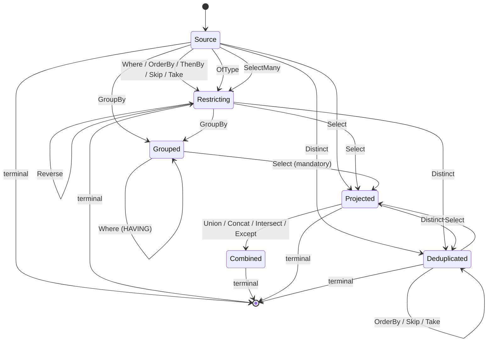

# Wire format

`Scry.Wire` defines the serializable query AST shared by client and server. It is a **restricted, closed node vocabulary** — not general expression-tree serialization — which is what makes every query exhaustively validatable.

These types are rarely constructed by hand; the client translator emits them and the server consumes them. This page is the reference for anyone writing another client, debugging a request, or reviewing the surface.


## Serialization

All (de)serialization goes through `ScryJson`, whose options are part of the contract:

- Property names are **camelCase**.
- Dictionary keys (result rows) are **camelCase**.
- Enums are written as **names**, never numbers, with no naming policy applied.
- Null-valued **properties** are omitted — so optional AST members such as `predicate` or a null constant's `value` do not appear. Result rows are dictionaries, not properties, so an explicit `null` column is still written.
- Polymorphic types use a `$type` discriminator.
- Deserialization is **fail-closed**: unknown discriminators and malformed JSON throw `ScryWireException`, they are not skipped.


### The vocabulary is source-generated

Because the vocabulary is closed, all of it can be emitted at compile time. `WireJsonContext` is a `System.Text.Json` `JsonSerializerContext` over the wire roots; the generator follows properties and `[JsonDerivedType]` from there, so every operator, node, and envelope is covered without being listed twice. Nothing on the wire is reflected over at run time — which matters most in the client's headline deployment, a trimmed Blazor WASM app that would otherwise pay to build that metadata on first query.

One thing cannot be generated here: the **payload**. Its type is the consumer's — a generated query model, an anonymous projection, a DTO of theirs — and this assembly has never seen it. So a reflection resolver sits *behind* the generated set in the chain and only ever answers what the wire does not name. A consumer wanting the payload generated too supplies their own types; nothing about the AST reaches reflection either way.

This is invisible on the wire. Reflection reads the same attributes and produces the same bytes, so a wire type that fell out of the generated set would keep working, silently — `WireMetadataTests` is what makes that drift loud.


### Why the options aren't configurable

There is no API for supplying custom `JsonSerializerOptions`, and that is deliberate.

**There is nothing to configure them *from*.** Unlike a normal ASP.NET application there is no single deployment holding both ends: the client is built separately, against a model DLL by path, and shipped somewhere else — a browser, another service, a third party's codebase. Any option would have to be set identically on both sides, out of band, with nothing verifying that it was. `version` catches a mismatched wire *format*; it cannot catch a client whose naming policy differs from the server's, which fails as an unexplained parse error or, worse, as a request the server reads as empty.

**Several of the options are the security model, not a preference.** Fail-closed deserialization is what keeps the node vocabulary *closed*, and closed is what makes every request exhaustively validatable — see the [security model](security.md). Options handed in from outside can carry `UnmappedMemberHandling.Skip`, a custom `TypeInfoResolver`, a `ReferenceHandler`, or a converter that resurrects a type the AST does not name. Each of those reopens the vocabulary, and a setting that is able to disable an invariant is one that gets disabled by whoever is debugging a `400`.

**There is nothing for a converter to attach to.** The usual reason to want one is a model type `System.Text.Json` cannot write. The exposed [scalar set](annotations.md#scalars) is closed, and a type outside it is not exposed at all — a strongly-typed ID or value object is invisible to clients unless it is `[QueryableComplex]`, whose own members are that same closed set again.

**A fixed format is what makes another client possible.** This page is only writable because the encoding is one thing rather than per-deployment. The same applies in-tree: the [explorer](explorer.md) reuses `ToScryRequest` and `ScryJson` specifically so the request it shows is the one production sends.

What is usually wanted instead already exists, in a narrower place:

| Want | Reach for |
| --- | --- |
| Bound what a query may ask for | [`ScryOptions` limits](server.md#options) — pipeline length, expression and navigation depth, page size, `IN` values, streamed rows |
| Change a name on the wire | [`Name`](annotations.md#naming-a-source) and [`[PreviousNames]`](annotations.md#renaming) — a versioned rename with a migration window, rather than a global reshaping |
| Compression, body size limits, headers | Ordinary ASP.NET Core middleware — these sit outside the wire |
| Readable JSON while debugging | Re-serialize locally with `WriteIndented`; the payload is already a `JsonElement` |


## Request

<!-- snippet: wireRequest -->
<a id='snippet-wireRequest'></a>
```cs
public sealed record QueryRequest(int Version, string Root, IReadOnlyList<QueryOp> Pipeline)
{
    /// <summary>
    /// Creates a request stamped with the lowest <see cref="WireFormat"/> version that can carry its
    /// pipeline whole — see <see cref="WireFormat.RequiredVersion"/>.
    /// </summary>
    public static QueryRequest Create(string root, IReadOnlyList<QueryOp> pipeline, string? stamp = null) =>
        new(WireFormat.RequiredVersion(pipeline), root, pipeline)
        {
            Stamp = stamp
        };

    /// <summary>
    /// The schema stamp of the generated client model the query was written against, when known.
    /// Lets the server distinguish a stale client (generated against a different model) from an
    /// invalid query. Omitted on the wire when null; servers ignore an unrecognized stamp property,
    /// so carrying it is compatible in both directions.
    /// </summary>
    public string? Stamp { get; init; }
}
```
<sup><a href='/src/Scry.Wire/QueryRequest.cs#L7-L28' title='Snippet source file'>snippet source</a> | <a href='#snippet-wireRequest' title='Start of snippet'>anchor</a></sup>
<!-- endSnippet -->

```json
{
  "version": 1,
  "root": "Employee",
  "pipeline": [ ... ]
}
```

| Field | Meaning |
| --- | --- |
| `version` | Wire format version. The server rejects anything newer than it understands. |
| `root` | The source name — the allow-listed type name, or the attribute's [`Name`](annotations.md#naming-a-source) when set. |
| `pipeline` | Ordered operators, applied left to right. |
| `stamp` | Optional. The [schema stamp](#schema-stamp) of the model the client was generated against. Omitted when unknown. |

Because `root` is part of the contract, prefer setting `Name` over relying on the type name if the CLR type is likely to be renamed.

`QueryRequest.Create(root, pipeline)` fills in the current wire version, and takes an optional schema stamp.


### The URL form

The same request travels one of two ways, and the JSON above is identical in both. As a body:

```
POST {pattern}
Content-Type: application/json

{"version":1,"root":"Employee","pipeline":[...]}
```

Or, when it is short enough, as a URL — the serialized request base64url-encoded into a single `q` parameter:

```
GET {pattern}?q=eyJ2ZXJzaW9uIjoxLCJyb290IjoiRW1wbG95ZWUi...
```

| | |
| --- | --- |
| Parameter | `q` (`QueryUrl.Parameter`) |
| Encoding | base64url of the UTF-8 JSON, unpadded (`QueryUrl.Encode`) |
| Limit | `QueryUrl.MaxLength` — 4096 encoded characters |
| Over the limit | sent as a body instead; both endpoints stay mapped |

`MapScry` maps `GET` and `POST` on the same pattern to the same handler, so the two forms differ in transport only: same validation, same allow-list, same policies, same response. Which one a client uses is not a property of the query — a client may send either, and a server answers both.

The form exists because a cache decides what it may store from the method and the URL, before it looks at anything else. A `POST` is uncacheable to every cache between the client and the server, and its body is part of no cache key; a `GET` carrying the query in its URL is an ordinary cacheable request, which is what makes [conditional requests](caching.md) work without both ends hand-implementing them.

The request travels in the URL rather than in content on the `GET` for two reasons, both of which are about what survives the trip. A browser will not send content on a `GET` at all — the Fetch standard forbids it, which rules a body out for a WASM client and for the explorer. And an intermediary is permitted to drop the content of a `GET`, after which the request still looks well-formed — same method, same URL — but carries nothing to execute, so the server answers 400 and the client cannot distinguish that from a rejection it caused itself. A URL survives every hop by construction.

base64url rather than the JSON percent-encoded: length is the binding constraint, and percent-encoding inflates JSON by about 1.84× where base64url costs 1.33×. It also has no reserved characters, so what the client writes is what the server reads.

A URL is logged, though, by every hop it passes and in the `Referer` of whatever the page does next — constants included. A query whose constants are sensitive on their own belongs on `POST` whatever its length.

Decoding fails closed like the rest of the wire: a `q` that is absent, not base64url, or not a request the server can parse is a 400, never a partial query.


## Operators

<!-- snippet: wireOperators -->
<a id='snippet-wireOperators'></a>
```cs
[JsonPolymorphic(TypeDiscriminatorPropertyName = "$type")]
[JsonDerivedType(typeof(WhereOp), "where")]
[JsonDerivedType(typeof(OrderByOp), "orderBy")]
[JsonDerivedType(typeof(ThenByOp), "thenBy")]
[JsonDerivedType(typeof(SkipOp), "skip")]
[JsonDerivedType(typeof(TakeOp), "take")]
[JsonDerivedType(typeof(SelectOp), "select")]
[JsonDerivedType(typeof(SelectManyOp), "selectMany")]
[JsonDerivedType(typeof(OfTypeOp), "ofType")]
[JsonDerivedType(typeof(GroupByOp), "groupBy")]
[JsonDerivedType(typeof(DistinctOp), "distinct")]
[JsonDerivedType(typeof(ReverseOp), "reverse")]
[JsonDerivedType(typeof(JoinOp), "join")]
[JsonDerivedType(typeof(SetOp), "set")]
[JsonDerivedType(typeof(CountOp), "count")]
[JsonDerivedType(typeof(LongCountOp), "longCount")]
[JsonDerivedType(typeof(AnyOp), "any")]
[JsonDerivedType(typeof(AllOp), "all")]
[JsonDerivedType(typeof(FirstOp), "first")]
[JsonDerivedType(typeof(SingleOp), "single")]
[JsonDerivedType(typeof(LastOp), "last")]
[JsonDerivedType(typeof(AggregateOp), "aggregate")]
[JsonDerivedType(typeof(PageOp), "page")]
public abstract record QueryOp;
```
<sup><a href='/src/Scry.Wire/Operators/QueryOp.cs#L8-L33' title='Snippet source file'>snippet source</a> | <a href='#snippet-wireOperators' title='Start of snippet'>anchor</a></sup>
<!-- endSnippet -->

| `$type` | Payload | Meaning |
| --- | --- | --- |
| `where` | `predicate: Node` | Filter. |
| `orderBy` | `key: Node`, `descending: bool` | Primary ordering. |
| `thenBy` | `key: Node`, `descending: bool` | Secondary ordering. Must follow `orderBy`. |
| `skip` | `count: int` | Skip elements. |
| `take` | `count: int` | Take at most `count`, capped by `MaxPageSize`. |
| `groupBy` | `keys: Node[]` | Group. Exactly one key is supported. |
| `select` | `projection: Projection` | Project to the requested shape. |
| `count` | — | Terminal, scalar. |
| `any` | `predicate: Node?` | Terminal, scalar. |
| `first` | `orDefault: bool`, `predicate: Node?` | Terminal, single. |
| `single` | `orDefault: bool`, `predicate: Node?` | Terminal, single. |
| `page` | `size: int?`, `cursor: string?` | Terminal, page. Bounded page of rows; `size` null uses `DefaultPageSize`, capped by `MaxPageSize`. `cursor` resumes a previous page (keyset). See [Paging](paging.md). |

At most one terminal, and nothing may follow it.

The legal operator orderings form a small state machine — every absent edge is an illegal ordering:<!-- include: pipeline-order. path: /docs/includes/pipeline-order.include.md -->



Nothing orders, skips, or takes after `GroupBy`; a `GroupBy` cannot reach a terminal without a
`Select` in between; and there is no second `GroupBy` or `Select`. A `Where` after `GroupBy` is the
one exception — it filters the groups rather than the rows, and reads only the key and aggregates.
`ThenBy` and `Reverse` without a preceding `OrderBy` are rejected, and nothing may follow a terminal.

A set operation combines the projected rows with a second source, so like a join only a terminal may
follow: the combined rows come from two sources and have no single root left to read.

`OfType` narrows to a derived type, leaving the query restricting but against that type — so the
members it declares become nameable and the base's stay so.

`SelectMany` flattens a collection into its elements, so it leaves the query restricting — but against
a different row. Everything after it is written against the element, at most one is allowed, and an
ordering written before it does not carry across.

`Distinct` deduplicates the projected rows, so what may follow it is the `Select` it deduplicates, a
terminal, and — over a flat projection of up to eight members — an `OrderBy` naming one of them, plus
`Skip` and `Take` over the resulting order. Filtering after it would be describing the rows that fed it, and
paging without an ordering would be slicing an order the deduplication never defined.<!-- endInclude -->


## Expressions

<!-- snippet: wireExpressions -->
<a id='snippet-wireExpressions'></a>
```cs
[JsonPolymorphic(TypeDiscriminatorPropertyName = "$type")]
[JsonDerivedType(typeof(MemberNode), "member")]
[JsonDerivedType(typeof(ElementNode), "element")]
[JsonDerivedType(typeof(ConstNode), "const")]
[JsonDerivedType(typeof(BinaryNode), "binary")]
[JsonDerivedType(typeof(UnaryNode), "unary")]
[JsonDerivedType(typeof(CallNode), "call")]
[JsonDerivedType(typeof(ConditionalNode), "conditional")]
[JsonDerivedType(typeof(SubqueryNode), "subquery")]
[JsonDerivedType(typeof(CollateNode), "collate")]
[JsonDerivedType(typeof(InSourceNode), "inSource")]
[JsonDerivedType(typeof(AggregateNode), "aggregate")]
[JsonDerivedType(typeof(GroupKeyNode), "groupKey")]
[JsonDerivedType(typeof(CompositeKeyNode), "compositeKey")]
public abstract record Node;
```
<sup><a href='/src/Scry.Wire/Expressions/Node.cs#L7-L23' title='Snippet source file'>snippet source</a> | <a href='#snippet-wireExpressions' title='Start of snippet'>anchor</a></sup>
<!-- endSnippet -->


### `member`

```json
{ "$type": "member", "path": "Name" }
{ "$type": "member", "path": ["Manager", "Name"] }
```

A navigation path of allow-listed property names. Each segment is validated against the allow-list of the type reached so far; every non-final segment must be a reference navigation.

A path naming a single member is written as a bare string, and one naming any other number as an array. The two spellings are alternatives rather than synonyms — `["Name"]` is **rejected**, so a path has exactly one encoding and two requests meaning the same thing cannot differ in bytes. Every `path` on the wire follows this rule, not only this node's: `selectMany`, `subquery`, `nested`, and a join's projected members read the same way.


### `element`

```json
{ "$type": "element" }
```

The element of the collection a `subquery` is reading — the counterpart of `member` for a [collection of **values**](querying.md#collection-subqueries) rather than of rows, whose elements have no member to name. `Tags.Any(_ => _ == "urgent")` is a `binary` over this and a `const`; `Scores.Sum()` is a `subquery` whose `selector` is this.

Carries no payload, and is valid **only** where the row being read is a value. Anywhere else the server rejects it: it would otherwise name a whole row, which is not something a query may compare, order by, or project.


### `const`

```json
{ "$type": "const", "value": "FullTime", "tag": "Enum" }
```

`value` is the invariant-culture string form, omitted entirely for a null constant. `tag` describes the shape the client had:

<!-- snippet: wireTypeTags -->
<a id='snippet-wireTypeTags'></a>
```cs
/// <summary>The CLR shape of a constant literal on the wire. The server reconciles it against the
/// member type at the comparison site.</summary>
public enum ClrTypeTag
{
    Null,
    String,
    Boolean,
    Int32,
    Int64,
    Decimal,
    Double,
    DateTime,
    DateOnly,
    Guid,
    Bytes,
    Enum
}
```
<sup><a href='/src/Scry.Wire/ClrTypeTag.cs#L3-L21' title='Snippet source file'>snippet source</a> | <a href='#snippet-wireTypeTags' title='Start of snippet'>anchor</a></sup>
<!-- endSnippet -->

The tag is a hint, not an instruction. The server parses the value into the **member's** type at the comparison site, so `tag` never dictates what CLR type is constructed. Types with no dedicated tag (`TimeOnly`, `TimeSpan`, `DateTimeOffset`, `char`) travel as `String` and are reconciled the same way. A `Bytes` value carries a `byte[]` as a base64 string.

#### Temporal spellings

Every temporal value travels in a **round-trip** form, so the text carries the whole value rather than whatever a default `ToString` would print:

| CLR type | `tag` | wire text |
| --- | --- | --- |
| `DateTime` (`Utc`) | `DateTime` | `2026-09-03T00:00:00.0000000Z` |
| `DateTime` (`Unspecified`) | `DateTime` | `2026-09-03T00:00:00.0000000` |
| `DateTime` (`Local`) | `DateTime` | `2026-09-03T00:00:00.0000000` — see below |
| `DateOnly` | `DateOnly` | `2026-09-03` |
| `TimeOnly` | `String` | `05:06:07.1230000` |
| `TimeSpan` | `String` | `01:02:03.4560000` |
| `DateTimeOffset` | `String` | `2026-03-04T05:06:07.1230000+02:00` |

A `DateTimeOffset` keeps its own offset: the offset is part of the value, and the server parses it back whole.

A `DateTime` does **not** carry one. A `Local` kind is flattened to the wall clock it names, and the `Local`/`Unspecified` distinction is not on the wire. An offset would otherwise be read back against the *server's* zone — `DateTime.Parse(…, RoundtripKind)` resolves an offset-bearing text into local time — and the provider binds the resulting wall clock, so one request would name a different moment on two deployments. That is the same environment dependency [`DayOfWeek`](querying.md#functions) is composed by hand to avoid and the `LocalDateTime` reading of an offset is not carried for, and a constant may not smuggle it in. Flattened, what the client wrote as its wall clock reaches SQL as that wall clock, identically wherever the server runs.

The same spellings encode a [paging cursor's](paging.md) ordering-key values, for the same reason: a key that travelled differently from the constant the same value becomes is a key the seek predicate compares against something else.


### `binary` and `unary`

```json
{
  "$type": "binary",
  "op": "GreaterThan",
  "left":  { "$type": "member", "path": "Amount" },
  "right": { "$type": "const", "value": "100", "tag": "Decimal" }
}
```

<!-- snippet: wireBinaryOps -->
<a id='snippet-wireBinaryOps'></a>
```cs
/// <summary>Binary operators allowed in a predicate or projection expression.</summary>
public enum BinaryOp
{
    Equal,
    NotEqual,
    LessThan,
    LessThanOrEqual,
    GreaterThan,
    GreaterThanOrEqual,
    AndAlso,
    OrElse,
    Add,
    Subtract,
    Multiply,
    Divide,
    Modulo,
    Coalesce
}

/// <summary>Unary operators allowed in an expression.</summary>
public enum UnaryOp
{
    Not,
    Negate
}
```
<sup><a href='/src/Scry.Wire/BinaryOp.cs#L3-L29' title='Snippet source file'>snippet source</a> | <a href='#snippet-wireBinaryOps' title='Start of snippet'>anchor</a></sup>
<!-- endSnippet -->

When one side is a constant, its type is inferred from the other side, and nullable/non-nullable operands are coerced to match.


### `call`

```json
{
  "$type": "call",
  "function": "StringStartsWith",
  "target": { "$type": "member", "path": "Name" },
  "arguments": [ { "$type": "const", "value": "A", "tag": "String" } ]
}
```

<!-- snippet: wireFunctions -->
<a id='snippet-wireFunctions'></a>
```cs
/// <summary>The closed set of functions a client may call on a value. No free-form method names.</summary>
public enum KnownFunction
{
    StringContains,
    StringStartsWith,
    StringEndsWith,
    StringToLower,
    StringToUpper,
    StringIsNullOrEmpty,
    StringIsNullOrWhiteSpace,
    StringLength,
    StringTrim,
    StringTrimStart,
    StringTrimEnd,
    StringSubstring,
    StringIndexOf,
    StringReplace,

    /// <summary>
    /// The first and last character of a string, as <c>FirstOrDefault</c> and <c>LastOrDefault</c>
    /// spell them — a substring of one, taken at either end. The indexer that looks like it means the
    /// same is not carried: no provider translates it, and one that reads past the end of the text
    /// would fault where these answer with the default.
    /// </summary>
    StringFirst,
    StringLast,
    DateYear,
    DateMonth,
    DateDay,
    DateHour,
    DateMinute,
    DateSecond,
    DateMillisecond,
    DateDayOfYear,

    /// <summary>
    /// The sub-millisecond parts, each within the one above it: 0-999 microseconds of the
    /// millisecond, 0-999 nanoseconds of the microsecond. SQL Server's DATEPART counts them from the
    /// whole second, so the server takes the remainder, exactly as EF does.
    /// </summary>
    DateMicrosecond,
    DateNanosecond,

    /// <summary>The count of days since 0001-01-01 (<c>DateOnly.DayNumber</c>).</summary>
    DateDayNumber,

    /// <summary>
    /// The day of the week, numbered as <see cref="System.DayOfWeek"/> does — 0 for Sunday. The server
    /// owns how that is expressed in SQL, since the obvious formulation is not deterministic.
    /// </summary>
    DateDayOfWeek,
    DateDate,

    /// <summary>
    /// The time of day a date carries, as the <see cref="System.TimeSpan"/> since midnight. The
    /// counterpart of <see cref="DateDate"/>, which drops the same part instead of keeping it.
    /// </summary>
    DateTimeOfDay,

    /// <summary>
    /// The parts of an elapsed time, each within the unit above it — the hours of the day, the
    /// minutes of the hour, and so on down. Whole totals (<c>TotalHours</c> and its siblings) are a
    /// division rather than a part and no provider translates them, so they are not carried.
    /// </summary>
    TimeSpanHours,
    TimeSpanMinutes,
    TimeSpanSeconds,
    TimeSpanMilliseconds,
    TimeSpanMicroseconds,
    TimeSpanNanoseconds,

    /// <summary>
    /// Reading one temporal type as another: the date or the time half of a timestamp, a time read as
    /// an elapsed time, and a date and a time composed back into one. Each is a conversion the
    /// database performs, so the answer does not depend on the client's calendar or its clock.
    /// </summary>
    DateOnlyFromDateTime,
    TimeOnlyFromDateTime,
    TimeOnlyFromTimeSpan,
    DateTimeFromDateAndTime,

    /// <summary>
    /// Unix time, counted from 1970-01-01 UTC (<c>DateTimeOffset.ToUnixTimeSeconds</c>). The
    /// <c>DateTime</c> / <c>UtcDateTime</c> / <c>LocalDateTime</c> readings of an offset are not
    /// carried alongside them: the provider has a translation only for a column whose store type is
    /// <c>datetimeoffset</c> and refuses the expression otherwise, and the local reading would go
    /// through <c>CURRENT_TIMEZONE_ID()</c> — the server's own zone — even where it does translate.
    /// </summary>
    UnixSecondsFromOffset,
    UnixMillisecondsFromOffset,

    DateAddYears,
    DateAddMonths,
    DateAddDays,
    DateAddHours,
    DateAddMinutes,
    DateAddSeconds,
    DateAddMilliseconds,
    /// <summary>
    /// Joins the target and the argument into one string, converting either if it is not one already.
    /// C# writes this as <c>+</c>, but the operator alone does not say it: an Add of a string and a
    /// number is a concatenation, while an Add of two numbers is arithmetic, and only the client can
    /// tell which was written.
    /// </summary>
    StringConcat,

    /// <summary>
    /// The target's value as text — <c>ToString()</c> with no arguments. The formatted overload is not
    /// part of the set: no provider translates it, and the SQL function that would express it reads
    /// the server's language, so the same row would format differently per connection.
    /// </summary>
    StringFrom,

    MathAbs,
    MathCeiling,
    MathFloor,
    MathRound,
    MathTruncate,
    /// <summary>
    /// The sign of the target: -1, 0, or 1. The server composes it from comparisons rather than from
    /// SQL's own function, whose result takes the argument's type and so cannot be read back as the
    /// <see cref="int"/> this returns.
    /// </summary>
    MathSign,

    MathSqrt,
    MathPow,
    MathExp,

    /// <summary>Natural logarithm, or — with one argument — the logarithm to that base.</summary>
    MathLog,
    MathLog10,
    MathSin,
    MathCos,
    MathTan,
    MathAsin,
    MathAcos,
    MathAtan,

    /// <summary>The angle whose tangent is the target over the argument (<c>Math.Atan2(y, x)</c>).</summary>
    MathAtan2,

    /// <summary>
    /// The greater / lesser of the target and the argument (<c>Math.Max</c> / <c>Math.Min</c>). The
    /// server composes each from a comparison rather than using SQL's GREATEST and LEAST, which exist
    /// only from SQL Server 2022; a null operand keeps the answer null.
    /// </summary>
    MathMax,
    MathMin,

    /// <summary>
    /// Degrees to radians and back (<c>double.DegreesToRadians</c> / <c>RadiansToDegrees</c> —
    /// statics on the floating types rather than on <c>Math</c>). Defined over double alone, so the
    /// target is widened to reach them.
    /// </summary>
    MathDegreesToRadians,
    MathRadiansToDegrees,

    /// <summary>
    /// Membership of a client-supplied set (SQL <c>IN</c>). The target is the value being tested and
    /// every argument is a <see cref="ConstNode"/>; the server caps the number of values.
    /// </summary>
    In,

    /// <summary>
    /// Whether the target — a [Flags] enum member — carries the argument's bits
    /// (<c>Enum.HasFlag</c>). A combined flag travels by name exactly as <c>Enum.ToString</c> spells
    /// it: <c>"Parking, Gym"</c>.
    /// </summary>
    EnumHasFlag,

    /// <summary>
    /// Reads text as a value — <c>int.Parse</c> / <c>Convert.ToInt32</c> and their siblings; the
    /// inverse of <see cref="StringFrom"/>. Only that direction exists: a numeric member is already a
    /// value, and SQL's numeric-to-numeric conversions truncate where the CLR's round, so those are
    /// not carried. Text that does not parse faults at execution, exactly as it would in memory.
    /// </summary>
    Int32From,
    Int64From,
    DecimalFrom,
    DoubleFrom,
    BooleanFrom,
    ByteFrom,
    Int16From,
    SingleFrom,

    /// <summary>
    /// Three-way comparison (<c>a.CompareTo(b)</c>, <c>string.Compare(a, b)</c>): -1, 0, or 1, or
    /// null when either operand is — a comparison against a value that is not there has no direction.
    /// Numbers, text and dates compare; text compares under the server's collation, exactly as its
    /// ordering does.
    /// </summary>
    CompareTo,

    /// <summary>
    /// Questions about a binary member's bytes, without reading them: how many there are
    /// (<c>DATALENGTH</c>), whether a byte is among them (<c>CHARINDEX</c>), and the byte at one
    /// position. An <c>[Attachment]</c> answers none of them — its value is the one thing no query
    /// reads — so these reach a plain or <c>[BinaryTransfer]</c> member only. <c>Any()</c> is absent
    /// because the provider refuses it; ask whether <see cref="BytesLength"/> is above zero, which is
    /// the same question and does translate.
    /// </summary>
    BytesLength,
    BytesContains,
    BytesElementAt
}
```
<sup><a href='/src/Scry.Wire/KnownFunction.cs#L3-L210' title='Snippet source file'>snippet source</a> | <a href='#snippet-wireFunctions' title='Start of snippet'>anchor</a></sup>
<!-- endSnippet -->

There is no free-form method name anywhere in the format. This enum is the complete set of behaviour a client can request.


### `aggregate`

```json
{ "$type": "aggregate", "function": "Sum", "selector": { "$type": "member", "path": "Amount" } }
```

<!-- snippet: wireAggregates -->
<a id='snippet-wireAggregates'></a>
```cs
/// <summary>
/// Aggregate functions, used either in a projection over a grouped query or as a terminal folding
/// the whole sequence to one scalar. <see cref="Count"/> is grouped-projection only — counting a
/// sequence has its own terminal — and so is <see cref="Join"/>, which has no terminal form.
/// </summary>
public enum AggregateFn
{
    Count,
    Sum,
    Average,
    Min,
    Max,

    /// <summary>
    /// Joins the group's text values into one string (SQL <c>STRING_AGG</c>), separated by
    /// <see cref="AggregateNode.Separator"/>. The values are ordered by themselves: SQL leaves the
    /// concatenation order unspecified, so the server imposes one, and the same answer reads from
    /// any source.
    /// </summary>
    Join
}
```
<sup><a href='/src/Scry.Wire/AggregateFn.cs#L3-L25' title='Snippet source file'>snippet source</a> | <a href='#snippet-wireAggregates' title='Start of snippet'>anchor</a></sup>
<!-- endSnippet -->

`selector` is omitted for `Count`. An aggregate is valid **only** as a projection member in a `select` that follows a `groupBy`.


### `groupKey`

```json
{ "$type": "groupKey", "index": 0 }
```

The key a query grouped by, read in the `select` or `where` that follows the `groupBy`, and rejected anywhere else. `index` selects the part of a composite key and is zero for a single one.

A key that is a plain member is named instead by its own `member` node, whose path the server matches back to the position it grouped at — so an existing client's grouped requests are unchanged by this node's existence. It is for the keys with no path to name: one computed from an expression, where the only thing left to say is which of the query's keys is meant.


## Projections

```json
{
  "projection": {
    "members": [
      "Name",
      { "name": "ManagerName", "value": { "$type": "node", "node": { "$type": "member", "path": ["Manager", "Name"] } } }
    ]
  }
}
```

A member has two spellings, and — as with a [member path](#member) — each case has exactly one of them.

A member reading the member it is named for travels as a **bare string**: the name and the single-segment path of the node it wraps are the same token, and spelling it twice says nothing. This is what every member of a [default projection](querying.md#without-a-select) is, so it is most of what a query writing no `Select` sends.

Everything else travels as an **object** with `name` and `value`: a member renamed away from what it reads, one reaching through a navigation, and one whose value is not a member read at all. A member qualifying for the string but arriving as an object is refused, so two requests meaning the same thing are the same bytes — which is what the `ETag` and anything else keying off a request already assume.

<!-- snippet: wireProjectionValues -->
<a id='snippet-wireProjectionValues'></a>
```cs
/// <summary>The value of a projection member.</summary>
[JsonPolymorphic(TypeDiscriminatorPropertyName = "$type")]
[JsonDerivedType(typeof(NodeValue), "node")]
[JsonDerivedType(typeof(NestedValue), "nested")]
public abstract record ProjectionValue;
```
<sup><a href='/src/Scry.Wire/Projections/ProjectionValue.cs#L3-L9' title='Snippet source file'>snippet source</a> | <a href='#snippet-wireProjectionValues' title='Start of snippet'>anchor</a></sup>
<!-- endSnippet -->

| `$type` | Payload | Produces |
| --- | --- | --- |
| `node` | `node: Node` | A scalar leaf, or an aggregate in a grouped select. |
| `nested` | `path: string` or `string[]`, `projection: Projection` | A nested JSON object built from a navigation. |

A projection must have at least one member. Nested projections are not allowed in a grouped select, and nesting depth is capped by `MaxNavigationDepth`.


## Response

<!-- snippet: wireResponse -->
<a id='snippet-wireResponse'></a>
```cs
public sealed partial record QueryResponse(
    [property: JsonPropertyOrder(0)] int Version,
    [property: JsonPropertyOrder(1)] ResultKind Kind,
    JsonElement Payload)
{
    /// <summary>Creates a response stamped with the current <see cref="WireFormat.Version"/>.</summary>
    public static QueryResponse Create(ResultKind kind, JsonElement payload) =>
        new(WireFormat.Version, kind, payload);

    /// <summary>
    /// The server's schema stamp, carried on every successful response so a client can compare it
    /// against its own and detect a drifted model. The HTTP transport also advertises it as a header
    /// (<see cref="WireFormat.SchemaStampHeader"/>), which additionally covers error responses; this is
    /// the channel every other transport uses.
    /// </summary>
    [JsonPropertyOrder(3)]
    public string? Stamp { get; init; }

    /// <summary>
    /// Renamed enum values ([PreviousNames] on the server model), sent only when the request's schema
    /// stamp differs from the server's. Lets a client generated before a rename resolve a value name
    /// it does not know to one it does. Null otherwise, and omitted from the JSON.
    /// </summary>
    [JsonPropertyOrder(4)]
    public IReadOnlyList<EnumAlias>? EnumAliases { get; init; }

    /// <summary>
    /// The raw binary parts a <see cref="ScryBinary.ContentType"/> response arrived with, in wire
    /// order, set by the transport for <c>ScryJson.DeserializePayload</c> to resolve placeholders
    /// against. Never serialized — the parts travel beside the JSON, not inside it.
    /// </summary>
    [JsonIgnore]
    public IReadOnlyList<byte[]>? BinaryParts { get; init; }
}
```
<sup><a href='/src/Scry.Wire/QueryResponse.cs#L15-L50' title='Snippet source file'>snippet source</a> | <a href='#snippet-wireResponse' title='Start of snippet'>anchor</a></sup>
<!-- endSnippet -->

```json
{
  "version": 1,
  "kind": "List",
  "payload": [ { "name": "Alice", "status": "FullTime" } ],
  "stamp": "9PcWs1g22NAOclcT"
}
```

| `kind` | `payload` |
| --- | --- |
| `List` | An array of projected row objects. |
| `Single` | One projected row object, or `null`. |
| `Scalar` | A bare value (`int` for `count`, `bool` for `any`). |
| `Page` | A `ScryPage` envelope: `{ items: [...], hasMore: bool, cursor: string? }` — `cursor` set for a seek-safe page, else null. See [Paging](paging.md). |

The client checks that `kind` matches the terminal it sent and throws `ScryWireException` if it does not.

`stamp` is the server's [schema stamp](#schema-stamp), carried on **every** successful response — this is what a client compares against its own to notice a drifted model. Over HTTP the same value is also sent as the `Scry-Schema-Stamp` header, which additionally covers *error* responses, where there is no body to read it from. Every other transport (SignalR, gRPC, in-process) uses the body, so [drift detection](schema-versioning.md#detecting-a-stale-client) is not HTTP-specific.

`enumAliases` is optional and **additive**: it appears only when the request's schema stamp differs from the server's and the model declares enum value renames via `[PreviousNames]` ([Annotations](annotations.md#renaming)). Each entry maps the name the payload serializes a value under to the previous names it was exposed as:

```json
{
  "version": 1,
  "kind": "List",
  "payload": [ { "name": "Carol", "status": "Contractor" } ],
  "enumAliases": [ { "enumName": "Status", "valueName": "Contractor", "previousNames": [ "Freelancer" ] } ]
}
```

The payload itself always carries the **current** name — the aliases are a translation table for a reader generated before the rename, never a second serialization. A reader that does not understand the field ignores it.

**A response declares its length when it has one.** The envelope is written into a buffer, and a result whose whole envelope fits under the server's [`ResponseSpillThreshold`](server.md#response-size) — 64 KB by default — is sent as one body with a `Content-Length`. A result that outgrows it is sent as it is written instead, which gives up the length: the response is chunked, and its status was committed before the last row was read.

That is the same trade the closing marker below exists for, arrived at through the transport rather than through the format. Past the threshold a failure has no way to become a `400` or a `500`, so the answer is truncated instead — but a truncated one is never mistakable for a complete one. The envelope's closing `stamp` is written only after the last row, and the host does not synthesize a valid ending: HTTP/1.1 closes the connection with no terminating chunk, HTTP/2 resets the stream. A reader must treat a body that ends early as a failure, exactly as it must treat a stream that ends without its marker. A response carrying [binary parts](#binary-transfer) is never sent early whatever the threshold says, because its parts have to precede the JSON that references them.


### Streamed results

A request sent to the [`…/stream` endpoint](server.md#mapping-the-endpoint) comes back as newline-delimited JSON (`application/x-ndjson`) instead: one JSON value per line, a marker line opening and closing the rows.

```
{"$scry":"begin","version":1,"stamp":"WsQ9hxzDNvqFuufg"}
{"name":"Aaron","status":"FullTime"}
{"name":"Alice","status":"FullTime"}
{"$scry":"end"}
```

The rows between the markers are exactly the objects a `list` payload holds, so a reader materializes them the same way. The opening marker carries what a single response carries on the envelope — the version, the schema stamp, and any enum aliases, sent under the same rule as [above](#response).

`$scry` is what tells a marker from a row. Projected member names come from the client's own C# identifiers, and `$` cannot start one, so no row can collide with it.

**The closing marker is load-bearing.** A stream commits to a success status before its first row is written, so a failure past that point cannot become a `400` or a `500`. Without an explicit end, a truncated response — a dropped connection, a faulting provider, a killed server — would be indistinguishable from a complete one, and a reader would silently return a short answer. A reader must therefore require the marker and fail without it. A failure the server does notice closes the stream instead with:

```
{"$scry":"error","error":"The query returned more than the maximum of 1000 streamed rows."}
```

carrying a validation message, which is the client's own doing, or a generic one — the same rule a non-streamed `500` follows, so nothing internal leaks either way.


## Batched queries

A request sent to the [`…/batch` endpoint](server.md#mapping-the-endpoint) carries several queries at once. It introduces no query vocabulary: an entry is an ordinary `QueryRequest`, unchanged and complete, so a batch is only an envelope around requests the format already defines.

```json
{
  "version": 1,
  "queries": [
    { "version": 1, "root": "Employee", "pipeline": [ { "$type": "count" } ] },
    { "version": 1, "root": "Department", "pipeline": [ { "$type": "count" } ] }
  ]
}
```

The response answers each entry positionally, and is likewise an envelope around ordinary `QueryResponse` values:

```json
{
  "version": 1,
  "stamp": "WsQ9hxzDNvqFuufg",
  "results": [
    { "response": { "version": 1, "kind": "Scalar", "payload": 4 } },
    { "error": "Unknown source 'Secret'.", "status": 400 }
  ]
}
```

| Field | Meaning |
| --- | --- |
| `response` | The entry's result, when it succeeded — exactly what it would have been sent alone. |
| `error` | Why the entry was rejected or failed; the specific message for a validation failure, and the same fixed text a `500` carries for anything else. |
| `status` | What the entry would have returned on its own: `400` rejected, `500` failed. Entries are returned inside a successful envelope and so have no status to inherit, which is why it is carried. |
| `staleClient` | As on a [single error](#response) — the rejection is attributed to a differing schema stamp. |

**Entries are independent.** Each is validated, policy-filtered, and executed separately, so one being rejected leaves the rest answered — the envelope only fails for a fault of its own: an unreadable body, an unsupported version, or more entries than [`MaxBatchSize`](server.md#options). It is not a transaction, and the entries run sequentially. The schema stamp is carried once on the envelope, since one server answered all of them.


## Binary transfer

A `byte[]` value normally travels as a base64 string — +33% size and an encode/decode on both ends. A member marked `[BinaryTransfer]` ([Annotations](annotations.md)) opts out: over HTTP its values leave the JSON payload entirely and travel as **raw multipart parts** beside it. This is a transfer encoding, not a shape change — the member's generated code, validation surface, introspection, and schema stamp are exactly what they would be without the attribute, and every non-HTTP transport (`ScryProcessor` hosted directly) keeps inline base64.

<!-- snippet: wireBinary -->
<a id='snippet-wireBinary'></a>
```cs
public static class ScryBinary
{
    /// <summary>The media type a binary-carrying response is served as.</summary>
    public const string ContentType = "multipart/mixed";

    /// <summary>The media type of each raw binary part.</summary>
    public const string PartContentType = "application/octet-stream";

    /// <summary>
    /// The property a diverted binary value is replaced with in JSON. Projected member names come from
    /// the client's own C# identifiers, and <c>$</c> cannot start one, so no row can collide with it.
    /// </summary>
    public const string PartProperty = "$bin";

    /// <summary>
    /// The prefix of the multipart boundary. The rest is random per
    /// response, so part content is never scanned for collisions.
    /// </summary>
    public const string BoundaryPrefix = "scry";
}
```
<sup><a href='/src/Scry.Wire/ScryBinary.cs#L17-L38' title='Snippet source file'>snippet source</a> | <a href='#snippet-wireBinary' title='Start of snippet'>anchor</a></sup>
<!-- endSnippet -->

The server decides per response: a result that projects at least one non-null decorated value is served as `multipart/mixed; boundary=scry<32 hex>`; anything else is plain JSON, byte for byte as before. The boundary is random per response and part content is never scanned — an accidental delimiter sequence inside a part is cryptographically negligible, the same bet the BCL's own multipart writers make.

Where a diverted value would have been, the JSON carries a **placeholder**:

```json
{ "name": "alpha", "avatar": { "$bin": 0 } }
```

`$bin` follows the same collision argument as `$type` and `$scry`: projected member names are C# identifiers, and `$` cannot start one. A `null` value stays inline as JSON `null` and produces no part — a placeholder never exists without its part. Only a projection leaf that is a direct member path resolves to a decorated member; a computed value (a conditional, a coalesce) has no owning member and stays base64, which a reader must continue to accept.

**Every part precedes the JSON document that references it**, and `n` indexes that document's parts, 0-based in emission order. A reader resolving placeholders while parsing JSON therefore always has the parts in hand. Concretely, per endpoint:

* **Single** — sections are the binary parts in encounter order, then one `application/json` section holding the ordinary response envelope. Indices span the whole response. Whether the response *may* be sent before it is whole is the projection plan's decision, taken before the first row is read: a plan carrying a binary slot is always held whole. The framing itself stays the data's, so a plan that could divert but produced no part comes back as plain JSON — where a stream, deciding both questions from the plan, would still wrap.
* **Batch** — one flat multipart for the whole batch: parts numbered globally across entries in encounter order, then the batch envelope last. No nested multipart. A batch commits to that framing before its first entry runs, while only entry *n*'s own plan says whether entry *n* diverts — so a batch on a model carrying any `[BinaryTransfer]` member anywhere is held whole. One on a model carrying none may be sent between entries, but never within one: an entry that fails part-way through its rows is still reported as that entry's own result, which nothing already sent could be replaced by.
* **Stream** — the referencing document is each row line, and indices reset after every one. Sections of `application/x-ndjson` lines (markers and rows, exactly the [streamed format](#streamed-results)) alternate with each row's parts, every part arriving in the section run immediately before its row's line — so a reader holds at most one row's parts at a time. Whether the stream wraps at all is decided by the projection plan before the first byte, so an all-null result still arrives as multipart.

Binary parts carry `Content-Type: application/octet-stream` and an advisory `Content-Length` (readers may preallocate from it but must not trust it); part identity is positional, so there is no `Content-Disposition`. A placeholder a reader cannot resolve — an index with no part, or a placeholder in a response that carried none — must fail the read rather than yield a guess.


## Attachment retrieval

A `byte[]` marked `[Attachment]` ([Annotations](annotations.md#attachment)) is never carried by a query at all — not inline, not as a part. It is fetched afterwards, by row key, from an endpoint of its own: `POST {pattern}/attachment`, mapped inside `MapScry` alongside the query, stream, and batch endpoints so one authorization convention covers all four.

This adds nothing to the query vocabulary. No operator, node, or function changed, and the wire version did not move: an attachment member is absent from every response, and a request naming one is rejected. The request below is a shape of its own, versioned separately.

<!-- snippet: wireAttachmentRequest -->
<a id='snippet-wireAttachmentRequest'></a>
```cs
public sealed record AttachmentRequest(int Version, string Root, string Member, IReadOnlyList<AttachmentKey> Keys)
{
    /// <summary>The current attachment request version. Versioned apart from the query wire, which this does not touch.</summary>
    public const int CurrentVersion = 1;

    /// <summary>Creates a request stamped with <see cref="CurrentVersion"/>.</summary>
    public static AttachmentRequest Create(string root, string member, IReadOnlyList<AttachmentKey> keys, string? stamp = null) =>
        new(CurrentVersion, root, member, keys)
        {
            Stamp = stamp
        };

    /// <summary>
    /// The schema stamp of the generated client model the handle came from, when known. Read for the
    /// same reason <see cref="QueryRequest.Stamp"/> is — to attribute a rejection to a stale client —
    /// and never as an authorization input.
    /// </summary>
    public string? Stamp { get; init; }
}

/// <summary>
/// One value of the row's primary key. Mirrors <c>ConstNode</c>: the invariant-culture string form
/// plus the shape the client had, which the server treats as a hint and never as an instruction — the
/// value is parsed into the key member's own CLR type.
/// </summary>
/// <remarks>
/// Keys are positional, ordered by member name ordinal — the order the generator and the server both
/// derive independently, since a composite key's declared order is not visible to the metadata reader.
/// </remarks>
public sealed record AttachmentKey(string? Value, ClrTypeTag Tag);
```
<sup><a href='/src/Scry.Wire/AttachmentRequest.cs#L8-L39' title='Snippet source file'>snippet source</a> | <a href='#snippet-wireAttachmentRequest' title='Start of snippet'>anchor</a></sup>
<!-- endSnippet -->

```json
{
  "version": 1,
  "root": "Employee",
  "member": "Photo",
  "keys": [ { "value": "7", "tag": "Int32" } ],
  "stamp": "9PcWs1g22NAOclcT"
}
```

| Field | Meaning |
| --- | --- |
| `version` | Attachment request version, checked as a query's is. Versioned apart, since this shape is not the query wire. |
| `root` | The source name, resolved through the same allow-list a query's root is. |
| `member` | The attachment member. Honours [`[PreviousNames]`](annotations.md#renaming) exactly as a query member does. |
| `keys` | The row's primary key, ordered **by member name** — see below. |
| `stamp` | Optional, and read for the same reason a query's is: to attribute a rejection to a stale client, never as an authorization input. |

Each key value mirrors a `const` node: the invariant-culture string plus the shape the client had. The tag is a hint — the value is parsed into the **key member's** own type, resolved from the schema, and bound as a parameter exactly as a query constant is.

**Key order is ordinal by member name**, on both sides. The values are positional and carry no names, so the two ends have to derive the same order independently; a composite key's declared order is not visible in the metadata a client is generated from, so it cannot be the one. The server verifies its derived key against the real EF key at startup — see [How the key is derived](attachments.md#how-the-key-is-derived).

The response is not a `QueryResponse`:

| Status | Body |
| --- | --- |
| `200` | The raw bytes, with an advisory `Content-Length`. The media type is what the member declared, or `application/octet-stream` where it declared nothing — see [Content type](attachments.md#content-type). |
| `204` | Empty — the row was readable and the value is null. |
| `404` | Empty — refused, absent, or hidden by a row policy, deliberately indistinguishable. |
| `400` | A `ScryError`, as elsewhere: a malformed request, an unknown source or member, a wrong key count, or a value that does not parse. |
| `500` | A `ScryError` carrying the fixed `Attachment fetch failed.` |

Every one of them carries the `Scry-Schema-Stamp` header, including the `404` — a client whose fetch stopped working is exactly the one that wants to know its model drifted. A `200` also carries `X-Content-Type-Options: nosniff`: the declared type is a statement about a column, and the bytes stored under it are whatever was written there.


## Versioning

<!-- snippet: wireVersion -->
<a id='snippet-wireVersion'></a>
```cs
/// <summary>Wire format version constants.</summary>
public static class WireFormat
{
    /// <summary>The current wire format version.</summary>
    public const int Version = 2;

    /// <summary>
    /// The HTTP response header carrying the server's schema stamp. A successful response also carries
    /// it in the body (<see cref="QueryResponse.Stamp"/>, the channel every non-HTTP transport uses);
    /// the header additionally covers error responses, where there is no body to read it from. Part of
    /// the wire contract.
    /// </summary>
    public const string SchemaStampHeader = "Scry-Schema-Stamp";

    /// <summary>
    /// The HTTP response header carrying the longest encoded query this server wants asked as a URL,
    /// as a decimal integer. Written on every response, so a client learns it from whatever it asked
    /// first and never has to be told out of band. Advisory: a request over the limit is still answered,
    /// because the ceiling being described belongs to the hops in between rather than to this server.
    /// Zero says this deployment maps no GET route at all. Part of the wire contract.
    /// </summary>
    public const string UrlLimitHeader = "Scry-Url-Limit";
```
<sup><a href='/src/Scry.Wire/WireFormat.cs#L3-L26' title='Snippet source file'>snippet source</a> | <a href='#snippet-wireVersion' title='Start of snippet'>anchor</a></sup>
<!-- endSnippet -->

`QueryRequest.Create` and `QueryResponse.Create` stamp the current version. The server rejects a request whose `version` is **greater** than its own — a newer client against an older server fails closed rather than being partially understood. Older requests continue to be accepted.

The `ScryJson` options, the `$type` discriminator strings, and the enum member names are all part of the contract. Changing any of them is a wire break.

**Adding** to the vocabulary — a new operator, node type, or function — does not bump the version. A request that uses only the older vocabulary stays byte-identical, so it keeps working against an older server; bumping the version would break those requests for no reason. A request that does use a new operator reaches an older server as an unknown `$type`, which fails deserialization closed rather than being partially understood — the same guarantee the version check gives, arrived at from the other direction. Removing or renaming any of them remains a break, and would bump the version.


## Schema stamp

`version` covers the *format*. The **schema stamp** covers the *model* — the allow-listed surface a client was generated against.

The stamp is a SHA-256 over a canonical description of the queryable surface — sources with their kinds, query-model types with their members and type displays, and re-emitted enums with their values, each list sorted ordinal — truncated to 96 bits and base64url-encoded, giving a 16-character string. The generator computes it from the model DLL's metadata and bakes it into the generated `ScryQuery` as `SchemaStamp`; the server computes it from the real model by reflection. Both sides compile the same source, so equal surfaces produce equal stamps.

Truncation is safe because the stamp is a **fingerprint, not a security boundary**. Nothing trusts it — every request is re-validated against the real schema whatever stamp arrives, so a forged one buys an attacker nothing but the suppression of their own reload prompt. And it is only ever compared pairwise, one client's against one server's, so the birthday bound does not apply: the chance two genuinely different surfaces collide is 2⁻⁹⁶, and the cost if they did is a missed reload prompt.

The stamp travels in three places:

| Direction | Carrier |
| --- | --- |
| Client → server | `stamp` on the request. The generated `ScryQuery` assigns it to the `ScryClient`, which attaches it to every request. |
| Server → client | The `Scry-Schema-Stamp` response header, set on **every** response including rejections. `ScryClient` records it as `ServerSchemaStamp`, and `SchemaStale` is true once it differs from the client's own. |
| Server → tooling | `schemaStamp` on [introspection](explorer.md). |

The response header is what makes drift detectable *early*: a long-lived client — a cached WASM app — sees the mismatch while its queries are still succeeding, so it can prompt a reload before a breaking change reaches it, rather than discovering the problem as a failed query. See [Detecting a stale client](schema-versioning.md#detecting-a-stale-client) for the client-side API.

A mismatch is **not** rejected on its own — an additive model change leaves older clients working, and the stamp on a request is client-supplied so it is never a security input. On the server it is used only to explain a rejection: when validation fails *and* the request's stamp differs from the server's, the 400 adds that the client was generated against a different model surface and should be regenerated, instead of leaving a bare "not allow-listed" that reads identically to a hostile request.

A request with no stamp (a hand-built request, or another client implementation) is treated exactly as before.


## Worked example

This LINQ:

<!-- snippet: translateWithoutExecuting -->
<a id='snippet-translateWithoutExecuting'></a>
```cs
var request = client.Source<Employee>("Employee")
    .Where(_ => _.Active &&
                _.Status == wanted &&
                _.Name.StartsWith(prefix))
    .OrderBy(_ => _.Name)
    .Take(take)
    .Select(_ => new EmployeeRow(_.Name, _.Status, _.Manager!.Name))
    .ToScryRequest();
```
<sup><a href='/src/Scry.Tests/ClientRoundTripTests.cs#L32-L41' title='Snippet source file'>snippet source</a> | <a href='#snippet-translateWithoutExecuting' title='Start of snippet'>anchor</a></sup>
<!-- endSnippet -->

translates to:

<!-- snippet: ClientRoundTripTests.ToScryRequestTranslatesWithoutExecuting.verified.txt -->
<a id='snippet-ClientRoundTripTests.ToScryRequestTranslatesWithoutExecuting.verified.txt'></a>
```txt
{
  Version: 1,
  Root: Employee,
  Pipeline: [
    {
      Predicate: {
        Op: AndAlso,
        Left: {
          Op: AndAlso,
          Left: {
            Path: [
              Active
            ]
          },
          Right: {
            Left: {
              Path: [
                Status
              ]
            },
            Right: {
              Value: FullTime,
              Tag: Enum
            }
          }
        },
        Right: {
          Function: StringStartsWith,
          Target: {
            Path: [
              Name
            ]
          },
          Arguments: [
            {
              Value: A,
              Tag: String
            }
          ]
        }
      }
    },
    {
      Key: {
        Path: [
          Name
        ]
      },
      Descending: false
    },
    {
      Count: 5
    },
    {
      Projection: {
        Members: [
          {
            Name: Name,
            Value: {
              Node: {
                Path: [
                  Name
                ]
              }
            }
          },
          {
            Name: Status,
            Value: {
              Node: {
                Path: [
                  Status
                ]
              }
            }
          },
          {
            Name: ManagerName,
            Value: {
              Node: {
                Path: [
                  Manager,
                  Name
                ]
              }
            }
          }
        ]
      }
    }
  ]
}
```
<sup><a href='/src/Scry.Tests/ClientRoundTripTests.ToScryRequestTranslatesWithoutExecuting.verified.txt#L1-L92' title='Snippet source file'>snippet source</a> | <a href='#snippet-ClientRoundTripTests.ToScryRequestTranslatesWithoutExecuting.verified.txt' title='Start of snippet'>anchor</a></sup>
<!-- endSnippet -->

Note that `wanted`, `prefix`, and `take` were closure-captured locals; they are evaluated on the client and emitted as constants.

Over HTTP, request and response look like this:

<!-- snippet: WireFormatTests.EmployeeQueryWireFormat.verified.txt -->
<a id='snippet-WireFormatTests.EmployeeQueryWireFormat.verified.txt'></a>
```txt
[
  {
    RequestUri: {
      Path: http://localhost/api/query,
      Query: {
        q: {"version":1,"root":"Employee","pipeline":[{"$type":"where","predicate":{"$type":"member","path":"Active"}},{"$type":"orderBy","key":{"$type":"member","path":"Name"},"descending":false},{"$type":"select","projection":{"members":["Name","Status",{"name":"Manager","value":{"$type":"node","node":{"$type":"member","path":["Manager","Name"]}}},{"name":"Department","value":{"$type":"node","node":{"$type":"member","path":["Department","Name"]}}}]}}],"stamp":"{scrubbed stamp}"}
      }
    },
    RequestMethod: GET,
    ResponseStatus: OK 200,
    ResponseHeaders: {
      Cache-Control: no-cache, private,
      Scry-Schema-Stamp: {Scrubbed},
      Scry-Url-Limit: 4096
    },
    ResponseContent: {"version":2,"kind":"List","payload":[{"name":"Aaron","status":"FullTime","manager":"Alice","department":"Engineering"},{"name":"Alice","status":"FullTime","manager":null,"department":"Engineering"},{"name":"Carol","status":"Contractor","manager":null,"department":"Sales"}],"stamp":"{scrubbed stamp}"}
  }
]
```
<sup><a href='/samples/Sample.Tests/WireFormatTests.EmployeeQueryWireFormat.verified.txt#L1-L18' title='Snippet source file'>snippet source</a> | <a href='#snippet-WireFormatTests.EmployeeQueryWireFormat.verified.txt' title='Start of snippet'>anchor</a></sup>
<!-- endSnippet -->
