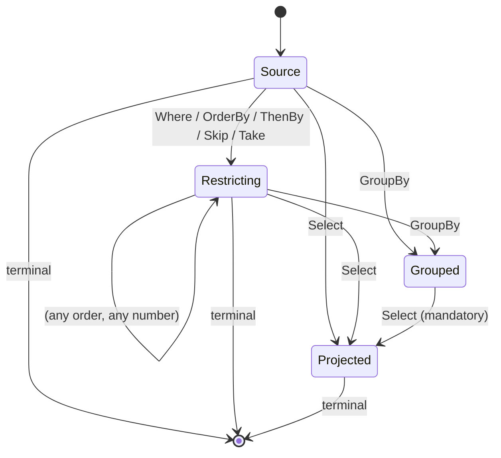

# Wire format

`Scry.Wire` defines the serializable query AST shared by client and server. It is a **restricted, closed node vocabulary** — not general expression-tree serialization — which is what makes every query exhaustively validatable.

These types are rarely constructed by hand; the client translator emits them and the server consumes them. This page is the reference for anyone writing another client, debugging a request, or reviewing the surface.


## Serialization

All (de)serialization goes through `ScryJson`, whose options are part of the contract:

- Property names are **camelCase**.
- Dictionary keys (result rows) are **camelCase**.
- Enums are written as **names**, never numbers, with no naming policy applied.
- Null-valued **properties** are omitted — so optional AST members such as `predicate` or a null constant's `value` do not appear. Result rows are dictionaries, not properties, so an explicit `null` column is still written.
- Polymorphic types use a `$type` discriminator.
- Deserialization is **fail-closed**: unknown discriminators and malformed JSON throw `ScryWireException`, they are not skipped.


## Request

<!-- snippet: wireRequest -->
<a id='snippet-wireRequest'></a>
```cs
public sealed record QueryRequest(int Version, string Root, IReadOnlyList<QueryOp> Pipeline)
{
    /// <summary>Creates a request stamped with the current <see cref="WireFormat.Version"/>.</summary>
    public static QueryRequest Create(string root, IReadOnlyList<QueryOp> pipeline, string? stamp = null) =>
        new(WireFormat.Version, root, pipeline)
        {
            Stamp = stamp
        };

    /// <summary>
    /// The schema stamp of the generated client model the query was written against, when known.
    /// Lets the server distinguish a stale client (generated against a different model) from an
    /// invalid query. Omitted on the wire when null; servers ignore an unrecognized stamp property,
    /// so carrying it is compatible in both directions.
    /// </summary>
    public string? Stamp { get; init; }
}
```
<sup><a href='/src/Scry.Wire/QueryRequest.cs#L7-L25' title='Snippet source file'>snippet source</a> | <a href='#snippet-wireRequest' title='Start of snippet'>anchor</a></sup>
<!-- endSnippet -->

```json
{
  "version": 1,
  "root": "Employee",
  "pipeline": [ ... ]
}
```

| Field | Meaning |
| --- | --- |
| `version` | Wire format version. The server rejects anything newer than it understands. |
| `root` | The source name — the allow-listed type name, or the attribute's [`Name`](annotations.md#naming-a-source) when set. |
| `pipeline` | Ordered operators, applied left to right. |
| `stamp` | Optional. The [schema stamp](#schema-stamp) of the model the client was generated against. Omitted when unknown. |

Because `root` is part of the contract, prefer setting `Name` over relying on the type name if the CLR type is likely to be renamed.

`QueryRequest.Create(root, pipeline)` fills in the current wire version, and takes an optional schema stamp.


## Operators

<!-- snippet: wireOperators -->
<a id='snippet-wireOperators'></a>
```cs
[JsonPolymorphic(TypeDiscriminatorPropertyName = "$type")]
[JsonDerivedType(typeof(WhereOp), "where")]
[JsonDerivedType(typeof(OrderByOp), "orderBy")]
[JsonDerivedType(typeof(ThenByOp), "thenBy")]
[JsonDerivedType(typeof(SkipOp), "skip")]
[JsonDerivedType(typeof(TakeOp), "take")]
[JsonDerivedType(typeof(SelectOp), "select")]
[JsonDerivedType(typeof(GroupByOp), "groupBy")]
[JsonDerivedType(typeof(CountOp), "count")]
[JsonDerivedType(typeof(AnyOp), "any")]
[JsonDerivedType(typeof(FirstOp), "first")]
[JsonDerivedType(typeof(SingleOp), "single")]
[JsonDerivedType(typeof(PageOp), "page")]
public abstract record QueryOp;
```
<sup><a href='/src/Scry.Wire/Operators/QueryOp.cs#L8-L23' title='Snippet source file'>snippet source</a> | <a href='#snippet-wireOperators' title='Start of snippet'>anchor</a></sup>
<!-- endSnippet -->

| `$type` | Payload | Meaning |
| --- | --- | --- |
| `where` | `predicate: Node` | Filter. |
| `orderBy` | `key: Node`, `descending: bool` | Primary ordering. |
| `thenBy` | `key: Node`, `descending: bool` | Secondary ordering. Must follow `orderBy`. |
| `skip` | `count: int` | Skip elements. |
| `take` | `count: int` | Take at most `count`, capped by `MaxPageSize`. |
| `groupBy` | `keys: Node[]` | Group. Exactly one key is supported. |
| `select` | `projection: Projection` | Project to the requested shape. |
| `count` | — | Terminal, scalar. |
| `any` | `predicate: Node?` | Terminal, scalar. |
| `first` | `orDefault: bool`, `predicate: Node?` | Terminal, single. |
| `single` | `orDefault: bool`, `predicate: Node?` | Terminal, single. |
| `page` | `size: int?`, `cursor: string?` | Terminal, page. Bounded page of rows; `size` null uses `DefaultPageSize`, capped by `MaxPageSize`. `cursor` resumes a previous page (keyset). See [Paging](paging.md). |

At most one terminal, and nothing may follow it.

The legal operator orderings form a small state machine — every absent edge is an illegal ordering:<!-- include: pipeline-order. path: /docs/includes/pipeline-order.include.md -->



Nothing filters, orders, skips, or takes after `GroupBy`; a `GroupBy` cannot reach a terminal without
a `Select` in between; and there is no second `GroupBy` or `Select`. `ThenBy` without a preceding
`OrderBy` is rejected, and nothing may follow a terminal.<!-- endInclude -->


## Expressions

<!-- snippet: wireExpressions -->
<a id='snippet-wireExpressions'></a>
```cs
[JsonPolymorphic(TypeDiscriminatorPropertyName = "$type")]
[JsonDerivedType(typeof(MemberNode), "member")]
[JsonDerivedType(typeof(ConstNode), "const")]
[JsonDerivedType(typeof(BinaryNode), "binary")]
[JsonDerivedType(typeof(UnaryNode), "unary")]
[JsonDerivedType(typeof(CallNode), "call")]
[JsonDerivedType(typeof(AggregateNode), "aggregate")]
public abstract record Node;
```
<sup><a href='/src/Scry.Wire/Expressions/Node.cs#L7-L16' title='Snippet source file'>snippet source</a> | <a href='#snippet-wireExpressions' title='Start of snippet'>anchor</a></sup>
<!-- endSnippet -->


### `member`

```json
{ "$type": "member", "path": ["Manager", "Name"] }
```

A navigation path of allow-listed property names. Each segment is validated against the allow-list of the type reached so far; every non-final segment must be a reference navigation.


### `const`

```json
{ "$type": "const", "value": "FullTime", "tag": "Enum" }
```

`value` is the invariant-culture string form, omitted entirely for a null constant. `tag` describes the shape the client had:

<!-- snippet: wireTypeTags -->
<a id='snippet-wireTypeTags'></a>
```cs
/// <summary>The CLR shape of a constant literal on the wire. The server reconciles it against the
/// member type at the comparison site.</summary>
public enum ClrTypeTag
{
    Null,
    String,
    Boolean,
    Int32,
    Int64,
    Decimal,
    Double,
    DateTime,
    DateOnly,
    Guid,
    Bytes,
    Enum
}
```
<sup><a href='/src/Scry.Wire/Enums.cs#L72-L90' title='Snippet source file'>snippet source</a> | <a href='#snippet-wireTypeTags' title='Start of snippet'>anchor</a></sup>
<!-- endSnippet -->

The tag is a hint, not an instruction. The server parses the value into the **member's** type at the comparison site, so `tag` never dictates what CLR type is constructed. Types with no dedicated tag (`TimeOnly`, `TimeSpan`, `DateTimeOffset`, `char`) travel as `String` and are reconciled the same way. A `Bytes` value carries a `byte[]` as a base64 string.


### `binary` and `unary`

```json
{
  "$type": "binary",
  "op": "GreaterThan",
  "left":  { "$type": "member", "path": ["Amount"] },
  "right": { "$type": "const", "value": "100", "tag": "Decimal" }
}
```

<!-- snippet: wireBinaryOps -->
<a id='snippet-wireBinaryOps'></a>
```cs
/// <summary>Binary operators allowed in a predicate or projection expression.</summary>
public enum BinaryOp
{
    Equal,
    NotEqual,
    LessThan,
    LessThanOrEqual,
    GreaterThan,
    GreaterThanOrEqual,
    AndAlso,
    OrElse,
    Add,
    Subtract,
    Multiply,
    Divide
}

/// <summary>Unary operators allowed in an expression.</summary>
public enum UnaryOp
{
    Not,
    Negate
}
```
<sup><a href='/src/Scry.Wire/Enums.cs#L18-L42' title='Snippet source file'>snippet source</a> | <a href='#snippet-wireBinaryOps' title='Start of snippet'>anchor</a></sup>
<!-- endSnippet -->

When one side is a constant, its type is inferred from the other side, and nullable/non-nullable operands are coerced to match.


### `call`

```json
{
  "$type": "call",
  "function": "StringStartsWith",
  "target": { "$type": "member", "path": ["Name"] },
  "arguments": [ { "$type": "const", "value": "A", "tag": "String" } ]
}
```

<!-- snippet: wireFunctions -->
<a id='snippet-wireFunctions'></a>
```cs
/// <summary>The closed set of functions a client may call on a value. No free-form method names.</summary>
public enum KnownFunction
{
    StringContains,
    StringStartsWith,
    StringEndsWith,
    StringToLower,
    StringToUpper,
    StringIsNullOrEmpty,
    DateYear,
    DateMonth,
    DateDay
}
```
<sup><a href='/src/Scry.Wire/Enums.cs#L44-L58' title='Snippet source file'>snippet source</a> | <a href='#snippet-wireFunctions' title='Start of snippet'>anchor</a></sup>
<!-- endSnippet -->

There is no free-form method name anywhere in the format. This enum is the complete set of behaviour a client can request.


### `aggregate`

```json
{ "$type": "aggregate", "function": "Sum", "selector": { "$type": "member", "path": ["Amount"] } }
```

<!-- snippet: wireAggregates -->
<a id='snippet-wireAggregates'></a>
```cs
/// <summary>Aggregate functions allowed in a projection over a grouped query.</summary>
public enum AggregateFn
{
    Count,
    Sum,
    Average,
    Min,
    Max
}
```
<sup><a href='/src/Scry.Wire/Enums.cs#L60-L70' title='Snippet source file'>snippet source</a> | <a href='#snippet-wireAggregates' title='Start of snippet'>anchor</a></sup>
<!-- endSnippet -->

`selector` is omitted for `Count`. An aggregate is valid **only** as a projection member in a `select` that follows a `groupBy`.


## Projections

```json
{
  "projection": {
    "members": [
      { "name": "Name", "value": { "$type": "expr", "expression": { "$type": "member", "path": ["Name"] } } }
    ]
  }
}
```

<!-- snippet: wireProjectionValues -->
<a id='snippet-wireProjectionValues'></a>
```cs
/// <summary>The value of a projection member.</summary>
[JsonPolymorphic(TypeDiscriminatorPropertyName = "$type")]
[JsonDerivedType(typeof(NodeValue), "expr")]
[JsonDerivedType(typeof(NestedValue), "nested")]
public abstract record ProjectionValue;
```
<sup><a href='/src/Scry.Wire/Projections/ProjectionValue.cs#L3-L9' title='Snippet source file'>snippet source</a> | <a href='#snippet-wireProjectionValues' title='Start of snippet'>anchor</a></sup>
<!-- endSnippet -->

| `$type` | Payload | Produces |
| --- | --- | --- |
| `expr` | `expression: Node` | A scalar leaf, or an aggregate in a grouped select. |
| `nested` | `path: string[]`, `projection: Projection` | A nested JSON object built from a navigation. |

A projection must have at least one member. Nested projections are not allowed in a grouped select, and nesting depth is capped by `MaxNavigationDepth`.


## Response

<!-- snippet: wireResponse -->
<a id='snippet-wireResponse'></a>
```cs
public sealed record QueryResponse(int Version, ResultKind Kind, JsonElement Payload)
{
    /// <summary>Creates a response stamped with the current <see cref="WireFormat.Version"/>.</summary>
    public static QueryResponse Create(ResultKind kind, JsonElement payload) =>
        new(WireFormat.Version, kind, payload);
}
```
<sup><a href='/src/Scry.Wire/QueryResponse.cs#L9-L16' title='Snippet source file'>snippet source</a> | <a href='#snippet-wireResponse' title='Start of snippet'>anchor</a></sup>
<!-- endSnippet -->

```json
{
  "version": 1,
  "kind": "List",
  "payload": [ { "name": "Alice", "status": "FullTime" } ]
}
```

| `kind` | `payload` |
| --- | --- |
| `List` | An array of projected row objects. |
| `Single` | One projected row object, or `null`. |
| `Scalar` | A bare value (`int` for `count`, `bool` for `any`). |
| `Page` | A `ScryPage` envelope: `{ items: [...], hasMore: bool, cursor: string? }` — `cursor` set for a seek-safe page, else null. See [Paging](paging.md). |

The client checks that `kind` matches the terminal it sent and throws `ScryWireException` if it does not.


## Versioning

<!-- snippet: wireVersion -->
<a id='snippet-wireVersion'></a>
```cs
/// <summary>Wire format version constants.</summary>
public static class WireFormat
{
    /// <summary>The current wire format version.</summary>
    public const int Version = 1;

    /// <summary>
    /// The response header carrying the server's schema stamp, so a client can detect a drifted model
    /// on any response rather than only on a rejection. Part of the wire contract.
    /// </summary>
    public const string SchemaStampHeader = "Scry-Schema-Stamp";
}
```
<sup><a href='/src/Scry.Wire/Enums.cs#L3-L16' title='Snippet source file'>snippet source</a> | <a href='#snippet-wireVersion' title='Start of snippet'>anchor</a></sup>
<!-- endSnippet -->

`QueryRequest.Create` and `QueryResponse.Create` stamp the current version. The server rejects a request whose `version` is **greater** than its own — a newer client against an older server fails closed rather than being partially understood. Older requests continue to be accepted.

The `ScryJson` options, the `$type` discriminator strings, and the enum member names are all part of the contract. Changing any of them is a wire break.


## Schema stamp

`version` covers the *format*. The **schema stamp** covers the *model* — the allow-listed surface a client was generated against.

The stamp is a SHA-256 hash over a canonical description of the queryable surface: sources with their kinds, query-model types with their members and type displays, and re-emitted enums with their values, each list sorted ordinal. The generator computes it from the model DLL's metadata and bakes it into the generated `ScryQuery` as `SchemaStamp`; the server computes it from the real model by reflection. Both sides compile the same source, so equal surfaces produce equal stamps.

The stamp travels in three places:

| Direction | Carrier |
| --- | --- |
| Client → server | `stamp` on the request. The generated `ScryQuery` assigns it to the `ScryClient`, which attaches it to every request. |
| Server → client | The `Scry-Schema-Stamp` response header, set on **every** response including rejections. `ScryClient` records it as `ServerSchemaStamp`, and `SchemaStale` is true once it differs from the client's own. |
| Server → tooling | `schemaStamp` on [introspection](explorer.md). |

The response header is what makes drift detectable *early*: a long-lived client — a cached WASM app — sees the mismatch while its queries are still succeeding, so it can prompt a reload before a breaking change reaches it, rather than discovering the problem as a failed query. See [Detecting a stale client](schema-versioning.md#detecting-a-stale-client) for the client-side API.

A mismatch is **not** rejected on its own — an additive model change leaves older clients working, and the stamp on a request is client-supplied so it is never a security input. On the server it is used only to explain a rejection: when validation fails *and* the request's stamp differs from the server's, the 400 adds that the client was generated against a different model surface and should be regenerated, instead of leaving a bare "not allow-listed" that reads identically to a hostile request.

A request with no stamp (a hand-built request, or another client implementation) is treated exactly as before.


## Worked example

This LINQ:

<!-- snippet: translateWithoutExecuting -->
<a id='snippet-translateWithoutExecuting'></a>
```cs
var request = client.Source<Employee>("Employee")
    .Where(_ => _.Active &&
                _.Status == wanted &&
                _.Name.StartsWith(prefix))
    .OrderBy(_ => _.Name)
    .Take(take)
    .Select(_ => new EmployeeRow(_.Name, _.Status, _.Manager!.Name))
    .ToScryRequest();
```
<sup><a href='/src/Scry.Tests/ClientRoundTripTests.cs#L34-L43' title='Snippet source file'>snippet source</a> | <a href='#snippet-translateWithoutExecuting' title='Start of snippet'>anchor</a></sup>
<!-- endSnippet -->

translates to:

<!-- snippet: ClientRoundTripTests.ToScryRequestTranslatesWithoutExecuting.verified.txt -->
<a id='snippet-ClientRoundTripTests.ToScryRequestTranslatesWithoutExecuting.verified.txt'></a>
```txt
{
  Version: 1,
  Root: Employee,
  Pipeline: [
    {
      Predicate: {
        Op: AndAlso,
        Left: {
          Op: AndAlso,
          Left: {
            Path: [
              Active
            ]
          },
          Right: {
            Left: {
              Path: [
                Status
              ]
            },
            Right: {
              Value: FullTime,
              Tag: Enum
            }
          }
        },
        Right: {
          Function: StringStartsWith,
          Target: {
            Path: [
              Name
            ]
          },
          Arguments: [
            {
              Value: A,
              Tag: String
            }
          ]
        }
      }
    },
    {
      Key: {
        Path: [
          Name
        ]
      },
      Descending: false
    },
    {
      Count: 5
    },
    {
      Projection: {
        Members: [
          {
            Name: Name,
            Value: {
              Node: {
                Path: [
                  Name
                ]
              }
            }
          },
          {
            Name: Status,
            Value: {
              Node: {
                Path: [
                  Status
                ]
              }
            }
          },
          {
            Name: ManagerName,
            Value: {
              Node: {
                Path: [
                  Manager,
                  Name
                ]
              }
            }
          }
        ]
      }
    }
  ]
}
```
<sup><a href='/src/Scry.Tests/ClientRoundTripTests.ToScryRequestTranslatesWithoutExecuting.verified.txt#L1-L92' title='Snippet source file'>snippet source</a> | <a href='#snippet-ClientRoundTripTests.ToScryRequestTranslatesWithoutExecuting.verified.txt' title='Start of snippet'>anchor</a></sup>
<!-- endSnippet -->

Note that `wanted`, `prefix`, and `take` were closure-captured locals; they are evaluated on the client and emitted as constants.

Over HTTP, request and response look like this:

<!-- snippet: WireFormatTests.EmployeeQueryWireFormat.verified.txt -->
<a id='snippet-WireFormatTests.EmployeeQueryWireFormat.verified.txt'></a>
```txt
[
  {
    RequestUri: http://localhost/api/query,
    RequestMethod: POST,
    RequestContent: {"version":1,"root":"Employee","pipeline":[{"$type":"where","predicate":{"$type":"member","path":["Active"]}},{"$type":"orderBy","key":{"$type":"member","path":["Name"]},"descending":false},{"$type":"select","projection":{"members":[{"name":"Name","value":{"$type":"expr","node":{"$type":"member","path":["Name"]}}},{"name":"Status","value":{"$type":"expr","node":{"$type":"member","path":["Status"]}}},{"name":"Manager","value":{"$type":"expr","node":{"$type":"member","path":["Manager","Name"]}}},{"name":"Department","value":{"$type":"expr","node":{"$type":"member","path":["Department","Name"]}}}]}}],"stamp":"a3b2edd1bc384796cc3e90ae40f16fdda5cb6136bf7badeb9da35653a7d74fcd"},
    ResponseStatus: OK 200,
    ResponseHeaders: {
      Scry-Schema-Stamp: a3b2edd1bc384796cc3e90ae40f16fdda5cb6136bf7badeb9da35653a7d74fcd
    },
    ResponseContent: {"version":1,"kind":"List","payload":[{"name":"Aaron","status":"FullTime","manager":"Alice","department":"Engineering"},{"name":"Alice","status":"FullTime","manager":null,"department":"Engineering"},{"name":"Carol","status":"Contractor","manager":null,"department":"Sales"}]}
  }
]
```
<sup><a href='/samples/Sample.Tests/WireFormatTests.EmployeeQueryWireFormat.verified.txt#L1-L12' title='Snippet source file'>snippet source</a> | <a href='#snippet-WireFormatTests.EmployeeQueryWireFormat.verified.txt' title='Start of snippet'>anchor</a></sup>
<!-- endSnippet -->
