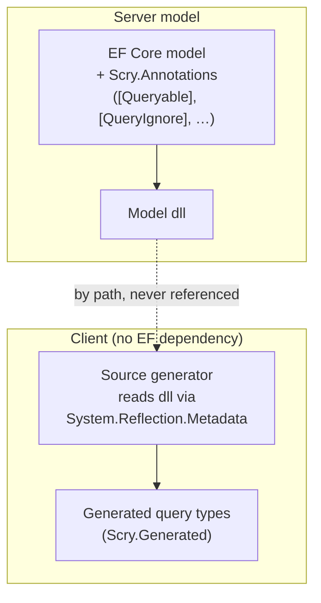
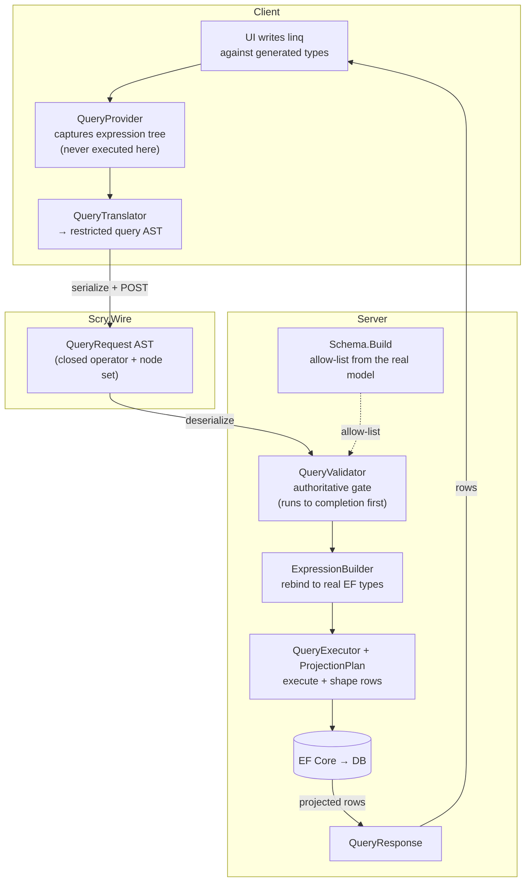

#  Scry

Type-safe, serializable LINQ from a client to a server-side EF Core model.

When a UI evolves quickly, server-side querying usually forces a choice between hand-coding a bespoke endpoint and contract per use case, or adopting GraphQL/OData and shaping queries with a separate query language. Scry removes that trade-off while keeping everything in C# and strongly typed end to end:

1. The EF Core model lives **server-side**. The client never references it — it is *pointed at by path*.
1. A **source generator** in the client reads the model assembly directly by path (`System.Reflection.Metadata`), applies an **allow-list**, and generates strongly-typed client query DTOs plus a queryable entry point.
1. The UI writes ordinary **LINQ** against the generated types.
1. The LINQ is captured and **serialized to a restricted query AST**.
1. The server **deserializes, re-validates against the allow-list at runtime, rebinds to the real EF types, executes**, and returns the projected rows.

Add or extend a query by writing LINQ in the client — no new endpoint, no new contract — while the server stays in full control of which types, properties, shapes, and rows can ever be returned.


## How it works

The build-time and runtime flows are deliberately independent. Nothing is referenced across the client/server boundary: the only things that cross it are the model dll *by path* (build time) and the serialized wire AST (run time).


### Build time — generating the client

The source generator reads the model assembly *by path* and emits strongly-typed client query types from the allow-listed surface only. The assembly is never referenced, loaded, or executed.




### Run time — a query round-trip

The client's LINQ is captured (never executed client-side) and serialized to a restricted AST. The server re-validates that AST against the allow-list — to completion, before anything is rebound — then rebinds to the real EF types, executes, and returns only the projected rows.



See [docs/security.md](docs/security.md) for the full threat model.


## Packages

| Package | Purpose |
| --- | --- |
| [Scry.Annotations](https://nuget.org/packages/Scry.Annotations/) | Allow-list attributes applied to the server model. |
| [Scry.Wire](https://nuget.org/packages/Scry.Wire/) | The serializable query AST shared by client and server. |
| [Scry.Client](https://nuget.org/packages/Scry.Client/) | Client-side `IQueryable` provider (no EF dependency). Ships the source generator. |
| [Scry.Server](https://nuget.org/packages/Scry.Server/) | Server-side validation + execution against EF Core. |
| [Scry.Server.Explorer](https://nuget.org/packages/Scry.Server.Explorer/) | Opt-in, GraphiQL-style query explorer. |

`Scry.SourceGenerator` is packed inside `Scry.Client` rather than published separately.


## At a glance

Annotate the server model:

<!-- snippet: queryableEntity -->
<a id='snippet-queryableEntity'></a>
```cs
[Queryable]
public class Employee
{
    public int Id { get; set; }
    public string Name { get; set; } = "";
    public Status Status { get; set; }
    public bool Active { get; set; }
    public DateOnly Created { get; set; }

    public int? ManagerId { get; set; }
    public Employee? Manager { get; set; }

    public int DepartmentId { get; set; }
    public Department? Department { get; set; }

    // Never exposed to clients.
    [QueryIgnore]
    public decimal Salary { get; set; }
}
```
<sup><a href='/samples/Sample.Model/Entities/Employee.cs#L3-L23' title='Snippet source file'>snippet source</a> | <a href='#snippet-queryableEntity' title='Start of snippet'>anchor</a></sup>
<!-- endSnippet -->

Register and map on the server:

<!-- snippet: serverRegistration -->
<a id='snippet-serverRegistration'></a>
```cs
builder.Services
    .AddScry<SampleContext>(
    _ =>
    {
        // Holiday is a [QueryablePoco]: it has no table, so the server supplies its rows. Every
        // [QueryablePoco] type must be registered here or AddScry throws at startup.
        _.AddPocoSource(_ => Holiday.Seed());
        _.MaxPageSize = 200;
    });
```
<sup><a href='/samples/Sample.Server/Program.cs#L26-L36' title='Snippet source file'>snippet source</a> | <a href='#snippet-serverRegistration' title='Start of snippet'>anchor</a></sup>
<!-- endSnippet -->

`AddPocoSource` supplies the rows for a `[QueryablePoco]` type — see [POCO sources](docs/server.md#poco-sources).

<!-- snippet: mapScry -->
<a id='snippet-mapScry'></a>
```cs
app.MapScry("/api/query");
```
<sup><a href='/samples/Sample.Server/Program.cs#L43-L45' title='Snippet source file'>snippet source</a> | <a href='#snippet-mapScry' title='Start of snippet'>anchor</a></sup>
<!-- endSnippet -->

Point the client at the model by path — no reference:

<!-- snippet: clientModelPath -->
<a id='snippet-clientModelPath'></a>
```csproj
<!-- The server model, pointed at by path. NOT referenced. -->
<ScryModelDll>$(MSBuildThisFileDirectory)..\Sample.Model\bin\$(Configuration)\net10.0\Sample.Model.dll</ScryModelDll>
```
<sup><a href='/samples/Sample.Client/Sample.Client.csproj#L7-L10' title='Snippet source file'>snippet source</a> | <a href='#snippet-clientModelPath' title='Start of snippet'>anchor</a></sup>
<!-- endSnippet -->

Then write LINQ:

<!-- snippet: clientQuery -->
<a id='snippet-clientQuery'></a>
```cs
employees = await Query.Employee
    .Where(_ => _.Active)
    .OrderBy(_ => _.Name)
    .Select(_ => new EmployeeRow(_.Name, _.Status, _.Manager!.Name, _.Department!.Name))
    .ToListAsync();
```
<sup><a href='/samples/Sample.Client/Pages/Index.razor.cs#L34-L40' title='Snippet source file'>snippet source</a> | <a href='#snippet-clientQuery' title='Start of snippet'>anchor</a></sup>
<!-- endSnippet -->


## Query explorer

An opt-in, GraphiQL-style explorer ships in `Scry.Server.Explorer`. It runs Roslyn in the browser, giving real IntelliSense and diagnostics against the allow-listed schema, and shows exactly what goes on the wire:

```csharp
app.MapScryExplorer("/scry");
```


It is off unless mapped, and Development-only by default. See [Query explorer](docs/explorer.md).


## Documentation

- [Getting started](docs/getting-started.md)
- [Annotations](docs/annotations.md)
- [Source generator](docs/source-generator.md)
- [Writing queries](docs/querying.md)
- [Server](docs/server.md)
- [Row policies](docs/policies.md)
- [Security model](docs/security.md)
- [Wire format](docs/wire-format.md)
- [Schema versioning](docs/schema-versioning.md)
- [Query explorer](docs/explorer.md)
- [Sample](docs/sample.md)


## License

Source is MIT. Binary releases are subject to the [Open Source Maintenance Fee](OsmfEula.txt).


## Icon

[Ripple](https://thenounproject.com/icon/ripple-2664516/) by [Zach Bogart](https://thenounproject.com/creator/zachbogart/) via [The Noun Project](https://thenounproject.com)
